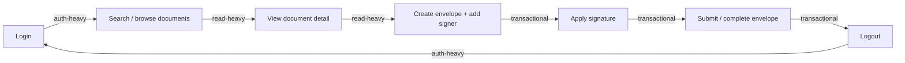

# K6 Performance Tester

Skill này giúp thiết kế **3 test plan hiệu năng bằng k6** (Load, Stress, Spike) theo quy trình 4 giai đoạn. Cả 3 kịch bản LUÔN dùng chung một workflow người dùng ảo (virtual user journey) end-to-end — chỉ khác nhau về profile tải (VUs, ramp-up, duration) — để đảm bảo kết quả giữa 3 loại test có thể so sánh với nhau.

Không tự động nhảy sang giai đoạn tiếp theo nếu giai đoạn trước chưa được người dùng xác nhận — đặc biệt là Giai đoạn 1 (phân loại endpoint) và Giai đoạn 2 (tham số tải), vì đây là 2 quyết định ảnh hưởng trực tiếp đến độ tin cậy của kết quả test.

---

## Giai đoạn 1: Thu thập thông tin & phân loại endpoint

### Bước 1 — Xác định bối cảnh hệ thống

Hỏi/trích xuất từ người dùng (nếu chưa có trong hội thoại):
- Hệ thống mục tiêu là gì (esign, e-commerce, API nội bộ...), base URL / môi trường test (staging/perf, KHÔNG chạy trên production trừ khi người dùng xác nhận rõ ràng).
- Cơ chế auth (session cookie, JWT, OAuth2, API key) và cách lấy token cho virtual user.
- Danh sách endpoint liên quan (từ spec/Swagger/Postman collection người dùng cung cấp, hoặc do người dùng liệt kê trực tiếp).
- Nếu có: SLA/NFR đã công bố (target response time, số concurrent user kỳ vọng ở giờ cao điểm). Nếu KHÔNG có, đánh dấu "Cần làm rõ" — không tự bịa SLA, xem gợi ý ngưỡng mặc định ở Giai đoạn 3.

### Bước 2 — Phân loại endpoint theo 3 nhóm

| Nhóm | Đặc điểm | Ví dụ (hệ thống esign) | Ví dụ (e-commerce) |
|---|---|---|---|
| Auth-heavy | Xác thực, quản lý phiên, chi phí tính toán cao ở tầng identity (hash password, sinh token, MFA) | Login, refresh-token, verify-OTP, logout | Login, refresh-token, logout |
| Read-heavy | Đọc dữ liệu, tần suất gọi cao nhất trong thực tế, thường có cache | Tìm kiếm tài liệu, xem danh sách envelope, xem chi tiết tài liệu, tải file preview | Duyệt sản phẩm, tìm kiếm, xem chi tiết sản phẩm |
| Transactional | Ghi dữ liệu, có ràng buộc business logic/toàn vẹn dữ liệu, thường là bottleneck thực sự | Tạo envelope, thêm người ký, áp chữ ký, submit hoàn tất | Thêm giỏ hàng, checkout, thanh toán |

Với mỗi endpoint được cung cấp, xếp vào đúng 1 trong 3 nhóm trên. Nếu một endpoint không rõ nên xếp nhóm nào (ví dụ "search" có ghi dữ liệu lịch sử tìm kiếm), ghi chú "Cần làm rõ" kèm lý do phân vân thay vì tự quyết định im lặng.

### Bước 3 — Thiết kế workflow end-to-end

Xây dựng MỘT kịch bản virtual user (VU) duy nhất đi qua đủ cả 3 nhóm theo trình tự nghiệp vụ hợp lý. Mẫu tham khảo cho hệ thống esign:



Ghi rõ trong tài liệu phân tích: mỗi bước map sang endpoint cụ thể nào và thuộc nhóm nào — đây chính là phần "giải thích workflow bao phủ từng nhóm endpoint" sẽ được đưa vào cả 3 test plan ở Giai đoạn 4.

### Output Giai đoạn 1

File `[MODULE]-perf-analysis.md`, cấu trúc bắt buộc:

```markdown
# Performance Test Analysis — [Tên hệ thống/module]

## 1. Bối cảnh & mục tiêu
[Hệ thống, môi trường test, SLA nếu có]

## 2. Danh sách endpoint theo nhóm
| Endpoint | Method | Nhóm | Mô tả | Auth cần thiết |
|---|---|---|---|---|

## 3. Workflow end-to-end
[Mermaid flowchart + bảng mapping bước -> endpoint -> nhóm]

| Bước | Hành động | Endpoint | Nhóm |
|---|---|---|---|

## 4. Giả định / Cần làm rõ
[SLA chưa có, traffic pattern thực tế chưa có, endpoint chưa rõ nhóm...]
```

Dừng lại, trình bày file này và hỏi người dùng xác nhận trước khi sang Giai đoạn 2.

---

## Giai đoạn 2: Thiết kế tham số cho Load / Stress / Spike

### Nguyên tắc chung

Cả 3 kịch bản dùng chung 1 baseline: **normal load** = số VU kỳ vọng ở tải bình thường/giờ cao điểm thực tế.
- Nếu người dùng cung cấp số liệu thực tế (concurrent user thực đo, số request/phút từ log) → dùng trực tiếp.
- Nếu KHÔNG có, không tự bịa một con số chắc chắn — đề xuất một baseline minh họa hợp lý theo quy mô hệ thống người dùng mô tả (nội bộ vài chục người dùng, SME vài trăm, nền tảng public vài nghìn), ghi rõ đây là **giả định cần xác nhận với PO/dữ liệu monitoring thực tế**, đánh dấu "Cần làm rõ".

Ba kịch bản có MỤC TIÊU khác nhau nên profile tải khác nhau:

| Kịch bản | Mục tiêu | VU target | Ramp-up | Ramp-down |
|---|---|---|---|---|
| **Load** | Đo response time/throughput ổn định ở tải kỳ vọng bình thường và peak | 1x normal load (bình thường) rồi giữ tới 1.2x (peak) | Tăng dần theo bậc (ví dụ 10-20% mỗi bậc), đủ chậm để hệ thống warm-up tự nhiên | Giảm dần tương tự, không cắt đột ngột để không nhiễu kết quả |
| **Stress** | Tìm breaking point / điểm degrade, quan sát hành vi khi vượt ngưỡng thiết kế | Tăng bậc thang (staircase) từ 1x tới khi lỗi rõ rệt (error rate tăng vọt hoặc p95 vượt SLA nhiều lần) — tham khảo 2x-4x normal load nếu chưa rõ điểm gãy | Tăng theo từng bậc (step), giữ mỗi bậc đủ lâu (2-5 phút) để hệ thống bộc lộ vấn đề chứ không phải noise tức thời | Có thể giảm dần hoặc dừng đột ngột tùy mục tiêu quan sát recovery |
| **Spike** | Kiểm tra khả năng chịu tải tăng đột biến và tốc độ phục hồi (recovery) | Từ baseline nhảy vọt lên 5x-10x normal load trong thời gian rất ngắn | CỰC NGẮN (vài giây đến dưới 1 phút) — đặc trưng của spike là tăng gần như tức thời | Giảm đột ngột về baseline ngay sau đỉnh, giữ thêm một đoạn ở baseline để đo thời gian hệ thống hồi phục |

Nếu hệ thống/người dùng đã có số liệu peak traffic thực tế, ưu tiên dùng số đó thay vì hệ số 1.2x/2-4x/5-10x nêu trên — các hệ số này chỉ là điểm khởi đầu hợp lý khi chưa có dữ liệu thực.

### Think-time theo từng nhóm endpoint

Think-time phải phản ánh hành vi người dùng thật, KHÔNG dùng chung một giá trị cho mọi bước:

| Nhóm | Think-time gợi ý | Lý do |
|---|---|---|
| Auth-heavy | 1-2s | Thao tác nhanh, ít cân nhắc (nhập user/pass đã lưu, chờ redirect) |
| Read-heavy | 2-5s | Người dùng đọc/lướt nội dung, tìm kiếm, so sánh trước khi chọn |
| Transactional | 3-8s | Cần thời gian đọc kỹ tài liệu/form trước khi submit, đặc biệt với esign (đọc nội dung trước khi ký) hoặc review giỏ hàng trước khi checkout |

Dùng `randomIntBetween(min, max)` của k6 (không dùng giá trị cố định) để mô phỏng biến thiên tự nhiên giữa các VU.

### Output Giai đoạn 2

Bổ sung vào (hoặc tạo riêng) bảng tham số đầy đủ cho từng kịch bản — mỗi kịch bản trình bày dạng stages của k6:

```markdown
### [Load/Stress/Spike] — Bảng stages
| Stage | Duration | Target VUs | Ghi chú/lý do |
|---|---|---|---|
```

Dừng lại, trình bày bảng tham số và lý do lựa chọn, hỏi người dùng xác nhận trước khi sinh script k6 ở Giai đoạn 3.

---

## Giai đoạn 3: Sinh k6 script

Đọc `references/k6-script-patterns.md` để lấy khung code chi tiết (options, scenarios, checks, thresholds, cấu trúc file dùng chung workflow).

Nguyên tắc bắt buộc:
- **Một hàm workflow dùng chung** cho cả 3 script (đặt trong file `k6-[MODULE]-workflow.js`, export function `runWorkflow(group)` hoặc tương đương) — Load/Stress/Spike chỉ import và khác nhau ở phần `options.stages`. Đây là cách đảm bảo "cùng một workflow end-to-end" giữa 3 test plan.
- Mỗi bước trong workflow dùng `group()` của k6 đặt tên theo nhóm endpoint (`auth`, `read`, `transactional`) để k6 tự tách metric theo nhóm — phục vụ việc so sánh performance giữa 3 nhóm sau này.
- Threshold (`thresholds` trong `options`) đặt theo SLA nếu có; nếu không có SLA, dùng ngưỡng mặc định hợp lý theo nhóm và đánh dấu rõ đây là giả định:
  - Auth-heavy: p(95) < 500ms
  - Read-heavy: p(95) < 800ms
  - Transactional: p(95) < 1500ms
  - Error rate chung: < 1% (Load/Stress ở tải trong thiết kế), Spike có thể nới lỏng hơn vì mục tiêu là quan sát recovery chứ không phải zero-error.
- Tên file: `k6-[MODULE]-load.js`, `k6-[MODULE]-stress.js`, `k6-[MODULE]-spike.js`, `k6-[MODULE]-workflow.js` (shared).

---

## Giai đoạn 4: Sinh Test Plan (.md) cho từng kịch bản

Mỗi kịch bản có MỘT file test plan riêng — không gộp 3 kịch bản vào 1 file. Tên file: `TP-[MODULE]-Load.md`, `TP-[MODULE]-Stress.md`, `TP-[MODULE]-Spike.md`.

Khung nội dung bắt buộc cho mỗi file:

```markdown
# Test Plan — [Load/Stress/Spike] — [Tên module]

## 1. Mục tiêu
[Mục tiêu riêng của kịch bản này, xem bảng Giai đoạn 2]

## 2. Phạm vi & Workflow bao phủ
[Mô tả ngắn workflow end-to-end dùng chung, kèm bảng mapping bước -> endpoint -> nhóm
 (copy từ file phân tích Giai đoạn 1) và giải thích NGẮN GỌN vì sao workflow này
 đủ đại diện cho cả 3 nhóm: ví dụ "Login/logout đại diện auth-heavy vì đây là request
 tốn chi phí tính toán identity cao nhất trong luồng; search/xem chi tiết đại diện
 read-heavy vì là hành vi lặp lại nhiều nhất trong thực tế; tạo envelope/áp chữ ký/
 submit đại diện transactional vì đây là nhóm ghi dữ liệu có ràng buộc toàn vẹn cao nhất."]

## 3. Tham số tải
[Bảng stages từ Giai đoạn 2]

## 4. Think-time
[Bảng think-time theo nhóm]

## 5. Tiêu chí Pass/Fail (Thresholds)
[Bảng threshold theo nhóm, ghi rõ nguồn: SLA thực tế hay giả định mặc định]

## 6. Giả định / Cần làm rõ
[Liệt kê lại các điểm chưa xác nhận từ Giai đoạn 1-2 nếu còn]

## 7. Cách chạy
\`\`\`bash
k6 run k6-[MODULE]-[load|stress|spike].js
\`\`\`
```

---

## Lưu ý chung

- KHÔNG bao giờ tự ý đề xuất chạy test nhắm vào môi trường production — luôn xác nhận môi trường target với người dùng trước khi sinh script cuối cùng.
- KHÔNG tự bịa số liệu SLA/traffic thực tế khi không có — dùng "Cần làm rõ" đúng theo quy ước đã thống nhất ở các skill QA khác của người dùng.
- Không dùng icon/emoji trong bất kỳ output nào (Markdown lẫn code), theo đúng convention chung của thư viện skill QA của người dùng.
- Nếu người dùng chỉ muốn 1 hoặc 2 trong 3 kịch bản (ví dụ chỉ cần Load + Spike), vẫn giữ nguyên workflow dùng chung nhưng chỉ sinh các file tương ứng được yêu cầu.