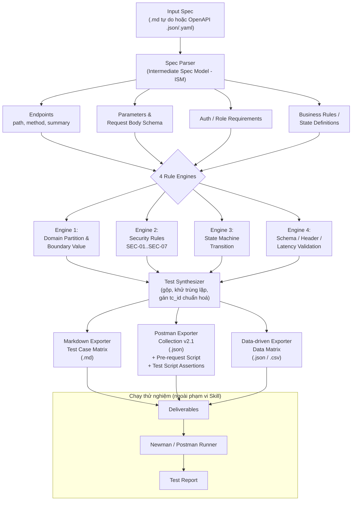

# Sơ đồ kiến trúc — `api-test-generator`

## Giải thích luồng

| Module | Vai trò | Đầu vào | Đầu ra |
|---|---|---|---|
| Spec Parser | Chuẩn hoá spec bất kỳ thành ISM (Intermediate Spec Model) | Markdown / OpenAPI | Dict/JSON nội bộ |
| Engine 1 — Boundary | Sinh test partition & boundary cho từng field | ISM.parameters | List[TestCase] |
| Engine 2 — Security | Sinh SEC-01..SEC-07 cho từng endpoint có auth/role | ISM.auth, ISM.endpoints | List[TestCase] |
| Engine 3 — State Machine | Sinh chuyển trạng thái hợp lệ/bất hợp lệ | ISM.business_rules | List[TestCase] |
| Engine 4 — Schema/Header/Latency | Kiểm tra hợp đồng response | ISM.responses | List[TestCase] |
| Test Synthesizer | Hợp nhất, khử trùng, đánh `tc_id` | 4 danh sách TestCase | List[TestCase] thống nhất |
| Markdown Exporter | Xuất bảng thiết kế test case | List[TestCase] | `test_case_matrix.md` |
| Postman Exporter | Xuất Collection v2.1 kèm script | List[TestCase] | `postman_collection.json` |
| Data-driven Exporter | Tách input data khỏi logic | List[TestCase] | `data_matrix.json/.csv` |
