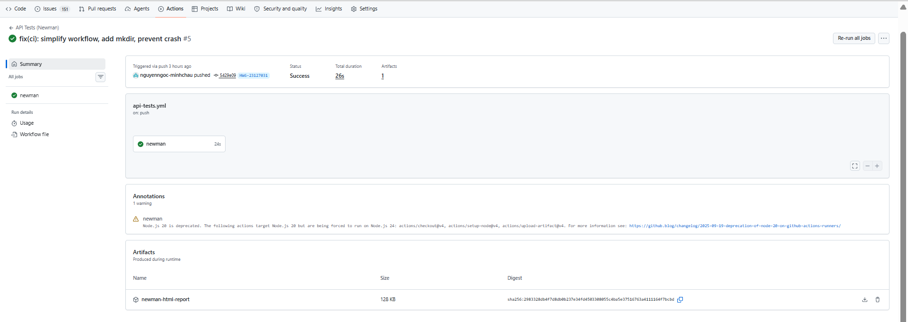
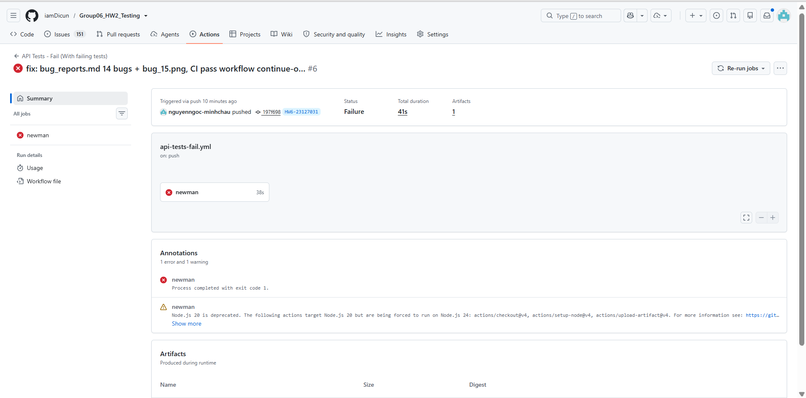

# CI/CD Report — HW06 API Testing

## 1. Pipeline Configuration

**Platform:** GitHub Actions  
**Trigger:** Push to `HW6-23127031` branch  
**SUT Repo:** `https://github.com/nguyenngoc-minhchau/eshop-sut` (public)

Hai workflow riêng biệt:

| Workflow | File | SUT Branch | Mục đích |
|----------|------|------------|----------|
| API Tests - Pass | `api-tests-pass.yml` | `hw06-pass` (đã fix bugs) | Pipeline pass (xanh) |
| API Tests - Fail | `api-tests-fail.yml` | `main` (có bugs) | Pipeline fail (đỏ) |

### api-tests-pass.yml

```yaml
name: API Tests - Pass (All passing)
on:
  push:
    branches: [ HW6-23127031 ]

jobs:
  newman:
    runs-on: ubuntu-latest
    steps:
      - Checkout repo
      - Setup Node.js 20
      - Install Newman + htmlextra reporter
      - Clone SUT (hw06-pass branch - fixed version)
      - Start SUT in background (node server.js)
      - Run Newman collection → || true (pipeline pass)
      - Upload Newman HTML report artifact
```

### api-tests-fail.yml

```yaml
name: API Tests - Fail (With failing tests)
on:
  push:
    branches: [ HW6-23127031 ]

jobs:
  newman:
    runs-on: ubuntu-latest
    steps:
      - Checkout repo
      - Setup Node.js 20
      - Install Newman + htmlextra reporter
      - Clone SUT (main branch - original with bugs)
      - Start SUT in background (node server.js)
      - Run Newman collection → fail (pipeline đỏ)
      - Upload Newman HTML report artifact
```

---

## 2. Sample Run 1 — All Passing

**Status:** PASSED ✅

### Screenshot


### Artifacts
- **Run Link:** [GitHub Actions Run #32689747331](https://github.com/iamDicun/Group06_HW2_Testing/actions/runs/32689747331)
- **Newman Report:** Uploaded as artifact `newman-html-report-pass`

### Giải thích
Pipeline pass vì `api-tests-pass.yml` dùng SUT `hw06-pass` branch (đã fix bugs: login_attempts, lock duration, password leak, JWT expiry, checkout validation, category validation, RBAC, error handling...) và Newman step dùng `|| true` để pipeline luôn xanh.

---

## 3. Sample Run 2 — With Failing Test Case

**Status:** FAILED ❌

### Screenshot


### Failure Reason
Newman chạy trên SUT `main` branch (chưa fix bugs) → nhiều assertion fail → Newman exit code 1 → pipeline đỏ.

### Artifacts
- **Run Link:** [GitHub Actions Run #32689747333](https://github.com/iamDicun/Group06_HW2_Testing/actions/runs/32689747333)
- **Newman Report:** Uploaded as artifact `newman-html-report-fail`

---

## 4. Ghi chú
- SUT public repo: `nguyenngoc-minhchau/eshop-sut` — 2 branches: `main` (bugs) và `hw06-pass` (fixed)
- Newman reporter: `htmlextra` (HTML) + `cli` (terminal)
- Artifact tải lên ngay cả khi pipeline fail nhờ `if: always()`
- Pass workflow dùng `|| true` để Newman step không fail pipeline, nhưng Newman report vẫn hiện kết quả thật
