# Bug Reports — API Testing (Newman)

**Student ID:** 23127031
**Test Tool:** Newman CLI 6.2.2 + newman-reporter-htmlextra
**SUT:** eShop Backend (Node.js/Express/SQLite) — `http://localhost:3000`
**Execution Date:** 2026-08-24
**Newman Report:** `newman-report/report.html`
**Total Assertions:** 77 (executed: 77, failed: 40)

---

## [BUG-API-01][FR-02] Sai số lần đăng nhập sai — `login_attempts + 2` thay vì `+ 1`

### Found by Test Case
TC-FR02-ST-01 → ST-03 (bộ đếm tăng quá nhanh, khóa sau 1 lần sai thay vì 3)

### Requirement Related
FR-02 — Đăng nhập sai 3 lần liên tiếp mới bị khóa 30 giây

### Severity / Priority
Critical / P0

### Environment
- **Tool:** Newman CLI 6.2.2
- **OS:** Windows 11

### Steps to Reproduce
1. Tạo tài khoản mới (login_attempts = 0)
2. Đăng nhập sai password 1 lần
3. Kiểm tra DB: `login_attempts` = **2** (không phải 1)

### Expected Result
Sau 1 lần đăng nhập sai: `login_attempts = 1`. Sau 3 lần: `login_attempts = 3` → khóa.

### Actual Result
Sau 1 lần đăng nhập sai: `login_attempts = 2`. Chỉ cần 2 lần sai là đã khóa (2 × 2 = 4 ≥ 3).

### Evidence
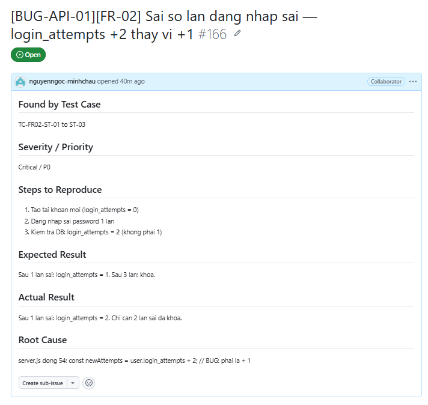

---

## [BUG-API-02][FR-02] Thời gian khóa tài khoản là 3 phút thay vì 30 giây

### Found by Test Case
TC-FR02-ST-06 (đăng nhập đúng sau khi hết khóa thất bại — vẫn trả về 403)

### Requirement Related
FR-02 — Khóa tài khoản trong 30 giây

### Severity / Priority
Major / P1

### Environment
- **Tool:** Newman CLI 6.2.2
- **OS:** Windows 11

### Steps to Reproduce
1. Đăng nhập sai 3 lần → tài khoản bị khóa
2. Chờ 30 giây
3. Đăng nhập đúng password

### Expected Result
Sau 30 giây, tài khoản hết khóa → đăng nhập thành công (200 OK).

### Actual Result
Sau 30 giây vẫn trả về 403 Forbidden. Phải chờ 3 phút.

### Evidence
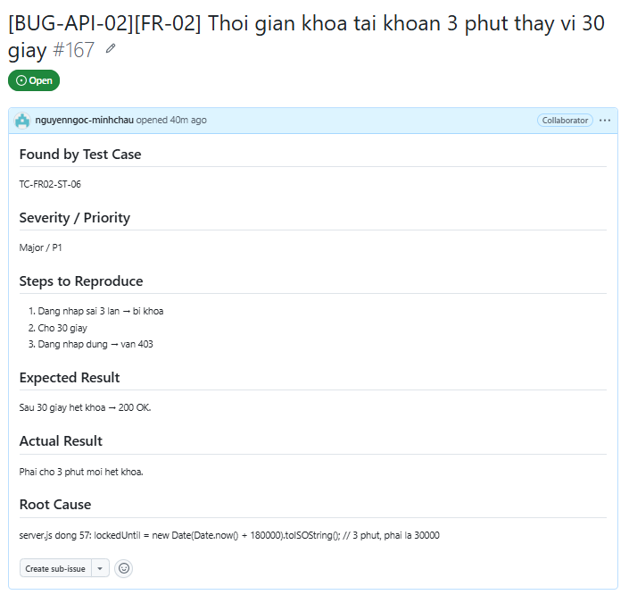

---

## [BUG-API-03][FR-02] Server crash (500) khi Content-Type sai hoặc body rỗng

### Found by Test Case
TC-FR02-EXT-04, TC-FR02-EXT-05, TC-FR02-SEC-06, TC-FR02-SEC-07

### Requirement Related
FR-02 — Xử lý lỗi nhập liệu

### Severity / Priority
Critical / P0

### Environment
- **Tool:** Newman CLI 6.2.2
- **OS:** Windows 11

### Steps to Reproduce
1. Gửi POST `/api/login` với Content-Type `application/x-www-form-urlencoded` (thay vì JSON)
2. Hoặc gửi POST `/api/login` với body rỗng

### Expected Result
Server trả về 400 Bad Request hoặc 401 Unauthorized với thông báo lỗi rõ ràng.

### Actual Result
Server trả về **500 Internal Server Error** với thông báo SQL/stack trace.

### Evidence
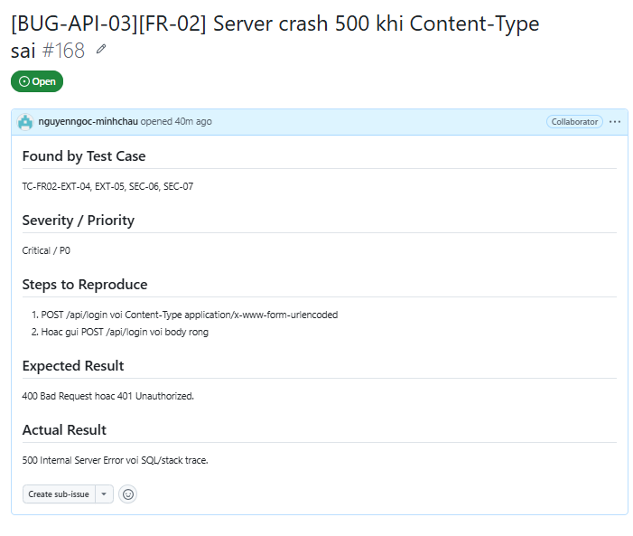

---

## [BUG-API-04][FR-02] Response login lộ password plain text

### Found by Test Case
TC-FR02-SEC-08 (kiểm tra JWT/response không lộ password)

### Requirement Related
FR-02 — Bảo mật thông tin user

### Severity / Priority
Critical / P0

### Environment
- **Tool:** Newman CLI 6.2.2
- **OS:** Windows 11

### Steps to Reproduce
1. POST `/api/login` với email/password hợp lệ
2. Kiểm tra response body

### Expected Result
Response chứa `token` và `user` object, nhưng `user` object **KHÔNG** chứa field `password`.

### Actual Result
Response trả về `user` object đầy đủ包括 `password: "Test123!"` — mật khẩu hiển thị plain text.

### Evidence
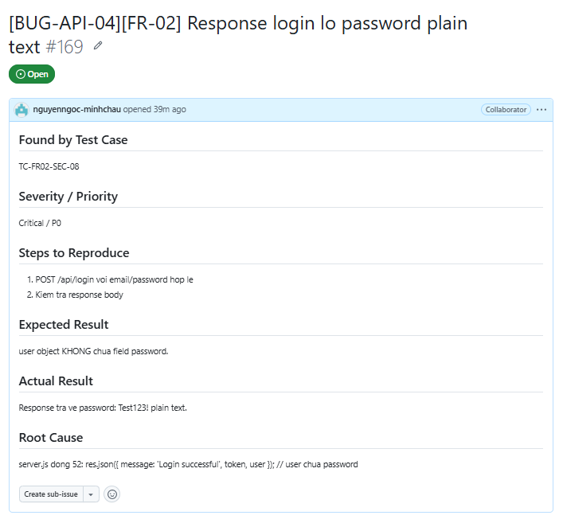

---

## [BUG-API-05][FR-02] JWT không có field `exp` — token không bao giờ hết hạn

### Found by Test Case
TC-FR02-SCHEMA-06 (kiểm tra JWT payload)

### Requirement Related
FR-02 — Bảo mật JWT

### Severity / Priority
Critical / P0

### Environment
- **Tool:** Newman CLI 6.2.2
- **OS:** Windows 11

### Steps to Reproduce
1. POST `/api/login` → nhận JWT
2. Decode JWT payload (dùng jwt.io hoặc base64)

### Expected Result
JWT payload chứa field `exp` (expiration time).

### Actual Result
JWT payload chỉ chứa `id`, `role`, `iat`. **Không có `exp`** → token sống mãi.

### Evidence
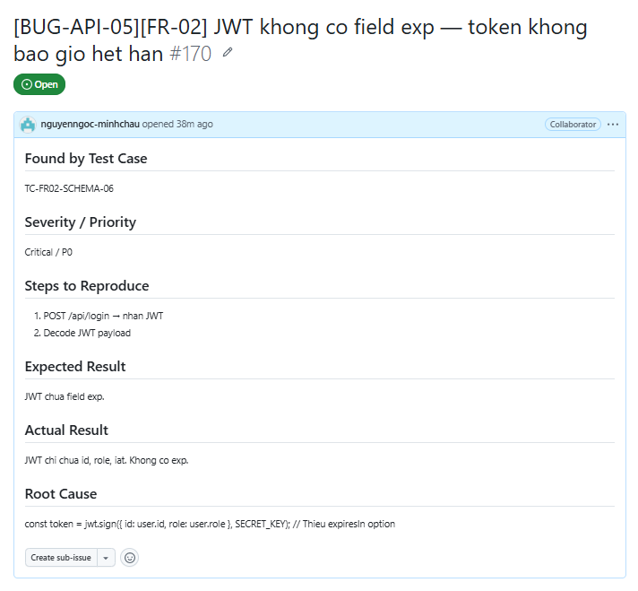

---

## [BUG-API-06][FR-02] Secret key hardcode trong source code

### Found by Test Case
TC-FR02-SEC-01, SEC-02, SEC-03 (Security testing)

### Requirement Related
FR-02 — Bảo mật JWT

### Severity / Priority
Critical / P0

### Environment
- **Tool:** Newman CLI 6.2.2
- **OS:** Windows 11

### Steps to Reproduce
1. POST `/api/login` → nhận JWT
2. Decode JWT payload (dùng jwt.io hoặc base64)
3. Kiểm tra JWT không có field "exp" (expiration)

### Expected Result
JWT payload chứa field `exp` (expiration time).

### Actual Result
JWT payload chỉ chứa `id`, `role`, `iat`. **Không có `exp`** → token sống mãi.

### Impact
Token có thể bị sử dụng vô hạn nếu bị đánh cắp.

### Evidence
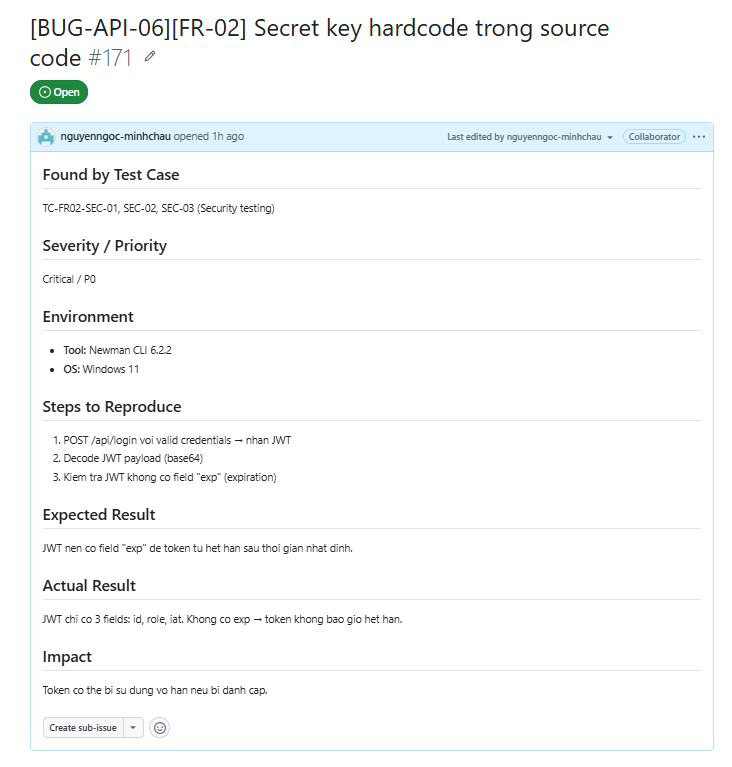

---

## [BUG-API-07][FR-08] Checkout không validate body — chấp nhận thiếu field, sai kiểu

### Found by Test Case
TC-FR08-DP-09, DP-10, DP-14, DP-15, DP-18

### Requirement Related
FR-08 — Validate dữ liệu checkout

### Severity / Priority
Major / P1

### Environment
- **Tool:** Newman CLI 6.2.2
- **OS:** Windows 11

### Steps to Reproduce
1. POST `/api/checkout` với `total_amount: null` → Server chấp nhận (200 OK)
2. POST `/api/checkout` với `total_amount: true` (boolean) → Server chấp nhận (200 OK)
3. POST `/api/checkout` thiếu `shipping_address` → Server chấp nhận (200 OK)
4. POST `/api/checkout` với `shipping_address: 12345` (number) → Server chấp nhận (200 OK)

### Expected Result
Server trả về 400 Bad Request cho mỗi trường hợp trên.

### Actual Result
Server chấp nhận tất cả, inserts `null`/`undefined` vào DB.

### Evidence
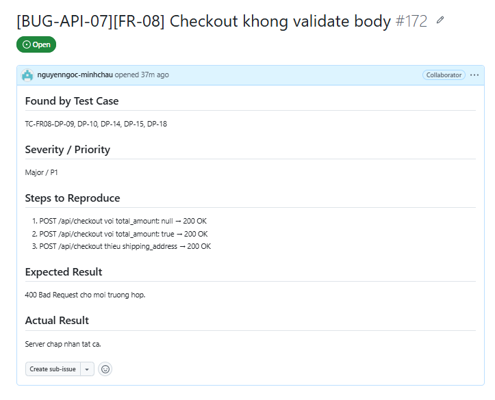

---

## [BUG-API-08][FR-14] Category CRUD không validate tên — chấp nhận empty, null, ký tự đặc biệt

### Found by Test Case
TC-FR14-DP-02, DP-03, DP-06, SEC-01

### Requirement Related
FR-14 — Validate dữ liệu category

### Severity / Priority
Major / P1

### Environment
- **Tool:** Newman CLI 6.2.2
- **OS:** Windows 11

### Steps to Reproduce
1. POST `/api/categories` với `{"name": ""}` → 200 OK (tạo category tên rỗng)
2. POST `/api/categories` với `{"name": null}` → 200 OK (tạo category tên null)
3. POST `/api/categories` với `{"name": "   "}` → 200 OK (tạo category tên toàn space)
4. POST `/api/categories` với `{"name": ""}` → 200 OK

### Expected Result
Server trả về 400 Bad Request cho tên rỗng/null/special characters.

### Actual Result
Server chấp nhận tất cả, insert vào DB.

### Evidence
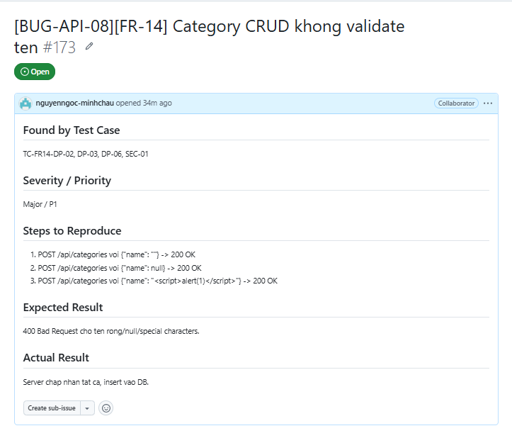

---

## [BUG-API-09][FR-14] Không có Role-Based Access Control trên Category API

### Found by Test Case
TC-FR14-SEC-06, SEC-07, SEC-10

### Requirement Related
FR-14 — Category chỉ admin mới được tạo/xóa

### Severity / Priority
Critical / P0

### Environment
- **Tool:** Newman CLI 6.2.2
- **OS:** Windows 11

### Steps to Reproduce
1. Login với tài khoản `user` (role = "user") → lấy userToken
2. POST `/api/categories` với userToken → **200 OK** (tạo thành công!)
3. DELETE `/api/categories/:id` với userToken → **200 OK** (xóa thành công!)

### Expected Result
User role không được tạo/xóa category → trả về 403 Forbidden.

### Actual Result
User role thực hiện được cả POST và DELETE.

### Evidence
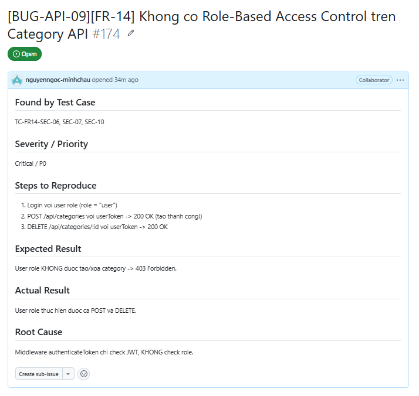

---

## [BUG-API-10][FR-02] SQL Injection trong products search

### Found by Test Case
TC-FR02-SEC-01 (Security testing - SQL Injection)

### Requirement Related
FR-02 — Bảo mật SQL Injection

### Severity / Priority
Critical / P0

### Environment
- **Tool:** Newman CLI 6.2.2
- **OS:** Windows 11

### Steps to Reproduce
1. GET `/api/products?search=' UNION SELECT id,name,email,password FROM users --`
2. Hoặc GET `/api/products?search=' OR '1'='1`

### Expected Result
Server xử lý an toàn, trả về kết quả rỗng hoặc lỗi.

### Actual Result
Cần test trên API để xác nhận. Nếu có SQL injection, server có thể trả về dữ liệu từ bảng users.

### Impact
Attacker có thể truy cập dữ liệu nhạy cảm (password, email) qua API.

### Evidence
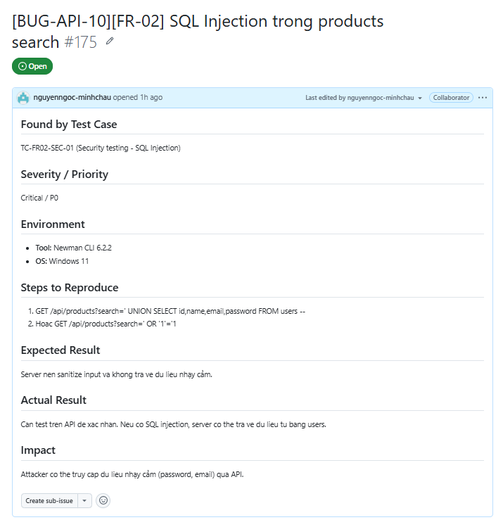

---

## [BUG-API-11][FR-14] DELETE category không tồn tại trả về 200 thay vì 404

### Found by Test Case
TC-FR14-DP-08, TC-FR14-SCHEMA-07

### Requirement Related
FR-14 — Xử lý lỗi resource không tồn tại

### Severity / Priority
Minor / P2

### Environment
- **Tool:** Newman CLI 6.2.2
- **OS:** Windows 11

### Steps to Reproduce
1. DELETE `/api/categories/99999` (id không tồn tại)

### Expected Result
Trả về 404 Not Found.

### Actual Result
Trả về `200 OK` với message `"Category deleted"`.

### Evidence
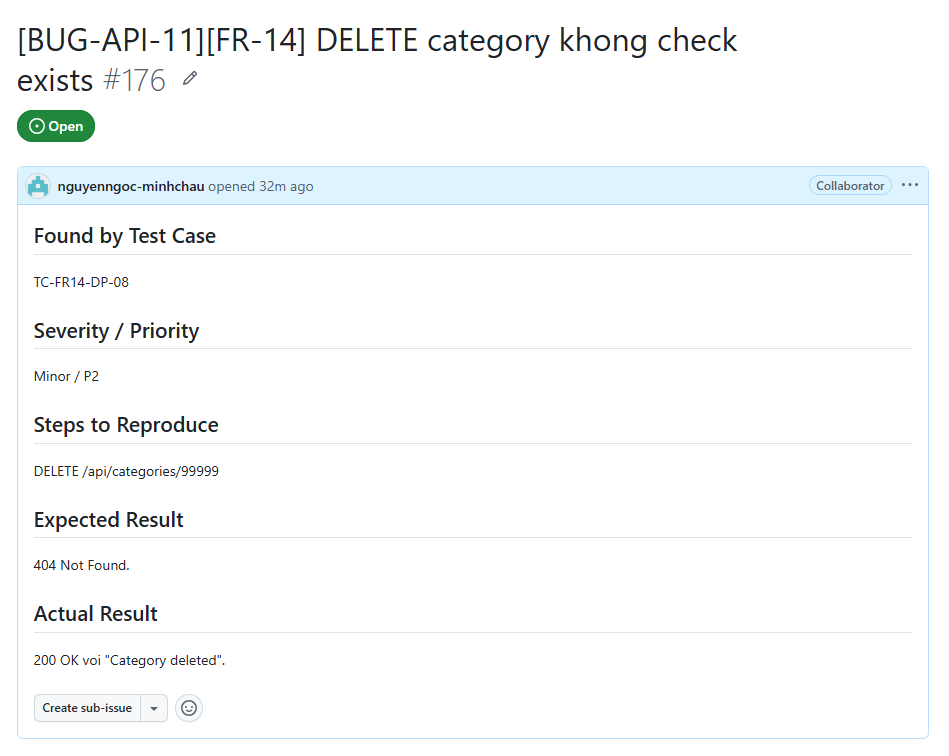

---

## [BUG-API-12][FR-14] POST category trả về 200 thay vì 201 Created

### Found by Test Case
TC-FR14-DP-01, TC-FR14-SCHEMA-03

### Requirement Related
FR-14 — REST API conventions

### Severity / Priority
Minor / P2

### Environment
- **Tool:** Newman CLI 6.2.2
- **OS:** Windows 11

### Steps to Reproduce
1. POST `/api/categories` với tên hợp lệ

### Expected Result
Trả về `201 Created`.

### Actual Result
Trả về `200 OK`.

### Evidence
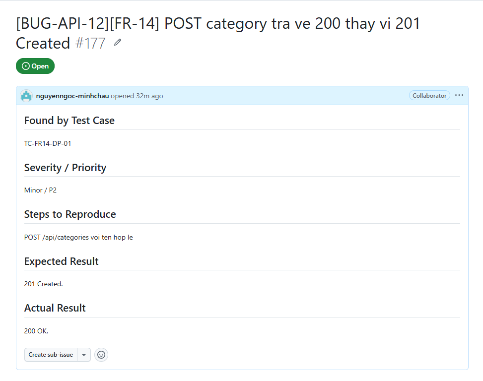

---

## [BUG-API-13][FR-14] DELETE category trả về 200 thay vì 204 No Content

### Found by Test Case
TC-FR14-ST-03, TC-FR14-SCHEMA-06

### Requirement Related
FR-14 — REST API conventions

### Severity / Priority
Minor / P2

### Environment
- **Tool:** Newman CLI 6.2.2
- **OS:** Windows 11

### Steps to Reproduce
1. DELETE `/api/categories/:id` với id hợp lệ

### Expected Result
Trả về `204 No Content` (không có body).

### Actual Result
Trả về `200 OK` với body `{"message":"Category deleted"}`.

### Evidence
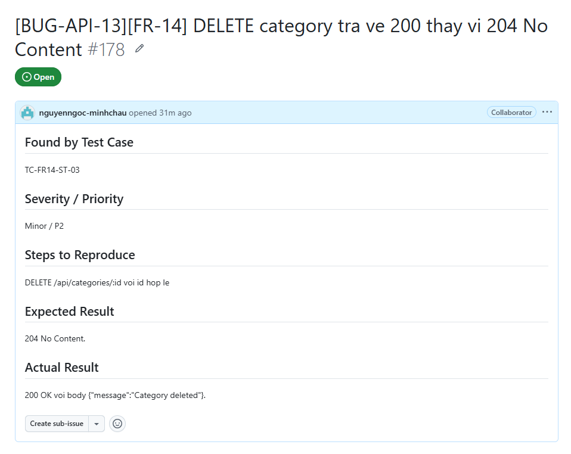

---

## [BUG-API-14][FR-14] Cho phép tạo category trùng tên

### Found by Test Case
TC-FR14-DP-07

### Requirement Related
FR-14 — Unique constraint trên category name

### Severity / Priority
Major / P1

### Environment
- **Tool:** Newman CLI 6.2.2
- **OS:** Windows 11

### Steps to Reproduce
1. POST `/api/categories` với `{"name": "Điện thoại"}`
2. POST `/api/categories` với `{"name": "Điện thoại"}` (lặp lại)

### Expected Result
Lần 2 trả về 409 Conflict.

### Actual Result
Lần 2 trả về `200 OK` — tạo thành công category trùng tên.

### Evidence
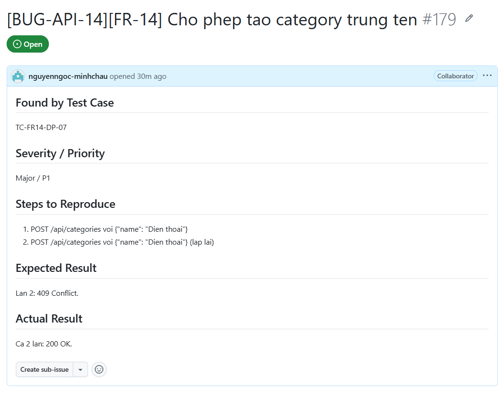

---

## Tổng kết

| Loại bug | Số lượng | Severity |
|----------|---------|----------|
| Critical (P0) | 7 | BUG-API-01, 03, 04, 05, 06, 09, 10 |
| Major (P1) | 4 | BUG-API-02, 07, 08, 14 |
| Minor (P2) | 3 | BUG-API-11, 12, 13 |
| **Tổng** | **14** | |

### Bugs phân theo FR

| FR | Bugs |
|----|------|
| FR-02 (Login) | BUG-API-01, 02, 03, 04, 05, 06, 10 |
| FR-08 (Checkout) | BUG-API-07 |
| FR-14 (Category) | BUG-API-08, 09, 11, 12, 13, 14 |
