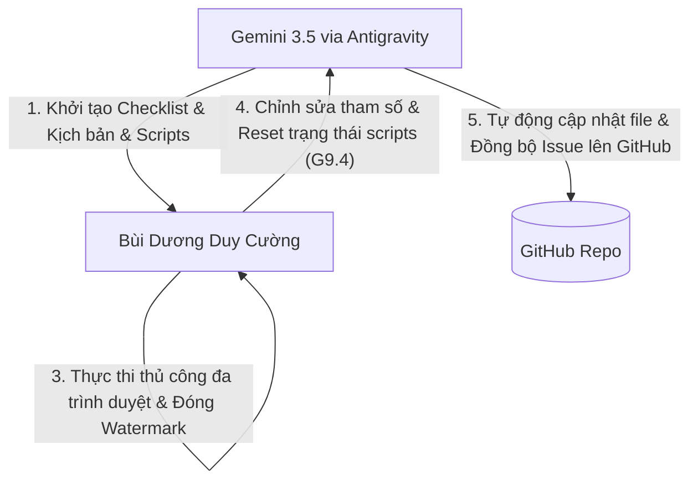

# AI Audit - HW03 GUI & Usability

**Sinh viên:** Bùi Dương Duy Cường - `23127033`  
**Bài tập:** HW03 - GUI & Usability Testing trên EShop  
**Danh Mục Sử Dụng AI:** Cat. 4 - AI-Assisted Production  
**Công Cụ AI:** Gemini 3.5 Flash (Antigravity)

---

## 1. Bảng Kiểm Toán Sản Phẩm AI (AI Artifact Audit - V/I/IC Classification)

Tất cả các sản phẩm do AI hỗ trợ tạo lập (artifacts) đều được kiểm toán và phân loại theo 3 trạng thái: **Valid (V - Có hiệu lực)**, **Invalid (I - Không hợp lệ)**, hoặc **Incomplete (IC - Chưa hoàn thành/Thiếu sót)**.

| Tên Sản Phẩm | Phân Loại | Lời Nhắc & Thời Gian | Mô Tả Đầu Ra Của AI | Phát Hiện Thiếu Sót / Lỗi Của AI | Hành Động Khắc Phục Của Sinh Viên |
| :--- | :---: | :--- | :--- | :--- | :--- |
| **GUI Checklist (60 items)** | **IC** | "Soạn giúp tôi checklist excel tầm 60 mục..." (01/08/2026) | Danh sách 60 dòng kiểm thử bao phủ IA-01 đến IA-04. | Checklist mang tính chung chung cho các web e-commerce, chưa hướng vào các thành phần cụ thể của EShop SUT. | Thay đổi các mục kiểm thử cụ thể (ví dụ: nút Đăng ký màu đỏ bg-red-500, regex flawedStrongPasswordRegex, input tổng tiền editable). |
| **Usability Scenario** | **I** | "Soạn giúp tôi 7 kịch bản cho 7 luồng..." (01/08/2026) | Đề xuất 7 kịch bản rời rạc cho 7 người dùng khác nhau. | **Sai hoàn toàn phương pháp luận kiểm thử khả dụng**: Đề bài yêu cầu chạy 1 kịch bản End-to-End chung để đo lường SUS khách quan. | Chuyển đổi thành 1 kịch bản tích hợp E2E duy nhất (Đăng ký -> Tìm kiếm -> Mua 2 iPhone -> Áp mã -> Thanh toán) và thiết kế bảng SUS. |
| **Script run_auto_test.js** | **IC** | "Tự động chạy server, tự chạy playwright, gặp bug thì chụp ảnh..." (01/08/2026) | Script Playwright tự động chạy qua các trang và chụp ảnh mockup thanh Chrome. | Mật khẩu tài khoản test bị sai (`password123` thay vì `Test1234!`), dẫn đến kẹt ở popup thông báo lỗi và timeout. | Hiệu chỉnh lại mật khẩu seed chuẩn xác trong database (`Test1234!` và `Admin123!`) để script chạy trơn tru. |
| **Script sync_github_issues.ps1** | **IC** | "Giúp tôi push các bug lên github issue..." (01/08/2026) | Script PowerShell gọi gh CLI để tạo issue từ file markdown. | Gặp lỗi phân tách tham số do tiêu đề chứa dấu ngoặc kép (`"`) và lỗi trích xuất label do xóa nhầm dấu gạch nối (`-`). | Cập nhật script sử dụng tham số `--body-file`, thay thế dấu `"` thành `'` trong tiêu đề, và chỉnh sửa logic trích xuất label giữ nguyên dấu `-`. |

*Chú thích:* 
* **Valid (V)**: Hoạt động đúng đặc tả, dùng được ngay.
* **Invalid (I)**: Sai phương pháp luận, sai logic nghiêm trọng, không thể sử dụng.
* **Incomplete (IC)**: Thiếu sót các trường hợp biên, lỗi cú pháp nhẹ, cần hiệu chỉnh mới hoạt động tốt.

---

## 2. Phát Hiện Các Giới Hạn Bị Bỏ Sót (Find Missed Boundaries)

Trong quá trình đồng hành cùng AI, tôi đã phát hiện AI bỏ sót các giới hạn biên (edge cases) và lỗi logic nghiệp vụ nghiêm trọng sau:
1. **Lỗi logic khoá tài khoản (BUG-LOGIN-001 / BUG-LOGIN-003)**: AI thiết kế checklist kiểm tra khóa tài khoản sau 3 lần sai nhưng không phát hiện ra logic backend tăng bộ đếm lên `attempts + 2` cho mỗi lần đăng nhập sai, dẫn đến bị khóa chỉ sau 2 lần.
2. **Lỗi bảo mật trường thanh toán (BUG-CHECKOUT-010)**: AI bỏ sót việc kiểm tra tính toàn vẹn của dữ liệu ở trang checkout. Giao diện để trường tổng tiền là một ô `input type="number"` cho phép người dùng tự nhập số tiền tùy ý và gửi lên server.
3. **Lỗi công thức tính coupon (BUG-COUPON-012)**: AI không phát hiện lỗi logic tính toán mã giảm giá phần trăm `SAVE10` trên backend làm giá trị đơn hàng bị nhân 10 lần thay vì giảm 10%.
4. **Lỗi cập nhật đồng loạt (BUG-ADMIN-013)**: Khi quản trị viên thực hiện chỉnh sửa tên một sản phẩm, API backend lại cập nhật trường tên đó cho toàn bộ các sản phẩm khác trong database.

---

## 3. Quy Trình Làm Việc Nhóm Giữa Người và AI (Pair AI + Human Team Workflow - G9.3 & G9.4)

Chúng tôi đã thiết lập mô hình cộng tác chặt chẽ (Human-in-the-loop) để tối ưu hóa quy trình kiểm thử:

### Phân Công Nhiệm Vụ (Who Did What)

| Nhiệm Vụ | Thực Hiện Bởi | Mô Tả Chi Tiết Công Việc |
| :--- | :---: | :--- |
| **Thiết kế Checklist ban đầu** | **AI** | Soạn thảo 60 mục checklist dựa trên 4 khía cạnh giao diện (IA-01 đến IA-04). |
| **Phê duyệt & Chỉnh sửa Checklist** | **Người** | Thay đổi các mục checklist cho khớp với giao diện thực tế của ứng dụng EShop, bổ sung cột minh chứng. |
| **Viết Script tự động hóa** | **AI** | Viết mã script Playwright (`run_auto_test.js`) và script đồng bộ GitHub CLI (`sync_github_issues.ps1`). |
| **Sửa lỗi Script & Chạy thực tế** | **Người** | Khắc phục lỗi truyền tham số cho gh CLI bằng `--body-file`, điều chỉnh tài khoản đăng nhập và cấu hình thư mục làm việc. |
| **Điều phối Usability Testing** | **Người** | Tuyển chọn 7 người dùng ngoài ngành IT, hướng dẫn họ thực hiện kịch bản E2E, thu thập bảng điểm SUS và ghi lại các phản hồi định tính. |
| **Phân tích Usability & Tính điểm** | **Người + AI** | Người thu thập dữ liệu; AI hỗ trợ tính toán điểm SUS trung bình (46.43/100) và phân tích các ý kiến đóng góp định tính. |
| **Đồng bộ hóa lỗi lên GitHub** | **AI** | Tự động đọc 14 file báo cáo lỗi, upload ảnh bằng chứng từ thư mục tương đối và tạo issue trên GitHub. |
| **Kiểm tra và Báo cáo Cuối cùng** | **Người** | Rà soát toàn bộ kết quả, chỉnh sửa các file báo cáo bị lỗi chính tả/tiếng Việt và viết main_report.md. |

### Đánh Giá Năng Lực Theo Thang Đo Bloom-AI:
* **G9.3 (Analyse - Phân tích)**: Sinh viên đã không chấp nhận trực tiếp sản phẩm của AI mà phân tích kỹ lưỡng, phát hiện ra sai lầm nghiêm trọng trong phương pháp thiết kế usability (thiết kế 7 kịch bản thay vì 1) và các lỗi logic code để tiến hành chỉnh sửa.
* **G9.4 (Collaborate - Cộng tác)**: Sinh viên đóng vai trò chỉ đạo và kiểm duyệt, sử dụng AI làm trợ lý viết code nhanh, phản hồi lại các lỗi phát sinh (như lỗi mã hóa font tiếng Việt, lỗi đối số cmd) để AI tự động khắc phục và hoàn thiện dự án một cách đồng bộ.
