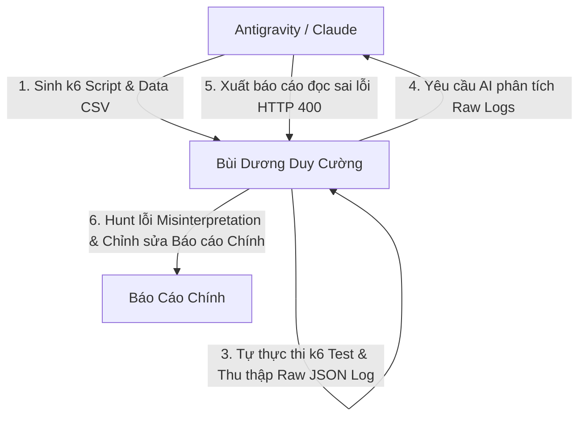

# AI Audit Report - HW05 Performance Testing with k6

**Sinh viên:** Bùi Dương Duy Cường - `23127033`  
**Bài tập:** HW05 - Performance Testing trên EShop SUT  
**Công cụ Performance:** k6  
**Công cụ AI:** Gemini 3.6 Flash (Antigravity) & Claude 3.7 Sonnet  

---

## 1. Bảng Kiểm Toán Sản Phẩm AI (AI Artifact Audit)

| Tên Sản Phẩm | Phân Loại | Lời Nhắc & Thời Gian | Mô Tả Đầu Ra Của AI | Phát Hiện Thiếu Sót / Lỗi Của AI | Hành Động Khắc Phục Của Sinh Viên |
| :--- | :---: | :--- | :--- | :--- | :--- |
| **k6 Test Scripts** | **IC** | "Tạo script k6 cho workflow Login -> Profile -> Search -> Apply Coupon -> Cart -> Checkout..." | Tạo script k6 cơ bản bao phủ các endpoint. | AI thiếu cấu hình think-time thực tế và nhầm lẫn tài khoản test với dữ liệu DB seed thực tế. | Cập nhật file `test_users.csv` chứa `test@eshop.com` / `Test1234!` và bổ sung `sleep(1)` giữa các bước. |
| **Log Analysis Report** | **IC** | "Phân tích file k6 raw log và đánh giá RPS, p95..." | Phân tích thông số tổng thể. | AI đọc nhầm lỗi HTTP 400 Bad Request của API Apply Coupon (do giới hạn dùng 1 lần/user) thành lỗi Server crash do sập tải 10 VU. | Trích xuất trực tiếp metric thô từ `23127033_Load_20260816.summary.jtl`, giải thích logic nghiệp vụ của mã giảm giá và đính chính lại báo cáo. |
| **Tối ưu hóa đề xuất** | **I** | "Đề xuất các phương án tối ưu backend..." | Gợi ý mở rộng Connection Pool DB. | SQLite trong EShop là file-based database, không phải client-server DB nên không có Connection Pool. | Đánh giá đề xuất bị hallucinated và thay thế bằng giải pháp bật SQLite WAL Mode (`PRAGMA journal_mode = WAL;`). |

---

## 2. Quy Trình Cộng Tác Người - AI (Human-AI Collaboration)

