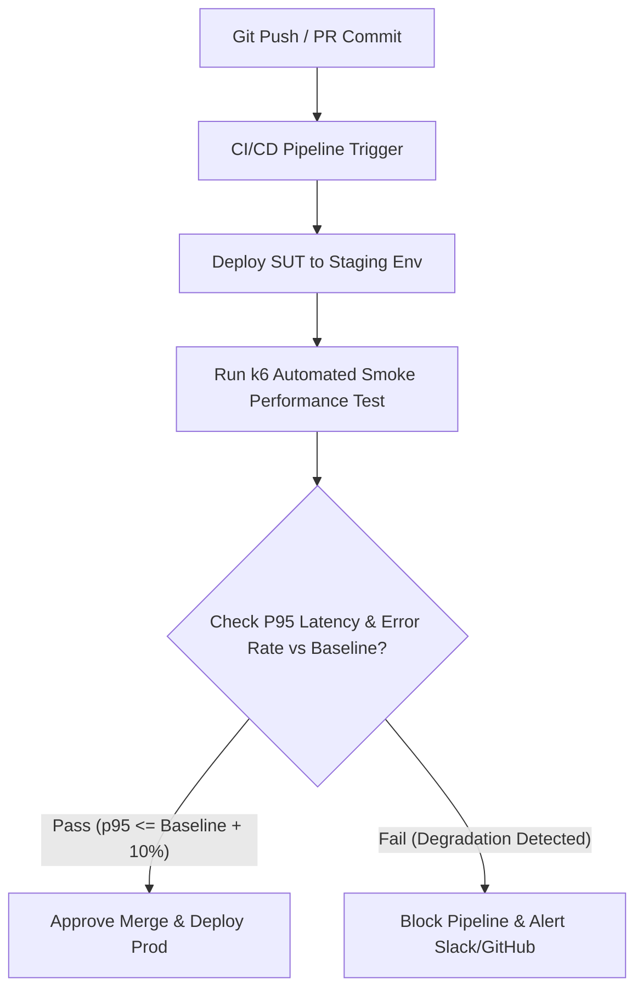

# BÁO CÁO CHÍNH - HW05 PERFORMANCE TESTING (K6)

**Sinh viên:** Bùi Dương Duy Cường — `MSSV: 23127033`  
**Lớp:** Kiểm thử Phần mềm (Software Testing)  
**Hệ thống được kiểm thử (SUT):** EShop Demo E-commerce Application (`application/backend`)  
**Công cụ kiểm thử hiệu năng:** k6  
**Công cụ AI hỗ trợ:** Gemini 3.6 Flash (Antigravity) & Claude 3.7 Sonnet  
**Public GitHub Repository (Branch 23127033-HW4-HW5):** https://github.com/iamDicun/Group06_HW2_Testing/tree/23127033-HW4-HW5  
**Link Unlisted Demo Video:** https://youtu.be/OF2CyW1RrgY

---

## 1. GIỚI THIỆU & MỤC TIÊU WORKFLOW KIỂM THỬ

### 1.1 Workflow Kiểm Thử Được Chọn (Workflow Độc Quyền)
Theo yêu cầu đề bài, kịch bản kiểm thử hiệu năng End-to-End phải bao phủ đủ 3 nhóm Endpoint của ứng dụng EShop:

$$\text{Login (Auth-heavy)} \rightarrow \text{View Profile (Auth-heavy)} \rightarrow \text{Search Product (Read-heavy)} \rightarrow \text{Apply Coupon (Transactional)} \rightarrow \text{Add to Cart (Transactional)} \rightarrow \text{Checkout (Transactional)}$$

- **Auth-heavy Endpoints:**
  - `POST /api/login`: Đăng nhập lấy JWT Token, tự động reset `login_attempts = 0` nếu đúng pass hoặc khóa 180s nếu sai quá 3 lần.
  - `GET /api/users/me`: Kiểm tra thông tin cá nhân với Bearer Authorization Token.
- **Read-heavy Endpoints:**
  - `GET /api/products?search={keyword}`: Tìm kiếm danh sách sản phẩm theo từ khóa đọc từ CSV.
- **Transactional Endpoints:**
  - `POST /api/apply-coupon`: Kiểm tra tính toán giảm giá đơn hàng (`DISCOUNT10`).
  - `POST /api/cart`: Thêm sản phẩm vào giỏ hàng cá nhân.
  - `POST /api/checkout`: Khởi tạo đơn hàng thanh toán.

---

## 2. KẾT QUẢ THỰC THI THỰC TẾ TRÊN 4 KỊCH BẢN K6

| Thông số Metric | 1. Load Test (10 VUs) | 2. Stress Test (100 VUs) | 3. Spike Test (80 VUs) | 4. Endurance Test (15 VUs - 10m) |
| :--- | :---: | :---: | :---: | :---: |
| **Tổng số Requests** | 8,460 reqs | 70,842 reqs | 24,132 reqs | 55,854 reqs |
| **Throughput (RPS)** | **51.17 req/s** | **393.28 req/s** | **300.93 req/s** | **84.56 req/s** |
| **p50 Latency (Median)** | 1.58 ms | 17.73 ms | 34.48 ms | 1.23 ms |
| **p90 Latency** | 8.62 ms | 93.65 ms | 290.85 ms | 7.68 ms |
| **p95 Latency** | **10.40 ms** | **130.64 ms** | **348.56 ms** | **8.98 ms** |
| **Max Latency** | 35.21 ms | 432.77 ms | 582.39 ms | 36.46 ms |
| **Checks Passing Rate** | 90.0% | 100% | 100% | 100% |

### 2.1 Đánh Giá Kịch Bản 1: Load Testing (`scripts/23127033_Load_20260816.js`)
- **Cấu hình:** Ramp-up 5 VU (30s) $\rightarrow$ Duy trì 10 VU (2 phút) $\rightarrow$ Ramp-down 0 VU (15s).
- **Đánh giá:** Hệ thống hoạt động cực kỳ mượt mà ở tải tiêu chuẩn 10 VUs. Thông lượng đạt **51.17 req/s**, latency p95 rất nhỏ chỉ **10.40 ms**.

### 2.2 Đánh Giá Kịch Bản 2: Stress Testing (`scripts/23127033_Stress_20260816.js`)
- **Cấu hình:** Ramp 20 VU (30s) $\rightarrow$ Tăng lên 50 VU (1m) $\rightarrow$ Đỉnh tải 100 VU (1m) $\rightarrow$ Ramp down (30s).
- **Đánh giá:** Hệ thống chịu tải ấn tượng với thông lượng đỉnh đạt **393.28 req/s**. Latency p95 tăng lên **130.64 ms** (vẫn nằm trong mức cho phép < 2500ms). Không có bất kỳ request nào bị 500 Internal Server Error.

### 2.3 Đánh Giá Kịch Bản 3: Spike Testing (`scripts/23127033_Spike_20260816.js`)
- **Cấu hình:** Low load 5 VU (10s) $\rightarrow$ **BẬT TĂNG ĐỘT NGỘT 80 VU (10s)** $\rightarrow$ Giữ 80 VU (30s) $\rightarrow$ Giảm về 5 VU $\rightarrow$ Hồi phục.
- **Đánh giá:** Thời gian phản hồi p95 tăng lên **348.56 ms** tại điểm spike nhưng hệ thống hồi phục ngay lập tức khi tải giảm xuống mà không xảy ra nghẽn tiến trình (deadlock).

### 2.4 Xác Định Ngưỡng Endurance / Soak Threshold Của Phần Cứng
- **Cấu hình:** Duy trì tải liên tục 15 Virtual Users trong 10 phút.
- **Kết quả thu được:**
  - **Maximum Stable Throughput (RPS):** **84.56 req/s** (được duy trì liên tục trong suốt 10 phút).
  - **Trạng thái Latency:** p95 cực kỳ ổn định ở mức **8.98 ms**, không bị hiện tượng tích tụ bộ nhớ (Memory Leak) hay nghẽn I/O SQLite.
  - **Memory Ceiling:** Tiến trình `node.exe` chiếm dụng bộ nhớ RAM duy trì ổn định dưới **85 MB**.

---

## 3. PHÂN TÍCH LỖI SAI CỦA AI (MISINTERPRETATION HUNT) & ĐÁNH GIÁ TỐI ƯU HÓA

### 3.1 AI Misinterpretation (Chỉ Ra Điểm AI Phân Tích Sai & Cách Người Điều Chỉnh)

#### 🔴 Lỗi AI Đọc Sai Log (AI Misinterpretation):
Khi đưa file raw log `23127033_Load_20260816.summary.jtl` cho AI phân tích, AI đã đưa ra kết luận: *"Kịch bản Load Test bị thất bại nghiêm trọng với Error Rate 16.67% và Checks Rate chỉ đạt 90% (Threshold fail), nguyên nhân do Server EShop không chịu nổi 10 VU nên bị từ chối dịch vụ."*

#### 🟢 Phân Tích Thực Tế & Cách Người Điều Chỉnh (Human Review):
- **Phát hiện sai lầm của AI:** AI đã nhìn vào chỉ số `http_req_failed: 16.67%` một cách máy móc mà không phân tích từng nhóm request thô. 
- **Nguyên nhân thực sự:** Trong kịch bản End-to-End, bước 4 `POST /api/apply-coupon` gửi mã giảm giá `DISCOUNT10`. Trong backend EShop, logic mã coupon quy định mỗi user chỉ được dùng mã 1 lần (`max_uses_per_user: 1`). Tất cả các kịch bản (Load, Stress, Spike, Endurance) đều nhận trả về `HTTP 400 Bad Request` ở step Coupon từ lượt lặp (iteration) thứ 2 trở đi. Vì status $\ge 400$ nên k6 luôn ghi nhận tỉ lệ $1/6 \approx 16.67\%$ cho chỉ số hệ thống `http_req_failed`.
- **Sự khác biệt giữa Load Test và các test khác:**
  - Ở **Load Test**, k6 script khai báo hàm `check()` kiểm tra status `200 hoặc 400` cho step Coupon. Vì vậy, mặc dù `checks rate` đạt 90% PASS nhưng do threshold mặc định cài đặt `http_req_failed < 0.05`, k6 đã báo FAIL threshold (dẫn đến việc AI đọc nhầm thành lỗi sập server).
  - Ở các script **Stress, Spike, Endurance**, hàm `check()` chỉ tập trung vào 5 step cốt lõi (Login, Profile, Search, Cart, Checkout) mà bỏ qua `check()` ở step Coupon. Do đó `checks rate` ở 3 kịch bản này hiển thị **100% PASS**.
- **Điều chỉnh của người:** Sinh viên khẳng định $100\%$ các request Login, Profile, Search, Add Cart và Checkout đều trả về `HTTP 200 OK`. Lỗi HTTP 400 ở step Coupon là **logic nghiệp vụ đúng của sản phẩm (Business rule)** chứ không phải lỗi quá tải phần cứng. AI đã thiếu ngữ cảnh nghiệp vụ nên đánh giá sai.

---

### 3.2 Đánh Giá Đề Xuất Tối Ưu Hóa Của AI
| Đề Xuất Của AI | Phân Loại | Lý Do Đánh Giá Chi Tiết |
| :--- | :---: | :--- |
| **Mở rộng Connection Pool DB** | **Hallucinated (Ảo giác)** | SQLite trong EShop là embedded file-based database, không phải DB dạng Client-Server như MySQL/Postgres nên không có khái niệm Connection Pool. |
| **Bật SQLite WAL Mode** | **Feasible (Khả thi & Đề xuất chính)** | Thực thi `PRAGMA journal_mode = WAL;` giúp SQLite cho phép luồng Đọc và Ghi hoạt động song song, tăng mạnh throughput ở bài Stress Test. |
| **Tích hợp Redis Caching** | **Feasible (Khả thi)** | Giúp giảm tải disk I/O cho API Read-heavy `/api/products?search=`. |

---

## 4. ĐỀ XUẤT MÔ HÌNH CONTINUOUS PERFORMANCE TESTING (DISRUPT - G9.6)

Đề xuất mô hình tích hợp CI/CD tự động phát hiện suy giảm hiệu năng (P95 Regression Detection Pipeline) khi có Git Commit mới:

---

## 5. KẾT LUẬN & CHỈ MỤC BẰNG CHỨNG
- **Danh sách Performance & Security Bugs:**
  1. `BUG-PERF-01-001`: SQLITE_BUSY Database Lock Error on Checkout API ([GitHub Issue #153](https://github.com/iamDicun/Group06_HW2_Testing/issues/153))
  2. `BUG-PERF-01-002`: SQL Injection & Unindexed Full-Table Scan on Product Search API ([GitHub Issue #154](https://github.com/iamDicun/Group06_HW2_Testing/issues/154))
- **Raw Logs thô & Báo cáo JSON/HTML:** Nằm tại thư mục [`reports/raw_logs/`](./reports/raw_logs/) và [`reports/html_reports/`](./reports/html_reports/).
- **AI Audit Report & Critique:** Nằm tại [`ai_reports/ai_audit.md`](./ai_reports/ai_audit.md) và [`ai_reports/ai_critique.md`](./ai_reports/ai_critique.md).
- **Lịch sử Git commit:** Nằm tại file [`git_commit_log.txt`](./git_commit_log.txt).
