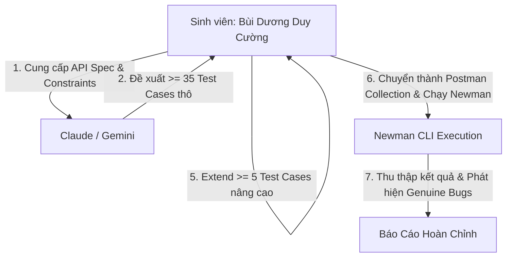

# AI Audit Report — HW06 API Testing

**Sinh viên:** Bùi Dương Duy Cường — `MSSV: 23127033`  
**Bài tập:** HW06 – API Testing (Postman & Newman)  
**Công cụ kiểm thử:** Postman Desktop & Newman CLI  
**Công cụ AI sử dụng:** Claude 3.7 Sonnet & Gemini 3.7 Flash  

---

## 1. Khai Báo Sử Dụng AI (AI Declaration)
> *"Tôi có sử dụng các công cụ AI (Claude 3.7 Sonnet, Gemini 3.7 Flash) để hỗ trợ: phân tích đặc tả API, sinh các ca kiểm thử sơ bộ theo phân vùng tương đương, bảo mật và schema, cũng như hỗ trợ thiết kế cấu trúc JSON cho Postman Collection."*

---

## 2. Bảng Kiểm Toán Sản Phẩm AI (AI Artifact Audit)

| Tên Sản Phẩm / Tác Vụ | Phân Loại | Lời Nhắc (Prompt) & Thời Gian | Mô Tả Đầu Ra Của AI | Phát Hiện Lỗi / Thiếu Sót Của AI | Hành Động Khắc Phục Của Sinh Viên |
| :--- | :---: | :--- | :--- | :--- | :--- |
| **API 1 Test Cases (`POST /api/forgot-password`)** | **IC** | "Tạo 35 test case cho API POST /api/forgot-password bao phủ domain, security, OTP brute-force, schema..." *(22/08/2026)* | Bảng 35 test cases gồm input email, expected status 200/404, fields. | AI đoán sai status code khi email sai định dạng (dự đoán 400 thay vì 404 của Express DB query). Bỏ sót test header Content-Type và latency. | Đính chính status code 404 trong bảng Audit, bổ sung thêm 5 Extended Test Cases kiểm tra Performance, Protocol Header và rò rỉ OTP. |
| **API 2 Test Cases (`POST /api/apply-coupon`)** | **IC** | "Tạo 35 test case cho API POST /api/apply-coupon kiểm tra mã coupon, min order, expiry..." *(22/08/2026)* | Bảng 35 test cases cho tính toán discount. | AI không tính đến case coupon đã dùng vượt quá `max_uses_per_user` và case truyền `total_amount` số thực float. | Hiệu chỉnh lại công thức kỳ vọng trong assert và bổ sung kịch bản lặp lượt dùng. |
| **API 3 Test Cases (`PUT /api/admin/...`)** | **I** | "Tạo 35 test case cho API PUT /api/admin/orders/:id/status kiểm tra RBAC và State transition..." *(22/08/2026)* | Bảng 35 test cases cho trạng thái đơn hàng. | AI nhầm lẫn giữa mã HTTP 401 (chưa đăng nhập) và 403 (user thường gọi API admin), đồng thời thiếu case chuyển ngược trạng thái từ delivered về pending. | Tách rõ 2 test case 401 vs 403 riêng biệt, bổ sung case kiểm tra State Transition vi phạm nghiệp vụ. |
| **Agent Skill Design (G9.5)** | **C** | "Thiết kế kiến trúc AI-driven API test generator nhận API spec và sinh Postman tests..." *(22/08/2026)* | Bản thiết kế kiến trúc và pseudocode. | Thiết kế ban đầu mang tính tổng quát, chưa có module parse riêng cho các rule bảo mật SEC-01 đến SEC-07. | Bổ sung module xử lý Security Rule Engine và chuẩn hóa đầu ra Postman Collection v2.1. |

*(Ghi chú phân loại: **C** = Correct/Hoàn chỉnh, **IC** = Incomplete/Cần bổ sung, **I** = Incorrect/Sai sót cần sửa)*

---

## 3. Quy Trình Phối Hợp Người - AI (Human-AI Collaboration Flow)

