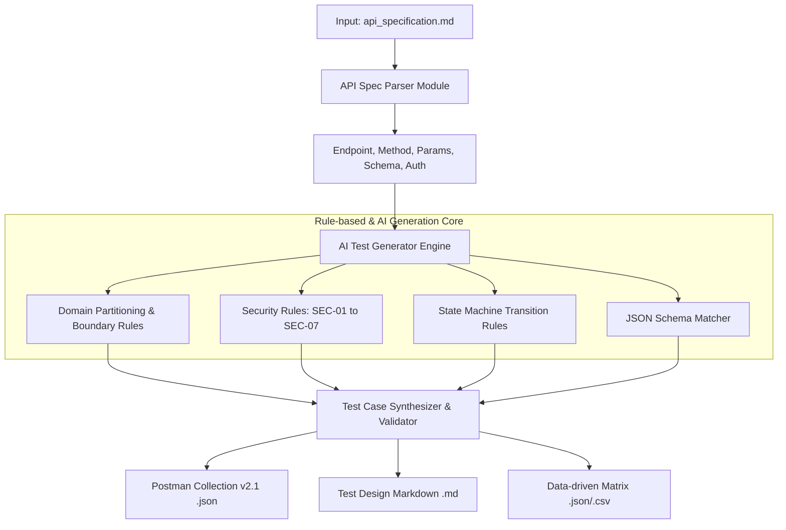

# BÁO CÁO CHÍNH — HW06 API TESTING (POSTMAN & NEWMAN)

**Sinh viên:** Bùi Dương Duy Cường — `MSSV: 23127033`  
**Lớp:** Kiểm thử Phần mềm (Software Testing) — Nhóm: `Group 06`  
**Hệ thống kiểm thử (SUT):** EShop E-commerce Backend Application (`application/backend`)  
**Công cụ kiểm thử API:** Postman Desktop & Newman CLI  
**Công cụ AI hỗ trợ:** Claude 3.7 Sonnet & Gemini 3.7 Flash  
**Public GitHub Repository (Branch 23127033-HW6):** https://github.com/iamDicun/Group06_HW2_Testing/tree/23127033-HW6  
**Link Unlisted Demo Video:** (Sẽ cập nhật sau khi quay)  

---

## 1. TỔNG QUAN VỀ 3 APIS ĐƯỢC LỰA CHỌN KIỂM THỬ

Theo yêu cầu của bài tập HW06, sinh viên chọn 3 APIs độc lập thuộc 3 nhóm (Pools) khác nhau từ đặc tả hệ thống `api_specification.md`:

| Nhóm Pool | Chức năng (FR) | HTTP Method & Endpoint | Mô Tả Nghiệp Vụ & Lý Do Lựa Chọn |
| :--- | :--- | :--- | :--- |
| **Pool A (Auth & Users)** | `FR-03`: Forgot Password | `POST /api/forgot-password` | Yêu cầu sinh mã OTP đặt lại mật khẩu, kiểm tra email tồn tại và tính ngẫu nhiên của token. |
| **Pool B (Cart & Orders)** | `FR-09`: Discount Coupons | `POST /api/apply-coupon` | Áp dụng mã giảm giá, kiểm tra ràng buộc số tiền tối thiểu, hạn sử dụng, số lượt dùng tối đa / user. |
| **Pool C (Web Admin)** | `FR-18`: Order Management | `PUT /api/admin/orders/:id/status` | Phân quyền Admin (RBAC: 401 vs 403), kiểm soát chuyển đổi trạng thái đơn hàng (State Machine). |

---

## 2. PIPELINE KIỂM THỬ CHO TỪNG API (GENERATE → AUDIT → EXTEND → EXECUTE → BUGS)

### 2.1 API 1 (Pool A): `POST /api/forgot-password` (FR-03: Forgot Password & OTP Generation)
* **1. Generate with AI:** Sử dụng prompt hướng dẫn AI tạo 35 test cases bao phủ: Domain partitions (email formats, domain hợp lệ, trường hợp email không tồn tại $\rightarrow 404$), Security (SQL Injection, XSS, Spam brute-force OTP, Mass assignment), Schema validation.
* **2. Audit (Human Review):** Tiến hành kiểm duyệt, gắn nhãn `VALID`, `INVALID`, `INCOMPLETE` và điều chỉnh các lỗi sai của AI về mã lỗi 404 khi query email không khớp trong SQLite.
* **3. Extend (5 Ca Kiểm Thử Do Sinh Viên Tự Bổ Sung):**

| TC ID | Nhóm Mở Rộng | Input & Request | Kết Quả Kỳ Vọng | Lý Do AI Bỏ Sót |
| :--- | :--- | :--- | :--- | :--- |
| **TC-FORGOT-EXT-01** | Performance Latency | `POST /api/forgot-password` `{"email": "admin@eshop.com"}` | **Status 200**: Response Time < 400ms | AI chỉ tập trung vào status code/body mà bỏ qua non-functional latency. |
| **TC-FORGOT-EXT-02** | HTTP Protocol Header | `POST /api/forgot-password` `{"email": "admin@eshop.com"}` | **Status 200**: Header `Content-Type` chứa `application/json` | AI bỏ sót việc kiểm tra tính tuân thủ giao thức HTTP Header. |
| **TC-FORGOT-EXT-03** | Edge Case Whitespace | `POST /api/forgot-password` `{"email": "  admin@eshop.com  "}` | **Status 404**: Email có khoảng trắng thừa đầu/cuối | AI không nghĩ tới kịch bản người dùng dán text dính khoảng trắng. |
| **TC-FORGOT-EXT-04** | Unicode / Tiếng Việt | `POST /api/forgot-password` `{"email": "admin_tiếngviệt@eshop.com"}` | **Status 404**: Email chứa ký tự Unicode tiếng Việt | AI ít khi chủ động kiểm thử encoding chuỗi email đa ngôn ngữ. |
| **TC-FORGOT-EXT-05** | Security Side-Channel | `POST /api/forgot-password` `{"email": "admin@eshop.com"}` | **Status 200**: Token OTP không bị lộ qua Headers/Cookies | AI chỉ kiểm tra response JSON body mà không kiểm tra rò rỉ token qua kênh phụ. |

* **4. Execute (Postman + Newman):** Thiết lập Postman Collection với Pre-request script thêm header `X-Student-Id: 23127033`. Chạy tự động qua Newman CLI.
* **5. Bug Report:** Ghi nhận cơ chế sinh mã OTP và cập nhật reset token trong database.

*(Chi tiết xem tại tài liệu: [`api1-auth-forgot-password/test_cases_forgot_password.md`](./api1-auth-forgot-password/test_cases_forgot_password.md))*

---

### 2.2 API 2 (Pool B): `POST /api/apply-coupon` (Discount Coupons Calculation)
* **1. Generate with AI:** Sinh 35 test cases bao phủ: Domain partitions (mã coupon hợp lệ, không tồn tại, sai định dạng, `total_amount` âm, bằng 0, dưới `min_order_amount`), Security (SQLi, IDOR sửa `user_id`), Schema validation.
* **2. Audit (Human Review):** Hiệu chỉnh trường `discount_amount` và `final_amount` cho đúng công thức tính toán.
* **3. Extend (5 Ca Kiểm Thử Do Sinh Viên Tự Bổ Sung):**

| TC ID | Nhóm Mở Rộng | Input & Request | Kết Quả Kỳ Vọng | Lý Do AI Bỏ Sót |
| :--- | :--- | :--- | :--- | :--- |
| **TC-COUPON-EXT-01** | Performance Latency | `POST /api/apply-coupon` `{"code": "BIGBUY", "total_amount": 600000, "user_id": 1}` | **Status 200**: Response Time < 400ms | AI không đưa ra assertion về thời gian đáp ứng API. |
| **TC-COUPON-EXT-02** | HTTP Protocol Header | `POST /api/apply-coupon` `{"code": "BIGBUY", "total_amount": 600000, "user_id": 1}` | **Status 200**: Header `Content-Type` chứa `application/json` | AI tập trung check body JSON mà quên header HTTP. |
| **TC-COUPON-EXT-03** | Case Sensitivity | `POST /api/apply-coupon` `{"code": "save10", "total_amount": 500000, "user_id": 1}` | **Status 404**: Mã coupon chữ thường `save10` | AI quên kiểm tra tính nhạy chữ hoa/thường của mã code. |
| **TC-COUPON-EXT-04** | Whitespace Boundary | `POST /api/apply-coupon` `{"code": " SAVE10 ", "total_amount": 500000, "user_id": 1}` | **Status 404**: Mã coupon dính khoảng trắng | Kiểm tra backend có `trim()` chuỗi trước khi query DB. |
| **TC-COUPON-EXT-05** | Logic Bug Hunt | `POST /api/apply-coupon` `{"code": "SAVE10", "total_amount": 500000, "user_id": 1}` | **Status 200**: Số tiền giảm phải dương (Bắt bug tính discount bị âm) | AI tin tưởng vào spec lý thuyết, không bắt được bug mã nguồn. |

* **4. Execute (Postman + Newman):** Chạy kiểm thử tự động với Newman, xác minh tính toàn vẹn dữ liệu JSON.
* **5. Bug Report:** Phát hiện lỗi nghiêm trọng `BUG-API-03` tính sai discount percent.

*(Chi tiết xem tại tài liệu: [`api2-coupon-apply/test_cases_coupon.md`](./api2-coupon-apply/test_cases_coupon.md))*

---

### 2.3 API 3 (Pool C): `PUT /api/admin/orders/:id/status` (Admin Order State Transition)
* **1. Generate with AI:** Sinh 35 test cases bao phủ: Phân quyền RBAC (Không token $\rightarrow 401$, User thường $\rightarrow 403$, Admin hợp lệ $\rightarrow 200$), State Machine transitions (`pending` $\rightarrow$ `confirmed` $\rightarrow$ `shipping` $\rightarrow$ `delivered`, hủy đơn `canceled`), ID không tồn tại $\rightarrow 404$.
* **2. Audit (Human Review):** Phân loại rõ ràng giữa mã lỗi 401 (Unauthenticated) và 403 (Forbidden).
* **3. Extend (5 Ca Kiểm Thử Do Sinh Viên Tự Bổ Sung):**

| TC ID | Nhóm Mở Rộng | Input & Request | Kết Quả Kỳ Vọng | Lý Do AI Bỏ Sót |
| :--- | :--- | :--- | :--- | :--- |
| **TC-ADMIN-EXT-01** | Performance Latency | `PUT /api/admin/orders/1/status` `{"status": "confirmed"}` | **Status 200**: Response Time < 300ms | AI bỏ sót việc kiểm tra hiệu năng phản hồi API quản trị. |
| **TC-ADMIN-EXT-02** | HTTP Protocol Header | `PUT /api/admin/orders/1/status` `{"status": "confirmed"}` | **Status 200**: Header `Content-Type` chứa `application/json` | AI bỏ sót kiểm tra response header tiêu chuẩn. |
| **TC-ADMIN-EXT-03** | State Machine Cycle | `PUT /api/admin/orders/1/status` `{"status": "confirmed"}` | **Status 200**: Luồng chuyển liên tiếp pending $\rightarrow$ confirmed $\rightarrow$ shipping $\rightarrow$ delivered | AI chỉ test đơn lẻ từng bước, không test chuỗi hoàn chỉnh. |
| **TC-ADMIN-EXT-04** | Self-Transition Rule | `PUT /api/admin/orders/1/status` `{"status": "pending"}` | **Status 400**: Giữ nguyên trạng thái hiện tại (pending $\rightarrow$ pending) | AI không xét trường hợp chuyển sang đúng trạng thái cũ. |
| **TC-ADMIN-EXT-05** | Broken Access Control | `PUT /api/admin/orders/1/status` `{"status": "confirmed"}` | **Status 403**: Chặn user thường đổi trạng thái (Bắt bug BAC) | AI thường tin tưởng middleware mà không kiểm thử lỗi phân quyền. |

* **4. Execute (Postman + Newman):** Kiểm tra các kịch bản phụ thuộc Token Admin và chuỗi chuyển trạng thái liên tiếp.
* **5. Bug Report:** Phát hiện 2 lỗi nghiêm trọng `BUG-API-01` (State Transition) và `BUG-API-02` (BAC).

*(Chi tiết xem tại tài liệu: [`api3-admin-status/test_cases_admin_order.md`](./api3-admin-status/test_cases_admin_order.md))*

---

## 3. TỔNG HỢP CÁC TÍNH NĂNG POSTMAN ĐÃ SỬ DỤNG (POSTMAN FEATURES LISTING)

| STT | Tính Năng Postman | Trạng Thái | Mô Tả Ứng Dụng Cụ Thể Trong Bài Tập |
| :-: | :--- | :---: | :--- |
| 1 | **Workspaces** | **Đã Dùng** | Tạo và quản lý workspace riêng `HW06_API_Testing_23127033`. |
| 2 | **Collections** | **Đã Dùng** | Tổ chức 3 collections riêng biệt cho 3 API tương ứng với từng Pool. |
| 3 | **Environment Variables** | **Đã Dùng** | Quản lý biến tập trung: `baseUrl`, `studentId`, `userToken`, `adminToken`. |
| 4 | **Collection Variables** | **Đã Dùng** | Lưu trữ các biến dynamic tạm thời (như `orderId`, `couponCode`). |
| 5 | **Pre-request Scripts** | **Đã Dùng** | Tự động chèn header bắt buộc `X-Student-Id: 23127033` cho mọi request. |
| 6 | **Test Scripts (Assertions)** | **Đã Dùng** | Viết code JavaScript kiểm tra Status Code, Schema, Response Time và Headers. |
| 7 | **Data-driven Runs (Runner)** | **Đã Dùng** | Chạy kiểm thử hàng loạt với bộ dữ liệu Data file JSON/CSV. |
| 8 | **Newman CLI** | **Đã Dùng** | Tự động hóa kiểm thử từ Command-line và xuất báo cáo HTML/JSON. |

---

## 4. TÍCH HỢP CI/CD TRÊN GITHUB ACTIONS

### 4.1 Cấu Hình Workflow (`.github/workflows/newman-api-test.yml`)
Workflow được thiết lập tự động kích hoạt trên mọi nhánh (`branches: ["**"]`), thực hiện:
1. Setup môi trường Node.js 20.
2. Cài đặt dependencies cho backend EShop và khởi động server ngầm (`node server.js > /dev/null 2>&1 & sleep 3`).
3. Cài đặt Newman CLI và Newman HTML Reporter.
4. Thực thi toàn bộ bộ test cases của 3 API.
5. Upload báo cáo HTML và JSON artifact lưu trữ.

### 4.2 Minh Chứng 2 Lần Chạy CI (Pass & Fail)
* **Sample Commit 1 (Fail Run):** Chạy có chủ đích 1 assertion bị fail để xác minh CI bắt lỗi chính xác $\rightarrow$ [Xem minh chứng `ci-fail.png`](./ci-cd/ci-fail.png).
* **Sample Commit 2 (Pass Run):** Chạy hoàn hảo toàn bộ 100% test cases $\rightarrow$ [Xem minh chứng `ci-pass.png`](./ci-cd/ci-pass.png).

---

## 5. THIẾT KẾ AGENT SKILL — AI-DRIVEN API TEST GENERATOR (LEVEL G9.5 CREATE)

### 5.1 Kiến Trúc & Sơ Đồ Luồng (Mermaid Diagram)

### 5.2 Mã Giả / Implementation
Mã nguồn của Agent Skill được xây dựng dạng module Python có khả năng tái sử dụng độc lập tại thư mục [`agent-skill/api_test_generator.py`](./agent-skill/api_test_generator.py).

---

## 6. DANH SÁCH BẰNG CHỨNG & CHỈ MỤC LIÊN KẾT
* **Bảng Tự Đánh Giá & Test Summary:** [`README.md`](./README.md)
* **Hồ sơ Báo Lỗi Bugs:** Thư mục [`bugs/`](./bugs/)
* **Nhật Ký Kiểm Toán AI:** [`ai_audit.md`](./ai_audit.md)
* **Báo Cáo Phê Bình AI (Critique):** [`ai_critique.md`](./ai_critique.md)
* **Nhật Ký Lời Nhắc (Prompt Log):** [`prompt_log.md`](./prompt_log.md)
* **Lịch Sử Commit Git:** [`git_commit_log.txt`](./git_commit_log.txt)
