# Báo cáo lỗi GUI Testing - EShop

> **Ngày tạo**: 01/08/2026
> **Dự án**: EShop SUT (System Under Test)
> **Phạm vi**: GUI Testing - 45 mục kiểm tra giao diện
> **Tổng số lỗi**: 27 Failed / 45 mục
> **Môi trường kiểm tra**: Local, Backend localhost:3000, Frontend localhost:5173

---

## Bảng tóm tắt lỗi

| STT | Mã lỗi | Tiêu đề | Mức độ | Ưu tiên |
|-----|---------|---------|--------|---------|
| 01 | BUG-01 | Trang Home có nhiều hơn 1 thẻ `<h1> `| Medium | Medium |
| 02 | BUG-02 | Ảnh sản phẩm không có thuộc tính loading='lazy' | Low | Low |
| 03 | BUG-03 | Đơn vị tiền tệ hiển thị 'VND' thay vì ký hiệu '₫' | Medium | Medium |
| 04 | BUG-04 | Empty state giỏ hàng thiếu icon minh họa... | Low | Low |
| 05 | BUG-05 | Nhãn tổng tiền hiển thị 'Tổng tạm tính' thay vì 'Tổng c... | Low | Medium |
| 06 | BUG-06 | Bảng giỏ hàng bị tràn trên mobile... | Medium | Medium |
| 07 | BUG-07 | Trang Checkout không có thẻ <h1>... | Medium | Medium |
| 08 | BUG-08 | Ô tổng tiền cho phép người dùng sửa trực tiếp... | High | High |
| 09 | BUG-09 | Thiếu ký hiệu '*' bên cạnh các trường bắt buộc... | Medium | Medium |
| 10 | BUG-10 | Input Email dùng type='text' thay vì type='email'... | Medium | Medium |
| 11 | BUG-11 | Input Mật khẩu trên Login dùng type='text' hiển thị rõ ... | High | High |
| 12 | BUG-12 | Form Register không có trường 'Xác nhận mật khẩu'... | High | High |
| 13 | BUG-13 | Thông báo lỗi Login hiển thị DƯỚI nút Submit... | Low | Low |
| 14 | BUG-14 | Các input Profile thiếu thuộc tính autocomplete... | Low | Low |
| 15 | BUG-15 | Input Số điện thoại dùng type='text' thay vì type='tel'... | Medium | Medium |
| 16 | BUG-16 | Quên mật khẩu thiếu Step Indicator 'Bước 1 / 2'... | Low | Low |
| 17 | BUG-17 | Navbar không highlight trang đang chọn... | Medium | Medium |
| 18 | BUG-18 | Link 'Giỏ hàng' không hiển thị badge số lượng sản phẩm... | Medium | Medium |
| 19 | BUG-19 | Nút logout ghi 'Thoát' thay vì 'Đăng xuất'... | Low | Low |
| 20 | BUG-20 | Thiếu Breadcrumb trên các trang con... | Medium | Medium |
| 21 | BUG-21 | Product Detail thiếu nút 'Quay lại / Tiếp tục mua sắm'... | Low | Low |
| 22 | BUG-22 | Không có loading state (spinner/skeleton) khi tải danh ... | Medium | Medium |
| 23 | BUG-23 | Không có empty state khi tìm kiếm không có kết quả... | Medium | Medium |
| 24 | BUG-24 | Không có toast notification khi thêm vào giỏ hàng... | Medium | Medium |
| 25 | BUG-25 | Xóa item khỏi giỏ hàng không có dialog xác nhận... | Medium | Medium |
| 26 | BUG-26 | Ảnh sản phẩm không có thuộc tính width/height (gây layo... | Low | Low |
| 27 | BUG-27 | Màu sắc nút không nhất quán trên toàn trang... | Medium | Medium |

---

## Chi tiết từng lỗi

### BUG-01: Trang Home có nhiều hơn 1 thẻ <h1>

| Trường | Nội dung |
|--------|----------|
| **Bug ID** | BUG-01 |
| **Tiêu đề** | Trang Home có nhiều hơn 1 thẻ `<h1>` |
| **Môi trường** | Local, Browser: Cốc Cốc |
| **Điều kiện tiên quyết** | Backend đang chạy trên localhost:3000, Frontend load thành công |
| **Các bước thực hiện** | 1. Mở trang Home tại localhost:5173 2. DevTools > Elements tab 3. Nhấn Ctrl+F, tìm kiếm `<h1>` 4. Đếm số lượng thẻ `<h1>` trong kết quả |
| **Kết quả kỳ vọng (ER)** | Chỉ có 1 `<h1>` duy nhất với nội dung mô tả trang chủ (FR-21, FR-05) |
| **Kết quả thực tế (AR)** | Có 2 thẻ `<h1>`: 'Danh sách sản phẩm' và 'Hiển thị X sản phẩm'. Vi phạm FR-21 yêu cầu mỗi trang chỉ có 1 `<h1>`|
| **Mức độ (Severity)** | Medium |
| **Ưu tiên (Priority)** | Medium |
| **Bằng chứng** | 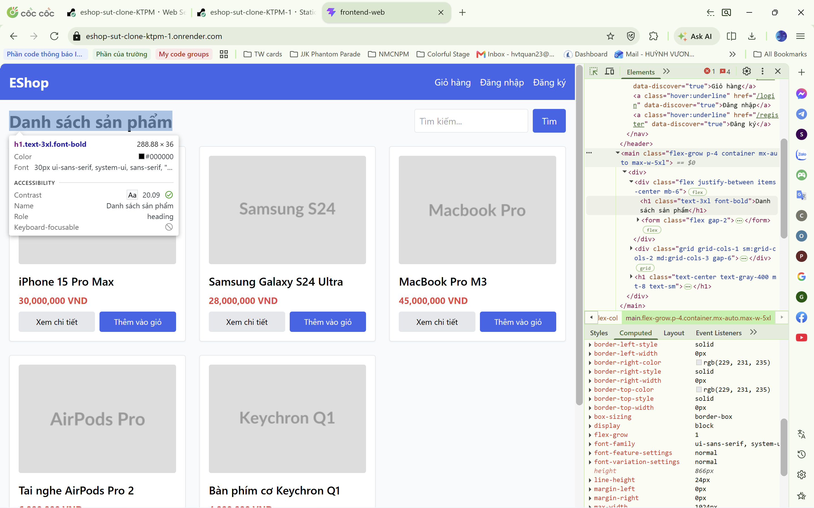   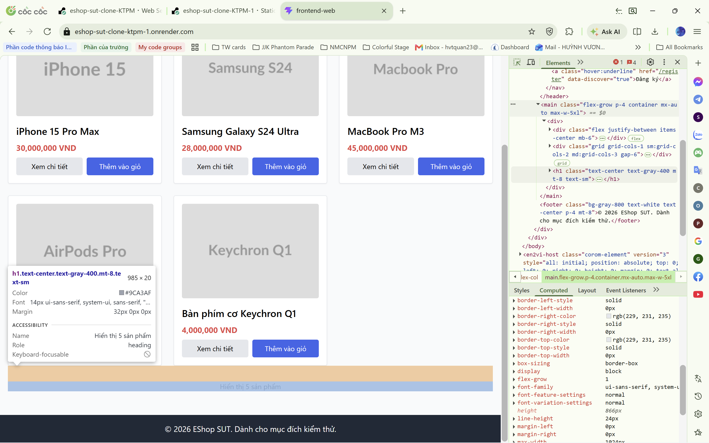|

---

### BUG-02: Ảnh sản phẩm không có thuộc tính loading='lazy'

| Trường | Nội dung |
|--------|----------|
| **Bug ID** | BUG-02 |
| **Tiêu đề** | Ảnh sản phẩm không có thuộc tính loading='lazy' |
| **Môi trường** | Local, Browser: Cốc Cốc |
| **Điều kiện tiên quyết** | Backend đang chạy trên localhost:3000, Frontend load thành công |
| **Các bước thực hiện** | 1. Mở trang Home tại localhost:5173 2. DevTools > Elements tab 3. Click chuột phải vào ảnh sản phẩm > Inspect  4. Kiểm tra thẻ  có thuộc tính loading='lazy' hay không |
| **Kết quả kỳ vọng (ER)** | Ảnh sản phẩm có loading='lazy' để trì hoãn tải ảnh ngoài viewport (Performance) |
| **Kết quả thực tế (AR)** | Thẻ  KHÔNG có thuộc tính loading='lazy'. Ảnh tải đồng thời gây chậm initial render, tăng FCP |
| **Mức độ (Severity)** | Low |
| **Ưu tiên (Priority)** | Low |
| **Bằng chứng** | 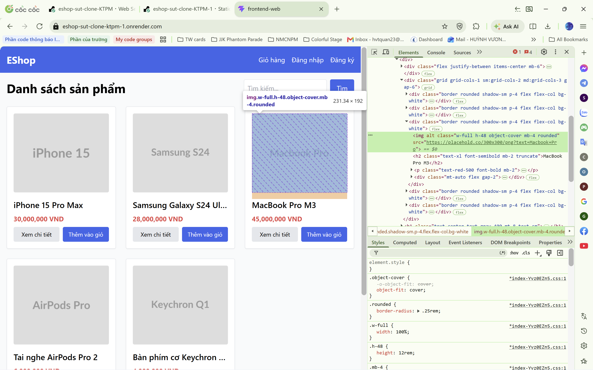 |

---

### BUG-03: Đơn vị tiền tệ hiển thị 'VND' thay vì ký hiệu '₫'

| Trường | Nội dung |
|--------|----------|
| **Bug ID** | BUG-03 |
| **Tiêu đề** | Đơn vị tiền tệ hiển thị 'VND' thay vì ký hiệu '₫' |
| **Môi trường** | Local, Browser: Cốc Cốc |
| **Điều kiện tiên quyết** | Backend đang chạy trên localhost:3000, Frontend load thành công |
| **Các bước thực hiện** | 1. Mở trang Home tại localhost:5173 2. DevTools > Elements tab 3. Tìm thẻ hiển thị giá sản phẩm 4. Kiểm tra nội dung text có chứa ký hiệu '₫' hay 'VND' |
| **Kết quả kỳ vọng (ER)** | Định dạng tiền tệ: ví dụ 299.000 ₫ (FR-21) |
| **Kết quả thực tế (AR)** | Hiển thị '30,000,000 VND' thay vì '30.000.000 ₫'. Vi phạm FR-21 yêu cầu dùng ký hiệu ₫ |
| **Mức độ (Severity)** | Medium |
| **Ưu tiên (Priority)** | Medium |
| **Bằng chứng** | 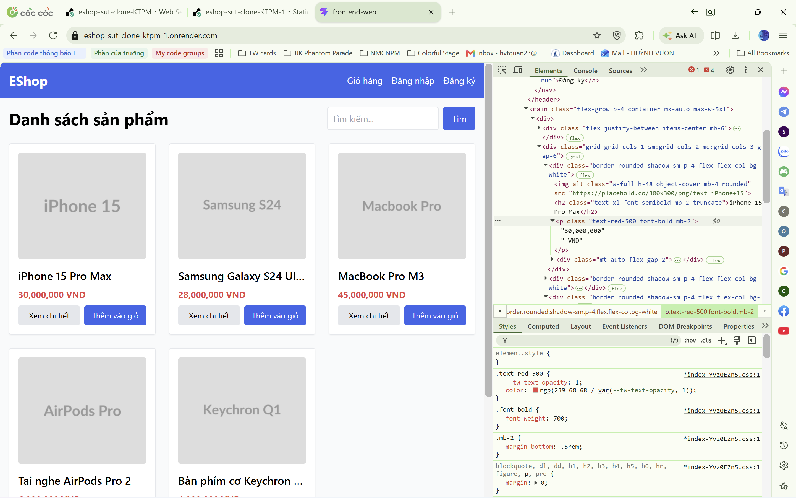 |

---

### BUG-04: Empty state giỏ hàng thiếu icon minh họa

| Trường | Nội dung |
|--------|----------|
| **Bug ID** | BUG-04 |
| **Tiêu đề** | Empty state giỏ hàng thiếu icon minh họa |
| **Môi trường** | Local, Browser: Cốc Cốc |
| **Điều kiện tiên quyết** | Backend đang chạy trên localhost:3000, Frontend load thành công |
| **Các bước thực hiện** | 1. Đảm bảo giỏ hàng trống 2. Mở trang Cart tại localhost:5173/cart 3. DevTools > Elements tab 4. Kiểm tra vùng empty state có chứa thẻ ``, `<svg>` hoặc icon font không |
| **Kết quả kỳ vọng (ER)** | Icon giỏ trống, text "Giỏ hàng đang trống", nút "Tiếp tục mua sắm" xanh dương (FR-07, FR-24) |
| **Kết quả thực tế (AR)** | Chỉ có text 'Giỏ hàng của bạn đang trống' và link text. THIẾU icon minh họa. Vi phạm FR-24 yêu cầu empty state phải có icon |
| **Mức độ (Severity)** | Low |
| **Ưu tiên (Priority)** | Low |
| **Bằng chứng** | 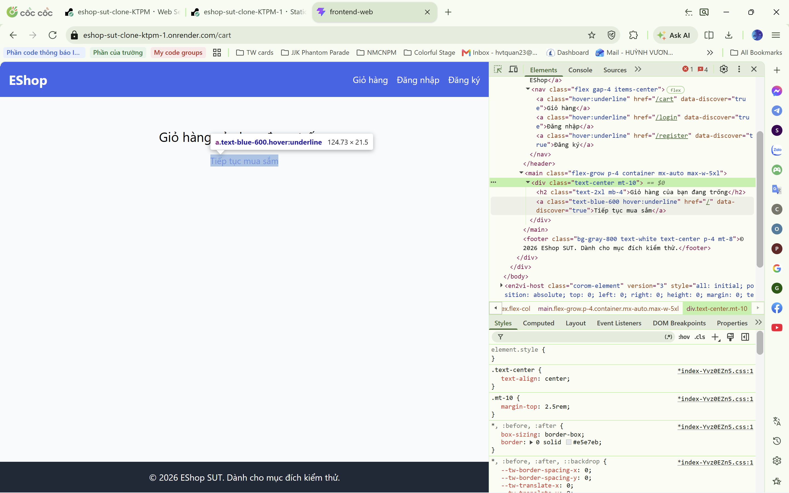 |

---

### BUG-05: Nhãn tổng tiền hiển thị 'Tổng tạm tính' thay vì 'Tổng cộng'

| Trường | Nội dung |
|--------|----------|
| **Bug ID** | BUG-05 |
| **Tiêu đề** | Nhãn tổng tiền hiển thị 'Tổng tạm tính' thay vì 'Tổng cộng' |
| **Môi trường** | Local, Browser: Cốc Cốc |
| **Điều kiện tiên quyết** | Backend đang chạy trên localhost:3000, Frontend load thành công |
| **Các bước thực hiện** | 1. Thêm sản phẩm vào giỏ hàng 2. Mở trang Cart tại localhost:5173/cart 3. DevTools > Elements tab 4. Tìm thẻ chứa text 'Tổng' và kiểm tra nội dung chính xác |
| **Kết quả kỳ vọng (ER)** | Nhãn chính xác "Tổng cộng" (không phải "Tổng tạm tính") (FR-07) |
| **Kết quả thực tế (AR)** | Nhãn hiển thị 'Tổng tạm tính'. Vi phạm FR-07 yêu cầu nhãn chính xác là 'Tổng cộng' |
| **Mức độ (Severity)** | Low |
| **Ưu tiên (Priority)** | Medium |
| **Bằng chứng** | 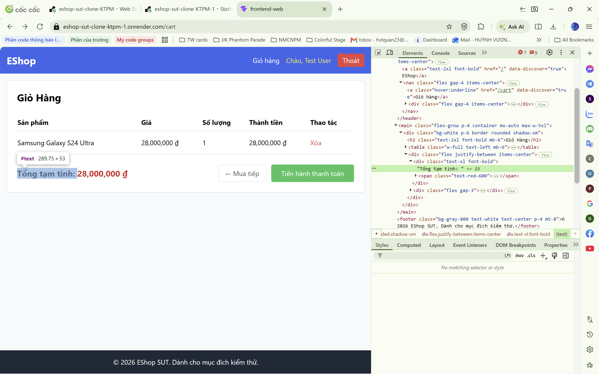 |

---

### BUG-06: Bảng giỏ hàng bị tràn trên mobile

| Trường | Nội dung |
|--------|----------|
| **Bug ID** | BUG-06 |
| **Tiêu đề** | Bảng giỏ hàng bị tràn trên mobile |
| **Môi trường** | Local, Browser: Cốc Cốc |
| **Điều kiện tiên quyết** | Backend đang chạy trên localhost:3000, Frontend load thành công |
| **Các bước thực hiện** | 1. Mở trang Cart tại localhost:5173/cart 2. DevTools > Toggle device toolbar (Ctrl+Shift+M) 3. Chọn thiết bị mobile (Galaxy ZFold 5, 344px) 4. Kiểm tra bảng giỏ hàng có bị tràn ngang không |
| **Kết quả kỳ vọng (ER)** | Không tràn màn hình, nội dung đọc được |
| **Kết quả thực tế (AR)** | Bảng bị tràn nội dung ngang qua mép màn hình. Không có cơ chế cuộn ngang hoặc chuyển layout. Vi phạm responsive requirement |
| **Mức độ (Severity)** | Medium |
| **Ưu tiên (Priority)** | Medium |
| **Bằng chứng** | 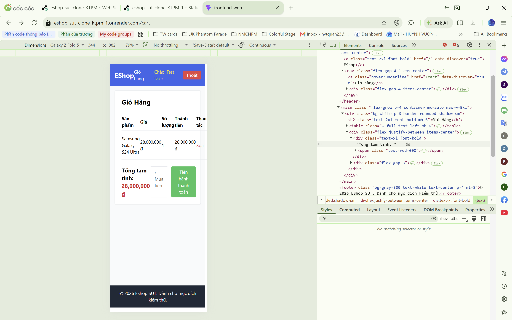 |

---

### BUG-07: Trang Checkout không có thẻ <h1>

| Trường | Nội dung |
|--------|----------|
| **Bug ID** | BUG-07 |
| **Tiêu đề** | Trang Checkout không có thẻ `<h1>`|
| **Môi trường** | Local, Browser: Cốc Cốc |
| **Điều kiện tiên quyết** | Backend đang chạy trên localhost:3000, Frontend load thành công |
| **Các bước thực hiện** | 1. Mở trang Checkout tại localhost:5173/checkout 2. DevTools > Elements tab 3. Nhấn Ctrl+F, tìm kiếm `<h1>` 4. Kiểm tra có thẻ `<h1>`nào tồn tại không |
| **Kết quả kỳ vọng (ER)** | Chỉ 1 `<h1>` chính xác (FR-21) |
| **Kết quả thực tế (AR)** | KHÔNG có thẻ `<h1>`nào trên trang Checkout. Vi phạm FR-21 yêu cầu mỗi trang phải có 1 `<h1>`|
| **Mức độ (Severity)** | Medium |
| **Ưu tiên (Priority)** | Medium |
| **Bằng chứng** | 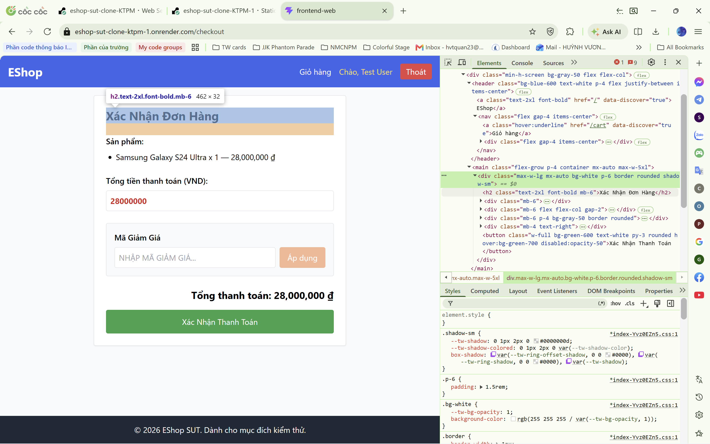 |

---

### BUG-08: Ô tổng tiền cho phép người dùng sửa trực tiếp

| Trường | Nội dung |
|--------|----------|
| **Bug ID** | BUG-08 |
| **Tiêu đề** | Ô tổng tiền cho phép người dùng sửa trực tiếp |
| **Môi trường** | Local, Browser: Cốc Cốc |
| **Điều kiện tiên quyết** | Backend đang chạy trên localhost:3000, Frontend load thành công |
| **Các bước thực hiện** | 1. Thêm sản phẩm vào giỏ hàng 2. Mở trang Checkout tại localhost:5173/checkout 3. DevTools > Elements tab 4. Tìm input hiển thị tổng tiền 5. Kiểm tra thuộc tính readonly hoặc disabled |
| **Kết quả kỳ vọng (ER)** | Ô tổng tiền disabled/readonly, giá trị khớp giỏ hàng (FR-08) |
| **Kết quả thực tế (AR)** | Input tổng tiền KHÔNG có thuộc tính readonly/disabled. Người dùng có thể sửa trực tiếp tổng tiền. Vi phạm FR-08 yêu cầu backend tự tính |
| **Mức độ (Severity)** | High |
| **Ưu tiên (Priority)** | High |
| **Bằng chứng** | 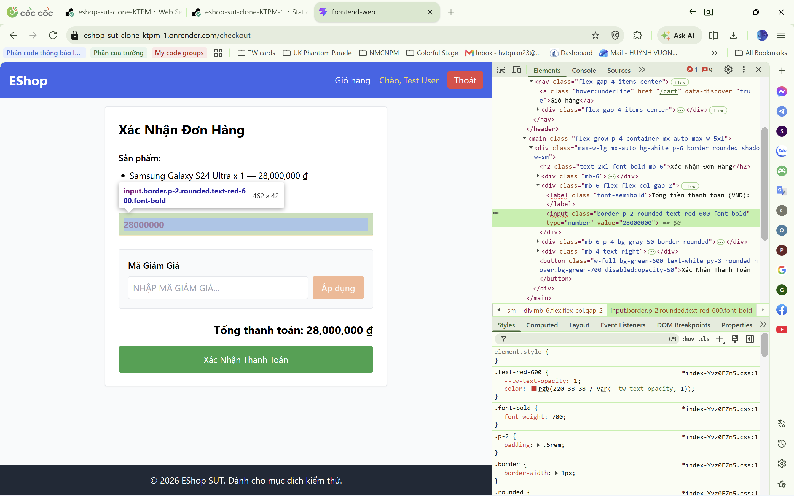 |

---

### BUG-09: Thiếu ký hiệu '*' bên cạnh các trường bắt buộc

| Trường | Nội dung |
|--------|----------|
| **Bug ID** | BUG-09 |
| **Tiêu đề** | Thiếu ký hiệu '*' bên cạnh các trường bắt buộc |
| **Môi trường** | Local, Browser: Cốc Cốc |
| **Điều kiện tiên quyết** | Backend đang chạy trên localhost:3000, Frontend load thành công |
| **Các bước thực hiện** | 1. Mở trang Login hoặc Register tại localhost:5173 2. DevTools > Elements tab 3. Kiểm tra các <label> hoặc phần tử chứa label 4. Tìm ký hiệu '*' màu đỏ bên cạnh nhãn trường bắt buộc |
| **Kết quả kỳ vọng (ER)** | * màu đỏ, ngay sau label, không bị tách dòng (FR-22) |
| **Kết quả thực tế (AR)** | KHÔNG có ký hiệu '*' bên cạnh bất kỳ trường bắt buộc nào. Vi phạm FR-22 |
| **Mức độ (Severity)** | Medium |
| **Ưu tiên (Priority)** | Medium |
| **Bằng chứng** | 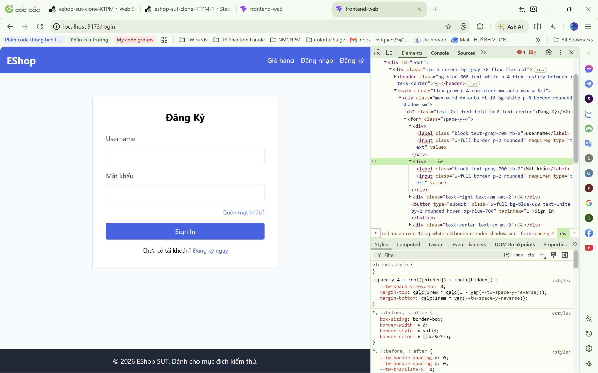 |

---

### BUG-10: Input Email dùng type='text' thay vì type='email'

| Trường | Nội dung |
|--------|----------|
| **Bug ID** | BUG-10 |
| **Tiêu đề** | Input Email dùng type='text' thay vì type='email' |
| **Môi trường** | Local, Browser: Cốc Cốc |
| **Điều kiện tiên quyết** | Backend đang chạy trên localhost:3000, Frontend load thành công |
| **Các bước thực hiện** | 1. Mở trang Login tại localhost:5173/login 2. DevTools > Elements tab 3. Tìm input nhập email 4. Kiểm tra thuộc tính type của input |
| **Kết quả kỳ vọng (ER)** | Keyboard mobile hiện @, HTML5 validation hoạt động (FR-02, FR-22) |
| **Kết quả thực tế (AR)** | Input Email có type='text'. Keyboard mobile không hiện '@'. Không có HTML5 email validation. Vi phạm FR-02, FR-22 |
| **Mức độ (Severity)** | Medium |
| **Ưu tiên (Priority)** | Medium |
| **Bằng chứng** | 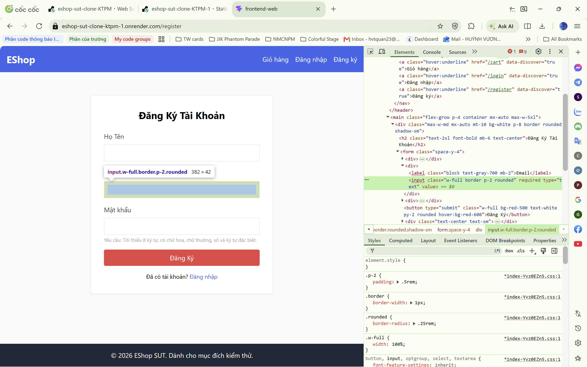 |

---

### BUG-11: Input Mật khẩu trên Login dùng type='text' hiển thị rõ password

| Trường | Nội dung |
|--------|----------|
| **Bug ID** | BUG-11 |
| **Tiêu đề** | Input Mật khẩu trên Login dùng type='text' hiển thị rõ password |
| **Môi trường** | Local, Browser: Cốc Cốc |
| **Điều kiện tiên quyết** | Backend đang chạy trên localhost:3000, Frontend load thành công |
| **Các bước thực hiện** | 1. Mở trang Login tại localhost:5173/login 2. DevTools > Elements tab 3. Tìm input nhập mật khẩu 4. Kiểm tra thuộc tính type của input |
| **Kết quả kỳ vọng (ER)** | Mặc định ẩn ký tự, icon mắt toggle hiện/ẩn hoạt động (FR-22) |
| **Kết quả thực tế (AR)** | Input Mật khẩu có type='text' - hiển thị rõ password. KHÔNG có toggle show/hide. Vi phạm FR-22 |
| **Mức độ (Severity)** | High |
| **Ưu tiên (Priority)** | High |
| **Bằng chứng** | 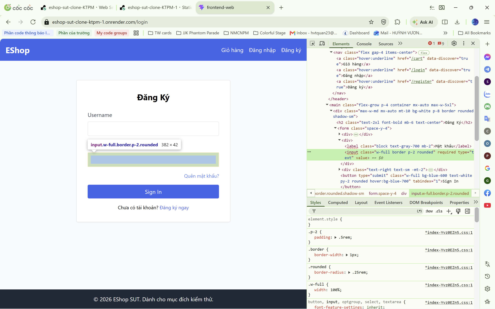 |

---

### BUG-12: Form Register không có trường 'Xác nhận mật khẩu'

| Trường | Nội dung |
|--------|----------|
| **Bug ID** | BUG-12 |
| **Tiêu đề** | Form Register không có trường 'Xác nhận mật khẩu' |
| **Môi trường** | Local, Browser: Cốc Cốc |
| **Điều kiện tiên quyết** | Backend đang chạy trên localhost:3000, Frontend load thành công |
| **Các bước thực hiện** | 1. Mở trang Register tại localhost:5173/register 2. DevTools > Elements tab 3. Kiểm tra tất cả input trong form 4. Tìm input có label chứa 'xác nhận' hoặc 'confirm' |
| **Kết quả kỳ vọng (ER)** | Không khớp → lỗi field-level "Mật khẩu không khớp" (FR-01) |
| **Kết quả thực tế (AR)** | KHÔNG có trường 'Xác nhận mật khẩu' trong form Register. Vi phạm FR-01 yêu cầu xác nhận mật khẩu |
| **Mức độ (Severity)** | High |
| **Ưu tiên (Priority)** | High |
| **Bằng chứng** | 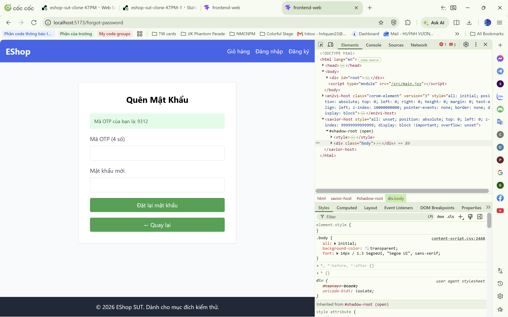 |

---

### BUG-13: Thông báo lỗi Login hiển thị DƯỚI nút Submit

| Trường | Nội dung |
|--------|----------|
| **Bug ID** | BUG-13 |
| **Tiêu đề** | Thông báo lỗi Login hiển thị DƯỚI nút Submit |
| **Môi trường** | Local, Browser: Cốc Cốc |
| **Điều kiện tiên quyết** | Backend đang chạy trên localhost:3000, Frontend load thành công |
| **Các bước thực hiện** | 1. Mở trang Login tại localhost:5173/login 2. Nhập sai email/password > nhấn Login 3. DevTools > Elements tab 4. Kiểm tra vị trí thông báo lỗi so với nút Submit |
| **Kết quả kỳ vọng (ER)** | Error summary/message nằm trên nút Đăng nhập/Đăng ký, không ở dưới (FR-22) |
| **Kết quả thực tế (AR)** | Thông báo lỗi hiển thị DƯỚI nút Submit. Vi phạm FR-22 yêu cầu error message nằm trên nút submit |
| **Mức độ (Severity)** | Low |
| **Ưu tiên (Priority)** | Low |
| **Bằng chứng** | 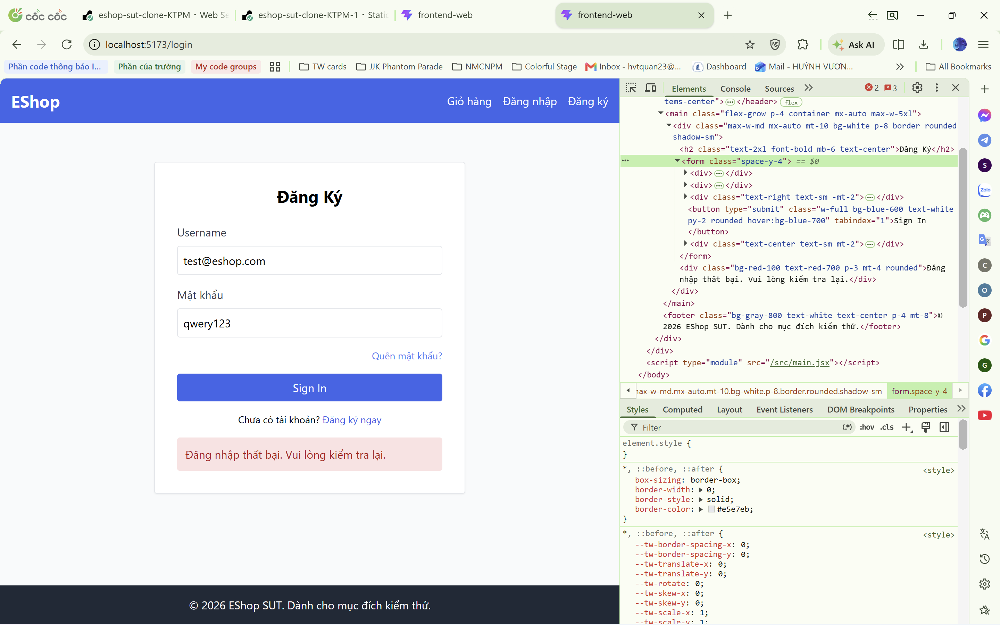 |

---

### BUG-14: Các input Profile thiếu thuộc tính autocomplete

| Trường | Nội dung |
|--------|----------|
| **Bug ID** | BUG-14 |
| **Tiêu đề** | Các input Profile thiếu thuộc tính autocomplete |
| **Môi trường** | Local, Browser: Cốc Cốc |
| **Điều kiện tiên quyết** | Đã đăng nhập, mở trang Profile tại localhost:5173/profile |
| **Các bước thực hiện** | 1. Mở trang Profile tại localhost:5173/profile 2. DevTools > Elements tab 3. Kiểm tra từng input (Họ tên, Số điện thoại, Địa chỉ) 4. Tìm thuộc tính autocomplete trên mỗi input |
| **Kết quả kỳ vọng (ER)** | Trình duyệt gợi ý tự động đúng trường (name, tel, street-address) |
| **Kết quả thực tế (AR)** | Profile các input (name, phone, address) KHÔNG có thuộc tính autocomplete. Trình duyệt không gợi ý tự động dữ liệu đã lưu |
| **Mức độ (Severity)** | Low |
| **Ưu tiên (Priority)** | Low |
| **Bằng chứng** | 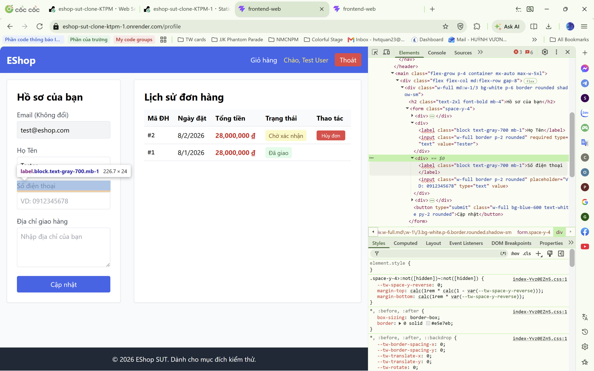 |

---

### BUG-15: Input Số điện thoại dùng type='text' thay vì type='tel'

| Trường | Nội dung |
|--------|----------|
| **Bug ID** | BUG-15 |
| **Tiêu đề** | Input Số điện thoại dùng type='text' thay vì type='tel' |
| **Môi trường** | Local, Browser: Cốc Cốc |
| **Điều kiện tiên quyết** | Đã đăng nhập, mở trang Profile tại localhost:5173/profile |
| **Các bước thực hiện** | 1. Mở trang Profile tại localhost:5173/profile 2. DevTools > Elements tab 3. Tìm input 'Số điện thoại' 4. Kiểm tra thuộc tính type của input |
| **Kết quả kỳ vọng (ER)** | Input Số điện thoại có type='tel' để mobile hiện numeric keyboard (FR-04, FR-22) |
| **Kết quả thực tế (AR)** | Profile.jsx line 139: Input Số điện thoại dùng type='text' thay vì type='tel'. Mobile không hiện numeric keyboard. Vi phạm FR-04 |
| **Mức độ (Severity)** | Medium |
| **Ưu tiên (Priority)** | Medium |
| **Bằng chứng** | 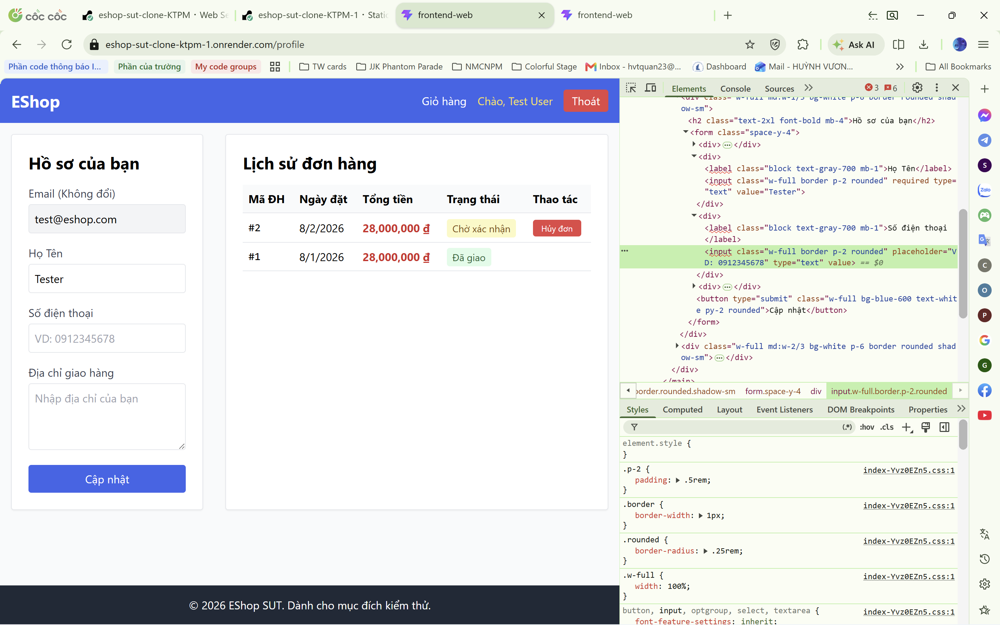 |

---

### BUG-16: Quên mật khẩu thiếu Step Indicator 'Bước 1 / 2'

| Trường | Nội dung |
|--------|----------|
| **Bug ID** | BUG-16 |
| **Tiêu đề** | Quên mật khẩu thiếu Step Indicator 'Bước 1 / 2' |
| **Môi trường** | Local, Browser: Cốc Cốc |
| **Điều kiện tiên quyết** | Backend đang chạy trên localhost:3000, Frontend load thành công |
| **Các bước thực hiện** | 1. Mở trang Forgot Password tại localhost:5173/forgot-password 2. DevTools > Elements tab 3. Kiểm tra vùng header của form 4. Tìm text chứa 'Bước' hoặc step indicator UI |
| **Kết quả kỳ vọng (ER)** | Hiển thị rõ bước hiện tại, tổng số bước (FR-03) |
| **Kết quả thực tế (AR)** | KHÔNG có Step Indicator UI trên trang Forgot Password. Vi phạm FR-03 yêu cầu step indicator cho flow nhiều bước |
| **Mức độ (Severity)** | Low |
| **Ưu tiên (Priority)** | Low |
| **Bằng chứng** |  |

---

### BUG-17: Navbar không highlight trang đang chọn

| Trường | Nội dung |
|--------|----------|
| **Bug ID** | BUG-17 |
| **Tiêu đề** | Navbar không highlight trang đang chọn |
| **Môi trường** | Local, Browser: Cốc Cốc |
| **Điều kiện tiên quyết** | Backend đang chạy trên localhost:3000, Frontend load thành công |
| **Các bước thực hiện** | 1. Mở trang Home, sau đó click vào 'Giỏ hàng' 2. DevTools > Elements tab 3. Kiểm tra class/style của link 'Giỏ hàng' trong Navbar 4. So sánh với các link khác để xem có khác biệt không |
| **Kết quả kỳ vọng (ER)** | Link trang hiện tại có style khác (bold, underline, bg khác) (FR-23) |
| **Kết quả thực tế (AR)** | Tất cả link trong Navbar có style giống nhau, KHÔNG có logic highlight trang đang chọn. Vi phạm FR-23 |
| **Mức độ (Severity)** | Medium |
| **Ưu tiên (Priority)** | Medium |
| **Bằng chứng** | 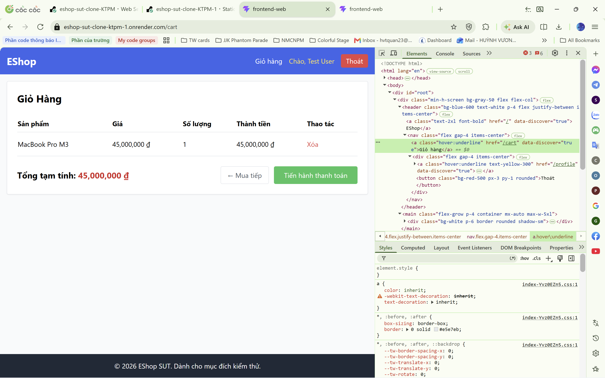 |

---

### BUG-18: Link 'Giỏ hàng' không hiển thị badge số lượng sản phẩm

| Trường | Nội dung |
|--------|----------|
| **Bug ID** | BUG-18 |
| **Tiêu đề** | Link 'Giỏ hàng' không hiển thị badge số lượng sản phẩm |
| **Môi trường** | Local, Browser: Cốc Cốc |
| **Điều kiện tiên quyết** | Backend đang chạy trên localhost:3000, Frontend load thành công |
| **Các bước thực hiện** | 1. Thêm ít nhất 1 sản phẩm vào giỏ hàng 2. DevTools > Elements tab 3. Tìm link '/cart' trong Navbar 4. Kiểm tra có span/badge hiển thị số lượng không |
| **Kết quả kỳ vọng (ER)** | Badge số lượng đúng, cập nhật real-time khi thêm/xóa (FR-23) |
| **Kết quả thực tế (AR)** | Link '/cart' KHÔNG có badge số lượng. Vi phạm FR-23 yêu cầu hiển thị số lượng sản phẩm trong giỏ |
| **Mức độ (Severity)** | Medium |
| **Ưu tiên (Priority)** | Medium |
| **Bằng chứng** | 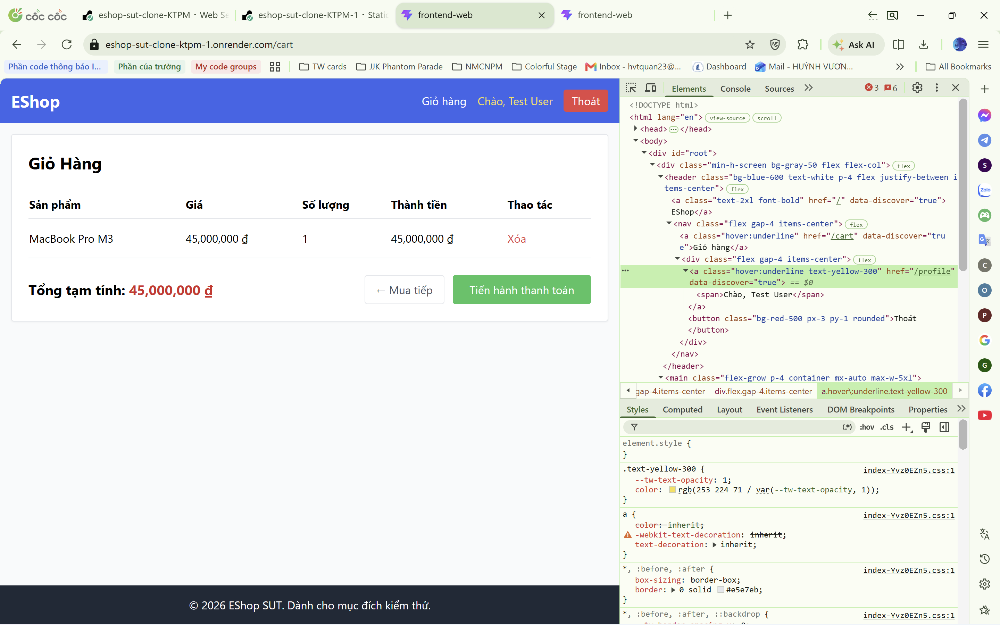 |

---

### BUG-19: Nút logout ghi 'Thoát' thay vì 'Đăng xuất'

| Trường | Nội dung |
|--------|----------|
| **Bug ID** | BUG-19 |
| **Tiêu đề** | Nút logout ghi 'Thoát' thay vì 'Đăng xuất' |
| **Môi trường** | Local, Browser: Cốc Cốc |
| **Điều kiện tiên quyết** | Backend đang chạy trên localhost:3000, Frontend load thành công |
| **Các bước thực hiện** | 1. Đăng nhập tài khoản 2. DevTools > Elements tab 3. Tìm button/logout trong Navbar 4. Kiểm tra text hiển thị trên button |
| **Kết quả kỳ vọng (ER)** | Nhãn chính xác "Đăng xuất" (FR-23) |
| **Kết quả thực tế (AR)** | Nút logout ghi 'Thoát' thay vì 'Đăng xuất'. Vi phạm FR-23 yêu cầu nhãn chính xác |
| **Mức độ (Severity)** | Low |
| **Ưu tiên (Priority)** | Low |
| **Bằng chứng** |  |

---

### BUG-20: Thiếu Breadcrumb trên các trang con

| Trường | Nội dung |
|--------|----------|
| **Bug ID** | BUG-20 |
| **Tiêu đề** | Thiếu Breadcrumb trên các trang con |
| **Môi trường** | Local, Browser: Cốc Cốc |
| **Điều kiện tiên quyết** | Backend đang chạy trên localhost:3000, Frontend load thành công |
| **Các bước thực hiện** | 1. Mở trang Product Detail, Cart, hoặc Checkout 2. DevTools > Elements tab 3. Kiểm tra vùng header/nav có chứa Breadcrumb không 4. Tìm thẻ `<nav>` hoặc `<ol>` có class 'breadcrumb' |
| **Kết quả kỳ vọng (ER)** | Breadcrumb hiển thị đường dẫn: Home > Danh mục > Sản phẩm; link Home hoạt động (FR-23) |
| **Kết quả thực tế (AR)** | KHÔNG tìm thấy component Breadcrumb trên ProductDetail, Cart, Checkout. Vi phạm FR-23 |
| **Mức độ (Severity)** | Medium |
| **Ưu tiên (Priority)** | Medium |
| **Bằng chứng** | 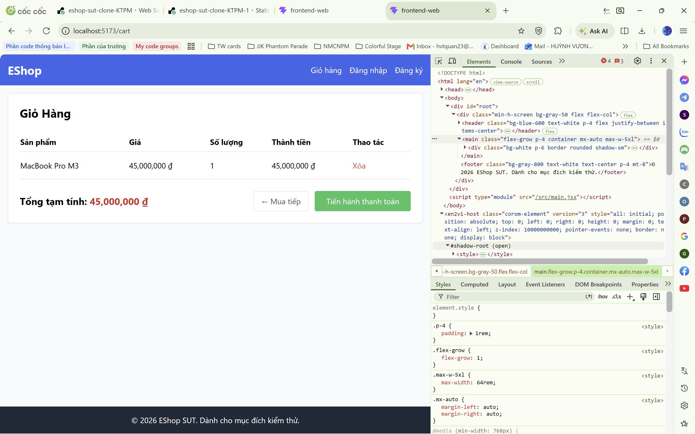 |

---

### BUG-21: Product Detail thiếu nút 'Quay lại / Tiếp tục mua sắm'

| Trường | Nội dung |
|--------|----------|
| **Bug ID** | BUG-21 |
| **Tiêu đề** | Product Detail thiếu nút 'Quay lại / Tiếp tục mua sắm' |
| **Môi trường** | Local, Browser: Cốc Cốc |
| **Điều kiện tiên quyết** | Backend đang chạy trên localhost:3000, Frontend load thành công |
| **Các bước thực hiện** | 1. Mở trang Product Detail tại localhost:5173/product/:id 2. DevTools > Elements tab 3. Kiểm tra vùng dưới description hoặc footer 4. Tìm button/link có text 'Quay lại' hoặc 'Tiếp tục mua sắm' |
| **Kết quả kỳ vọng (ER)** | Nút hoạt động, giữ lịch sử trang trước (FR-07) |
| **Kết quả thực tế (AR)** | KHÔNG có nút 'Quay lại' hoặc 'Tiếp tục mua sắm' trên trang Product Detail. Vi phạm FR-07 |
| **Mức độ (Severity)** | Low |
| **Ưu tiên (Priority)** | Low |
| **Bằng chứng** | 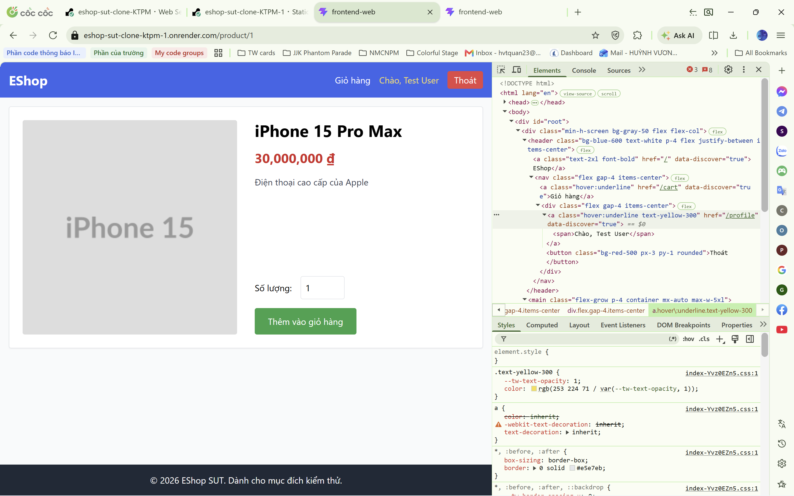 |

---

### BUG-22: Không có loading state (spinner/skeleton) khi tải danh sách sản phẩm

| Trường | Nội dung |
|--------|----------|
| **Bug ID** | BUG-22 |
| **Tiêu đề** | Không có loading state (spinner/skeleton) khi tải danh sách sản phẩm |
| **Môi trường** | Local, Browser: Cốc Cốc |
| **Điều kiện tiên quyết** | Backend đang chạy trên localhost:3000, Frontend load thành công |
| **Các bước thực hiện** | 1. DevTools > Network tab 2. Disable cache 3. Throttle network về 4G Slow 4. Reload trang Home 5. Quan sát giao diện trong khi dữ liệu đang tải |
| **Kết quả kỳ vọng (ER)** | Skeleton loader hoặc spinner xuất hiện cho đến khi data về (FR-05) |
| **Kết quả thực tế (AR)** | Hiển thị màn hình trắng/chớp trong khi tải dữ liệu. KHÔNG có spinner/skeleton. Vi phạm FR-05 |
| **Mức độ (Severity)** | Medium |
| **Ưu tiên (Priority)** | Medium |
| **Bằng chứng** | 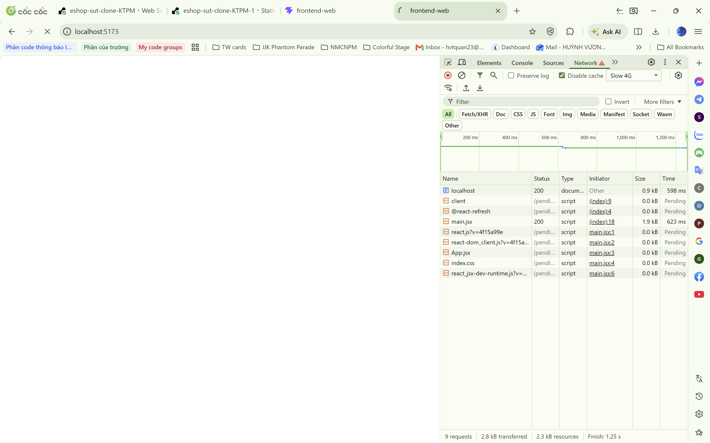 |

---

### BUG-23: Không có empty state khi tìm kiếm không có kết quả

| Trường | Nội dung |
|--------|----------|
| **Bug ID** | BUG-23 |
| **Tiêu đề** | Không có empty state khi tìm kiếm không có kết quả |
| **Môi trường** | Local, Browser: Cốc Cốc |
| **Điều kiện tiên quyết** | Backend đang chạy trên localhost:3000, Frontend load thành công |
| **Các bước thực hiện** | 1. Mở trang Home tại localhost:5173 2. Nhập từ khóa không tồn tại (ví dụ: 'xyzabc123') 3. DevTools > Elements tab 4. Kiểm tra vùng kết quả tìm kiếm có icon + message không |
| **Kết quả kỳ vọng (ER)** | Icon tìm kiếm, text "Không tìm thấy sản phẩm", gợi ý từ khóa khác (FR-05, FR-24) |
| **Kết quả thực tế (AR)** | KHÔNG có hiển thị 'Không tìm thấy sản phẩm'. Chỉ xuất hiện vùng trống. Vi phạm FR-05, FR-24 |
| **Mức độ (Severity)** | Medium |
| **Ưu tiên (Priority)** | Medium |
| **Bằng chứng** | 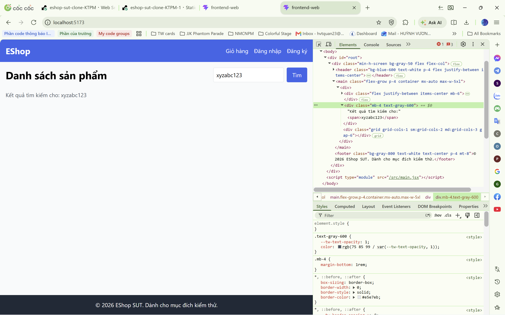 |

---

### BUG-24: Không có toast notification khi thêm vào giỏ hàng

| Trường | Nội dung |
|--------|----------|
| **Bug ID** | BUG-24 |
| **Tiêu đề** | Không có toast notification khi thêm vào giỏ hàng |
| **Môi trường** | Local, Browser: Cốc Cốc |
| **Điều kiện tiên quyết** | Backend đang chạy trên localhost:3000, Frontend load thành công |
| **Các bước thực hiện** | 1. Mở trang Product Detail hoặc Home 2. DevTools > Elements tab 3. Click nút 'Thêm vào giỏ hàng' 4. Kiểm tra có toast notification xuất hiện không |
| **Kết quả kỳ vọng (ER)** | Toast "Đã thêm vào giỏ hàng" + badge cart tăng số lượng (FR-06, FR-24) |
| **Kết quả thực tế (AR)** | Chỉ đổi text nút thành 'Đã thêm' rồi reset sau 2s. KHÔNG có toast notification. KHÔNG có badge cart cập nhật. Vi phạm FR-06, FR-24 |
| **Mức độ (Severity)** | Medium |
| **Ưu tiên (Priority)** | Medium |
| **Bằng chứng** | 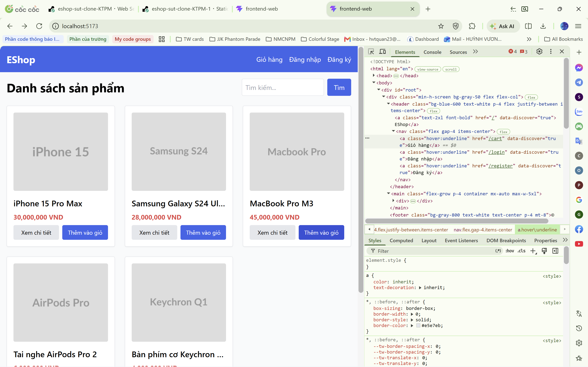 |

---

### BUG-25: Xóa item khỏi giỏ hàng không có dialog xác nhận

| Trường | Nội dung |
|--------|----------|
| **Bug ID** | BUG-25 |
| **Tiêu đề** | Xóa item khỏi giỏ hàng không có dialog xác nhận |
| **Môi trường** | Local, Browser: Cốc Cốc |
| **Điều kiện tiên quyết** | Backend đang chạy trên localhost:3000, Frontend load thành công |
| **Các bước thực hiện** | 1. Thêm sản phẩm vào giỏ hàng 2. Mở trang Cart tại localhost:5173/cart 3. DevTools > Elements tab 4. Click nút 'Xóa' trên 1 item 5. Kiểm tra có dialog/modal xác nhận xuất hiện không |
| **Kết quả kỳ vọng (ER)** | Dialog modal, focus trap, Esc đóng, click overlay đóng (FR-07, FR-24) |
| **Kết quả thực tế (AR)** | Nút Xóa gọi trực tiếp. KHÔNG có dialog xác nhận. Vi phạm FR-07, FR-24 |
| **Mức độ (Severity)** | Medium |
| **Ưu tiên (Priority)** | Medium |
| **Bằng chứng** | 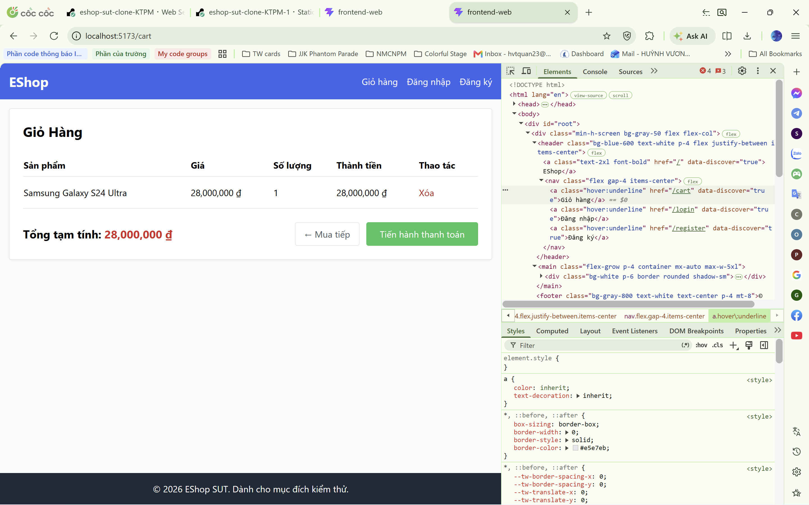 |

---

### BUG-26: Ảnh sản phẩm không có thuộc tính width/height (gây layout shift)

| Trường | Nội dung |
|--------|----------|
| **Bug ID** | BUG-26 |
| **Tiêu đề** | Ảnh sản phẩm không có thuộc tính width/height (gây layout shift) |
| **Môi trường** | Local, Browser: Cốc Cốc |
| **Điều kiện tiên quyết** | Backend đang chạy trên localhost:3000, Frontend load thành công |
| **Các bước thực hiện** | 1. Mở trang Home tại localhost:5173 2. DevTools > Elements tab 3. Click chuột phải vào ảnh sản phẩm > Inspect 4. Kiểm tra thẻ  có thuộc tính width và height không |
| **Kết quả kỳ vọng (ER)** | Ảnh sản phẩm có thuộc tính width/height để trình duyệt reserved layout trước khi tải (CLS < 0.1) |
| **Kết quả thực tế (AR)** | Thẻ  KHÔNG có thuộc tính width/height rõ ràng (chỉ dùng className CSS). Gây layout shift khi ảnh tải xong |
| **Mức độ (Severity)** | Low |
| **Ưu tiên (Priority)** | Low |
| **Bằng chứng** | 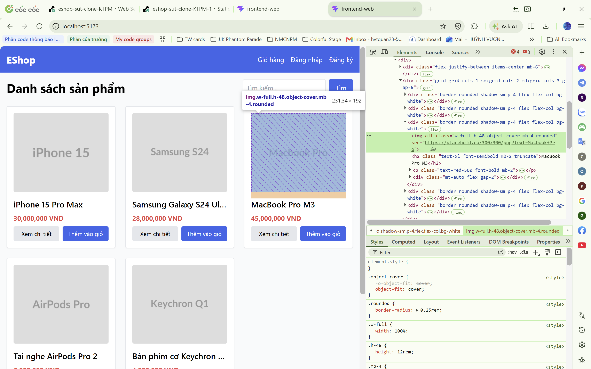 |

---

### BUG-27: Màu sắc nút không nhất quán trên toàn trang

| Trường | Nội dung |
|--------|----------|
| **Bug ID** | BUG-27 |
| **Tiêu đề** | Màu sắc nút không nhất quán trên toàn trang |
| **Môi trường** | Local, Browser: Cốc Cốc |
| **Điều kiện tiên quyết** | Backend đang chạy trên localhost:3000, Frontend load thành công |
| **Các bước thực hiện** | 1. DevTools > Elements tab 2. Kiểm tra color/background-color của các button trên các trang khác nhau 3. So sánh: nút tích cực (Primary) có cùng màu xanh dương không? 4. Kiểm tra tại Home, ProductDetail, Cart, Checkout, Register |
| **Kết quả kỳ vọng (ER)** | Primary = blue, Danger = red, Secondary = gray, nhất quán toàn site (FR-21) |
| **Kết quả thực tế (AR)** | Màu Primary KHÔNG NHẤT QUÁN: ProductDetail dùng green, Cart dùng green, Register dùng red cho nút submit. FR-21 yêu cầu Primary = xanh dương |
| **Mức độ (Severity)** | Medium |
| **Ưu tiên (Priority)** | Medium |
| **Bằng chứng** | 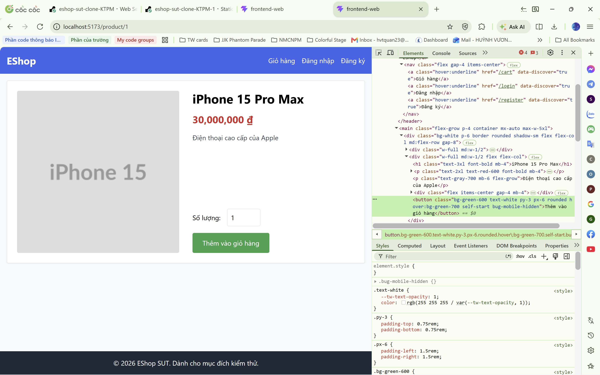  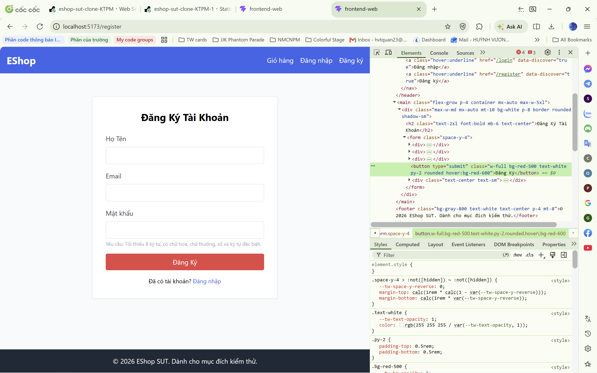 |

---
