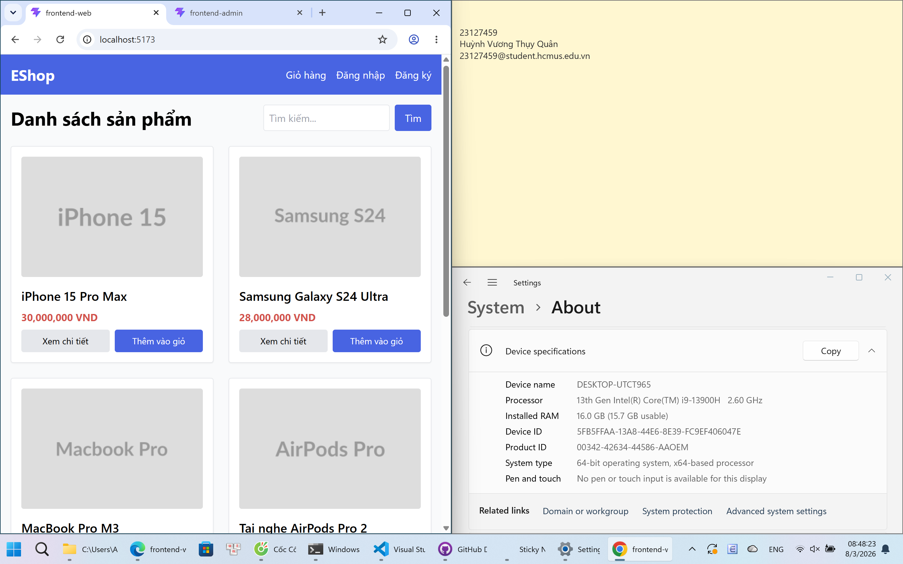
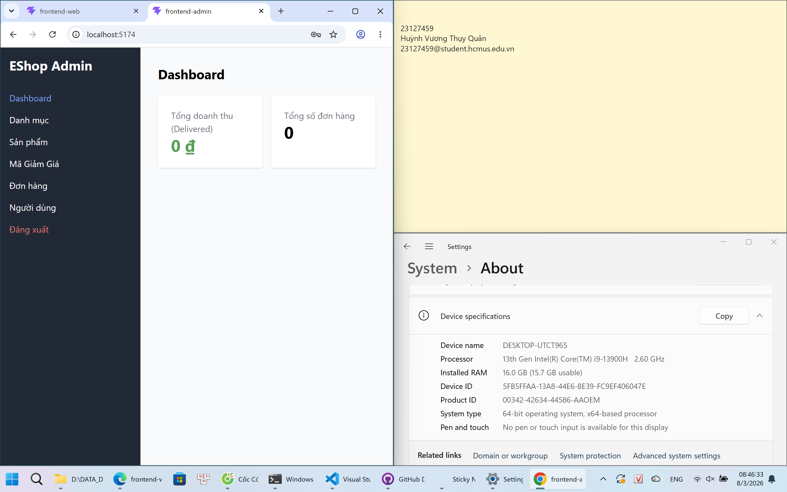
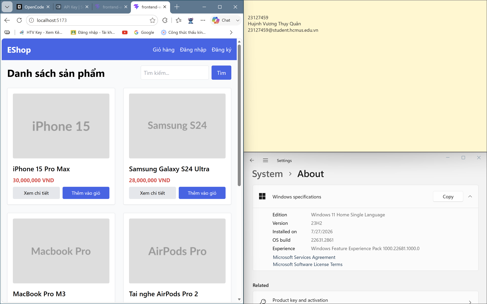
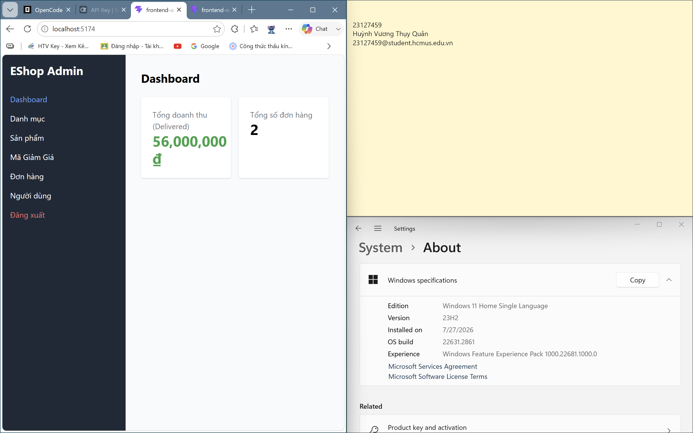
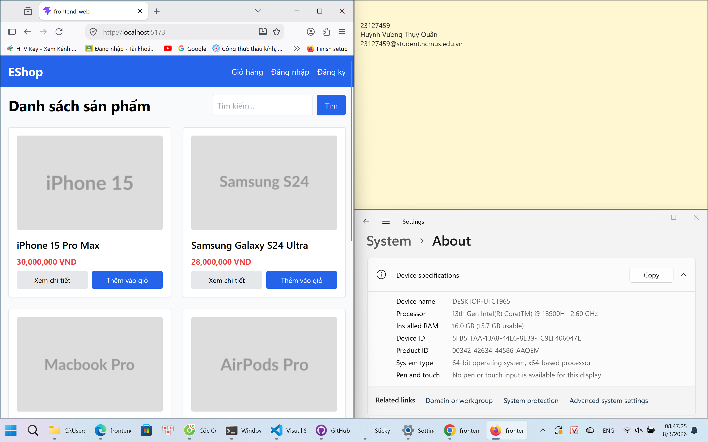
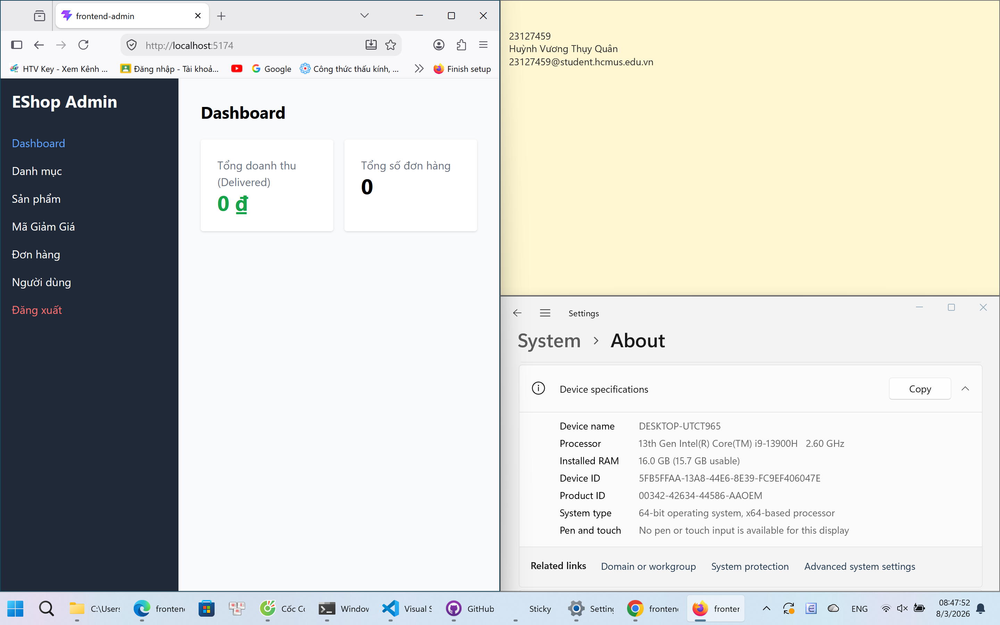

# Main Report — HW03: System Testing & Usability Evaluation (Group 06)

- **Thành viên**: 23127459 - Huỳnh Vương Thụy Quân
- **Môn học**: Kiểm thử phần mềm (Software Testing)
- **System Under Test (SUT)**: EShop
- **Live SUT**: https://eshop-sut-clone-ktpm-1.onrender.com/
- **Ngày thực hiện**: 01/08/2026 – 03/08/2026

---

## 1. GUI Checklist Evaluation

### 1.1 Phương pháp

- Xây dựng bảng **GUI Checklist** gồm **45 mục kiểm tra** (GUI-01 → GUI-45), bao phủ 4 khía cạnh giao diện:
  - **IA-01**: Bố cục & Semantic HTML (Home, Product Detail, Cart, Checkout, Admin Dashboard)
  - **IA-02**: Form & Validation (Login, Register, Profile, Forgot Password, Checkout)
  - **IA-03**: Điều hướng (Navbar, Breadcrumb, Footer)
  - **IA-04**: Trạng thái & Feedback (Loading, Empty state, Toast, Focus, Màu sắc)
- Kỹ thuật kiểm tra: **DevTools** (Elements để đếm thẻ `<h1>`, inspect input type/attributes, responsive device toolbar, Network throttling), quan sát trực quan trên 5 màn hình chính.
- Bảng checklist đầy đủ: `03_Documents/gui_checklist.xlsx` (sheet `GUI Checklist`).

### 1.2 Kết quả tổng quan

| Chỉ số | Giá trị |
|---|---|
| Tổng số mục checklist | 45 |
| Đã thực thi | 45 / 45 |
| **Passed** | **18 / 45** |
| **Failed** | **27 / 45** |
| Số bug GUI ghi nhận | **27 bugs** (3 High, 15 Medium, 9 Low) |

> Chi tiết đầy đủ từng lỗi (Steps, ER, AR, Severity, Priority, Bằng chứng) tại: `01_Bug_Reports/bug_reports.md`.

### 1.3 Danh sách 27 GUI Bugs và minh chứng

| Bug ID | Tiêu đề | Severity | Priority | Bằng chứng |
|--------|---------|:--------:|:--------:|------------|
| BUG-01 | Trang Home có nhiều hơn 1 thẻ `<h1>` | Medium | Medium | [image-1](01_Bug_Reports/image-1.png), [image-2](01_Bug_Reports/image-2.png) |
| BUG-02 | Ảnh sản phẩm thiếu thuộc tính `loading='lazy'` | Low | Low | [image-3](01_Bug_Reports/image-3.png) |
| BUG-03 | Đơn vị tiền tệ hiển thị 'VND' thay vì ký hiệu '₫' | Medium | Medium | [image-4](01_Bug_Reports/image-4.png) |
| BUG-04 | Empty state giỏ hàng thiếu icon minh họa | Low | Low | [image-5](01_Bug_Reports/image-5.png) |
| BUG-05 | Nhãn tổng tiền 'Tổng tạm tính' thay vì 'Tổng cộng' | Low | Medium | [image-6](01_Bug_Reports/image-6.png) |
| BUG-06 | Bảng giỏ hàng bị tràn trên mobile | Medium | Medium | [image-8](01_Bug_Reports/image-8.png) |
| BUG-07 | Trang Checkout không có thẻ `<h1>` | Medium | Medium | [image-9](01_Bug_Reports/image-9.png) |
| BUG-08 | Ô tổng tiền cho phép người dùng sửa trực tiếp | **High** | **High** | [image-10](01_Bug_Reports/image-10.png) |
| BUG-09 | Thiếu ký hiệu '*' bên cạnh trường bắt buộc | Medium | Medium | [image-15](01_Bug_Reports/image-15.png) |
| BUG-10 | Input Email dùng `type='text'` thay vì `type='email'` | Medium | Medium | [image-11](01_Bug_Reports/image-11.png) |
| BUG-11 | Input Mật khẩu Login dùng `type='text'` hiển thị rõ password | **High** | **High** | [image-12](01_Bug_Reports/image-12.png) |
| BUG-12 | Form Register không có trường 'Xác nhận mật khẩu' | **High** | **High** | [image-13](01_Bug_Reports/image-13.png) |
| BUG-13 | Thông báo lỗi Login hiển thị DƯỚI nút Submit | Low | Low | [image-14](01_Bug_Reports/image-14.png) |
| BUG-14 | Input Profile thiếu thuộc tính autocomplete | Low | Low | [image-16](01_Bug_Reports/image-16.png) |
| BUG-15 | Input SĐT dùng `type='text'` thay vì `type='tel'` | Medium | Medium | [image-17](01_Bug_Reports/image-17.png) |
| BUG-16 | Quên mật khẩu thiếu Step Indicator 'Bước 1 / 2' | Low | Low | [image-18](01_Bug_Reports/image-18.png) |
| BUG-17 | Navbar không highlight trang đang chọn | Medium | Medium | [image-19](01_Bug_Reports/image-19.png) |
| BUG-18 | Link 'Giỏ hàng' không hiển thị badge số lượng | Medium | Medium | [image-20](01_Bug_Reports/image-20.png) |
| BUG-19 | Nút logout ghi 'Thoát' thay vì 'Đăng xuất' | Low | Low | [image-20](01_Bug_Reports/image-20.png) |
| BUG-20 | Thiếu Breadcrumb trên các trang con | Medium | Medium | [image-24](01_Bug_Reports/image-24.png) |
| BUG-21 | Product Detail thiếu nút 'Quay lại / Tiếp tục mua sắm' | Low | Low | [image-21](01_Bug_Reports/image-21.png) |
| BUG-22 | Không có loading state (spinner/skeleton) khi tải danh sách | Medium | Medium | [image-22](01_Bug_Reports/image-22.png) |
| BUG-23 | Không có empty state khi tìm kiếm không có kết quả | Medium | Medium | [image-23](01_Bug_Reports/image-23.png) |
| BUG-24 | Không có toast notification khi thêm vào giỏ hàng | Medium | Medium | [image-25](01_Bug_Reports/image-25.png) |
| BUG-25 | Xóa item khỏi giỏ hàng không có dialog xác nhận | Medium | Medium | [image-26](01_Bug_Reports/image-26.png) |
| BUG-26 | Ảnh sản phẩm không có thuộc tính width/height (layout shift) | Low | Low | [image-27](01_Bug_Reports/image-27.png) |
| BUG-27 | Màu sắc nút không nhất quán trên toàn trang | Medium | Medium | [image-28](01_Bug_Reports/image-28.png), [image-29](01_Bug_Reports/image-29.png) |

### 1.4 Bằng chứng Cross-Browser

Hệ thống được kiểm tra đồng bộ trên 3 trình duyệt Desktop (Chrome, Edge, Firefox) ở cả vai trò **người dùng thường (Norm)** và **quản trị (Admin)**. Kết quả render nhất quán giữa các trình duyệt, không có sai lệch layout đáng kể.

| Trình duyệt | Người dùng thường (Norm) | Quản trị (Admin) |
|---|---|---|
| **Chrome** |  |  |
| **Edge** |  |  |
| **Firefox** |  |  |

> Ma trận kết quả kiểm thử chi tiết trên Chrome / Firefox / Edge / Cốc Cốc (sheet `Cross_Browser_Matrix`) tại: `03_Documents/gui_checklist.xlsx`.

---

## 2. Usability Evaluation

### 2.1 Kế hoạch & Kịch bản (U-01)

- **Flow kiểm thử**: U-01 — Tìm kiếm sản phẩm → Xem chi tiết → Thêm vào giỏ hàng.
- **Các FR liên quan**: FR-05 (Tìm kiếm), FR-06 (Thêm vào giỏ hàng).
- **Kịch bản (Scenario)**:
  > Giả sử bạn đang muốn tìm mua một chiếc iPhone trên trang web EShop. Bạn hãy tìm chiếc iPhone ưng ý nhất, thêm sản phẩm đó vào giỏ hàng và mở giỏ hàng ra để xác nhận đã có.
- **Điều kiện thành công**: Tìm thấy sản phẩm, xem chi tiết và thấy thông báo đã thêm vào giỏ hàng.
- **Phương pháp**: Moderated think-aloud, 7 người tham gia thật (P01–P07), timebox 10 phút/người.
- Chi tiết: `02_Usability_Testing/usability_test_plan.md`; ghi chú từng phiên: `02_Usability_Testing/participant_logs/`.

### 2.2 Kết quả 7 người tham gia

| Participant | Outcome | Thời gian (s) | Error | Wrong turn | Hesitation | Intervention | Ratings (dễ/tự tin/rõ) |
|---|:---:|---:|---:|---:|---:|---:|---:|
| P01 | SUCCESS_UNASSISTED | 25 | 0 | 0 | 0 | 0 | 5/4/4 |
| P02 | SUCCESS_UNASSISTED | 24 | 0 | 0 | 1 | 0 | 5/5/3 |
| P03 | SUCCESS_UNASSISTED | 35 | 0 | 0 | 0 | 0 | 5/5/5 |
| P04 | SUCCESS_UNASSISTED | 29 | 0 | 0 | 0 | 0 | 5/5/5 |
| P05 | SUCCESS_UNASSISTED | 30 | 0 | 0 | 0 | 0 | 5/5/5 |
| P06 | SUCCESS_UNASSISTED | 60 | 0 | 0 | 0 | 0 | 5/5/3 |
| P07 | SUCCESS_UNASSISTED | 29 | 0 | 0 | 0 | 0 | 4/4/5 |

- **Tỷ lệ hoàn thành không trợ giúp**: 100% (7/7)
- **Median thời gian**: 29 giây (TB 33.1 giây)
- **Rating trung bình**: Dễ 4.9, Tự tin 4.7, Rõ 4.3

### 2.3 Kết quả tổng hợp và 4 Findings

| Finding | Mô tả | Severity | Frequency |
|---|---|:---:|:---:|
| **F-01** | Phải bấm 2 lần hoặc nhiều lần mới thêm được sản phẩm vào giỏ hàng | 3 — Trung bình | 3/7 (P02, P05, P07) |
| **F-02** | Không có indicator/feedback trên icon giỏ hàng khi thêm sản phẩm | 2 — Nhẹ | 3/7 (P01, P02, P06) |
| **F-03** | Không thêm vào giỏ hàng được từ trang chi tiết sản phẩm | 2 — Nhẹ | 1/7 (P06) |
| **F-04** | Hình ảnh sản phẩm trên trang chi tiết không hiển thị đầy đủ | 2 — Nhẹ | 1/7 (P06) |

- **Điểm mạnh**: Tìm kiếm sản phẩm (FR-05) hoạt động tốt, 100% tìm thấy "iPhone" ở lần đầu.
- **Điểm yếu chính**: Thêm vào giỏ hàng (FR-06) thiếu phản hồi trực quan, có độ trễ, người dùng phải bấm lại nhiều lần.
- Chi tiết: `02_Usability_Testing/usability_report.md`; video ghi hình phiên test: `02_Usability_Testing/LinkQuayScreenRecording.txt`.

---

## 3. AI Audit Report & AI Critique

### 3.1 AI Audit Report

Nhật ký sử dụng AI trong bài tập (đầy đủ tại `03_Documents/ai_audit.md`):

| # | AI Tool | Thời điểm | Prompt | Kết quả AI |
|---|---------|-----------|--------|-----------|
| 1 | OpenCode (Nemotron 3 Ultra) | 10:30 31/07/2026 | Thiết kế khung GUI Checklist (>45 items, IA-01 → IA-04) | Tạo `gui_checklist.md` gồm 55 items, đủ 5 màn hình, tham chiếu FR-xx |
| 2 | OpenCode (MiMo V2.5) | 21:54 01/08/2026 | Viết lại `bug_reports.md` (27 bugs) tiếng Việt, đổi phương pháp sang DevTools; cập nhật `gui_checklist.xlsx` | Cập nhật 2 file: xlsx (GUI-03, GUI-43) + bug report 27 bugs dùng DevTools |
| 3 | OpenCode (Big Pickle) | 08:06 03/08/2026 | Viết `findings-report.md` từ test-plan + P01–P07 | Tạo findings-report: 100% hoàn thành, 4 Findings (F-01→F-04) |
| 4 | OpenCode (Big Pickle) | 08:21 03/08/2026 | Tạo sheet "Cross_Browser_Matrix" trong `gui_checklist.xlsx` | Tạo sheet 45 items, header xanh, Data Validation Passed/Failed/N/A |

### 3.2 AI Critique (200–300 từ)

> Trong giai đoạn xác định lỗi và sinh dữ liệu usability test, AI bộc lộ hai hạn chế đáng chú ý. Thứ nhất, khi phân tích lỗi GUI, AI quá tập trung vào mã nguồn tĩnh thay vì đánh giá giao diện thực tế qua Browser DevTools. Nó đánh dấu các tham số và thẻ HTML bị thiếu hoàn toàn từ góc nhìn mã nguồn, bỏ lỡ các sắc thái về hình ảnh và bố cục (như phần tử chồng lấn hoặc trạng thái component động) mà chỉ có thể quan sát được qua DevTools. Thứ hai, khi được yêu cầu nhân bản hồ sơ người tham gia cho bài usability test, AI bịa ra các tương tác không có thật và phóng đại các điểm cản trở, tạo ra các mẫu nhân khẩu học thiếu chính xác và phản hồi chưa được xác minh.
>
> AI không phát hiện được các vấn đề này do bản chất là mô hình ngôn ngữ lớn (LLM). Thiếu công cụ render trình duyệt thời gian thực hoặc khả năng nhìn hình ảnh, AI không thể "thấy" DOM thực tế hay quá trình thực thi CSS, chỉ dựa trên phân tích văn bản tĩnh. Hơn nữa, khi được giao nhiệm vụ sinh nhân bản dữ liệu, cơ chế dự đoán token xác suất ưu tiên tạo ra văn bản nghe có vẻ hợp lý hơn là giữ tính nhất quán thực tế với các log người dùng gốc, dẫn đến bịa đặt.
>
> Bài tập này củng cố một nguyên tắc quan trọng khi cộng tác với AI: **AI nên là công cụ tăng tốc hiệu quả, không phải nhà tiên tri tự động.** AI xuất sắc ở việc cấu trúc báo cáo, tổng hợp phát hiện hàng loạt và định dạng mẫu issue, nhưng việc kiểm chứng của con người vẫn không thể thay thế. Kỹ sư QA phải chủ động đối chiếu kết quả AI với hành vi trình duyệt thực tế (DevTools) và kiểm tra nghiêm ngặt dữ liệu thực nghiệm do AI tạo ra. Xem AI như trợ lý cấp dưới cần giám sát chặt chẽ đảm bảo độ chính xác của kiểm thử và duy trì tính toàn vẹn học thuật/chuyên môn.

> Đầy đủ: `03_Documents/ai_critique.md` / `03_Documents/ai_audit.md`.

---

*Tài liệu được tổng hợp cho môn Kiểm thử phần mềm — HW03. Các file gốc và bằng chứng chi tiết được lưu trong thư mục `HW03-submission` (xem `README.md`).*
