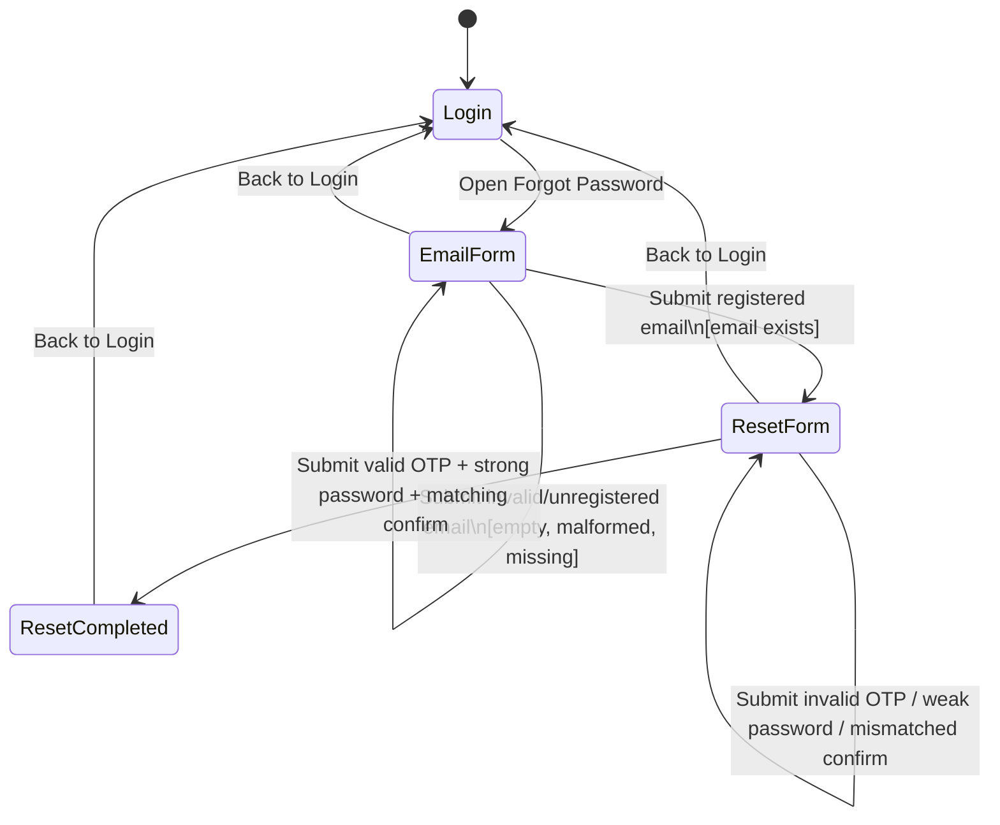

# State Diagram - FR-03 Forgot Password & Reset

## States

| ID | State | Ý nghĩa |
|---|---|---|
| S1 | Login | Màn hình đăng nhập, trạng thái khởi tạo |
| S2 | Forgot Password - Email Form | Người dùng nhập email để yêu cầu OTP/reset |
| S3 | Reset Password Form | Người dùng nhập OTP, mật khẩu mới và confirm password |
| S4 | Reset Completed | Reset mật khẩu thành công, có thể quay lại Login |

## Events

| ID | Event | Ý nghĩa |
|---|---|---|
| E1 | Open Forgot Password | Người dùng mở luồng quên mật khẩu từ Login |
| E2 | Submit registered email | Submit email đã đăng ký, ví dụ `test@eshop.com` |
| E3 | Submit invalid or unregistered email | Submit email trống, sai định dạng hoặc chưa đăng ký |
| E4 | Submit valid OTP and matching strong password | Submit OTP đúng 6 chữ số, password mạnh và confirm khớp |
| E5 | Submit invalid OTP, weak password, or mismatched confirm password | Submit dữ liệu reset không hợp lệ |
| E6 | Back to Login | Người dùng quay lại màn hình Login |
