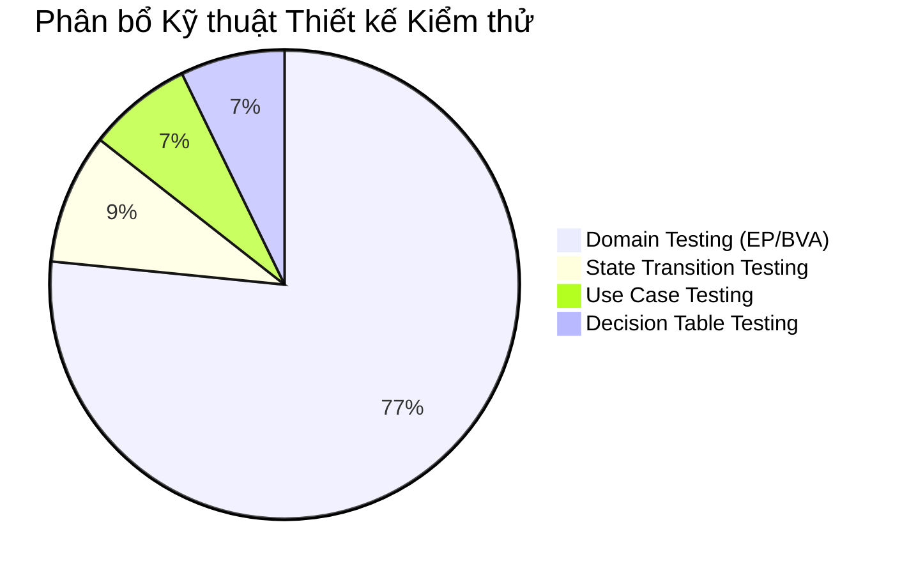
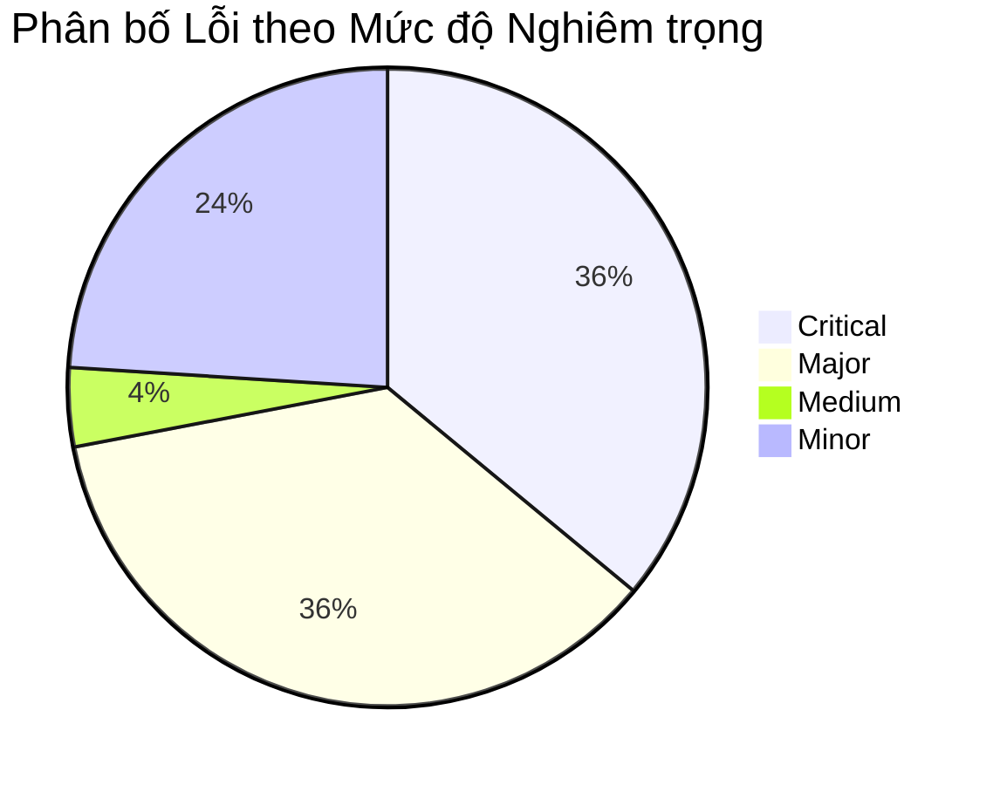

# BÁO CÁO TỔNG HỢP KẾT QUẢ KIỂM THỬ (SUMMARY TEST REPORT)

---

## 1. Thông tin chung
- **Hệ thống kiểm thử (SUT):** EShop (E-commerce Platform)
- **Học viên thực hiện:** Nguyễn Anh Khoa (MSSV: 23127391)
- **Nhóm:** 06
- **Thời gian tổng hợp:** 2026-07-06

---

## 2. Thống kê Ca kiểm thử (Test Cases Statistics)

### 2.1 Tổng số lượng và Trạng thái thực thi
Hệ thống đã được thiết kế và thực thi tổng cộng **111 ca kiểm thử (Test Cases)** bao phủ qua 7 phân hệ/yêu cầu nghiệp vụ (FRs):

| Phân hệ (FR) | Tổng số TC | Đã đạt (PASSED) | Thất bại (FAILED) | Bị chặn (BLOCKED) | Tỷ lệ PASSED | Tỷ lệ FAILED |
|---|---|---|---|---|---|---|
| **FR-04: Profile Web** | 21 | 9 | 5 | 7 | 42.86% | 23.81% |
| **FR-04: Profile Mobile**| 15 | 4 | 3 | 8 | 26.67% | 20.00% |
| **FR-10: Order State** | 31 | 21 | 10 | 0 | 67.74% | 32.26% |
| **FR-19: User Mgmt** | 18 | 4 | 14 | 0 | 22.22% | 77.78% |
| **FR-08: Checkout** | 10 | 3 | 7 | 0 | 30.00% | 70.00% |
| **FR-16: Product Import**| 8 | 5 | 3 | 0 | 62.50% | 37.50% |
| **FR-12: Access Control**| 8 | 5 | 3 | 0 | 62.50% | 37.50% |
| **TỔNG CỘNG** | **111** | **51** | **45** | **15** | **45.95%** | **40.54%** |

> [!NOTE]
> - Các ca kiểm thử bị chặn (`BLOCKED` - chiếm 13.51%) tập trung ở phân hệ **FR-04 (Hồ sơ cá nhân)** do lỗi logic kiểm tra Số điện thoại ở API chặn đứng các luồng cập nhật Tên/Địa chỉ hợp lệ.
> - Phân hệ **FR-19 (Quản lý Người dùng)**, **FR-08 (Thanh toán)** và **FR-12 (Kiểm soát truy cập)** có tỷ lệ FAILED cao nhất (>70% đối với FR-08, FR-19 và 37.50% đối với FR-12) do backend thiếu hụt nghiêm trọng các lớp bảo vệ bảo mật, validate ràng buộc dữ liệu đầu vào và kiểm soát nghiệp vụ (như cho phép thanh toán giỏ hàng rỗng, chấp nhận số tiền giả mạo từ client, hoặc cho phép tài khoản thường gọi các API Admin `/api/admin/*`).

### 2.2 Bao phủ theo Kỹ thuật Thiết kế Kiểm thử (Test Design Techniques Coverage)
Bố cục phân bổ kỹ thuật thiết kế kiểm thử trên tổng số 111 TCs:

* **Domain Testing (Phân hoạch tương đương EP & Phân tích giá trị biên BVA):** 85 TCs (~76.58%)
* **State Transition Testing (Kiểm thử chuyển trạng thái):** 10 TCs (~9.01%)
* **Use Case Testing (Kiểm thử ca sử dụng):** 8 TCs (~7.21%)
* **Decision Table Testing (Kiểm thử bảng quyết định):** 8 TCs (~7.21%)

---

## 3. Thống kê lỗi phát hiện (Defect Statistics)

Tổng số lỗi được phát hiện và lập báo cáo lỗi (Bug Reports) tính từ khi bắt đầu đến nay là **25 lỗi**.

### 3.1 Phân bố lỗi theo phân hệ (Bug Coverage by Functional Requirement)

| Phân hệ (FR) | Số lượng lỗi | Tỷ lệ (%) | Thư mục lưu báo cáo lỗi |
|---|---|---|---|
| **FR-04: Profile (Web & Mobile)** | 5 | 20.00% | `tests/test-reports/FR-4/` |
| **FR-10: Order State** | 6 | 24.00% | `tests/test-reports/FR-10/` |
| **FR-19: User Mgmt** | 5 | 20.00% | `tests/test-reports/FR-19/` |
| **FR-08: Checkout** | 5 | 20.00% | `tests/test-reports/FR-8/` |
| **FR-16: Product Import** | 2 | 8.00% | `tests/test-reports/FR-16/` |
| **FR-12: Access Control** | 2 | 8.00% | `tests/test-reports/FR-12/` |
| **TỔNG CỘNG** | **25** | **100%** | |

### 3.2 Phân bố lỗi theo mức độ nghiêm trọng (Bug Coverage by Severity)

* **Critical (Nghiêm trọng):** 9 lỗi (36.00%)
* **Major (Lớn):** 9 lỗi (36.00%)
* **Medium (Trung bình):** 1 lỗi (4.00%)
* **Minor (Nhỏ):** 6 lỗi (24.00%)

---

## 4. Danh sách chi tiết lỗi (Defect Traceability Matrix)

Dưới đây là danh sách toàn bộ 25 lỗi được ghi nhận trong dự án:

| Mã Bug | Tóm tắt lỗi | Phân hệ | Mức độ nghiêm trọng | Độ ưu tiên | Ca kiểm thử phát hiện |
|---|---|---|---|---|---|
| **BUG-PROFILE-001** | API chặn cập nhật thông tin hợp lệ do regex SĐT sai | FR-04 (Web) | Major | P2 | TC-PROFILE-001 |
| **BUG-PROFILE-002** | SĐT không bắt đầu bằng số 0 vẫn cập nhật thành công | FR-04 (Web) | Major | P2 | TC-PROFILE-010 |
| **BUG-PROFILE-003** | Bỏ qua validation lỗi SĐT khi cập nhật qua API | FR-04 (Web) | Major | P2 | TC-PROFILE-021 |
| **BUG-PROFILE-MOBILE-001** | Lỗi SĐT chặn cập nhật thông tin trên Mobile | FR-04 (Mobile)| Critical | P1 | TC-PROFILE-MOBILE-001 |
| **BUG-PROFILE-MOBILE-002** | Mobile cho phép lưu SĐT không bắt đầu bằng 0 | FR-04 (Mobile)| Major | P2 | TC-PROFILE-MOBILE-005 |
| **BUG-ORDERSTATE-001** | Trả về 404 thay vì 400 cho ID đơn hàng không hợp lệ | FR-10 | Minor | P3 | TC-ORDERSTATE-003 |
| **BUG-ORDERSTATE-002** | User thường có thể cập nhật trạng thái đơn hàng của người khác | FR-10 | Critical | P1 | TC-ORDERSTATE-023 |
| **BUG-ORDERSTATE-003** | Trả về 404 thay vì 403 khi User thường cập nhật đơn hàng | FR-10 | Minor | P3 | TC-ORDERSTATE-024 |
| **BUG-ORDERSTATE-004** | Cho phép hủy đơn hàng đang ở trạng thái shipping | FR-10 | Major | P2 | TC-ORDERSTATE-025 |
| **BUG-ORDERSTATE-005** | API không chặn cập nhật trạng thái đơn hàng đã delivered | FR-10 | Minor | P3 | TC-ORDERSTATE-030 |
| **BUG-ORDERSTATE-006** | Cho phép Admin chuyển trạng thái đơn hàng tùy ý không theo tuần tự | FR-10 | Critical | P1 | TC-ORDERSTATE-031 |
| **BUG-USERMGMT-001** | Trả về 200 OK thay vì 400 Bad Request cho ID user không hợp lệ | FR-19 | Minor | P3 | TC-USERMGMT-002 |
| **BUG-USERMGMT-002** | Admin có thể xóa người dùng có ID không tồn tại | FR-19 | Minor | P3 | TC-USERMGMT-005 |
| **BUG-USERMGMT-003** | Phản hồi sai định dạng JSON khi xóa thành công người dùng | FR-19 | Minor | P3 | TC-USERMGMT-008 |
| **BUG-USERMGMT-004** | Admin có thể tự xóa chính tài khoản của mình | FR-19 | Critical | P1 | TC-USERMGMT-010 |
| **BUG-USERMGMT-005** | Người dùng thường có thể gọi API xóa người dùng của Admin | FR-19 | Critical | P1 | TC-USERMGMT-014 |
| **BUG-CHECKOUT-001** | Giỏ hàng không được xóa sạch sau khi checkout thành công | FR-08 | Major | P2 | TC-CHECKOUT-001 |
| **BUG-CHECKOUT-002** | Chấp nhận thanh toán thành công với địa chỉ giao hàng rỗng | FR-08 | Medium | P3 | TC-CHECKOUT-005 |
| **BUG-CHECKOUT-003** | Chấp nhận giá trị total_amount giả mạo từ phía Client | FR-08 | Critical | P1 | TC-CHECKOUT-008 |
| **BUG-CHECKOUT-004** | Cho phép đặt hàng thành công khi giỏ hàng trống rỗng | FR-08 | Major | P2 | TC-CHECKOUT-007 |
| **BUG-CHECKOUT-005** | Tạo đơn hàng trùng lặp khi gửi yêu cầu liên tiếp (Race Condition)| FR-08 | Major | P2 | TC-CHECKOUT-010 |
| **BUG-IMPORT-001** | API import sản phẩm thiếu tính giao dịch nguyên tử (Rollback) | FR-16 | Critical | P1 | TC-IMPORT-004 |
| **BUG-IMPORT-002** | Cho phép import sản phẩm có giá âm hoặc bằng 0 | FR-16 | Major | P2 | TC-IMPORT-005 |
| **BUG-ACCESS-001** | Người dùng thường truy cập và thực thi các API Admin (/api/admin/*) | FR-12 | Critical | P1 | TC-ACCESS-003 |
| **BUG-ACCESS-002** | Các API thay đổi dữ liệu sản phẩm (POST/PUT/DELETE /api/products) không yêu cầu xác thực | FR-12 | Critical | P1 | TC-ACCESS-006 |
