# HW05 — Performance Testing Suite (EShop System)

**Sinh viên thực hiện**: Châu (MSSV: `23127031`)  
**Học phần**: Software Testing & Quality Assurance  
**Công cụ kiểm thử**: [k6](https://k6.io/) (v2.0+)  
**Hệ thống mục tiêu (SUT)**: EShop Backend (`http://localhost:3000`) — Node.js + Express + SQLite  

---

## 1. Cấu Trúc Thư Mục Kiểm Thử

```
performance-tests/
├── 23127031_Load_20260815.js           # Kịch bản Load Test (Listener 1: HTML Dashboard)
├── 23127031_Stress_20260815.js         # Kịch bản Stress Test (Listener 2: Summary JSON)
├── 23127031_Spike_20260815.js          # Kịch bản Spike Test (Listener 3: Raw Text Log)
├── 23127031_Endurance_20260815.js      # Kịch bản Endurance/Soak Test (10-15 phút đo Hardware Threshold)
├── k6-eshop-workflow.js                # Module Workflow nghiệp vụ dùng chung (End-to-End User Journey)
├── run_tests.ps1                       # Script PowerShell tự động hóa toàn bộ quá trình chạy và gom báo cáo
├── README.md                           # Tài liệu tổng quan này
├── data/                               # Dữ liệu Data-Driven CSV
│   ├── users.csv                       # 500 tài khoản Virtual User độc lập
│   ├── products.csv                    # Danh sách từ khóa tìm kiếm & ID sản phẩm
│   └── orders.csv                      # Dữ liệu địa chỉ giao hàng & giỏ hàng
├── test-plans/                         # Bộ 3 Test Plan chi tiết theo định dạng yêu cầu
│   ├── 23127031_Load_20260815_TestPlan.md
│   ├── 23127031_Stress_20260815_TestPlan.md
│   └── 23127031_Spike_20260815_TestPlan.md
├── analysis/                           # Tài liệu phân tích & đánh giá phản biện
│   ├── eshop-perf-analysis.md          # Phân loại endpoint 3 nhóm & phân tích luồng
│   └── ai_critique_review.md           # Báo cáo đánh giá những gì AI làm sai / bỏ sót
├── scripts/                            # Scripts tiện ích SQLite & Seeding
│   ├── seed_perf_users.js              # Seed 500 user vào database.sqlite
│   ├── generate_csv_data.js            # Sinh file CSV data-driven
│   └── reset_lockouts.js               # Reset lockout & login_attempts giữa các lần test
└── reports/                            # Thư mục chứa báo cáo sau khi chạy test
    ├── 23127031_Load_20260815_Report.html
    ├── 23127031_Stress_20260815_Summary.json
    └── 23127031_Spike_20260815_Console.txt
```

---

## 2. Bao Phủ 3 Nhóm Endpoint Trong 1 Workflow Duy Nhất

Cả 3 kịch bản đều thực thi **cùng một workflow người dùng ảo end-to-end**:

```mermaid
flowchart LR
    A[1. POST /api/login] -->|Auth-heavy: Lấy Token JWT & Check Lockout| B[2. GET /api/products?search]
    B -->|Read-heavy: Tìm kiếm theo keyword CSV| C[3. GET /api/products/:id]
    C -->|Read-heavy: Đọc chi tiết sản phẩm| D[4. POST /api/cart]
    D -->|Transactional: Thêm sản phẩm vào giỏ| E[5. POST /api/checkout]
    E -->|Transactional: Ghi đơn hàng SQLite| F[6. GET /api/orders/my-orders]
    F -->|Read-heavy: Xác nhận lịch sử đơn hàng| G([Hoàn tất])
```



1. **Auth-heavy (`POST /api/login`)**: Mã hóa token JWT, xử lý logic kiểm tra brute-force và cập nhật `login_attempts` trong SQLite.
2. **Read-heavy (`GET /api/products`, `GET /api/products/:id`, `GET /api/orders/my-orders`)**: Tần suất truy vấn cao nhất mô phỏng duyệt danh mục, tìm kiếm và xem đơn hàng.
3. **Transactional (`POST /api/cart`, `POST /api/checkout`)**: Thao tác ghi đơn hàng (`INSERT INTO orders`) với tính toàn vẹn dữ liệu, là nút thắt (bottleneck) khi concurrency tăng cao.

---

## 3. Ba Dạng Báo Cáo / Listener Khác Biệt (Distinct Report Views)

Theo yêu cầu của đề bài, 3 kịch bản sử dụng 3 định dạng báo cáo hoàn toàn khác nhau:

| Kịch bản | Tên file k6 | Định dạng báo cáo (Listener View) | Vị trí file lưu |
|---|---|---|---|
| **Load Test** | `23127031_Load_20260815.js` | **Interactive HTML Dashboard** (Giao diện đồ họa sinh động với biểu đồ phân bố độ trễ, throughput, checks status qua `k6-reporter`) | `reports/23127031_Load_20260815_Report.html` |
| **Stress Test** | `23127031_Stress_20260815.js` | **Aggregated JSON Metrics Export** (Cấu trúc JSON tổng hợp chi tiết các chỉ số p90, p95, p99, error rate, RPS phục vụ phân tích tự động) | `reports/23127031_Stress_20260815_Summary.json` |
| **Spike Test** | `23127031_Spike_20260815.js` | **Formatted Text Console & Metric Stream Log** (Báo cáo văn bản chi tiết ghi nhận từng phase tải và thời gian tự phục hồi) | `reports/23127031_Spike_20260815_Console.txt` |

---

## 4. Bảng Báo Cáo Thông Số Phần Cứng (Hardware Specification Table)

| Thành phần phần cứng | Thông số chi tiết | Ghi chú môi trường test |
|---|---|---|
| **Hệ điều hành** | Windows 11 Pro 64-bit | Local Dev Environment |
| **CPU** | Multi-Core Processor (x86_64) | Chạy đồng thời Backend + k6 Engine |
| **RAM** | 16 GB DDR4/DDR5 | Giám sát qua Task Manager / Resource Monitor |
| **Ổ đĩa lưu trữ (Storage)** | NVMe SSD | Tốc độ đọc/ghi cao cho SQLite DB file |
| **Node.js Runtime** | Node.js v22.21.0 | Backend Express API |
| **k6 Version** | k6 v2.0.0 (windows/amd64) | Load Generation Engine |

---

## 5. Hướng Dẫn Chạy Toàn Bộ Kịch Bản

### Bước 1: Khởi động Backend EShop
Mở 1 cửa sổ terminal riêng và chạy:
```powershell
cd application/backend
node server.js
```
*Backend sẽ lắng nghe tại `http://localhost:3000`.*

### Bước 2: Chạy Tự Động Toàn Bộ Kịch Bản
Mở một terminal khác tại thư mục gốc của repository:
```powershell
.\performance-tests\run_tests.ps1 -Scenario all
```

Hoặc chạy từng kịch bản đơn lẻ:
```powershell
# 1. Load Test
k6 run performance-tests/23127031_Load_20260815.js

# 2. Stress Test
k6 run performance-tests/23127031_Stress_20260815.js

# 3. Spike Test
k6 run performance-tests/23127031_Spike_20260815.js

# 4. Endurance Test (10-15 phút đo ngưỡng phần cứng)
k6 run performance-tests/23127031_Endurance_20260815.js
```

### Bước 3: Reset Lockout (Nếu cần)
```powershell
node performance-tests/scripts/reset_lockouts.js
```

---

## 6. Hướng Dẫn Thu Thập Bằng Chứng & Quay Video Demo

1. **Bằng chứng hình ảnh (Evidence Screenshots)**:
   - Chụp màn hình terminal chạy k6 song song cùng cửa sổ **Task Manager** (mục Processes / Performance) hiển thị CPU và Memory của tiến trình `node.exe` và `k6.exe`.
   - Chụp thông tin hệ thống (dxdiag hoặc System Properties) để đính kèm vào báo cáo.
2. **Video Demo (>= 6 phút, thuyết minh tiếng Việt)**:
   - Ghi lại quá trình chạy cả 3 kịch bản (Load, Stress, Spike).
   - Đặt cửa sổ chạy k6 và Task Manager trong cùng 1 khung hình.
   - Thuyết minh giải thích: Profile tải của từng kịch bản, các nhóm endpoint Auth/Read/Transactional, phản ứng của CPU/RAM khi tăng tải, và phân tích các dạng báo cáo HTML/JSON/Text thu được.
