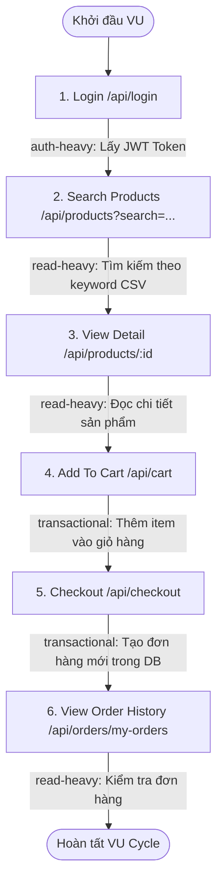

# Performance Test Analysis — EShop System

## 1. Bối cảnh & Mục tiêu

- **Hệ thống mục tiêu**: EShop — Hệ thống thương mại điện tử (Node.js Express + SQLite backend).
- **Môi trường test**: Local Performance Test Target (`http://localhost:3000`).
- **Cơ chế xác thực (Auth)**:
  - Xác thực qua JWT (JSON Web Token) thông qua header `Authorization: Bearer <token>`.
  - Cơ chế Account Lockout: Hệ thống theo dõi `login_attempts`. Nếu đăng nhập sai, mỗi lần cộng +2 attempts; khi $\ge 3$ attempts, tài khoản bị khóa trong 3 phút (`locked_until`). Đăng nhập thành công sẽ reset `login_attempts = 0` và `locked_until = NULL`.
- **Mục tiêu kiểm thử**:
  - Đánh giá khả năng đáp ứng và độ ổn định của hệ thống ở tải bình thường (Load Test).
  - Xác định điểm quá tải / suy biến (breaking point / degradation point) (Stress Test).
  - Đánh giá khả năng chống chịu tải đột biến và tốc độ tự phục hồi (recovery) (Spike Test).
  - Khảo sát ngưỡng chịu tải phần cứng (Endurance / Soak Test).
- **SLA / NFR Tham chiếu (Baseline)**:
  - Auth-heavy p(95) < 500ms
  - Read-heavy p(95) < 800ms
  - Transactional p(95) < 1500ms
  - Overall HTTP error rate < 1% (Load), < 5% (Stress), < 10% (Spike đỉnh)

---

## 2. Danh sách Endpoint theo Nhóm

| Endpoint | Method | Nhóm | Mô tả chi phí tính toán & tài nguyên | Auth cần thiết |
|---|---|---|---|---|
| `/api/login` | POST | **Auth-heavy** | Truy vấn DB tìm user, kiểm tra lockout window, so khớp mật khẩu, cập nhật `login_attempts` và ký JWT token mã hóa. Tốn chi phí CPU/DB read-write. | Không |
| `/api/products` | GET | **Read-heavy** | Tìm kiếm sản phẩm theo từ khóa (`?search=keyword`) thông qua câu truy vấn LIKE trong DB. Tần suất truy cập cao nhất. | Không |
| `/api/products/:id` | GET | **Read-heavy** | Truy vấn chi tiết thông tin sản phẩm theo khóa chính `id`. Truy vấn đọc trực tiếp từ bảng `products`. | Không |
| `/api/cart` | POST | **Transactional** | Ghi thông tin sản phẩm vào giỏ hàng (`userCarts` in-memory state). Cập nhật phiên giao dịch người dùng. | Có (Bearer JWT) |
| `/api/checkout` | POST | **Transactional** | Ghi đơn hàng mới vào bảng `orders` trong SQLite (`INSERT INTO orders`). Đây là thao tác ghi đĩa có ràng buộc toàn vẹn dữ liệu, là bottleneck chính khi tải cao. | Có (Bearer JWT) |
| `/api/orders/my-orders` | GET | **Read-heavy** | Truy vấn danh sách đơn hàng đã mua của người dùng từ bảng `orders` để kiểm tra kết quả giao dịch. | Có (Bearer JWT) |

---

## 3. Workflow End-to-End

Kịch bản Virtual User (VU) end-to-end bao phủ đầy đủ hành trình mua sắm thực tế của khách hàng:

### Bảng Mapping Chi Tiết Bước -> Endpoint -> Nhóm:

| Bước | Hành động nghiệp vụ | Endpoint gọi | Nhóm | Dữ liệu Data-Driven (CSV) |
|---|---|---|---|---|
| 1 | Đăng nhập tài khoản | `POST /api/login` | **Auth-heavy** | Lấy từ `users.csv` (phân bổ user theo VU ID chống login collision & lockout) |
| 2 | Tìm kiếm danh mục/sản phẩm | `GET /api/products?search={query}` | **Read-heavy** | Lấy từ khóa ngẫu nhiên từ `products.csv` |
| 3 | Xem chi tiết sản phẩm | `GET /api/products/{id}` | **Read-heavy** | Lấy `product_id` từ kết quả tìm kiếm hoặc `products.csv` |
| 4 | Thêm sản phẩm vào giỏ hàng | `POST /api/cart` | **Transactional** | Đóng gói `id`, `name`, `price`, `quantity` |
| 5 | Đặt hàng & thanh toán | `POST /api/checkout` | **Transactional** | Lấy `shipping_address` từ `orders.csv` và `total_amount` |
| 6 | Xem lịch sử đơn hàng | `GET /api/orders/my-orders` | **Read-heavy** | Dùng JWT token để kiểm tra đơn hàng vừa tạo |

---

## 4. Lý Giải Cách Workflow Bao Phủ 3 Nhóm Endpoint

1. **Nhóm Auth-Heavy (`POST /api/login`)**:
   - Đại diện cho khâu xác thực danh tính ban đầu. Đây là endpoint tiêu tốn CPU (ký token JWT) và xử lý DB kiểm tra cơ chế chống tấn công brute-force (`login_attempts` & `locked_until`).
2. **Nhóm Read-Heavy (`GET /api/products`, `GET /api/products/:id`, `GET /api/orders/my-orders`)**:
   - Đại diện cho các tác vụ chiếm hơn 70-80% lưu lượng thực tế của sàn thương mại điện tử (khách hàng tìm kiếm, so sánh giá, xem ảnh/mô tả trước khi quyết định mua, và xem lại lịch sử đơn).
3. **Nhóm Transactional (`POST /api/cart`, `POST /api/checkout`)**:
   - Đại diện cho các hành động chốt đơn và ghi nhận giao dịch tài chính. `POST /api/checkout` thực hiện `INSERT INTO orders` vào database SQLite - kiểm tra khả năng xử lý concurrency lock của database engine khi có hàng trăm request ghi đồng thời.

---

## 5. Giả Định & Xử Lý Concurrency / Lockout

- **Xử lý Account Lockout**:
  - Nếu tất cả VU cùng dùng chung 1 tài khoản `test@eshop.com`, chỉ cần 1 request lỗi hoặc race condition có thể làm tài khoản bị lock, dẫn đến hàng trăm VU tiếp theo thất bại (cascading failure).
  - **Giải pháp**: Tạo pool 500 tài khoản `perf_user_0001` đến `perf_user_0500` trong `users.csv` và gán user theo chỉ số `(__VU - 1) % users.length` để mỗi VU chạy trên 1 tài khoản độc lập, triệt tiêu nguy cơ account-lockout collision.
- **SQLite Concurrency Characteristic**:
  - SQLite có cơ chế file-level write locking. Khi chạy Stress test (> 100 VU đồng thời gọi `/api/checkout`), thời gian phản hồi của `/api/checkout` được kỳ vọng sẽ tăng mạnh do chờ ghi DB tuần tự.
