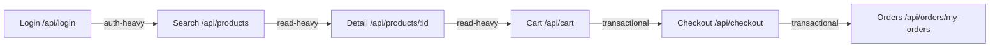

# Test Plan — Stress Test — EShop System

**Mã kịch bản / Định danh**: `23127031_Stress_20260815`  
**Hệ thống mục tiêu**: EShop E-Commerce Backend (`http://localhost:3000`)  
**Loại kiểm thử**: Stress & Degradation Point Testing  
**Hình thức Báo cáo (Listener Type 2)**: Summary Aggregated JSON Metric Export (`reports/23127031_Stress_20260815_Summary.json`)  

---

## 1. Mục tiêu

- Tìm điểm gãy (breaking point) hoặc điểm suy thoái hiệu năng (degradation point) của ứng dụng Node.js & SQLite.
- Quan sát hành vi hệ thống khi số lượng Virtual Users tăng vượt quá năng lực thiết kế ban đầu (bậc thang từ 20 lên đến 150 VUs).
- Xác định điểm nghẽn (bottleneck) liên quan đến cơ chế khóa ghi đơn luồng của SQLite (File Lock Contention) tại endpoint `/api/checkout` và tiêu hao CPU khi ký JWT tại `/api/login`.
- Đánh giá khả năng hồi phục của hệ thống sau khi chịu tải quá mức.

---

## 2. Phạm vi & Workflow Bao Phủ

Kịch bản sử dụng quy trình Virtual User Journey đồng nhất:



### Bảng Mapping Bước -> Endpoint -> Nhóm:

| Bước | Hành động nghiệp vụ | Endpoint | Nhóm |
|---|---|---|---|
| 1 | Đăng nhập tài khoản | `POST /api/login` | **Auth-heavy** |
| 2 | Tìm kiếm danh mục | `GET /api/products?search=...` | **Read-heavy** |
| 3 | Xem chi tiết sản phẩm | `GET /api/products/:id` | **Read-heavy** |
| 4 | Thêm sản phẩm vào giỏ hàng | `POST /api/cart` | **Transactional** |
| 5 | Đặt hàng & thanh toán | `POST /api/checkout` | **Transactional** |
| 6 | Xem lịch sử đơn hàng | `GET /api/orders/my-orders` | **Read-heavy** |

---

## 3. Tham Số Tải (Staircase Stress Profile)

| Stage | Duration | Target VUs | Mục đích & Lý do kỹ thuật |
|---|---|---|---|
| 1 (Step 0) | 30s | 20 VUs | Khởi động mức tải nền bình thường. |
| 2 (Step 1) | 1m00s | 50 VUs | Nâng tải lên mức gấp 2.5x baseline, kiểm tra đáp ứng ban đầu. |
| 3 (Step 2) | 1m00s | 80 VUs | Nâng tải lên 4x baseline, quan sát độ trễ bắt đầu tăng ở khâu ghi DB. |
| 4 (Step 3) | 1m00s | 120 VUs | Tải cao vượt ngưỡng thiết kế, kiểm tra hàng đợi I/O SQLite. |
| 5 (Step 4) | 1m00s | 150 VUs | Mức tải cực đại (Maximum Stress), tìm điểm suy sụp hoặc tỷ lệ lỗi tăng vọt. |
| 6 (Cooldown) | 45s | 0 VUs | Giảm tải về 0, quan sát tốc độ giải phóng bộ nhớ và khôi phục của backend. |

---

## 4. Think-Time

| Nhóm Endpoint | Think-Time | Ghi chú |
|---|---|---|
| **Auth-heavy** | 1 - 2 giây | Nhập thông tin đăng nhập |
| **Read-heavy** | 2 - 4 giây | Duyệt sản phẩm & đọc chi tiết |
| **Transactional** | 3 - 5 giây | Cân nhắc trước khi chốt đơn |

---

## 5. Tiêu Chí Pass/Fail & Giám Sát Suy Thoái

| Tiêu chí | Ngưỡng giám sát (Threshold) | Nhóm / Loại | Ý nghĩa |
|---|---|---|---|
| Giới hạn lỗi tổng | `rate < 0.10` (< 10%) | Toàn hệ thống | Cho phép lỗi tăng khi vượt 120 VUs nhưng không để crash sập hoàn toàn |
| Thời gian phản hồi Auth | `p(95) < 2000ms` | Auth-heavy | Giám sát độ trễ xác thực khi CPU tăng cao |
| Thời gian phản hồi Giao dịch | `p(95) < 5000ms` | Transactional | Giám sát độ trễ do SQLite Write Lock Contention |

---

## 6. Xử Lý Lockout & Khắc Phục Lỗi Giữa Các Lần Chạy

- Khi chạy Stress tải cao, nếu có request bị timeout làm gián đoạn trạng thái đăng nhập, script `reset_lockouts.js` được chuẩn bị sẵn để mở khóa toàn bộ user trước và sau mỗi lần test:
  ```bash
  node performance-tests/scripts/reset_lockouts.js
  ```

---

## 7. Cách Chạy & Báo Cáo Đầu Ra

```bash
k6 run performance-tests/23127031_Stress_20260815.js
```

**Báo cáo đầu ra**:
- File JSON Tổng hợp Chi tiết: `reports/23127031_Stress_20260815_Summary.json` chứa đầy đủ thông số p90, p95, max latency, throughput RPS và error rates.
