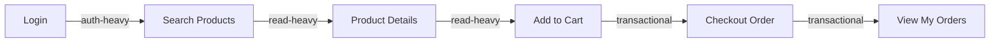

# Test Plan — Load Test — EShop System

**Mã kịch bản / Định danh**: `23127391_Load_20260815`  
**Hệ thống mục tiêu**: EShop E-Commerce Backend (`http://localhost:3000`)  
**Loại kiểm thử**: Normal & Peak Load Performance Testing  
**Hình thức Báo cáo (Listener Type 1)**: HTML Dashboard Report (`reports/23127391_Load_20260815_Report.html`)  

---

## 1. Mục tiêu

- Đánh giá khả năng đáp ứng (Response Time - p95) và Thông lượng (Throughput / Requests Per Second) của hệ thống EShop dưới tải vận hành bình thường (20 VUs) và tải cao điểm kỳ vọng (40 VUs).
- Đảm bảo hệ thống đạt SLA về thời gian phản hồi cho từng nhóm nghiệp vụ, không phát sinh lỗi (Error Rate < 1%).
- Xác thực tính ổn định của cơ chế cấp phát phiên đăng nhập JWT và luồng đặt hàng.

---

## 2. Phạm vi & Workflow Bao Phủ

Kịch bản sử dụng quy trình người dùng ảo (Virtual User Journey) end-to-end hoàn chỉnh:



### Bảng Mapping Bước -> Endpoint -> Nhóm:

| Bước | Hành động nghiệp vụ | Endpoint gọi | Nhóm | Dữ liệu Data-Driven (CSV) |
|---|---|---|---|---|
| 1 | Đăng nhập tài khoản | `POST /api/login` | **Auth-heavy** | `users.csv` (phân bổ user theo VU ID) |
| 2 | Tìm kiếm danh mục/sản phẩm | `GET /api/products?search={query}` | **Read-heavy** | `products.csv` (search keyword) |
| 3 | Xem chi tiết sản phẩm | `GET /api/products/:id` | **Read-heavy** | `products.csv` hoặc dynamic ID từ search |
| 4 | Thêm sản phẩm vào giỏ hàng | `POST /api/cart` | **Transactional** | Payload sản phẩm & số lượng |
| 5 | Đặt hàng & thanh toán | `POST /api/checkout` | **Transactional** | `orders.csv` (địa chỉ giao hàng) |
| 6 | Xem lịch sử đơn hàng | `GET /api/orders/my-orders` | **Read-heavy** | Xác thực giao dịch thành công |

### Lý Giải Độ Bao Phủ Của Workflow:
- `POST /api/login` đại diện **Auth-heavy** vì tiêu tốn chi phí CPU tính toán mã hóa JWT và truy vấn DB kiểm tra chống tấn công brute-force (`login_attempts` & `locked_until`).
- `GET /api/products` và `GET /api/products/:id` đại diện **Read-heavy** vì chiếm tần suất gọi cao nhất trong thực tế (khách hàng duyệt và so sánh sản phẩm).
- `POST /api/cart` và `POST /api/checkout` đại diện **Transactional** vì đây là các tác vụ ghi dữ liệu có ràng buộc toàn vẹn vào DB SQLite (`INSERT INTO orders`), là bottleneck chính của hệ thống.

---

## 3. Tham Số Tải (Load Profile)

| Stage | Duration | Target VUs | Mục đích & Lý do kỹ thuật |
|---|---|---|---|
| 1 | 30s | 20 VUs | Ramp-up mượt mà từ 0 lên mức tải bình thường, giúp warm-up Node.js runtime & SQLite connection. |
| 2 | 1m00s | 20 VUs | Duy trì tải ổn định (Normal Load) để đo throughput và độ trễ baseline. |
| 3 | 30s | 40 VUs | Ramp-up lên tải cao điểm (Peak Load ~ 2x baseline). |
| 4 | 1m00s | 40 VUs | Duy trì tải cao điểm để kiểm tra hệ thống có bị nghẽn (bottleneck) hay suy giảm hiệu năng không. |
| 5 | 30s | 0 VUs | Ramp-down giảm tải dần, giải phóng kết nối một cách tự nhiên. |

---

## 4. Think-Time

Mô phỏng thời gian suy nghĩ thực tế của người dùng bằng khoảng ngẫu nhiên:

| Nhóm Endpoint | Think-Time | Lý giải thực tế |
|---|---|---|
| **Auth-heavy** | 1 - 2 giây | Người dùng nhập thông tin đăng nhập hoặc trình duyệt tự điền mật khẩu. |
| **Read-heavy** | 2 - 4 giây | Người dùng đọc kết quả tìm kiếm, xem hình ảnh và mô tả sản phẩm. |
| **Transactional** | 3 - 5 giây | Người dùng rà soát thông tin giỏ hàng, điền địa chỉ giao hàng và bấm xác nhận thanh toán. |

---

## 5. Tiêu Chí Pass/Fail (Thresholds)

| Tiêu chí | Ngưỡng (Threshold) | Nhóm / Loại | Cơ sở xác định |
|---|---|---|---|
| Thời gian phản hồi Auth | `p(95) < 500ms` | Auth-heavy | SLA đăng nhập tiêu chuẩn |
| Thời gian phản hồi Đọc | `p(95) < 800ms` | Read-heavy | SLA truy vấn đọc |
| Thời gian phản hồi Giao dịch | `p(95) < 1500ms` | Transactional | SLA ghi đơn hàng SQLite |
| Thời gian phản hồi chung | `p(95) < 1000ms` | Toàn hệ thống | NFR trải nghiệm người dùng |
| Tỷ lệ lỗi HTTP | `rate < 0.01` (< 1%) | Toàn hệ thống | Yêu cầu độ tin cậy tải bình thường |

---

## 6. Dữ Liệu Đầu Vào & Chống Khóa Tài Khoản (Lockout Resilience)

- Sử dụng file `data/users.csv` chứa 500 tài khoản được seed trước.
- Mỗi VU được gán tài khoản độc lập qua công thức `userIndex = (__VU - 1) % users.length`.
- Tránh tuyệt đối việc nhiều VU chạy cùng 1 account gây xung đột bộ đếm `login_attempts` trong SQLite dẫn đến khóa tài khoản (3-fail lockout).

---

## 7. Cách Chạy & Xuất Báo Cáo

```bash
# Đảm bảo backend đang chạy tại http://localhost:3000
# Chạy k6 script:
k6 run performance-tests/23127391_Load_20260815.js
```

**Báo cáo đầu ra**:
- File HTML Dashboard tương tác: `reports/23127391_Load_20260815_Report.html`
- Kết quả Console STDOUT thời gian thực.
