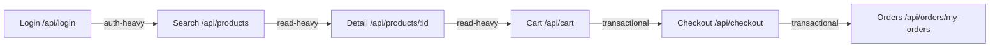

# Test Plan — Spike Test — EShop System

**Mã kịch bản / Định danh**: `23127391_Spike_20260815`  
**Hệ thống mục tiêu**: EShop E-Commerce Backend (`http://localhost:3000`)  
**Loại kiểm thử**: Traffic Surge & Recovery (Spike Testing)  
**Hình thức Báo cáo (Listener Type 3)**: Comprehensive Console & Text Metric Stream Log (`reports/23127391_Spike_20260815_Console.txt`)  

---

## 1. Mục tiêu

- Đánh giá khả năng chịu đựng của hệ thống EShop khi lưu lượng truy cập tăng vọt đột ngột trong thời gian cực ngắn (mô phỏng sự kiện Flash Sale hoặc chiến dịch khuyến mãi chớp nhoáng).
- Đo lường mức độ suy giảm hiệu năng và tỷ lệ lỗi trong giai đoạn đỉnh tải (Peak Spike).
- **Trọng tâm chính**: Đo tốc độ phục hồi (Recovery Time) của Node.js Event Loop và SQLite Database khi lưu lượng giảm đột ngột trở về mức tải cơ sở (baseline).

---

## 2. Phạm vi & Workflow Bao Phủ

Kịch bản sử dụng quy trình Virtual User Journey đồng nhất:



### Bảng Mapping Bước -> Endpoint -> Nhóm:

| Bước | Hành động nghiệp vụ | Endpoint | Nhóm | Dữ liệu Data-Driven (CSV) |
|---|---|---|---|---|
| 1 | Đăng nhập tài khoản | `POST /api/login` | **Auth-heavy** | `users.csv` (phân bổ user theo VU ID) |
| 2 | Tìm kiếm danh mục | `GET /api/products?search=...` | **Read-heavy** | `products.csv` |
| 3 | Xem chi tiết sản phẩm | `GET /api/products/:id` | **Read-heavy** | `products.csv` |
| 4 | Thêm sản phẩm vào giỏ hàng | `POST /api/cart` | **Transactional** | Cập nhật session cart |
| 5 | Đặt hàng & thanh toán | `POST /api/checkout` | **Transactional** | `orders.csv` |
| 6 | Xem lịch sử đơn hàng | `GET /api/orders/my-orders` | **Read-heavy** | Kiểm tra xác thực đơn hàng |

---

## 3. Tham Số Tải (Spike Profile)

Đặc trưng của Spike Test là thời gian tăng tải cực ngắn (vài giây) và có pha theo dõi phục hồi (Recovery phase):

| Stage | Duration | Target VUs | Đặc trưng & Mục đích |
|---|---|---|---|
| 1 (Warm-up) | 30s | 15 VUs | Duy trì tải nền bình thường (Baseline). |
| 2 (Sudden Surge) | 15s | 120 VUs | **Tăng vọt 8x** trong 15 giây (mô phỏng mở cổng Flash Sale). |
| 3 (Spike Peak) | 45s | 120 VUs | Giữ đỉnh tải ngắn để quan sát tỷ lệ lỗi và nghẽn hàng đợi I/O. |
| 4 (Sudden Drop) | 15s | 15 VUs | **Giảm đột ngột** về lại mức tải nền 15 VUs. |
| 5 (Recovery Phase) | 1m30s | 15 VUs | **Pha then chốt**: Giữ ở baseline để đo thời gian hệ thống giải phóng tài nguyên và đưa latency trở về bình thường. |
| 6 (Cooldown) | 15s | 0 VUs | Kết thúc kịch bản và ngắt kết nối. |

---

## 4. Think-Time

| Nhóm Endpoint | Think-Time | Ghi chú |
|---|---|---|
| **Auth-heavy** | 1 - 2 giây | Thao tác nhập tài khoản |
| **Read-heavy** | 2 - 4 giây | Lướt sản phẩm |
| **Transactional** | 3 - 5 giây | Chốt đơn mua nhanh trong flash sale |

---

## 5. Tiêu Chí Pass/Fail (Thresholds)

| Tiêu chí | Ngưỡng (Threshold) | Nhóm / Loại | Lý giải |
|---|---|---|---|
| Tỷ lệ lỗi HTTP | `rate < 0.15` (< 15%) | Toàn hệ thống | Chấp nhận một phần lỗi nghẽn tại đỉnh tải 8x, nhưng hệ thống không được sập hoàn toàn (Unrecoverable Crash). |
| Tự phục hồi sau Spike | `p(95) baseline < 1200ms` | Toàn hệ thống | Latency phải trở về mức chấp nhận được ngay trong Pha 5 (Recovery). |

---

## 6. Cách Chạy & Báo Cáo Đầu Ra

```bash
k6 run performance-tests/23127391_Spike_20260815.js
```

**Báo cáo đầu ra**:
- Báo cáo Log Chi tiết dạng Text: `reports/23127391_Spike_20260815_Console.txt`
- Dữ liệu hiển thị Console STDOUT thời gian thực.
