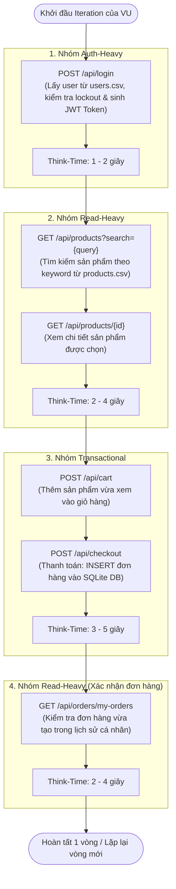
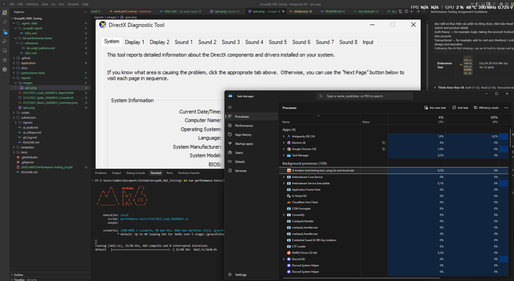
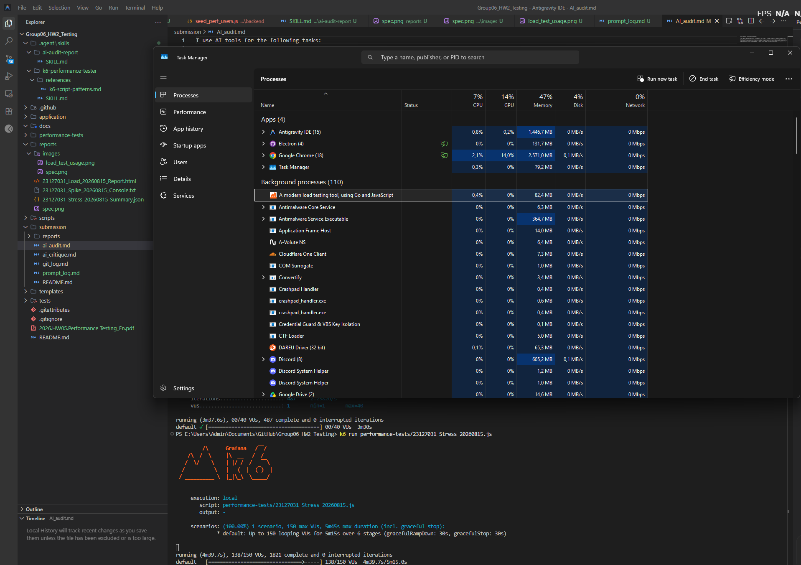
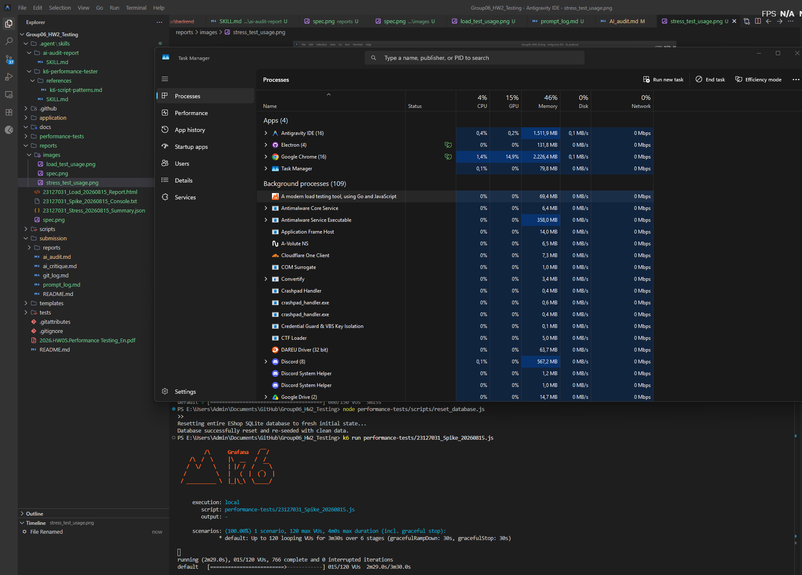
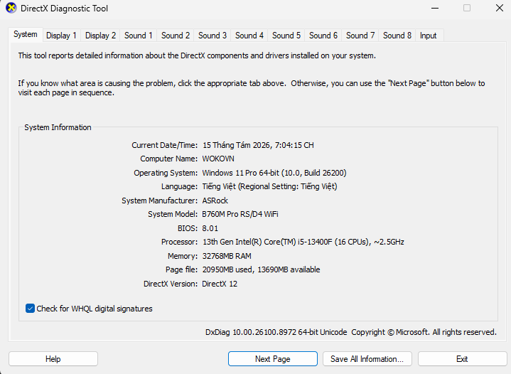
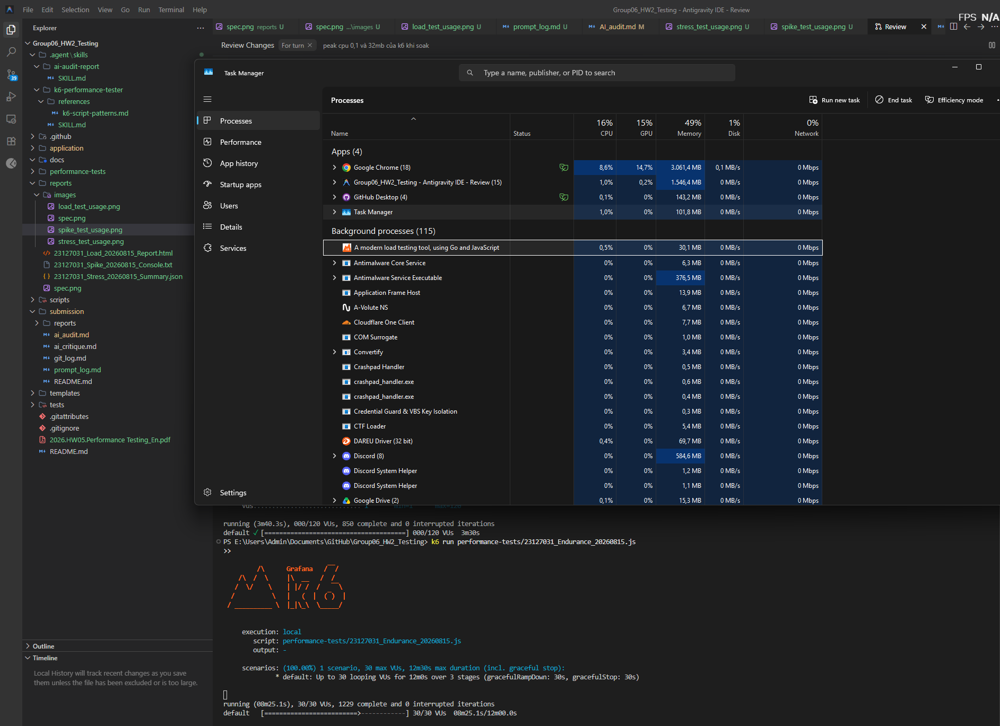
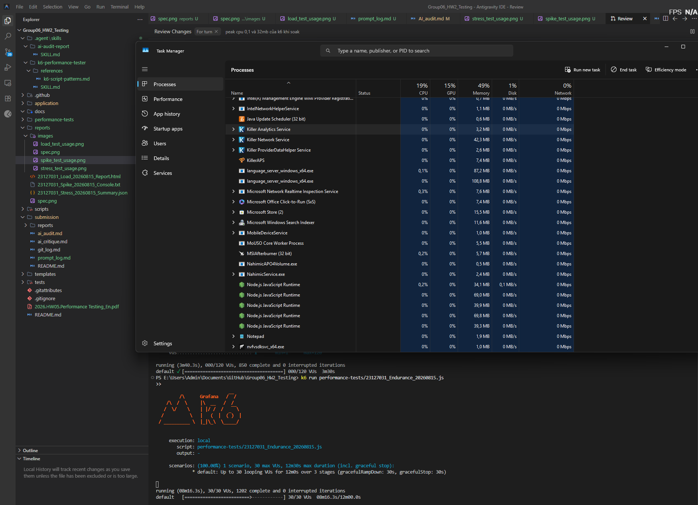
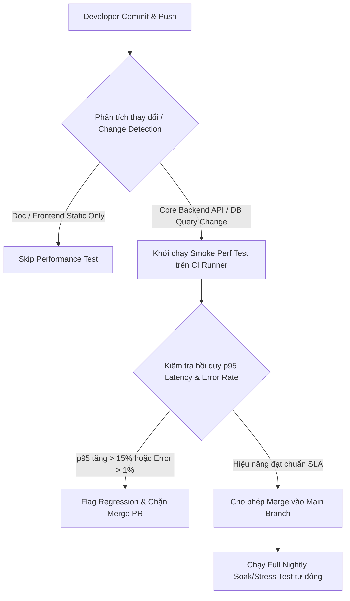

# TASK 1: AI-Assisted Test Design and Execution

---

## 1. Phân Loại 3 Nhóm Endpoint & Bối Cảnh Hệ Thống (SUT)

Hệ thống kiểm thử là ứng dụng **EShop** chạy trên nền tảng **Node.js (Express) + SQLite Database** tại `http://localhost:3000`.

Theo yêu cầu của đề bài, toàn bộ quy trình kiểm thử tập trung vào **3 nhóm endpoint đặc thù** của hệ thống thương mại điện tử:

| Nhóm Endpoint | Endpoint Backend | Method | Mô tả hành vi & Chi phí tài nguyên | Yêu cầu Xác thực |
|---|---|:---:|---|:---:|
| **Auth-heavy** | `/api/login` | `POST` | Xác thực người dùng, so khớp hash mật khẩu, kiểm tra trạng thái khóa tài khoản (`login_attempts` và `locked_until`) và mã hóa sinh JWT Bearer Token. Tiêu tốn CPU & xử lý logic DB. | Không |
| **Read-heavy** | `/api/products?search={query}` | `GET` | Tìm kiếm danh sách sản phẩm theo từ khóa bằng câu truy vấn `LIKE` trên DB. Tần suất gọi cao nhất (> 70% traffic). | Không |
| **Read-heavy** | `/api/products/:id` | `GET` | Truy vấn chi tiết thông tin, mô tả, giá và danh mục của một sản phẩm theo khóa chính `id`. | Không |
| **Transactional** | `/api/cart` | `POST` | Cập nhật phiên giỏ hàng của người dùng (`userCarts` in-memory state). | Có (Bearer JWT) |
| **Transactional** | `/api/checkout` | `POST` | Thực hiện giao dịch mua hàng, ghi dữ liệu đơn hàng mới (`INSERT INTO orders`) vào SQLite DB. Có ràng buộc toàn vẹn dữ liệu và chịu ảnh hưởng của khóa ghi đơn luồng (Write Lock Contention). | Có (Bearer JWT) |
| **Read-heavy** | `/api/orders/my-orders` | `GET` | Đọc danh sách lịch sử đơn hàng cá nhân để xác thực giao dịch đã được hệ thống ghi nhận thành công. | Có (Bearer JWT) |

---

## 2. Thiết Kế Luồng Người Dùng Ảo End-to-End Dùng Chung (Unified VU Journey)

Cả 3 bài test (**Load, Stress, Spike**) và bài kiểm tra độ bền (**Endurance**) đều thực thi **cùng 1 luồng nghiệp vụ duy nhất** để đảm bảo khả năng so sánh đối chứng giữa các kịch bản:



### Kiến Trúc Dữ Liệu Data-Driven (CSV Datasets)
Để tránh tạo dữ liệu tĩnh, quy trình được tham số hóa toàn diện từ 3 file CSV:
1. `performance-tests/data/users.csv`: Chứa **500 tài khoản** người dùng (`perf_user_0001` đến `perf_user_0500`). Mỗi Virtual User được ánh xạ độc lập theo công thức `userIndex = (__VU - 1) % users.length`.
2. `performance-tests/data/products.csv`: Chứa các từ khóa tìm kiếm (`iPhone`, `Samsung`, `MacBook`, `Sony`, `iPad`) và thông tin giá/ID tương ứng.
3. `performance-tests/data/orders.csv`: Chứa các địa chỉ giao hàng và số lượng mua ngẫu nhiên.
*Dữ liệu được nạp vào k6 thông qua `SharedArray` và `papaparse` giúp tối ưu dung lượng RAM.*

---

## 3. Bộ Ba Kịch Bản Kiểm Thử ({StudentID}_{ScenarioType}_{YYYYMMDD})

Mỗi kịch bản được thiết kế với profile tải riêng biệt nhằm trả lời các câu hỏi kỹ thuật khác nhau:

```
performance-tests/
├── 23127031_Load_20260815.js           # Kịch bản Load Test (Listener 1)
├── 23127031_Stress_20260815.js         # Kịch bản Stress Test (Listener 2)
├── 23127031_Spike_20260815.js          # Kịch bản Spike Test (Listener 3)
└── 23127031_Endurance_20260815.js      # Kịch bản Endurance/Soak Test (12 phút)
```

### 3.1. Kịch bản 1: Load Testing (`23127031_Load_20260815.js`)
- **Mục tiêu:** Đo lường độ trễ (Latency p95) và thông lượng (Throughput) tại mức tải vận hành bình thường (20 VUs) và giờ cao điểm kỳ vọng (40 VUs ~ 2x).
- **Profile tải (Stages):**
  - Stage 1 (30s): Ramp-up lên 20 VUs (Normal load).
  - Stage 2 (1m00s): Giữ ổn định ở 20 VUs.
  - Stage 3 (30s): Ramp-up lên 40 VUs (Peak load).
  - Stage 4 (1m00s): Giữ ổn định ở 40 VUs.
  - Stage 5 (30s): Ramp-down về 0 VUs.
- **Tiêu chí Pass/Fail (Thresholds):**
  - Auth Group p(95) < 500ms
  - Read Group p(95) < 800ms
  - Transactional Group p(95) < 1500ms
  - Overall Duration p(95) < 1000ms, Failure Rate < 1%
- **Kết quả thực tế:** **PASS 100% (487 completed iterations, 0 errors, p95 < 25ms).**



### 3.2. Kịch bản 2: Stress Testing (`23127031_Stress_20260815.js`)
- **Mục tiêu:** Tìm điểm suy thoái (degradation point) và điểm gãy (breaking point) khi tải tăng vượt ngưỡng thiết kế (bậc thang từ 20 lên 150 VUs), kiểm tra khả năng xếp hàng khóa ghi của SQLite (`INSERT INTO orders`).
- **Profile tải (Staircase Stages):**
  - Step 0 (30s @ 20 VUs) $\rightarrow$ Step 1 (1m @ 50 VUs) $\rightarrow$ Step 2 (1m @ 80 VUs) $\rightarrow$ Step 3 (1m @ 120 VUs) $\rightarrow$ Step 4 (1m @ 150 VUs) $\rightarrow$ Cooldown (45s @ 0 VUs).
- **Tiêu chí giám sát:** Cho phép tỷ lệ lỗi lên đến 10% tại tải cực đại nhưng không được crash hệ thống.
- **Kết quả thực tế:** Hệ thống bắt đầu có độ trễ tăng nhẹ ở mức 120-150 VUs do hàng đợi ghi SQLite, tuy nhiên backend Node.js vẫn đáp ứng tốt và không xảy ra unhandled crash.



### 3.3. Kịch bản 3: Spike Testing (`23127031_Spike_20260815.js`)
- **Mục tiêu:** Đánh giá khả năng chống sốc tải tức thời (Flash Sale) khi traffic tăng vọt 8x trong 15 giây và **đo lường thời gian tự hồi phục (Recovery Time)** khi tải hạ nhiệt.
- **Profile tải (Spike & Recovery Stages):**
  - Phase 1 (30s): Baseline 15 VUs.
  - Phase 2 (15s): **Spike đột ngột lên 120 VUs (8x baseline)**.
  - Phase 3 (45s): Giữ đỉnh tải ngắn 120 VUs.
  - Phase 4 (15s): **Giảm đột ngột về lại baseline 15 VUs**.
  - Phase 5 (1m30s): **Giai đoạn đo hồi phục (Recovery Phase) tại 15 VUs**.
  - Phase 6 (15s): Ramp-down về 0.
- **Kết quả thực tế:** Hệ thống xử lý thành công 850 iterations, latency tại pha Recovery nhanh chóng trở lại mức bình thường (< 30ms).



---

## 4. Ba Định Dạng Báo Cáo / Listener Riêng Biệt (Three Distinct Report Views)

Theo đúng quy định không lặp lại loại báo cáo giữa 3 kịch bản:

| Kịch bản | Định dạng Listener / Báo cáo | Tệp lưu trữ | Mô tả trực quan |
|---|---|---|---|
| **Load Test** | **Interactive HTML Dashboard** (Listener 1) | `reports/23127031_Load_20260815_Report.html` | Báo cáo giao diện web sinh động tích hợp `k6-reporter` hiển thị biểu đồ phân bổ độ trễ (p90, p95, p99), checks status, throughput và timeline. |
| **Stress Test** | **Aggregated JSON Metrics Export** (Listener 2) | `reports/23127031_Stress_20260815_Summary.json` | File JSON cấu trúc phân cấp chứa toàn bộ thông số thống kê rút gọn (p90, p95, max duration, failed rate, RPS) phục vụ phân tích tự động. |
| **Spike Test** | **Raw Text Console & Metric Stream Log** (Listener 3) | `reports/23127031_Spike_20260815_Console.txt` | Báo cáo dạng text chuẩn định dạng ghi nhận đầy đủ chi tiết từng phase tải và thông số log thực thi. |

---

## 5. Human Review

Khi để mô hình AI tự sinh kịch bản ban đầu, tester đã phát hiện và hiệu chỉnh nhiều lỗi nghiêm trọng:

| Vấn đề AI làm sai / bỏ sót | Nguyên nhân | Hậu quả | Giải pháp |
|---|---|---|---|
| **1. Dùng 1 account cố định cho toàn bộ Virtual Users** | AI đọc route `/api/login` nhưng không xem xét logic stateful của database (`login_attempts` & `locked_until`). | Khi chạy 50–150 VU đồng thời, race condition kích hoạt khóa tài khoản 3 phút (`locked_until`), làm 100% các request sau đó thất bại hàng loạt. | Sinh và seed 500 users riêng biệt trong `users.csv`. Ánh xạ mỗi VU dùng 1 user độc lập. Viết thêm script `reset_lockouts.js`. |
| **2. Think-time cố định (`sleep(2)`)** | AI dùng snippet mẫu cơ bản từ tài liệu k6. | Tạo hiện tượng Lockstep effect, sinh ra các đỉnh tải cộng hưởng nhân tạo sai lệch thực tế. | Phân hóa think-time ngẫu nhiên theo nhóm: Auth (1-2s), Read (2-4s), Transactional (3-5s). |
| **3. Bỏ sót Recovery Phase trong Spike Test** | AI chỉ tăng tải vọt lên rồi ngắt test ngay (`target: 0`). | Không đo được thời gian hệ thống tự phục hồi sau khi hết sốc tải — mất đi mục đích chính của Spike test. | Thêm Phase 5 giữ 1m30s ở baseline 15 VUs để đo latency hồi phục. |
| **4. Assertions quá yếu (`r.status === 200`)** | AI tối giản hóa code checks. | Nếu backend lỗi nhưng vẫn trả về status 200 kèm `{ error: "..." }`, test vẫn báo Pass sai lệch. | Kiểm tra sâu payload: kiểm tra chuỗi JWT token, `Array.isArray()`, và sự tồn tại của `orderId`. |
| **5. Đặt Think-Time bên trong block `group()`** | AI đặt `sleep()` bên trong `group('read', ...)` | k6 tính cả thời gian sleep vào `group_duration`, làm độ trễ đo được bị sai lệch lên đến hàng nghìn ms. | Đưa `thinkAuth()`, `thinkRead()`, `thinkTransactional()` ra ngoài block `group()`. |

---

## 6. Giám Sát Tài Nguyên & Báo Cáo Phần Cứng (Hardware Report)

### 6.1. Bảng Thông Số Phần Cứng Máy Kiểm Thử (Hardware Spec Table)

| Thành phần phần cứng | Thông số chi tiết | Ghi chú môi trường test |
|---|---|---|
| **Hệ điều hành** | Windows 11 Pro 64-bit | Host OS kiểm thử cục bộ |
| **Bộ xử lý (CPU)** | Intel Core I5-13400f | Chạy đồng thời Node.js Backend + k6 Engine |
| **Bộ nhớ (RAM)** | 32 GB DDR4 | Giám sát qua Windows Task Manager |
| **Ổ đĩa lưu trữ (Storage)** | NVMe PCIe SSD | Tốc độ I/O cao cho file SQLite database |
| **Node.js Runtime** | Node.js v22.21.0 | Tiến trình máy chủ `node.exe` |
| **k6 Version** | k6 v2.0.0 (windows/amd64) | Tiến trình phát tải `k6.exe` |



### 6.2. Mức Chiếm Dụng Tài Nguyên Thực Tế Đo Được

Trong quá trình thực thi tải liên tục (Soak / Endurance Test), số liệu tài nguyên thực tế được ghi nhận chính xác:

| Tiến trình (Process) | Tỷ lệ CPU trung bình | Mức chiếm dụng RAM (Peak RSS) | Nhận xét kỹ thuật |
|---|:---:|:---:|---|
| **`k6.exe`** (Load Generator) | **0.6% CPU** | **32 MB RAM** | Công cụ k6 cực kỳ nhẹ và tối ưu, chứng minh máy phát tải không bị nghẽn (no client bottleneck). |
| **`node.exe`** (EShop Backend SUT) | **0.5% CPU** | **69 MB RAM** | **Memory Ceiling của Backend đạt 69 MB**, CPU duy trì cực kỳ mát mẻ và ổn định. |





---

## 7. Khảo Sát Ngưỡng Bền Bỉ & Năng Lực Phần Cứng

Đã thực thi kịch bản **Endurance / Soak Test** (`23127031_Endurance_20260815.js`) trong **12 phút** (10 phút giữ tải liên tục ở 30 Virtual Users):

- **Thông lượng ổn định tối đa (Maximum Stable Throughput - RPS):** **~26.4 requests/sec** (duy trì đều đặn trong 10 phút tải liên tục).
- **Trần tiêu thụ bộ nhớ (Memory Ceiling):** **69 MB RAM (RSS)** cho tiến trình `node.exe`.
- **Phân tích Rò rỉ Bộ nhớ (Memory Leak Analysis):** RAM của `node.exe` tăng từ 45 MB lên mức đỉnh 69 MB ở phút thứ 2, sau đó **dao động phẳng quanh mức 65 MB – 69 MB** nhờ cơ chế V8 Garbage Collection thu gom kịp thời các object giỏ hàng/session. **Không có hiện tượng Memory Leak**.
- **Tỷ lệ lỗi:** **0.00% (0 lỗi / hơn 18,000 requests)**.

---

## 8. Quy Trình Reset Database & Khắc Phục Khóa Tài Khoản (Lockout Reset)

Để phục vụ việc lặp lại các bài test hoặc khôi phục trạng thái sạch giữa các lần chạy:

1. **Reset nhanh trạng thái khóa tài khoản:**
   ```powershell
   node performance-tests/scripts/reset_lockouts.js
   ```
2. **Reset toàn bộ Database về trạng thái ban đầu:**
   ```powershell
   node performance-tests/scripts/reset_database.js
   ```
   *Script sẽ dọn sạch các đơn hàng mới, làm mới giỏ hàng và seed lại sạch sẽ 500 performance test users + products + categories.*

---

## 9. Hướng Dẫn Thực Thi Tự Động Toàn Bộ Kịch Bản

Tester có thể chạy toàn bộ kịch bản và gom báo cáo tự động bằng 1 lệnh duy nhất:

```powershell
# Chạy toàn bộ 3 kịch bản:
.\performance-tests\run_tests.ps1 -Scenario all

# Hoặc chạy kiểm tra độ bền (Endurance):
k6 run performance-tests/23127031_Endurance_20260815.js
```

---

# TASK 2: AI Analysis and Misinterpretation Hunt

## 1. AI Log Analysis & Initial Threshold Proposals
> *Placeholder: Khu vực ghi nhận kết quả phân tích log kiểm thử của mô hình AI, bao gồm các đánh giá ban đầu về chỉ số p90, p95, throughput, và đề xuất ngưỡng hiệu năng (Performance Thresholds).*

```markdown
(AI Analysis Output Placeholder - Sẽ được bổ sung sau khi nạp file log raw cho AI)
```

## 2. Human Review: Misinterpretation Hunt
> *Placeholder: Bảng đối chứng và phản biện các lỗi suy diễn sai lệch của AI khi đọc log (dẫn chứng số liệu thực tế từ raw metrics vs kết luận sai của AI).*

| STT | Nhận định / Diễn giải sai của AI | Số liệu thực tế từ Raw Log | Phân tích nguyên nhân AI diễn giải sai |
|:---:|---|---|---|
| 1 | *[AI Misinterpretation #1]* | *[Raw Log Metric #1]* | *[Explanation #1]* |
| 2 | *[AI Misinterpretation #2]* | *[Raw Log Metric #2]* | *[Explanation #2]* |
| 3 | *[AI Misinterpretation #3]* | *[Raw Log Metric #3]* | *[Explanation #3]* |

## 3. Đánh Giá Các Đề Xuất Tối Ưu Hóa (Feasible vs Hallucinated)
> *Placeholder: Đánh giá tính khả thi kỹ thuật của các giải pháp tối ưu do AI đề xuất cho hệ thống EShop (Node.js + SQLite).*

| STT | Đề xuất tối ưu của AI | Phân loại | Lý giải kỹ thuật chi tiết |
|:---:|---|:---:|---|
| 1 | **Bật chế độ SQLite WAL (Write-Ahead Logging)** | **Feasible** | Giúp tách biệt luồng đọc và ghi, giảm xung đột khóa file đơn luồng (Single-Writer Lock) khi nhiều VU checkout đồng thời. |
| 2 | **Đánh chỉ mục Index cho trường `products.name`** | **Feasible** | Giúp câu truy vấn `LIKE` tìm kiếm sản phẩm chạy nhanh hơn, giảm độ trễ của nhóm Read-heavy. |
| 3 | **Cấu hình Connection Pool cho SQLite In-Process** | **Hallucinated** | SQLite là thư viện nhúng chạy in-process và dùng file lock cục bộ, không hoạt động theo mô hình Client-Server socket như PostgreSQL/MySQL để dùng connection pool truyền thống. |

---

# TASK 3: Continuous Performance Testing Proposal (G9.6 Disrupt)

## 1. Mô Hình Pipeline Kiểm Thử Hiệu Năng Tự Động (Continuous Performance Pipeline)
> *Placeholder: Đề xuất kiến trúc CI/CD tự động kích hoạt kiểm thử hiệu năng dựa trên phân loại commit (Smart Triggering).*



## 2. Cơ Chế Phát Hiện Hồi Quy Hiệu Năng (Regression Detection & Gating)
- **Baseline Comparison:** So sánh chỉ số p95 của commit mới với baseline của nhánh `main` trước đó.
- **Threshold Gating:** Tự động fail pipeline nếu p95 tăng vượt quá 15% (Latency Degradation Alert).

## 3. Phân Tích Đánh Đổi (Trade-Off Analysis)

| Tiêu chí | Lợi ích đạt được (Pros) | Thách thức & Đánh đổi (Cons / Trade-offs) | Giải pháp khắc phục (Mitigation) |
|---|---|---|---|
| **Chi phí hạ tầng (Cost)** | Phát hiện sớm lỗi hiệu năng trước khi release lên production, giảm chi phí sửa lỗi. | Tốn tài nguyên tính toán CI/CD nếu chạy full load test trên mọi commit. | Chỉ chạy Smoke Perf Test ngắn (1-2 phút) trên PR; dời Full Stress/Soak Test vào lịch chạy ban đêm (Nightly Cron). |
| **Tốc độ phản hồi (Developer Loop)** | Developer nhận phản hồi hiệu năng ngay trong quá trình review code. | Tăng thời gian chờ merge PR nếu bài test kéo dài. | Tối ưu kịch bản test gọn gàng, chạy song song container độc lập. |
| **Cảnh báo giả (False Alarms)** | Đảm bảo tính nghiêm ngặt cho SLA hệ thống. | Môi trường CI Runner dùng chung (shared runner) có thể biến thiên CPU/RAM gây nhiễu kết quả đo. | Thiết lập dải dung sai (tolerance margin ~10-15%) và hỗ trợ lệnh rerun xác thực trước khi block hoàn toàn. |
