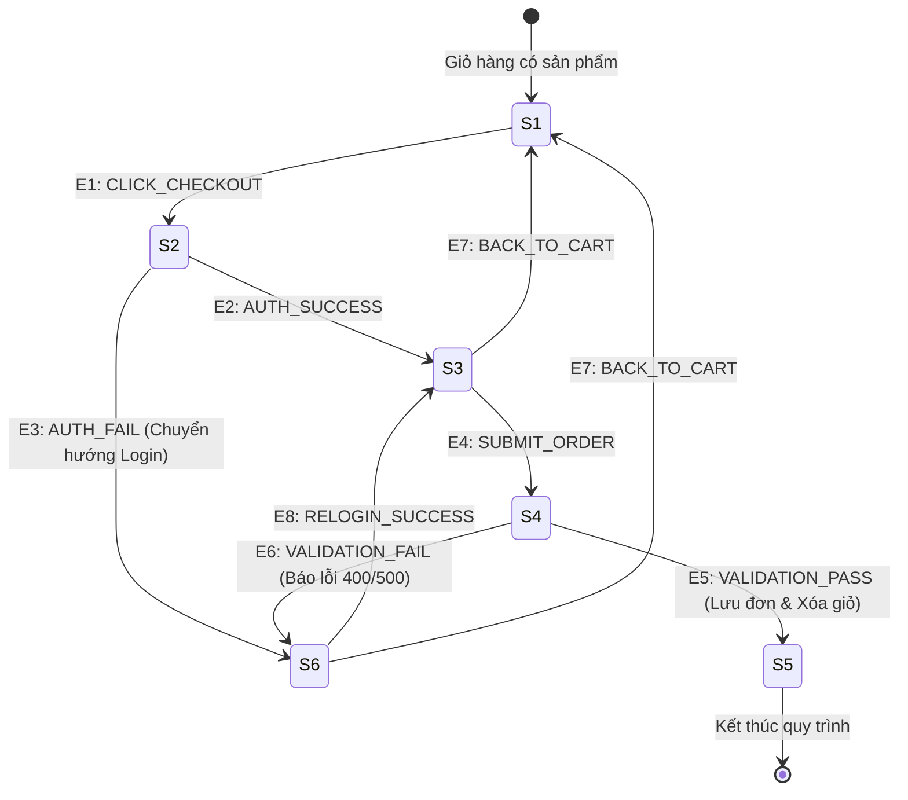

# Test Analysis — FR-08: Thanh toán (State Transition Testing)

---

## 1. Test Analysis Identifier

| Trường | Giá trị |
|---|---|
| **Document ID** | TA-ESHOP-KHOA-FR08-v1.0 |
| **Tính năng** | FR-08: Thanh toán (Checkout) |
| **Hệ thống** | EShop (E-commerce System) |
| **Phiên bản** | 1.0 |
| **Ngày tạo** | 2026-07-06 |
| **Tác giả** | Khoa (Group 06) |
| **Trạng thái** | Completed |

---

## 2. Introduction

Tài liệu này thực hiện bước **Phân tích chuyển đổi trạng thái (State Transition Testing Analysis)** cho tính năng **FR-08: Thanh toán (Checkout)** trên hệ thống EShop.

Mục tiêu là xác định rõ các trạng thái (States), các sự kiện kích hoạt (Events), các hành động (Actions), và các quy tắc chuyển đổi trạng thái hợp lệ và không hợp lệ trong vòng đời của quy trình thanh toán từ khi người dùng có giỏ hàng hoạt động đến khi đơn hàng được tạo thành công và giỏ hàng được xóa sạch.

### Tài liệu tham chiếu:
- Đặc tả yêu cầu hệ thống: [docs/README.md](file:///c:/Users/ADMIN/OneDrive%20-%20CONG%20TY%20TNHH%20BIGIN-SGIM00458/Documents/GitHub/Group06_HW2_Testing/docs/README.md)
- Đặc tả API: [docs/api_specification.md](file:///c:/Users/ADMIN/OneDrive%20-%20CONG%20TY%20TNHH%20BIGIN-SGIM00458/Documents/GitHub/Group06_HW2_Testing/docs/api_specification.md)
- Mã nguồn Backend: [application/backend/server.js](file:///c:/Users/ADMIN/OneDrive%20-%20CONG%20TY%20TNHH%20BIGIN-SGIM00458/Documents/GitHub/Group06_HW2_Testing/application/backend/server.js)

---

## 3. State Transition Model for FR-08

### 3.1 Định nghĩa các Trạng thái (States)

Quy trình thanh toán (Checkout) gồm 6 trạng thái chính sau:

| Mã Trạng thái | Tên Trạng thái | Mô tả |
|---|---|---|
| **S1: CART_ACTIVE** | Giỏ hàng hoạt động | Người dùng đang ở màn hình Giỏ hàng (`/api/cart` có sản phẩm). Đây là trạng thái bắt đầu của quy trình. |
| **S2: AUTH_CHECKING** | Kiểm tra xác thực | Hệ thống kiểm tra xem người dùng đã đăng nhập chưa (Token JWT có hợp lệ hay không). |
| **S3: CHECKOUT_SUMMARY** | Màn hình Thanh toán | Người dùng đang ở màn hình tóm tắt thông tin thanh toán (Hiển thị sản phẩm, địa chỉ nhận hàng, ô nhập coupon, nút Đặt hàng). |
| **S4: BACKEND_PROCESSING** | Backend xử lý thanh toán | Người dùng gửi yêu cầu đặt hàng (`POST /api/checkout`). Backend thực hiện tính toán lại tổng tiền từ CSDL giỏ hàng và xác thực địa chỉ. |
| **S5: ORDER_PLACED (Final)** | Đặt hàng thành công | Đơn hàng được tạo thành công trong DB (trạng thái `pending`), giỏ hàng hiện tại bị xóa hoàn toàn. Người dùng chuyển sang trang thành công. |
| **S6: CHECKOUT_FAILED** | Thanh toán thất bại / Chặn | Quá trình thanh toán bị lỗi hoặc bị chặn (do chưa đăng nhập, giỏ hàng trống, tổng tiền sai lệch, hoặc địa chỉ không hợp lệ). |

---

### 3.2 Định nghĩa các Sự kiện kích hoạt (Events)

| Mã Sự kiện | Tên Sự kiện | Hành động / Mô tả kích hoạt |
|---|---|---|
| **E1: CLICK_CHECKOUT** | Bấm nút Thanh toán | Người dùng bấm nút "Thanh toán" từ màn hình Giỏ hàng. |
| **E2: AUTH_SUCCESS** | Xác thực thành công | JWT Token hợp lệ (role = 'user' hoặc 'admin'). |
| **E3: AUTH_FAIL** | Xác thực thất bại | Token không tồn tại, hết hạn, sai chữ ký hoặc sai định dạng. |
| **E4: SUBMIT_ORDER** | Bấm Đặt hàng | Người dùng bấm nút "Đặt hàng" (gửi `POST /api/checkout` kèm địa chỉ). |
| **E5: VALIDATION_PASS** | Backend validate thành công | Backend tự tính toán lại tổng tiền khớp, địa chỉ nhận hàng hợp lệ, và giỏ hàng có sản phẩm. |
| **E6: VALIDATION_FAIL** | Backend validate thất bại | Dữ liệu sai lệch: địa chỉ rỗng, giỏ hàng trống, hoặc lỗi cơ sở dữ liệu. |
| **E7: BACK_TO_CART** | Quay lại Giỏ hàng | Người dùng chọn quay lại hoặc hủy bỏ tiến trình thanh toán. |
| **E8: RELOGIN_SUCCESS** | Đăng nhập lại thành công | Người dùng đăng nhập thành công sau khi bị chuyển hướng sang trang Login. |

---

### 3.3 Sơ đồ chuyển đổi trạng thái (State Transition Diagram)

---

### 3.4 Bảng chuyển đổi trạng thái (State Transition Table)

| Trạng thái hiện tại | Sự kiện kích hoạt | Trạng thái tiếp theo | Hành động của Hệ thống (Action / Output) | Loại chuyển đổi |
|---|---|---|---|---|
| **S1: CART_ACTIVE** | E1: CLICK_CHECKOUT | **S2: AUTH_CHECKING** | Gửi yêu cầu xác thực JWT Token | Valid |
| **S2: AUTH_CHECKING** | E2: AUTH_SUCCESS | **S3: CHECKOUT_SUMMARY** | Điều hướng sang trang Thanh toán, hiển thị tóm tắt đơn | Valid |
| **S2: AUTH_CHECKING** | E3: AUTH_FAIL | **S6: CHECKOUT_FAILED** | Trả về lỗi 401/403, chuyển hướng sang trang Đăng nhập | Valid |
| **S6: CHECKOUT_FAILED** | E8: RELOGIN_SUCCESS | **S3: CHECKOUT_SUMMARY** | Lưu session, chuyển tiếp đến màn hình Thanh toán | Valid |
| **S6: CHECKOUT_FAILED** | E7: BACK_TO_CART | **S1: CART_ACTIVE** | Quay lại màn hình Giỏ hàng | Valid |
| **S3: CHECKOUT_SUMMARY** | E4: SUBMIT_ORDER | **S4: BACKEND_PROCESSING** | Gửi request `POST /api/checkout` lên máy chủ | Valid |
| **S3: CHECKOUT_SUMMARY** | E7: BACK_TO_CART | **S1: CART_ACTIVE** | Điều hướng quay lại màn hình Giỏ hàng | Valid |
| **S4: BACKEND_PROCESSING** | E5: VALIDATION_PASS | **S5: ORDER_PLACED** | Lưu đơn hàng (`pending`), xóa sạch giỏ hàng trong DB | Valid |
| **S4: BACKEND_PROCESSING** | E6: VALIDATION_FAIL | **S6: CHECKOUT_FAILED** | Trả về lỗi 400 Bad Request, giữ nguyên giỏ hàng | Valid |
| **S5: ORDER_PLACED** | E7: BACK_TO_CART | **S1: CART_ACTIVE** | Màn hình Giỏ hàng trống | Valid |

---

### 3.5 Ma trận chuyển đổi trạng thái (State Transition Matrix)

| Trạng thái | S1 (CART_ACTIVE) | S2 (AUTH_CHECKING) | S3 (CHECKOUT_SUMMARY) | S4 (BACKEND_PROCESSING) | S5 (ORDER_PLACED) | S6 (CHECKOUT_FAILED) |
|---|---|---|---|---|---|---|
| **S1** | - | E1 | - | - | - | - |
| **S2** | - | - | E2 | - | - | E3 |
| **S3** | E7 | - | - | E4 | - | - |
| **S4** | - | - | - | - | E5 | E6 |
| **S5** | E7 | - | - | - | - | - |
| **S6** | E7 | - | E8 | - | - | - |

*(Ký hiệu `-` thể hiện chuyển đổi không hợp lệ/không thể xảy ra trực tiếp)*

---

## 4. Thiết kế Ca kiểm thử (Test Cases)

Dựa trên sơ đồ và ma trận chuyển đổi trạng thái, ta thiết kế các ca kiểm thử bao phủ toàn bộ các trạng thái và đường chuyển đổi (0-switch coverage).

### 4.1 Danh sách Test Cases đề xuất

| Mã Test Case | Trạng thái ban đầu | Chuỗi sự kiện / Trạng thái chuyển đổi | Kết quả mong đợi |
|---|---|---|---|
| **TC-CHECKOUT-001** | S1: CART_ACTIVE | S1 → S2 (E1) → S3 (E2) → S4 (E4) → S5 (E5) | **Thanh toán thành công (Happy Path)**: - Đăng nhập trước đó. - Nhập địa chỉ hợp lệ. - Bấm Đặt hàng thành công. - Giỏ hàng bị xóa sạch. - Trả về HTTP 200, đơn hàng `pending` được tạo. |
| **TC-CHECKOUT-002** | S1: CART_ACTIVE | S1 → S2 (E1) → S6 (E3) → S3 (E8) → S4 (E4) → S5 (E5) | **Thanh toán thành công sau khi chuyển hướng đăng nhập**: - Bấm checkout khi chưa login. - Bị chặn và chuyển sang login. - Đăng nhập thành công, tự động dẫn tới checkout và hoàn thành đặt hàng. |
| **TC-CHECKOUT-003** | S1: CART_ACTIVE | S1 → S2 (E1) → S6 (E3) → S1 (E7) | **Hủy thanh toán tại trang Đăng nhập**: - Bấm checkout khi chưa login. - Bấm quay lại giỏ hàng từ trang đăng nhập. - Giỏ hàng được giữ nguyên. |
| **TC-CHECKOUT-004** | S1: CART_ACTIVE | S1 → S2 (E1) → S3 (E2) → S1 (E7) | **Hủy thanh toán tại trang Checkout Summary**: - Đã login, vào màn hình checkout. - Bấm quay lại giỏ hàng. - Giỏ hàng được giữ nguyên, thông tin không mất. |
| **TC-CHECKOUT-005** | S1: CART_ACTIVE | S1 → S2 (E1) → S3 (E2) → S4 (E4) → S6 (E6) | **Thanh toán thất bại do địa chỉ giao hàng rỗng**: - Bỏ trống trường `shipping_address` khi gửi request `POST /api/checkout`. - Backend trả về lỗi 400 Bad Request. - Giỏ hàng được giữ nguyên. |
| **TC-CHECKOUT-006** | S3: CHECKOUT_SUMMARY| S3 → S4 (E4) → S6 (E6 - Token Expired) | **Thanh toán thất bại do Token hết hạn đột ngột**: - Đang ở màn hình checkout nhưng token hết hạn trước khi bấm đặt hàng. - Gửi request đặt hàng bị Backend từ chối với mã lỗi 401/403. - Chuyển hướng sang màn hình đăng nhập. |
| **TC-CHECKOUT-007** | S3: CHECKOUT_SUMMARY| S3 → S4 (E4) → S6 (E6 - Empty Cart) | **Thanh toán thất bại do giỏ hàng trống**: - Người dùng mở 2 tab, một tab xóa sạch giỏ hàng, tab kia bấm đặt hàng. - Backend kiểm tra phát hiện giỏ hàng trống. - Trả về lỗi 400 Bad Request, không tạo đơn hàng. |
| **TC-CHECKOUT-008** | S3: CHECKOUT_SUMMARY| S3 → S4 (E4) → S5 (E5 - Altered Total) | **Backend tự tính toán lại tổng tiền, bỏ qua tổng tiền do Client gửi lên**: - Kẻ tấn công sửa đổi giá trị `total_amount` trong payload gửi lên API. - Backend tự tính toán lại dựa trên giá tiền thực tế của sản phẩm từ CSDL. - Đơn hàng được tạo thành công với tổng tiền đúng từ DB, bỏ qua giá trị giả mạo của Client. |
| **TC-CHECKOUT-009** | S5: ORDER_PLACED | S5 → S1 (E7) | **Giỏ hàng bị xóa sạch sau khi checkout thành công**: - Sau khi checkout thành công, quay trở lại trang chủ hoặc giỏ hàng. - Số lượng badge giỏ hàng trở về 0, trang giỏ hàng hiển thị trạng thái trống. |
| **TC-CHECKOUT-010** | S3: CHECKOUT_SUMMARY| Gửi đồng thời nhiều request đặt hàng (Double click / Race condition) | **Ngăn chặn tạo đơn hàng trùng lặp**: - Bấm Đặt hàng liên tục nhiều lần. - Hệ thống chỉ xử lý thành công request đầu tiên và chặn các request sau (hoặc trả về lỗi cho các request sau). Chỉ tạo đúng 1 đơn hàng. |

---

## 5. Giải thích Phân tích bằng tiếng Việt

Dưới đây là tóm tắt các điểm quan trọng rút ra từ quá trình phân tích chuyển đổi trạng thái của tính năng FR-08 (Thanh toán):

1. **Ràng buộc nghiệp vụ về trạng thái (State Validation)**:
   - Một trong những lỗi bảo mật và logic phổ biến nhất là bỏ qua bước kiểm tra xác thực (**S2: AUTH_CHECKING**). API `/api/checkout` bắt buộc phải chạy qua middleware `authenticateToken` để kiểm tra tính hợp lệ của Token JWT trước khi chuyển sang xử lý backend.
   - Trạng thái giỏ hàng rỗng cần phải được chặn từ frontend (nút thanh toán bị disabled) và bắt buộc chặn ở backend (**S4: BACKEND_PROCESSING**). Nếu giỏ hàng của người dùng không có sản phẩm nào, hệ thống không được phép chuyển đổi sang trạng thái **S5: ORDER_PLACED**.

2. **Bảo mật và toàn vẹn dữ liệu tại Backend**:
   - Đặc tả yêu cầu ghi rõ: *Backend phải tự tính lại tổng tiền; không chấp nhận giá trị `total_amount` do client gửi lên*. Đây là chốt chặn quan trọng tại trạng thái **S4: BACKEND_PROCESSING**. Điều này ngăn chặn việc người dùng độc hại sử dụng các công cụ như Postman để gửi một đơn hàng trị giá hàng triệu đồng nhưng payload lại ghi `total_amount = 0`.
   - Sau khi chuyển đổi thành công sang trạng thái **S5: ORDER_PLACED**, một hành động bắt buộc của hệ thống (Action) là xóa sạch giỏ hàng (`userCarts[userId] = []`) nhằm đảm bảo tính đồng bộ dữ liệu.

3. **Thiết kế kiểm thử chuyển đổi trạng thái (Coverage)**:
   - Các ca kiểm thử được thiết kế để bao phủ tất cả các cạnh chuyển đổi hợp lệ trong sơ đồ.
   - Đồng thời, chúng tôi thêm vào các ca kiểm thử để kiểm tra các chuyển đổi không hợp lệ (ví dụ: cố gắng tạo đơn hàng mà không qua trang tóm tắt, gửi request đặt hàng trực tiếp qua API mà không có xác thực, hoặc gửi tham số sai lệch nhằm phá vỡ logic tính tiền).
