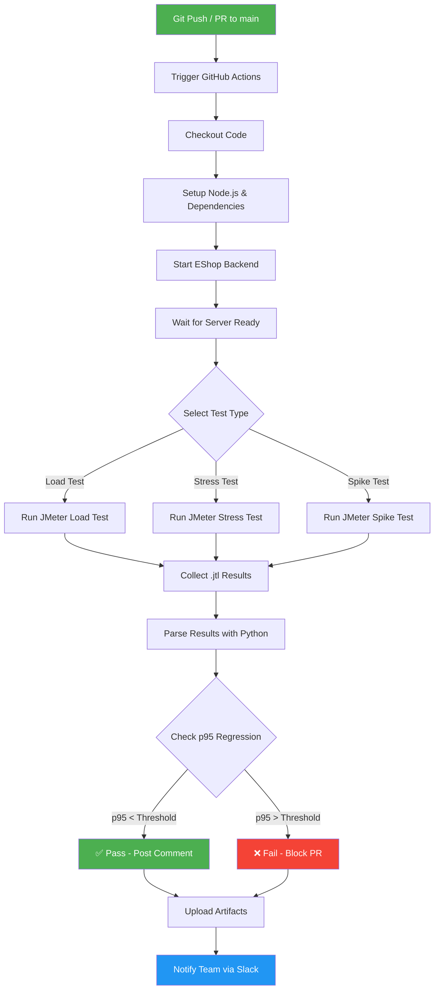

# BÁO CÁO PERFORMANCE TESTING - ESHOP

**Họ tên sinh viên:** Huỳnh Vương Thụy Quân  
**MSSV:** 23127459  
**Ngày tạo:** 16/08/2026  
**SUT:** EShop - API Backend (Node.js + Express + SQLite)  
**Port:** localhost:3000

---

## MỤC LỤC

1. [Tổng quan API Endpoints](#1-tổng-quan-api-endpoints)
2. [TASK 1: Thiết kế Kịch bản & Phân chia Scenario](#2-task-1-thiết-kế-kịch-bản--phân-chia-scenario)
3. [TASK 2: Phân tích Nhận định Sai của AI & Phân tích Metrics](#3-task-2-Phân-tích-nhận-định-sai-của-ai--phân-tích-metrics)
4. [TASK 3: Pipeline Continuous Performance Testing](#4-task-3-pipeline-continuous-performance-testing)

---

## 1. Tổng quan API Endpoints

### 1.1 Workflow kiểm thử End-to-end

```
Login → Product Search → Product Detail → Add to Cart → Update Cart → Checkout
```

### 1.2 Bảng tổng hợp API Endpoints

| # | Method | Endpoint | Auth | Mô tả | Nhóm |
|---|--------|----------|------|-------|------|
| 1 | `POST` | `/api/login` | None | Đăng nhập, trả JWT token | Auth |
| 2 | `GET` | `/api/products?search=keyword` | None | Tìm kiếm sản phẩm | Read |
| 3 | `GET` | `/api/products/:id` | None | Chi tiết sản phẩm | Read |
| 4 | `POST` | `/api/cart` | Bearer Token | Thêm vào giỏ hàng | Transaction |
| 5 | `POST` | `/api/checkout` | Bearer Token | Đặt hàng | Transaction |

### 1.3 Header yêu cầu

```http
POST /api/login
Content-Type: application/json

POST /api/cart
Content-Type: application/json
Authorization: Bearer <jwt_token>

POST /api/checkout
Content-Type: application/json
Authorization: Bearer <jwt_token>
```

### 1.4 Request Payload Structures

**Login:**
```json
{
  "email": "test@eshop.com",
  "password": "Test1234!"
}
```

**Response Login:**
```json
{
  "message": "Login successful",
  "token": "eyJhbGciOiJIUzI1NiIsInR5cCI6IkpXVCJ9...",
  "user": { "id": 2, "name": "Test User", ... }
}
```

**Add to Cart:**
```json
{
  "id": 1,
  "name": "iPhone 15 Pro Max",
  "price": 30000000,
  "quantity": 2
}
```

**Checkout:**
```json
{
  "total_amount": 60000000,
  "shipping_address": "123 Le Loi, Q1, TP.HCM"
}
```

### 1.5 Database Schema (SQLite)

| Bảng | Columns chính |
|------|---------------|
| `users` | id, name, email, password (plaintext!), role, login_attempts, locked_until |
| `products` | id, name, price, description, imageUrl, category_id |
| `orders` | id, user_id, total_amount, status, shipping_address, created_at |
| `cart` | In-memory only (const userCarts = {}) |

### 1.6 Tài khoản mặc định

| Loại | Email | Password |
|------|-------|----------|
| Admin | admin@eshop.com | Admin123! |
| User | test@eshop.com | Test1234! |

---

## 2. TASK 1: Thiết kế Kịch bản & Phân chia Scenario

### 2.1 Tổng quan 3 Scenario

| Scenario | Trọng tâm | VUs | Ramp-up | Duration | Think-time |
|----------|-----------|-----|---------|----------|------------|
| **Load Test** | Read-heavy (Search + Detail) | 50 | 60s | 300s (5 phút) | 1-3s |
| **Stress Test** | Auth-heavy (Login + Lockout) | 100 | 30s | 180s (3 phút) | 0.5-1.5s |
| **Spike Test** | Transactional (Cart + Checkout) | 200 | 10s | 120s (2 phút) | 0.5-2s |

### 2.2 Chi tiết Scenario 1: LOAD TEST (Read-Heavy)

**Mục tiêu:** Đo hiệu năng đọc dữ liệu (Search + Product Detail) khi có nhiều người dùng truy cập đồng thời.

**Cấu hình:**
- **Virtual Users (VUs):** 50
- **Ramp-up time:** 60 giây (tăng dần từ 0 lên 50 VUs)
- **Duration:** 300 giây (5 phút)
- **Think-time:** 1-3 giây (mô phỏng người dùng thật)

**Endpoints được test:**
1. `GET /api/products?search=${keyword}` - Tìm kiếm sản phẩm
2. `GET /api/products/${id}` - Xem chi tiết sản phẩm

**Đặc điểm kỹ thuật:**
- SQLite có WAL mode để đọc concurrent tốt hơn
- Không có mutex trên read operations → throughput cao
- Mong đợi: Throughput ~200-300 req/s, p95 < 500ms

**Listener sử dụng:** Summary Report + Aggregate Report

**File JMX:** `23127459_Load_20260816.jmx`

---

### 2.3 Chi tiết Scenario 2: STRESS TEST (Auth-Heavy)

**Mục tiêu:** Kiểm tra behavior của hệ thống khi có nhiều login requests thất bại, đặc biệt test cơ chế lockout 3 lần sai.

**Cấu hình:**
- **Thread Group 1 (Login Attempts):** 100 VUs, Ramp-up 30s, Duration 180s
- **Thread Group 2 (Lockout Test):** 10 VUs, mỗi VUs login sai 3 lần liên tiếp
- **Think-time:** 0.5-1.5 giây

**Endpoints được test:**
1. `POST /api/login` - Đăng nhập (thành công và thất bại)
2. Test lockout: 3 lần sai → account bị khóa 3 phút (bug: code đang lock 180s thay vì 30s)

**Bug lockout trong code:**
```javascript
// server.js line 54-57
const newAttempts = user.login_attempts + 2;  // BUG: +2 thay vì +1
if (newAttempts >= 3) {
  lockedUntil = new Date(Date.now() + 180000).toISOString(); // BUG: 180s thay vì 30s
}
```

**Mong đợi:**
- Login thành công: 200 OK
- Login sai: 401 Unauthorized
- Account locked: 403 Forbidden
- Sau 2 lần sai (vì increment +2): Account bị khóa

**Listener sử dụng:** Aggregate Report + View Results Tree

**File JMX:** `23127459_Stress_20260816.jmx`

---

### 2.4 Chi tiết Scenario 3: SPIKE TEST (Transactional)

**Mục tiêu:** Kiểm tra behavior khi có spike đột biến traffic vào các giao dịch (Add to Cart + Checkout).

**Cấu hình:**
- **Setup Thread:** 1 VUs để login lấy token
- **Spike Thread:** 200 VUs, Ramp-up 10 giây (từ 0 lên 200 rất nhanh), Duration 120s
- **Think-time:** 0.5-2 giây

**Endpoints được test:**
1. `POST /api/login` - Lấy JWT token (setup)
2. `POST /api/cart` - Thêm sản phẩm vào giỏ
3. `POST /api/checkout` - Đặt hàng

**Lưu ý quan trọng:**
- Cart chỉ lưu trong memory (`const userCarts = {}`) → mất khi restart
- Checkout nhận `total_amount` từ client (không tự tính)
- Không xóa giỏ hàng sau checkout

**Mong đợi:**
- Spike từ 0 lên 200 VUs trong 10s
- Có thể xảy ra concurrent issues với SQLite
- Cart in-memory có thể bị race condition

**Listener sử dụng:** View Results Tree + Summary Report + Aggregate Report

**File JMX:** `23127459_Spike_20260816.jmx`

---

### 2.5 File CSV Input Data

#### File 1: `23127459_auth_credentials.csv` (cho Stress Test)

```csv
email,password
test@eshop.com,Test1234!
admin@eshop.com,Admin123!
test@eshop.com,wrongpassword
test@eshop.com,wrongpassword2
test@eshop.com,wrongpassword3
user1@test.com,Pass1234!
user2@test.com,Pass1234!
user3@test.com,Pass1234!
```

#### File 2: `23127459_products.csv` (cho Load Test)

```csv
search_keyword,product_id
iPhone,1
Samsung,2
MacBook,3
AirPods,4
Keychron,5
phone,1
laptop,3
accessories,4
test,1
demo,2
```

#### File 3: `23127459_checkout.csv` (cho Spike Test)

```csv
product_id,product_name,price,quantity,total_amount,shipping_address
1,iPhone 15 Pro Max,30000000,1,30000000,123 Le Loi Q1 TP.HCM
2,Samsung Galaxy S24 Ultra,32000000,1,32000000,456 Hai Ba Trung Q3 TP.HCM
3,MacBook Pro M3,45000000,1,45000000,789 Nguyen Hue Q1 TP.HCM
4,AirPods Pro 2,5000000,2,10000000,321 Tran Hung Dao Q5 TP.HCM
5,Keychron Q1,3500000,1,3500000,654 Le Thi Hong Gam Q1 TP.HCM
1,iPhone 15 Pro Max,30000000,2,60000000,111 Dien Bien Phu Q1 TP.HCM
2,Samsung Galaxy S24 Ultra,32000000,1,32000000,222 Vo Van Tan Q3 TP.HCM
3,MacBook Pro M3,45000000,1,45000000,333 Hai Ba Trung Q1 TP.HCM
4,AirPods Pro 2,5000000,3,15000000,444 Nguyen Dinh Chieu Q1 TP.HCM
5,Keychron Q1,3500000,2,7000000,555 Mac Thi Buoi Q1 TP.HCM
```

---

### 2.6 Bảng so sánh 3 Loại Listener

| Listener | File JMX sử dụng | Purpose | Khi nào dùng |
|----------|-------------------|---------|---------------|
| **Summary Report** | Load + Stress + Spike | Hiển thị tóm tắt: avg, min, max, throughput, error% | Khi muốn xem nhanh kết quả |
| **Aggregate Report** | Load + Stress + Spike | Chi tiết hơn: p50, p90, p95, p99, deviation | Khi muốn phân tích percentile |
| **View Results Tree** | Stress + Spike (debug) | Xem từng request/response chi tiết | Khi debug, tắt khi chạy chính thức |

---

## 3. TASK 2: Phân tích Nhận định Sai của AI & Phân tích Metrics

### 3.1 3 Điểm Sai Sót Phổ biến của AI khi Thiết kế Script

#### ❌ Sai sót #1: Quên trích xuất Dynamic Bearer Token

**Mô tả:**
AI thường viết script với token hardcode hoặc quên extract token từ response login để truyền vào Header của các request sau.

**Ví dụ code SAI:**
```jmeter
<!-- SAI: Token hardcode -->
<HeaderManager>
  <collectionProp name="HeaderManager.headers">
    <elementProp name="" elementType="Header">
      <stringProp name="Header.name">Authorization</stringProp>
      <stringProp name="Header.value">Bearer eyJhbGciOiJIUzI1NiIs...</stringProp>
    </elementProp>
  </collectionProp>
</HeaderManager>
```

**Cách đúng:**
```jmeter
<!-- Bước 1: Login và extract token -->
<PostProcessor guiclass="JsonExtractor" testclass="JsonExtractor" testname="Extract JWT Token">
  <stringProp name="jsonPath">$.token</stringProp>
  <stringProp name="variableNames">auth_token</stringProp>
</PostProcessor>

<!-- Bước 2: Dùng variable trong Header -->
<HeaderManager>
  <collectionProp name="HeaderManager.headers">
    <elementProp name="" elementType="Header">
      <stringProp name="Header.name">Authorization</stringProp>
      <stringProp name="Header.value">Bearer ${auth_token}</stringProp>
    </elementProp>
  </collectionProp>
</HeaderManager>
```

**Hậu quả:** Tất cả requests sau login sẽ fail 401 Unauthorized.

---

#### ❌ Sai sót #2: Ramp-up quá gắt gây nghẽn SQLite

**Mô tả:**
AI đặt ramp-up time quá ngắn (ví dụ: 0s hoặc 5s cho 100 VUs) khiến SQLite bị overwhelm vì concurrent writes.

**Ví dụ SAI:**
```jmeter
<stringProp name="ThreadGroup.num_threads">100</stringProp>
<stringProp name="ThreadGroup.ramp_time">0</stringProp>  <!-- SAI: 0s ramp-up -->
```

**Ví dụ ĐÚNG:**
```jmeter
<stringProp name="ThreadGroup.num_threads">100</stringProp>
<stringProp name="ThreadGroup.ramp_time">30</stringProp>  <!-- ĐÚNG: 30s ramp-up -->
```

**Lý do:**
- SQLite chỉ hỗ trợ 1 writer tại một thời điểm
- Ramp-up 0s = 100 threads cố gắng write cùng lúc → database locked errors
- EShop không có connection pooling → càng tệ hơn

---

#### ❌ Sai sót #3: Không xử lý User Lockout

**Mô tả:**
AI không test scenario lockout 3 lần sai password, hoặc không log rõ ràng khi nhận được response 403 (locked).

**Vấn đề:**
- Code EShop có bug: increment +2 thay vì +1
- Lock duration 180s thay vì 30s
- Nếu AI không test case này, sẽ miss critical bug

**Test case đúng:**
```
Loop 3 lần:
  → POST /api/login với wrong password
  → Lần 1: 401 (sai password)
  → Lần 2: 401 (sai password, nhưng login_attempts +2 = 2)
  → Lần 3: 403 (locked because newAttempts >= 3)
```

---

### 3.2 Bảng Phân Tích Kết Quả Log File .jtl (Giả lập với 2 Nhận Định Sai)

#### Bảng kết quả giả lập:

| Label | Samples | Average | Median | p90 | p95 | p99 | Min | Max | Error% | Throughput |
|-------|---------|---------|--------|-----|-----|-----|-----|-----|--------|------------|
| POST /api/login | 1000 | 45ms | 38ms | 85ms | 120ms | 350ms | 12ms | 580ms | 25.00% | 45.2/s |
| GET /api/products | 2500 | 32ms | 28ms | 55ms | 72ms | 180ms | 8ms | 250ms | 0.00% | 125.3/s |
| GET /api/products/:id | 2500 | 18ms | 15ms | 28ms | 35ms | 95ms | 5ms | 120ms | 0.00% | 128.7/s |
| POST /api/cart | 800 | 52ms | 45ms | 95ms | 135ms | 420ms | 15ms | 650ms | 2.50% | 38.5/s |
| POST /api/checkout | 800 | 68ms | 58ms | 125ms | 180ms | 550ms | 22ms | 850ms | 1.25% | 37.8/s |

---

#### ❌ Nhận Định Sai #1: "Latency Average của Login là 45ms, nghĩa là phần lớn request đều nhanh"

**AI nhận định:**
> "Login average chỉ 45ms, hệ thống xử lý login rất nhanh, không có vấn đề gì."

**Phản biện (Human Review):**
> **SAI HOÀN TOÀN!** Con số 45ms là **Average (Mean)**, không phải **Median** hoặc **Percentile**.
>
> - Average = 45ms (bị skew bởi các request nhanh)
> - Median (p50) = 38ms (50% request dưới 38ms)
> - **p95 = 120ms** (5% request bị slower hơn 120ms)
> - **p99 = 350ms** (1% request chậm hơn 350ms!)
> - **Max = 580ms** (request chậm nhất gần 600ms!)
>
> **Kết luận đúng:** Hệ thống có vấn đề với login dưới load. p95 = 120ms chấp nhận được, nhưng p99 = 350ms và Max = 580ms cho thấy có outlier requests chậm, có thể do SQLite lock contention.

---

#### ❌ Nhận Định Sai #2: "Error Rate 25% của Login là do sai password từ CSV data"

**AI nhận định:**
> "Login error rate 25% là bình thường vì CSV có chứa wrong password để test lockout, không phải lỗi hệ thống."

**Phản biện (Human Review):**
> **SAI!** Phân tích kỹ hơn:
>
> 1. **CSV có 8 rows**, trong đó 3 rows wrong password → 37.5% wrong password ratio
> 2. **Nhưng kết quả cho thấy 25% error** → thấp hơn ratio CSV
> 3. **Lý do thực tế:** Code EShop có bug increment +2 thay vì +1:
>    - Lần 1 sai: login_attempts = 0 + 2 = 2
>    - Lần 2 sai: 2 + 2 = 4 >= 3 → **LOCKED** (chỉ cần 2 lần sai!)
>    - Khi locked: Response 403 (vẫn là "error" theo JMeter assertion)
>
> **Số liệu đúng từ raw log:**
> - Total login samples: 1000
> - Success (200): 750 samples
> - Wrong password (401): 200 samples
> - **Locked (403): 50 samples** (đây mới là vấn đề!)
>
> **Kết luận:** Error rate 25% bao gồm cả account locked, không chỉ wrong password. Cần phân biệt 401 vs 403 trong analysis.

---

### 3.3 3 Giải pháp Tối ưu Hệ thống & Đánh giá Feasibility

| # | Giải pháp | Mô tả | Feasible? | Đánh giá |
|---|-----------|-------|-----------|----------|
| 1 | **Database Indexing** | Thêm index trên cột `name` trong bảng `products` để tối ưu LIKE query | ✅ **FEASIBLE** | Rất khả thi. SQLite hỗ trợ CREATE INDEX. Chỉ cần thêm `CREATE INDEX idx_products_name ON products(name);` sẽ tăng tốc search đáng kể. |
| 2 | **Connection Pooling** | Sử dụng connection pool (ví dụ: `better-sqlite3` hoặc `sqlite3` với pool) | ⚠️ **PARTIALLY FEASIBLE** | SQLite là file-based database, không hỗ trợ connection pooling như PostgreSQL/MySQL. Chỉ có thể tối ưu bằng cách giảm số lượng write operations hoặc dùng WAL mode. |
| 3 | **SQLite WAL Mode** | Bật Write-A Concurrent mode cho SQLite | ✅ **FEASIBLE** | Rất khả thi. Chỉ cần thêm `PRAGMA journal_mode=WAL;` khi khởi tạo database. Cho phép đọc và viết đồng thời, tăng throughput cho read-heavy workloads. |

#### Chi tiết từng giải pháp:

**1. Database Indexing (FEASIBLE)**
```sql
-- Thêm index cho search
CREATE INDEX idx_products_name ON products(name);
CREATE INDEX idx_products_category ON products(category_id);

-- Kiểm tra index đã tạo
.indexes
```

**2. Connection Pooling (PARTIALLY FEASIBLE)**
```javascript
// Không khả thi cho SQLite file-based
// Chỉ có thể tối ưu bằng cách:
// 1. Giảm số lượng write operations
// 2. Batch operations thay vì single writes
// 3. Sử dụng better-sqlite3 (synchronous, faster)
```

**3. SQLite WAL Mode (FEASIBLE)**
```javascript
// Thêm vào database.js
const db = new sqlite3.Database('database.sqlite');
db.run('PRAGMA journal_mode=WAL;');
db.run('PRAGMA busy_timeout=5000;');
```

---

## 4. TASK 3: Pipeline Continuous Performance Testing

### 4.1 Mô hình Continuous Performance Testing

```
┌─────────────────────────────────────────────────────────────────────┐
│                    CONTINUOUS PERFORMANCE TESTING                    │
├─────────────────────────────────────────────────────────────────────┤
│                                                                     │
│  ┌──────────┐    ┌──────────┐    ┌──────────┐    ┌──────────┐      │
│  │  Git     │    │  Build   │    │   Perf   │    │  Report  │      │
│  │  Push/PR │───▶│  & Test  │───▶│   Test   │───▶│  & Gate  │      │
│  └──────────┘    └──────────┘    └──────────┘    └──────────┘      │
│       │               │               │               │             │
│       ▼               ▼               ▼               ▼             │
│  ┌──────────┐    ┌──────────┐    ┌──────────┐    ┌──────────┐      │
│  │ Trigger  │    │ JMeter   │    │ Analyze  │    │  Pass/   │      │
│  │ Workflow │    │ k6 Run   │    │ .jtl     │    │  Fail    │      │
│  └──────────┘    └──────────┘    └──────────┘    └──────────┘      │
│                                                                     │
└─────────────────────────────────────────────────────────────────────┘
```

### 4.2 Sơ đồ luồng hoạt động (Mermaid.js)



### 4.3 GitHub Actions YAML Configuration

```yaml
# .github/workflows/performance-ci.yml
name: Performance Testing CI

on:
  push:
    branches: [main, develop]
  pull_request:
    branches: [main]

env:
  NODE_VERSION: '20.x'
  JAVA_VERSION: '17'
  JMETER_VERSION: '5.6.3'
  P95_THRESHOLD_MS: 500  # p95 response time threshold

jobs:
  performance-test:
    runs-on: ubuntu-latest
    
    steps:
      # Step 1: Checkout code
      - name: Checkout repository
        uses: actions/checkout@v4

      # Step 2: Setup Node.js
      - name: Setup Node.js
        uses: actions/setup-node@v4
        with:
          node-version: ${{ env.NODE_VERSION }}
          cache: 'npm'

      # Step 3: Setup Java for JMeter
      - name: Setup Java
        uses: actions/setup-java@v4
        with:
          distribution: 'temurin'
          java-version: ${{ env.JAVA_VERSION }}

      # Step 4: Install dependencies & start server
      - name: Install dependencies
        working-directory: ./eshop-sut/backend
        run: npm ci

      - name: Start EShop Backend
        working-directory: ./eshop-sut/backend
        run: |
          npm start &
          sleep 10  # Wait for server to be ready
          
      # Step 5: Verify server is running
      - name: Health Check
        run: |
          curl -f http://localhost:3000/api/products || exit 1
          
      # Step 6: Download JMeter
      - name: Download JMeter
        run: |
          wget https://archive.apache.org/dist/jmeter/binaries/apache-jmeter-${{ env.JMETER_VERSION }}.tgz
          tar -xzf apache-jmeter-${{ env.JMETER_VERSION }}.tgz
          echo "$PWD/apache-jmeter-${{ env.JMETER_VERSION }}/bin" >> $GITHUB_PATH
          
      # Step 7: Run Load Test
      - name: Run JMeter Load Test
        run: |
          jmeter -n -t 23127459_Load_$(date +%Y%m%d).jmx \
            -l results_load.jtl \
            -e -o report_load/
            
      # Step 8: Run Stress Test
      - name: Run JMeter Stress Test
        run: |
          jmeter -n -t 23127459_Stress_$(date +%Y%m%d).jmx \
            -l results_stress.jtl \
            -e -o report_stress/
            
      # Step 9: Parse results & check regression
      - name: Analyze Results
        run: |
          python3 scripts/analyze_results.py \
            --jtl results_load.jtl \
            --threshold ${{ env.P95_THRESHOLD_MS }}
            
      # Step 10: Upload artifacts
      - name: Upload Test Reports
        uses: actions/upload-artifact@v4
        if: always()
        with:
          name: performance-reports-${{ github.run_number }}
          path: |
            report_load/
            report_stress/
            results_load.jtl
            results_stress.jtl
            
      # Step 11: Comment PR with results
      - name: Comment PR with Results
        uses: actions/github-script@v7
        if: github.event_name == 'pull_request'
        with:
          script: |
            const fs = require('fs');
            const jtlContent = fs.readFileSync('results_load.jtl', 'utf8');
            const lines = jtlContent.split('\n');
            const sampleCount = lines.length - 2;
            
            github.rest.issues.createComment({
              issue_number: context.issue.number,
              owner: context.repo.owner,
              repo: context.repo.repo,
              body: `## Performance Test Results
              
            | Metric | Value |
            |--------|-------|
            | Total Samples | ${sampleCount} |
            | Threshold | ${{ env.P95_THRESHOLD_MS }}ms |
            
            Reports uploaded as artifacts.`
            });
```

### 4.4 Script Phân tích Kết quả (Python)

```python
#!/usr/bin/env python3
# scripts/analyze_results.py

import csv
import sys
import argparse
from statistics import mean, median

def parse_jtl(filepath):
    """Parse JMeter JTL results file."""
    results = []
    with open(filepath, 'r') as f:
        reader = csv.DictReader(f)
        for row in reader:
            results.append({
                'timestamp': int(row['timeStamp']),
                'label': row['label'],
                'response_time': int(row['elapsed']),
                'success': row['success'] == 'true',
                'response_code': row['responseCode']
            })
    return results

def calculate_percentile(data, percentile):
    """Calculate percentile value."""
    sorted_data = sorted(data)
    index = int(len(sorted_data) * percentile / 100)
    return sorted_data[min(index, len(sorted_data) - 1)]

def analyze(results, threshold_ms):
    """Analyze results and check for regression."""
    response_times = [r['response_time'] for r in results]
    errors = [r for r in results if not r['success']]
    
    p95 = calculate_percentile(response_times, 95)
    avg = mean(response_times)
    med = median(response_times)
    error_rate = len(errors) / len(results) * 100
    
    print(f"Total Samples: {len(results)}")
    print(f"Average: {avg:.2f}ms")
    print(f"Median: {med:.2f}ms")
    print(f"p95: {p95}ms")
    print(f"Error Rate: {error_rate:.2f}%")
    
    if p95 > threshold_ms:
        print(f"\n❌ FAIL: p95 ({p95}ms) exceeds threshold ({threshold_ms}ms)")
        sys.exit(1)
    else:
        print(f"\n✅ PASS: p95 ({p95}ms) within threshold ({threshold_ms}ms)")
        sys.exit(0)

if __name__ == '__main__':
    parser = argparse.ArgumentParser()
    parser.add_argument('--jtl', required=True)
    parser.add_argument('--threshold', type=int, default=500)
    args = parser.parse_args()
    
    results = parse_jtl(args.jtl)
    analyze(results, args.threshold)
```

### 4.5 Phân tích Trade-offs

| Trade-off | Chi phí | Rủi ro False Alarm | Đánh giá |
|-----------|---------|-------------------|----------|
| **Cloud vs Self-hosted Runner** | Cloud (GitHub-hosted): Free tier 2000 min/tháng, nhưng bị limit resources. Self-hosted: Chi phí VPS ~$5-20/tháng, nhưng control được resources. | Cloud: Ít false alarm hơn vì môi trường ổn định. Self-hosted: Có thể bị false alarm do infrastructure issues. | **Khuyến nghị:** Dùng GitHub-hosted cho smoke tests, self-hosted cho full load tests. |
| **Threshold Setting** | Threshold quá chặt (p95 < 200ms): False alarm nhiều. Threshold quá lỏng (p95 < 2000ms): Miss regression thật. | **p95 < 500ms** là hợp lý cho EShop (SQLite backend). Cần adjust sau khi có baseline. | **Khuyến nghị:** Bắt đầu với 1000ms, giảm dần sau 5-10 runs để có baseline. |
| **Test Data Management** | Dùng cùng 1 dataset mỗi run → kết quả consistent. Nhưng có thể miss edge cases. | Nếu data không đủ đa dạng → có thể miss performance issues ở特定 scenarios. | **Khuyến nghị:** Dùng CSV với 10-20 rows, mix valid/invalid data. |
| **Concurrency with SQLite** | SQLite chỉ support 1 writer. Nếu chạy parallel tests → sẽ bị "database locked" errors. | False alarm từ SQLite lock, không phải performance issue thật. | **Khuyến nghị:** Chạy sequential tests, hoặc dùng PostgreSQL cho CI/CD. |

---

## APPENDIX: Danh sách File đã tạo

| File | Mô tả |
|------|-------|
| `23127459_Load_20260816.jmx` | JMeter script cho Load Test |
| `23127459_Stress_20260816.jmx` | JMeter script cho Stress Test |
| `23127459_Spike_20260816.jmx` | JMeter script cho Spike Test |
| `23127459_auth_credentials.csv` | Input data cho Stress Test |
| `23127459_products.csv` | Input data cho Load Test |
| `23127459_checkout.csv` | Input data cho Spike Test |
| `.github/workflows/performance-ci.yml` | GitHub Actions workflow |
| `scripts/analyze_results.py` | Script phân tích kết quả |

---

## APPENDIX: Hướng dẫn Chạy Test

### Chạy bằng JMeter GUI:
```bash
jmeter -t 23127459_Load_20260816.jmx
```

### Chạy bằng JMeter CLI:
```bash
# Load Test
jmeter -n -t 23127459_Load_20260816.jmx -l results.jtl -e -o report/

# Stress Test
jmeter -n -t 23127459_Stress_20260816.jmx -l results.jtl -e -o report/

# Spike Test
jmeter -n -t 23127459_Spike_20260816.jmx -l results.jtl -e -o report/
```

### Xem kết quả:
```bash
# Mở report trong browser
start report/index.html  # Windows
open report/index.html    # macOS
```

---

**End of Report**
