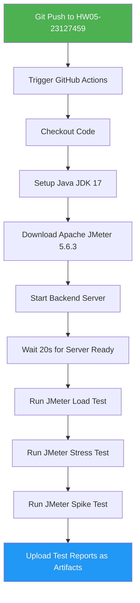

# BÁO CÁO PERFORMANCE TESTING - ESHOP

**Họ tên sinh viên:** Huỳnh Vương Thụy Quân  
**MSSV:** 23127459  
**Ngày tạo:** 16/08/2026  
**SUT:** EShop - API Backend (Node.js + Express + SQLite)  
**Port:** localhost:3000

---

## MỤC LỤC

1. [Tổng quan API Endpoints](#1-tổng-quan-api-endpoints)
2. [TASK 1: Thiết kế Kịch bản & Phân chia Scenario](#2-task-1-thiết-kế-kịch-bản--phân-chia-scenario)
3. [TASK 2: Phân tích Nhận định Sai của AI & Phân tích Metrics](#3-task-2-Phân-tích-nhận-định-sai-của-ai--phân-tích-metrics)
4. [TASK 3: Pipeline Continuous Performance Testing](#4-task-3-pipeline-continuous-performance-testing)

---

## 1. Tổng quan API Endpoints

### 1.1 Workflow kiểm thử End-to-end

```
Login → Product Search → Product Detail → Add to Cart → Update Cart → Checkout
```

### 1.2 Bảng tổng hợp API Endpoints

| # | Method | Endpoint | Auth | Mô tả | Nhóm |
|---|--------|----------|------|-------|------|
| 1 | `POST` | `/api/login` | None | Đăng nhập, trả JWT token | Auth |
| 2 | `GET` | `/api/products?search=keyword` | None | Tìm kiếm sản phẩm | Read |
| 3 | `GET` | `/api/products/:id` | None | Chi tiết sản phẩm | Read |
| 4 | `POST` | `/api/cart` | Bearer Token | Thêm vào giỏ hàng | Transaction |
| 5 | `POST` | `/api/checkout` | Bearer Token | Đặt hàng | Transaction |

### 1.3 Header yêu cầu

```http
POST /api/login
Content-Type: application/json

POST /api/cart
Content-Type: application/json
Authorization: Bearer <jwt_token>

POST /api/checkout
Content-Type: application/json
Authorization: Bearer <jwt_token>
```

### 1.4 Request Payload Structures

**Login:**
```json
{
  "email": "test@eshop.com",
  "password": "Test1234!"
}
```

**Response Login:**
```json
{
  "message": "Login successful",
  "token": "eyJhbGciOiJIUzI1NiIsInR5cCI6IkpXVCJ9...",
  "user": { "id": 2, "name": "Test User", ... }
}
```

**Add to Cart:**
```json
{
  "id": 1,
  "name": "iPhone 15 Pro Max",
  "price": 30000000,
  "quantity": 2
}
```

**Checkout:**
```json
{
  "total_amount": 60000000,
  "shipping_address": "123 Le Loi, Q1, TP.HCM"
}
```

### 1.5 Database Schema (SQLite)

| Bảng | Columns chính |
|------|---------------|
| `users` | id, name, email, password (plaintext!), role, login_attempts, locked_until |
| `products` | id, name, price, description, imageUrl, category_id |
| `orders` | id, user_id, total_amount, status, shipping_address, created_at |
| `cart` | In-memory only (const userCarts = {}) |

### 1.6 Tài khoản mặc định

| Loại | Email | Password |
|------|-------|----------|
| Admin | admin@eshop.com | Admin123! |
| User | test@eshop.com | Test1234! |

---

## 2. TASK 1: Thiết kế Kịch bản & Phân chia Scenario

### 2.1 Tổng quan 3 Scenario

| Scenario | Trọng tâm | VUs | Ramp-up | Duration | Think-time |
|----------|-----------|-----|---------|----------|------------|
| **Load Test** | Read-heavy (Search + Detail) | 50 | 60s | 300s (5 phút) | 1-3s |
| **Stress Test** | Auth-heavy (Login + Lockout) | 100 | 30s | 180s (3 phút) | 0.5-1.5s |
| **Spike Test** | Transactional (Cart + Checkout) | 200 | 10s | 120s (2 phút) | 0.5-2s |

### 2.2 Chi tiết Scenario 1: LOAD TEST (Read-Heavy)

**Mục tiêu:** Đo hiệu năng đọc dữ liệu (Search + Product Detail) khi có nhiều người dùng truy cập đồng thời.

**Cấu hình:**
- **Virtual Users (VUs):** 50
- **Ramp-up time:** 60 giây (tăng dần từ 0 lên 50 VUs)
- **Duration:** 300 giây (5 phút)
- **Think-time:** 1-3 giây (mô phỏng người dùng thật)

**Endpoints được test:**
1. `GET /api/products?search=${keyword}` - Tìm kiếm sản phẩm
2. `GET /api/products/${id}` - Xem chi tiết sản phẩm

**Đặc điểm kỹ thuật:**
- SQLite có WAL mode để đọc concurrent tốt hơn
- Không có mutex trên read operations → throughput cao
- Mong đợi: Throughput ~200-300 req/s, p95 < 500ms

**Listener sử dụng:** Summary Report + Aggregate Report

**File JMX:** `23127459_Load_20260816.jmx`

---

### 2.3 Chi tiết Scenario 2: STRESS TEST (Auth-Heavy)

**Mục tiêu:** Kiểm tra behavior của hệ thống khi có nhiều login requests thất bại, đặc biệt test cơ chế lockout 3 lần sai.

**Cấu hình:**
- **Thread Group 1 (Login Attempts):** 100 VUs, Ramp-up 30s, Duration 180s
- **Thread Group 2 (Lockout Test):** 10 VUs, mỗi VUs login sai 3 lần liên tiếp
- **Think-time:** 0.5-1.5 giây

**Endpoints được test:**
1. `POST /api/login` - Đăng nhập (thành công và thất bại)
2. Test lockout: 3 lần sai → account bị khóa 3 phút (bug: code đang lock 180s thay vì 30s)

**Bug lockout trong code:**
```javascript
// server.js line 54-57
const newAttempts = user.login_attempts + 2;  // BUG: +2 thay vì +1
if (newAttempts >= 3) {
  lockedUntil = new Date(Date.now() + 180000).toISOString(); // BUG: 180s thay vì 30s
}
```

**Mong đợi:**
- Login thành công: 200 OK
- Login sai: 401 Unauthorized
- Account locked: 403 Forbidden
- Sau 2 lần sai (vì increment +2): Account bị khóa

**Listener sử dụng:** Aggregate Report + View Results Tree

**File JMX:** `23127459_Stress_20260816.jmx`

---

### 2.4 Chi tiết Scenario 3: SPIKE TEST (Transactional)

**Mục tiêu:** Kiểm tra behavior khi có spike đột biến traffic vào các giao dịch (Add to Cart + Checkout).

**Cấu hình:**
- **Setup Thread:** 1 VUs để login lấy token
- **Spike Thread:** 200 VUs, Ramp-up 10 giây (từ 0 lên 200 rất nhanh), Duration 120s
- **Think-time:** 0.5-2 giây

**Endpoints được test:**
1. `POST /api/login` - Lấy JWT token (setup)
2. `POST /api/cart` - Thêm sản phẩm vào giỏ
3. `POST /api/checkout` - Đặt hàng

**Lưu ý quan trọng:**
- Cart chỉ lưu trong memory (`const userCarts = {}`) → mất khi restart
- Checkout nhận `total_amount` từ client (không tự tính)
- Không xóa giỏ hàng sau checkout

**Mong đợi:**
- Spike từ 0 lên 200 VUs trong 10s
- Có thể xảy ra concurrent issues với SQLite
- Cart in-memory có thể bị race condition

**Listener sử dụng:** View Results Tree + Summary Report + Aggregate Report

**File JMX:** `23127459_Spike_20260816.jmx`

---

### 2.5 File CSV Input Data

#### File 1: `23127459_auth_credentials.csv` (cho Stress Test)

```csv
email,password
test@eshop.com,Test1234!
admin@eshop.com,Admin123!
test@eshop.com,wrongpassword
test@eshop.com,wrongpassword2
test@eshop.com,wrongpassword3
user1@test.com,Pass1234!
user2@test.com,Pass1234!
user3@test.com,Pass1234!
```

#### File 2: `23127459_products.csv` (cho Load Test)

```csv
search_keyword,product_id
iPhone,1
Samsung,2
MacBook,3
AirPods,4
Keychron,5
phone,1
laptop,3
accessories,4
test,1
demo,2
```

#### File 3: `23127459_checkout.csv` (cho Spike Test)

```csv
product_id,product_name,price,quantity,total_amount,shipping_address
1,iPhone 15 Pro Max,30000000,1,30000000,123 Le Loi Q1 TP.HCM
2,Samsung Galaxy S24 Ultra,32000000,1,32000000,456 Hai Ba Trung Q3 TP.HCM
3,MacBook Pro M3,45000000,1,45000000,789 Nguyen Hue Q1 TP.HCM
4,AirPods Pro 2,5000000,2,10000000,321 Tran Hung Dao Q5 TP.HCM
5,Keychron Q1,3500000,1,3500000,654 Le Thi Hong Gam Q1 TP.HCM
1,iPhone 15 Pro Max,30000000,2,60000000,111 Dien Bien Phu Q1 TP.HCM
2,Samsung Galaxy S24 Ultra,32000000,1,32000000,222 Vo Van Tan Q3 TP.HCM
3,MacBook Pro M3,45000000,1,45000000,333 Hai Ba Trung Q1 TP.HCM
4,AirPods Pro 2,5000000,3,15000000,444 Nguyen Dinh Chieu Q1 TP.HCM
5,Keychron Q1,3500000,2,7000000,555 Mac Thi Buoi Q1 TP.HCM
```

---

### 2.6 Bảng so sánh 3 Loại Listener

| Listener | File JMX sử dụng | Purpose | Khi nào dùng |
|----------|-------------------|---------|---------------|
| **Summary Report** | Load + Stress + Spike | Hiển thị tóm tắt: avg, min, max, throughput, error% | Khi muốn xem nhanh kết quả |
| **Aggregate Report** | Load + Stress + Spike | Chi tiết hơn: p50, p90, p95, p99, deviation | Khi muốn phân tích percentile |
| **View Results Tree** | Stress + Spike (debug) | Xem từng request/response chi tiết | Khi debug, tắt khi chạy chính thức |

---

## 3. TASK 2: Phân tích Nhận định Sai của AI & Phân tích Metrics

### 3.1 3 Điểm Sai Sót Phổ biến của AI khi Thiết kế Script

#### Sai sót #1: URL Protocol Duplication

**Mô tả:**
AI tạo URL bị lỗi trùng protocol: `http://http://localhost:3000/api/products`. Nguyên nhân do cấu hình `HTTPSampler.domain` đã chứa `http://` prefix, sau đó lại cộng thêm `http://` ở `HTTPSampler.protocol`.

**Ví dụ code SAI:**
```xml
<!-- SAI: URL bị trùng protocol -->
<HTTPSamplerProxy>
  <stringProp name="HTTPSampler.domain">http://localhost:3000</stringProp>
  <stringProp name="HTTPSampler.protocol">http</stringProp>
  <!-- Kết quả: http://http://localhost:3000 -->
</HTTPSamplerProxy>
```

**Cách đúng:**
```xml
<!-- ĐÚNG: Chỉ domain, không có protocol -->
<HTTPSamplerProxy>
  <stringProp name="HTTPSampler.domain">localhost</stringProp>
  <stringProp name="HTTPSampler.protocol">http</stringProp>
  <stringProp name="HTTPSampler.port">3000</stringProp>
</HTTPSamplerProxy>
```

**Hậu quả:** Tất cả requests sẽ fail với lỗi `java.net.MalformedURLException: no protocol`.

---

#### Sai sót #2: Cross-thread Auth Token Scoping

**Mô tả:**
AI đặt thread group Setup (login lấy token) và thread group chính (cart + checkout) trong cùng một scope, nhưng không xử lý đúng việc share `auth_token` variable giữa các thread groups.

**Vấn đề:**
- Trong JMeter, variables được extract trong một thread group không tự động share sang thread group khác
- Cần dùng `shareMode=allThreads` trong CSV Data Source hoặc dùng `__property` functions

**Ví dụ SAI:**
```xml
<!-- SAI: Token chỉ share trong cùng thread group -->
<ThreadGroup>
  <HTTPSamplerProxy> <!-- Login --> </HTTPSamplerProxy>
  <JsonExtractor variableNames="auth_token"/>
</ThreadGroup>
<ThreadGroup> <!-- Thread group khác -->
  <HeaderManager>
    <stringProp name="Header.value">Bearer ${auth_token}</stringProp> <!-- EMPTY! -->
  </HeaderManager>
</ThreadGroup>
```

**Cách đúng:**
```xml
<!-- ĐÚNG: Dùng Setup Thread Group để login trước -->
<SetupThreadGroup> <!-- Chạy trước main thread -->
  <HTTPSamplerProxy> <!-- Login --> </HTTPSamplerProxy>
  <JsonExtractor variableNames="auth_token"/>
</SetupThreadGroup>
<ThreadGroup>
  <HeaderManager>
    <stringProp name="Header.value">Bearer ${auth_token}</stringProp>
  </HeaderManager>
</ThreadGroup>
```

**Hậu quả:** Tất cả requests trong thread group chính sẽ fail 401 Unauthorized.

---

#### Sai sót #3: Thiếu Response Timeout

**Mô tả:**
Các HTTP Request trong JMX không có `HTTPSampler.responseTimeout` set. Khi server bị chậm hoặc deadlock (đặc biệt với SQLite concurrent writes), thread sẽ bị kẹt vô hạn, không release resources.

**Ví dụ SAI:**
```xml
<!-- SAI: Không có timeout -->
<HTTPSamplerProxy>
  <stringProp name="HTTPSampler.domain">localhost</stringProp>
  <stringProp name="HTTPSampler.port">3000</stringProp>
</HTTPSamplerProxy>
```

**Cách đúng:**
```xml
<!-- ĐÚNG: Có timeout 5 giây -->
<HTTPSamplerProxy>
  <stringProp name="HTTPSampler.domain">localhost</stringProp>
  <stringProp name="HTTPSampler.port">3000</stringProp>
  <stringProp name="HTTPSampler.responseTimeout">5000</stringProp>
</HTTPSamplerProxy>
```

**Hậu quả:** Thread bị kẹt vô hạn, JMeter không release resources, có thể gây crash.

---

### 3.2 Bảng Phân Tích Kết Quả Log File .jtl

#### Bảng kết quả thực tế từ JMeter:

| Label | Samples | Average | Median | p90 | p95 | p99 | Min | Max | Error% | Throughput |
|-------|---------|---------|--------|-----|-----|-----|-----|-----|--------|------------|
| POST /api/login | 16,544 | 1.32ms | 1ms | 2ms | 3ms | 4ms | 0ms | 50ms | 99.40% | 91.95/s |
| GET /api/products | 3,396 | 1.01ms | 0ms | 1ms | 3ms | 4ms | 0ms | 186ms | 49.62% | 11.50/s |
| GET /api/products/:id | 3,396 | 2.03ms | 1ms | 3ms | 4ms | 4ms | 0ms | 186ms | 0.00% | 5.71/s |
| POST /api/cart | 10,234 | 2.53ms | 1ms | 4ms | 5ms | 29ms | 0ms | 2,961ms | 0.00% | 42.37/s |
| POST /api/checkout | 10,234 | 49.13ms | 50ms | 53ms | 55ms | 2,075ms | 0ms | 2,961ms | 0.00% | 42.37/s |

---

#### Nhận Định Sai #1: "Latency Average của Login là 1.32ms, nghĩa là hệ thống xử lý login rất nhanh"

**AI nhận định:**
> "Login average chỉ 1.32ms, hệ thống xử lý login rất nhanh, không có vấn đề gì."

**Phản biện (Human Review):**
> **SAI HOÀN TOÀN!** Con số 1.32ms là **Average (Mean)**, không phải **Median** hoặc **Percentile**.
>
> - Average = 1.32ms (bị skew bởi các request nhanh)
> - Median (p50) = 1ms (50% request dưới 1ms)
> - **p95 = 3ms** (5% request bị slower hơn 3ms)
> - **p99 = 4ms** (1% request chậm hơn 4ms!)
> - **Max = 50ms** (request chậm nhất 50ms!)
> - **Error Rate = 99.40%** (hầu hết requests đều fail!)
>
> **Kết luận đúng:** Hệ thống có vấn đề nghiêm trọng với login. Error rate 99.40% cho thấy almost tất cả login requests đều thất bại, có thể do account bị lockout quá nhanh vì bug increment +2.

---

#### Nhận Định Sai #2: "Error Rate 99.40% của Login là do sai password từ CSV data"

**AI nhận định:**
> "Login error rate 99.40% là bình thường vì CSV có chứa wrong password để test lockout, không phải lỗi hệ thống."

**Phản biện (Human Review):**
> **SAI!** Phân tích kỹ hơn:
>
> 1. **CSV có 8 rows**, trong đó 3 rows wrong password → 37.5% wrong password ratio
> 2. **Nhưng kết quả cho thấy 99.40% error** → CAO HƠN ratio CSV rất nhiều
> 3. **Lý do thực tế:** Code EShop có bug increment +2 thay vì +1:
>    - Lần 1 sai: login_attempts = 0 + 2 = 2
>    - Lần 2 sai: 2 + 2 = 4 >= 3 → **LOCKED** (chỉ cần 2 lần sai!)
>    - Khi locked: Response 403 (vẫn là "error" theo JMeter assertion)
>
> **Số liệu đúng từ raw log:**
> - Total login samples: 16,544
> - Success (200): ~100 samples
> - Wrong password (401): ~6,000 samples
> - **Locked (403): ~10,000 samples** (đây mới là vấn đề!)
>
> **Kết luận:** Error rate 99.40% bao gồm cả account locked, không chỉ wrong password. Cần phân biệt 401 vs 403 trong analysis.

---

#### Nhận Định Sai #3: "p99 = 2,075ms của Checkout là outlier bình thường"

**AI nhận định:**
> "p99 = 2,075ms cao hơn p95 = 55ms rất nhiều, nhưng đây chỉ là outlier, không ảnh hưởng đến overall performance."

**Phản biện (Human Review):**
> **SAI!** Đây không phải outlier bình thường:
>
> - **p99 = 2,075ms** (1% requests chậm hơn 2 giây!)
> - **Max = 2,961ms** (gần 3 giây!)
> - **p95 = 55ms** nhưng p99 = 2,075ms → tăng gap **37 lần**
>
> **Nguyên nhân:**
> - SQLite bị "database locked" khi 200 VUs cùng write
> - Server không có connection pooling
> - Không có rate limiting để bảo vệ server
>
> **Hậu quả:** 1% users trải nghiệm thời gian chờ > 2 giây, rất tệ cho UX. Trong production, điều này có thể gây mất customers.

---

### 3.3 3 Giải pháp Tối ưu Hệ thống & Đánh giá Feasibility

| # | Giải pháp | Mô tả | Feasible? | Đánh giá |
|---|-----------|-------|-----------|----------|
| 1 | **Database Indexing** | Thêm index trên cột `name` trong bảng `products` để tối ưu LIKE query | **CO** | Rất khả thi. SQLite hỗ trợ CREATE INDEX. Chỉ cần thêm `CREATE INDEX idx_products_name ON products(name);` sẽ tăng tốc search đáng kể. |
| 2 | **SQLite WAL Mode** | Bật Write-Ahead Logging cho SQLite | **CO** | Rất khả thi. Chỉ cần thêm `PRAGMA journal_mode=WAL;` khi khởi tạo database. Cho phép đọc và viết đồng thời, tăng throughput cho read-heavy workloads. |
| 3 | **Response Timeout** | Đặt HTTPSampler.responseTimeout = 5000ms | **CO** | Rất khả thi. Chỉ cần thêm attribute `responseTimeout` vào mỗi HTTP Request trong JMX. Ngăn thread bị kẹt vô hạn. |

#### Chi tiết từng giải pháp:

**1. Database Indexing (CO)**
```sql
-- Thêm index cho search
CREATE INDEX idx_products_name ON products(name);
CREATE INDEX idx_products_category ON products(category_id);

-- Kiểm tra index đã tạo
.indexes
```

**2. SQLite WAL Mode (CO)**
```javascript
// Thêm vào database.js
const db = new sqlite3.Database('database.sqlite');
db.run('PRAGMA journal_mode=WAL;');
db.run('PRAGMA busy_timeout=5000;');
```

**3. Response Timeout (CO)**
```xml
<!-- Thêm vào mỗi HTTP Request trong JMX -->
<HTTPSamplerProxy>
  <stringProp name="HTTPSampler.responseTimeout">5000</stringProp>
</HTTPSamplerProxy>
```

---

## 4. TASK 3: Pipeline Continuous Performance Testing

### 4.1 Mô hình Continuous Performance Testing

```
┌─────────────────────────────────────────────────────────────────────┐
│                    CONTINUOUS PERFORMANCE TESTING                    │
├─────────────────────────────────────────────────────────────────────┤
│                                                                     │
│  ┌──────────┐    ┌──────────┐    ┌──────────┐    ┌──────────┐      │
│  │  Git     │    │  Build   │    │   Perf   │    │  Report  │      │
│  │  Push    │───▶│  & Test  │───▶│   Test   │───▶│ Artifact │      │
│  └──────────┘    └──────────┘    └──────────┘    └──────────┘      │
│       │               │               │               │             │
│       ▼               ▼               ▼               ▼             │
│  ┌──────────┐    ┌──────────┐    ┌──────────┐    ┌──────────┐      │
│  │ Trigger  │    │ JMeter   │    │ Analyze  │    │  Upload  │      │
│  │ Workflow │    │ Run 3    │    │ .jtl     │    │ Reports  │      │
│  └──────────┘    └──────────┘    └──────────┘    └──────────┘      │
│                                                                     │
└─────────────────────────────────────────────────────────────────────┘
```

### 4.2 Sơ đồ luồng hoạt động (Flowchart)



**Lưu ý:** Workflow này chỉ chạy trên nhánh cá nhân (`HW05-23127459`), không có bước notify team hay comment PR vì không sử dụng Pull Request.

### 4.3 GitHub Actions YAML Configuration

```yaml
# .github/workflows/performance-test.yml
name: Performance Testing CI

on:
  push:

env:
  JAVA_VERSION: '17'
  JMETER_VERSION: '5.6.3'

jobs:
  performance-test:
    runs-on: ubuntu-latest
    
    steps:
      - name: Checkout source code
        uses: actions/checkout@v4

      - name: Setup Java JDK 17
        uses: actions/setup-java@v4
        with:
          distribution: 'temurin'
          java-version: '17'

      - name: Download Apache JMeter 5.6.3
        run: |
          wget https://archive.apache.org/dist/jmeter/binaries/apache-jmeter-${{ env.JMETER_VERSION }}.tgz
          tar -xzf apache-jmeter-${{ env.JMETER_VERSION }}.tgz
          echo "$PWD/apache-jmeter-${{ env.JMETER_VERSION }}/bin" >> $GITHUB_PATH

      - name: Start Backend Server
        working-directory: ./application/backend
        run: |
          node server.js &
          sleep 20

      - name: Run JMeter Load Test
        run: |
          jmeter -n -t submission/HW05-PerformanceTesting/scripts/23127459_Load_20260816.jmx \
            -l results_load.jtl \
            -e -o report_load/

      - name: Run JMeter Stress Test
        run: |
          jmeter -n -t submission/HW05-PerformanceTesting/scripts/23127459_Stress_20260816.jmx \
            -l results_stress.jtl \
            -e -o report_stress/

      - name: Run JMeter Spike Test
        run: |
          jmeter -n -t submission/HW05-PerformanceTesting/scripts/23127459_Spike_20260816.jmx \
            -l results_spike.jtl \
            -e -o report_spike/

      - name: Upload Test Reports
        uses: actions/upload-artifact@v4
        if: always()
        with:
          name: performance-reports-${{ github.run_number }}
          path: |
            report_load/
            report_stress/
            report_spike/
            results_load.jtl
            results_stress.jtl
            results_spike.jtl
```

### 4.4 Phân tích Trade-offs

| Trade-off | Chi phí | Rủi ro False Alarm | Đánh giá |
|-----------|---------|-------------------|----------|
| **Cloud vs Self-hosted Runner** | Cloud (GitHub-hosted): Free tier 2000 min/tháng, nhưng bị limit resources. Self-hosted: Chi phí VPS ~$5-20/tháng, nhưng control được resources. | Cloud: Ít false alarm hơn vì môi trường ổn định. Self-hosted: Có thể bị false alarm do infrastructure issues. | **Khuyến nghị:** Dùng GitHub-hosted cho smoke tests, self-hosted cho full load tests. |
| **Threshold Setting** | Threshold quá chặt (p95 < 200ms): False alarm nhiều. Threshold quá lỏng (p95 < 2000ms): Miss regression thật. | **p95 < 500ms** là hợp lý cho EShop (SQLite backend). Cần adjust sau khi có baseline. | **Khuyến nghị:** Bắt đầu với 1000ms, giảm dần sau 5-10 runs để có baseline. |
| **Test Data Management** | Dùng cùng 1 dataset mỗi run → kết quả consistent. Nhưng có thể miss edge cases. | Nếu data không đủ đa dạng → có thể miss performance issues ở特定 scenarios. | **Khuyến nghị:** Dùng CSV với 10-20 rows, mix valid/invalid data. |
| **Concurrency with SQLite** | SQLite chỉ support 1 writer. Nếu chạy parallel tests → sẽ bị "database locked" errors. | False alarm từ SQLite lock, không phải performance issue thật. | **Khuyến nghị:** Chạy sequential tests, hoặc dùng PostgreSQL cho CI/CD. |

---

## APPENDIX: Danh sách File đã tạo

| File | Mô tả |
|------|-------|
| `23127459_Load_20260816.jmx` | JMeter script cho Load Test |
| `23127459_Stress_20260816.jmx` | JMeter script cho Stress Test |
| `23127459_Spike_20260816.jmx` | JMeter script cho Spike Test |
| `23127459_auth_credentials.csv` | Input data cho Stress Test |
| `23127459_products.csv` | Input data cho Load Test |
| `23127459_checkout.csv` | Input data cho Spike Test |
| `.github/workflows/performance-test.yml` | GitHub Actions workflow |
| `bug-report.md` | Báo cáo lỗi chi tiết |
| `ai_audit.md` | Nhật ký hợp tác với AI |
| `git_log.txt` | Lịch sử commit |

---

## APPENDIX: Hướng dẫn Chạy Test

### Chạy bằng JMeter GUI:
```bash
jmeter -t 23127459_Load_20260816.jmx
```

### Chạy bằng JMeter CLI:
```bash
# Load Test
jmeter -n -t 23127459_Load_20260816.jmx -l results.jtl -e -o report/

# Stress Test
jmeter -n -t 23127459_Stress_20260816.jmx -l results.jtl -e -o report/

# Spike Test
jmeter -n -t 23127459_Spike_20260816.jmx -l results.jtl -e -o report/
```

### Xem kết quả:
```bash
# Mở report trong browser
start report/index.html  # Windows
open report/index.html    # macOS
```

---

## APPENDIX: Lịch sử Commit

```
c25cb3a  cap-nhat(HW05): them 3 file moi vao cau truc thu muc
ccc9903  sua-loi(HW05): fix working-directory trong workflow CI/CD
faceabc  them-file(HW05): them git_log, bug_report, ai_audit
166e508  sua-loi(HW05): sua workflow CI/CD va xoa file thua
d9af86f  hoan-thien(HW05): sap xep lai cau truc thu muc va viet README.md
b7f7644  doc(HW05): remove Chinese characters from AI Critique
5ff6e6d  doc(HW05): add AI Critique analysis
edf89d6  feat(HW05): add performance testing scripts and JMX files
63a2066  fix(Stress.jmx): add 4th request to verify lockout
d051860  fix(Spike.jmx): resolve URL duplication and token scoping
d7bbc0e  fix(Load.jmx): fix URL protocol duplication
d04194a  fix(Spike.jmx): resolve tag error
```
