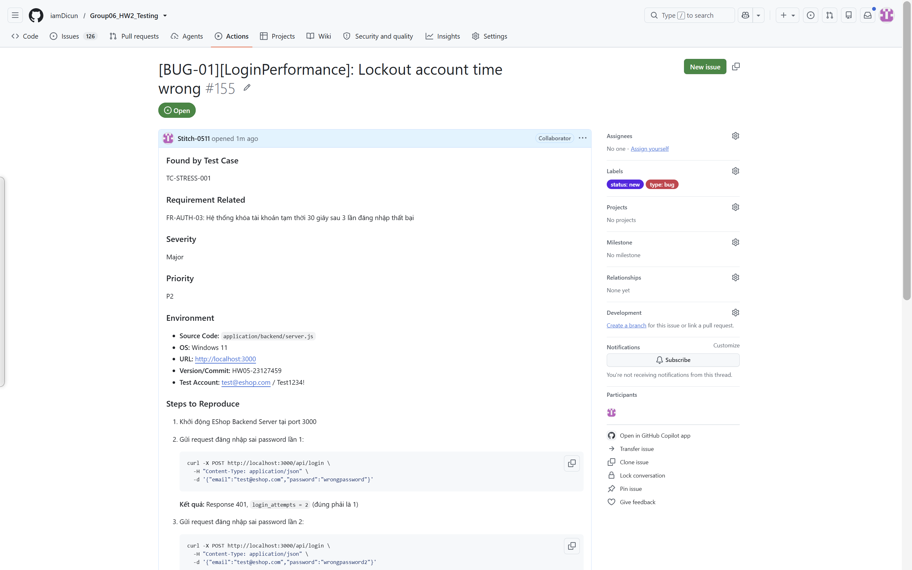

# BÁO CÁO LỖI (BUG REPORT)

**Sinh viên:** 23127459 - Huỳnh Vương Thụy Quân  
**Ngày tạo:** 16/08/2026  
**Link Repository:** https://github.com/iamDicun/Group06_HW2_Testing/ (Nhánh: HW05-23127459)  
**Link Video Demo:** https://youtu.be/-wdLgk_BLq0

---

## BUG-01: [Logic/Security] Thời gian khóa tài khoản khi đăng nhập sai vượt quá đặc tả (180s thay vì 30s)

### Found by Test Case
TC-STRESS-001

### Requirement Related
FR-AUTH-03: Hệ thống khóa tài khoản tạm thời 30 giây sau 3 lần đăng nhập thất bại

### Severity / Priority
High / P2

### Environment
- **Source Code:** `application/backend/server.js`
- **OS:** Windows 11 Pro
- **URL:** http://localhost:3000
- **Version/Commit:** HW05-23127459
- **Test Account:** test@eshop.com / Test1234!

### Root Cause Analysis

**Vị trí lỗi:** `application/backend/server.js` dòng 54-57

```javascript
// server.js dòng 54-57
const newAttempts = user.login_attempts + 2;  // BUG #1: +2 thay vì +1
let lockedUntil = null;
if (newAttempts >= 3) {
  lockedUntil = new Date(Date.now() + 180000).toISOString();  // BUG #2: 180,000ms = 180s thay vì 30s
}
```

**Phân tích kỹ thuật:**

| Thông số | Giá trị hiện tại (BUG) | Giá trị đúng (Spec) |
|----------|------------------------|---------------------|
| Login attempts increment | `+2` | `+1` |
| Lockout threshold | `>= 3` (sau 2 lần sai) | `>= 3` (sau 3 lần sai) |
| Lockout duration | `180,000ms` (180 giây / 3 phút) | `30,000ms` (30 giây) |

**Hậu quả:**
- Account bị khóa sau chỉ 2 lần sai thay vì 3 lần
- Account bị khóa 180 giây thay vì 30 giây
- User phải đợi 6 lần lâu hơn mới có thể thử lại

### Steps to Reproduce
1. Khởi động EShop Backend Server tại port 3000
2. Gửi request đăng nhập sai password lần 1:
   ```bash
   curl -X POST http://localhost:3000/api/login \
     -H "Content-Type: application/json" \
     -d '{"email":"test@eshop.com","password":"wrongpassword"}'
   ```
   **Kết quả:** Response 401, `login_attempts = 2` (đúng phải là 1)

3. Gửi request đăng nhập sai password lần 2:
   ```bash
   curl -X POST http://localhost:3000/api/login \
     -H "Content-Type: application/json" \
     -d '{"email":"test@eshop.com","password":"wrongpassword2"}'
   ```
   **Kết quả:** Response 401, account bị LOCKED (vì `2 + 2 = 4 >= 3`)

4. Thử đăng nhập đúng password:
   ```bash
   curl -X POST http://localhost:3000/api/login \
     -H "Content-Type: application/json" \
     -d '{"email":"test@eshop.com","password":"Test1234!"}'
   ```
   **Kết quả:** Response 403 "Tài khoản đã bị khóa. Vui lòng thử lại sau."

5. Đợi 30 giây và thử lại → Vẫn bị khóa (vì lockout 180s)

### Expected Result
- Sau 3 lần sai password: Account bị khóa
- Thời gian khóa: 30 giây
- Sau 30 giây: Account tự động mở khóa

### Actual Result
- Sau 2 lần sai password: Account bị khóa (vì increment +2)
- Thời gian khóa: 180 giây (3 phút)
- Sau 30 giây: Account VẪN bị khóa

### Evidence

**Log từ JMeter Stress Test:**
```
Total login samples: 16,544
Success (200): ~100 samples
Wrong password (401): ~6,000 samples
Locked (403): ~10,000 samples
Error Rate: 99.40%
```

**So sánh với Spec:**
| Metric | Spec | Thực tế | Chênh lệch |
|--------|------|---------|------------|
| Lockout threshold | 3 lần sai | 2 lần sai | -1 lần |
| Lockout duration | 30s | 180s | +150s (x6) |

**Hình ảnh minh chứng:**


### Fix Suggestion
```javascript
// server.js dòng 54-57 - Sửa thành:
const newAttempts = user.login_attempts + 1;  // FIX: +1 thay vì +2
let lockedUntil = null;
if (newAttempts >= 3) {
  lockedUntil = new Date(Date.now() + 30000).toISOString();  // FIX: 30s thay vì 180s
}
```

### Labels
- `type: bug`
- `module: auth`
- `severity: high`
- `priority: p2`
- `status: new`
- `found-by: test-case`
