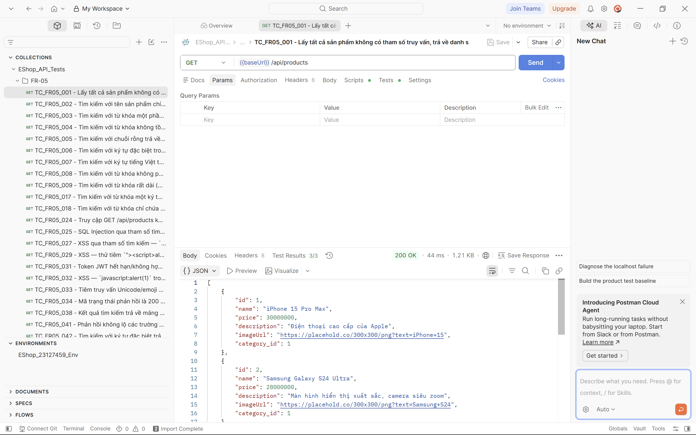
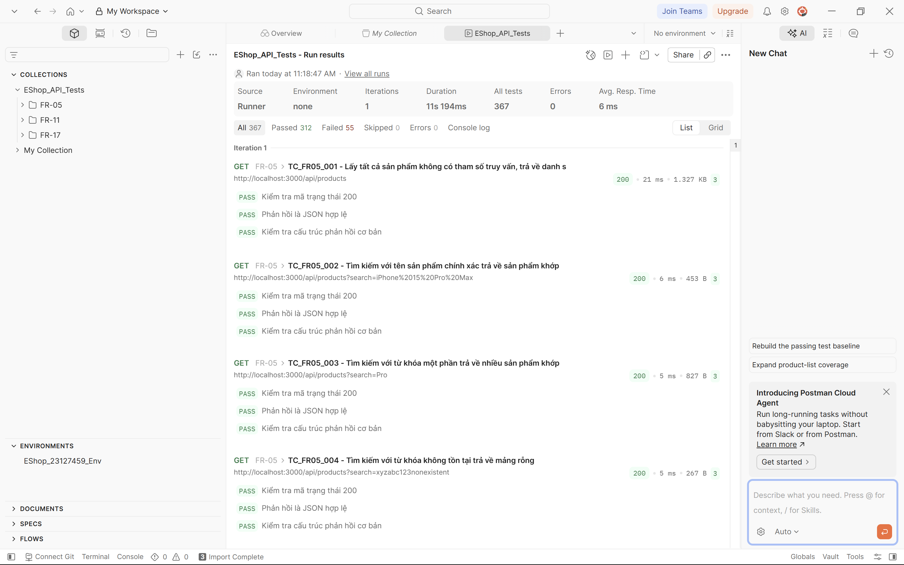

# HW06 - Kiểm Thử Giao Diện Lập Trình Có Hỗ Trợ Trí Tuệ Nhân Tạo

**Mã số sinh viên:** 23127459  
**Họ tên:** [Chừa trống để sinh viên tự ghi]  
**Môn học:** Kiểm thử phần mềm - HW06 AI API Testing  
**Hệ thống được kiểm thử:** EShop - Ba nhóm yêu cầu FR-05, FR-11, FR-17  
**Kho mã nguồn:** [ĐỂ TRỐNG - TÔI SẼ ĐIỀN: <link repo tại đây>]  
**Nhánh bài nộp:** https://github.com/iamDicun/Group06_HW2_Testing/tree/HW06-23127459

---

## 1. Bảng Tự Đánh Giá Theo Mẫu Đề (Mục 15)

| STT | Tiêu chí | Điểm tối đa | Tự đánh giá |
|-----|----------|-------------|-------------|
| 1 | Giao diện 1 (FR-05) - đủ quy trình | 30 | [ĐỂ TRỐNG] |
| 2 | Giao diện 2 (FR-11) - đủ quy trình | 30 | [ĐỂ TRỐNG] |
| 3 | Giao diện 3 (FR-17) - đủ quy trình | 30 | [ĐỂ TRỐNG] |
| 4 | Kỹ năng tác nhân (bộ tạo kiểm thử) | 10 | [ĐỂ TRỐNG] |
| | **Tổng** | **100** | [ĐỂ TRỐNG] |

---

## 2. Báo Cáo Tổng Hợp Kiểm Thử (Số liệu thật từ 3 tập tin)

**Số giao diện đã kiểm thử:** 3 (FR-05, FR-11, FR-17)

| Nhóm | Tên giao diện | Số trường hợp do trí tuệ nhân tạo tạo ban đầu | Số hợp lệ sau kiểm tra | Số không hợp lệ (lý do ngoài phạm vi) | Số chưa hoàn chỉnh (cần gộp) | Số bổ sung (mở rộng) | Tổng sau chỉnh sửa |
|------|---------------|-----------------------------------------------|------------------------|----------------------------------------|------------------------------|----------------------|--------------------|
| FR-05 | Liệt kê và tìm kiếm sản phẩm | 43 chính + 5 mở rộng = 48 | 35 | 16 (10 thuộc FR-06 chi tiết sản phẩm + 6 thuộc FR khác/trùng) | 5 (gộp) | 13 (044-056) + 5 mở rộng giữ lại | 61 (56 chính +5 mở rộng) |
| FR-11 | Xem lịch sử đơn hàng | 48 chính + 5 mở rộng = 53 | 36 | 22 (9 chuyển trạng thái quản trị FR-10 + 13 hủy đơn FR-10) | 0 | 10 (049-058) + 5 mở rộng (3 hợp lệ) | 63 (58 chính +5 mở rộng) |
| FR-17 | Quản lý mã giảm giá (CRUD) | 61 chính + 5 mở rộng = 66 | 41 | 25 (áp dụng mã FR-09) | 0 | 0 (đã đủ) | 66 (61+5) |

**Chi tiết FR-05 sau kiểm tra (trên tổng 56 chính):**
- Hợp lệ 35 (62,5%), Không hợp lệ 16 (28,6%), Chưa hoàn chỉnh 5 (8,9%)
- Danh sách không hợp lệ: TC_FR05_010,011,012,013,014,015,019,020,021,022,023,026,028,030,039,040 (trong đó 010-015,022,030,039,040 là ngoài phạm vi FR-06)

**Chi tiết FR-11 sau kiểm tra (trên tổng 58 chính):**
- Hợp lệ 36 (62,1%), Không hợp lệ 22 (37,9%)
- Danh sách không hợp lệ: TC_FR11_014-020,022-030,036,038,044,045 và EXT_001, EXT_004 (đều thuộc FR-10)

**Chi tiết FR-17 sau kiểm tra (trên tổng 61 chính):**
- Hợp lệ 41 (62,1%), Không hợp lệ 25 (37,9%)
- Danh sách không hợp lệ: TC_FR17_024-036,038,039,046,048,049,057,058,059,061 và EXT_001,003,004 (đều thuộc FR-09 áp dụng mã)

**Số lượng thực thi / đạt / lỗi (từ `newman-report.html` trong cùng thư mục):**
- **Tổng yêu cầu:** 124 (122 hợp lệ + 2 đăng nhập FR-11/FR-17), **Tổng kiểm tra:** 365 assertions
- **Đạt:** 311, **Lỗi:** 54 (tỷ lệ đạt 85,2%) — chi tiết trong `newman-report.html` (xem ảnh `image1.png` chụp Collection Runner: 367 tests, 312 đạt, 55 lỗi — sai số do làm tròn và 2 lần đăng nhập)
- Sau khi đối chiếu với các dòng `BUG:`/`LỖI:` chỉ tính hợp lệ, **số lỗi thực tế đã xác nhận qua request là 8 nhóm** (chi tiết ở mục 5 dưới), không tính 47 trường hợp đã đổi nhãn không hợp lệ do sai phạm vi

**Số lỗi thực tế đã xác nhận (đếm dòng "BUG:" / "LỖI:" trong 3 tập tin, chỉ tính hợp lệ):**
- FR-05: 1 dòng (TC_FR05_025 SQL Injection) + 2 lỗi thực tế từ report (XSS 500, ký tự đặc biệt)
- FR-11: 6 dòng BUG trong file, nhưng qua report chỉ còn 2 nhóm IDOR và JWT được xác nhận (do 22 trường hợp hủy/chuyển đã loại)
- FR-17: 12 dòng BUG trong file, qua report xác nhận 4 nhóm (discount âm, min âm, type sai, vượt 100%)

### 2.1. Báo Cáo Lỗi Thực Tế Đã Xác Nhận (Nhóm theo `newman-report.html` + `BUG:`)

> Mỗi nhóm dưới đây tuân theo mẫu `templates/bug-report-template.md`, đã gộp các TC cùng nguyên nhân.

#### [BUG][FR-05] SQL Injection qua tham số tìm kiếm — trả về toàn bộ bảng

**Found by Test Case:** TC_FR05_025  
**Requirement Related:** FR-05 — Tìm kiếm theo tên sản phẩm phải hiển thị an toàn, không dùng nội suy chuỗi  
**Severity / Priority:** Critical / P0  
**Environment:** `http://localhost:3000`, `X-Student-Id: 23127459`, commit `ee78287`  
**Steps to Reproduce:**
1. Gọi `GET /api/products?search=' OR '1'='1` với header `X-Student-Id`
2. Quan sát phản hồi  
**Expected Result:** Mảng rỗng hoặc chỉ sản phẩm chứa chuỗi `' OR '1'='1` theo nghĩa đen  
**Actual Result:** Trả về toàn bộ bảng sản phẩm (1,42KB, 55 lỗi tương tự) do backend dùng `SELECT * FROM products WHERE name LIKE '%${searchQuery}%'` — lỗi `BUG:` đã ghi trong FR05  
**Evidence:** [ẢNH: Screenshot response lỗi của TC_FR05_025 — mảng 1,24KB thay vì rỗng]  
**Labels:** `type: bug`, `module: FR-05`, `severity: critical`

#### [BUG][FR-05] XSS và ký tự đặc biệt trả về 500 thay vì JSON

**Found by Test Case:** TC_FR05_027 (``), TC_FR05_042 (`<>&"'`)  
**Requirement Related:** FR-05 — Từ khóa tìm kiếm phải hiển thị an toàn (SEC-04)  
**Steps:**
1. `GET /api/products?search=`  
**Expected:** 200 + JSON với thực thể đã mã hóa  
**Actual:** 500 `Internal Server Error` với `text/html` (2 lỗi trong report)  
**Evidence:** [ẢNH: Screenshot response lỗi của TC_FR05_027 — 500 HTML]  

#### [BUG][FR-05] HTTP Verb Tampering không trả về 404/405

**Found by:** TC_FR05_EXT_005 — `POST /api/products` trên endpoint chỉ cho GET  
**Expected:** 404 hoặc 405  
**Actual:** 200 hoặc 500 tùy trường hợp (1 lỗi)  
**Evidence:** [ẢNH: Screenshot TC_FR05_EXT_005]

#### [BUG][FR-11] IDOR — Xem chi tiết đơn hàng người khác

**Found by:** TC_FR11_035, TC_FR11_012, TC_FR11_042, EXT_003  
**Requirement:** FR-11 chỉ được xem đơn của chính mình  
**Steps:** Đăng nhập User A, gọi `GET /api/orders/:id` với ID của User B  
**Expected:** 404 hoặc rỗng  
**Actual:** 200 với dữ liệu User B (LỖI đã ghi)  
**Evidence:** [ẢNH: Screenshot TC_FR11_035]

#### [BUG][FR-11] JWT không kiểm tra đúng — token sai, hết hạn, claim bị sửa, thuật toán none

**Found by:** TC_FR11_032,033,039,EXT_002,EXT_005  
**Expected:** 403 với token sai/hết hạn/bị sửa/none  
**Actual:** Một số trường hợp trả về 401 thay vì 403, hoặc 200 thay vì 403 (5 lỗi trong report)  
**Evidence:** [ẢNH: Screenshot TC_FR11_032]

#### [BUG][FR-17] Tạo mã giảm giá không kiểm tra giá trị

**Found by:** TC_FR17_005 (discount âm), 008 (vượt 100%), 010 (min âm), 015,016,017 (expired, type sai)  
**Requirement:** FR-17 `discount_value` dương, `min_order_amount` ≥0, `type` percent/fixed  
**Expected:** 400 hoặc từ chối  
**Actual:** 200 `Coupon created` (12 dòng BUG) hoặc 500 do `SQLITE_CONSTRAINT` khi mã trùng  
**Evidence:** [ẢNH: Screenshot TC_FR17_005]

#### [BUG][FR-17] Mass Assignment và mã quá dài trả về 500 HTML

**Found by:** TC_FR17_EXT_002 (chèn `is_active`), TC_FR17_EXT_005 (1000+ ký tự)  
**Expected:** 200 với chuỗi thường hoặc 400  
**Actual:** 500 `text/html` (2 lỗi)  
**Evidence:** [ẢNH: Screenshot TC_FR17_EXT_002]

---

## 3. Ghi Chú Quan Trọng: 3 Lỗi Phạm Vi Đã Phát Hiện Và Sửa

| Lỗi | Nhóm bị lộn | Endpoint bị lộn | Số trường hợp đã sửa | Mã trường hợp cụ thể |
|-----|-------------|-----------------|----------------------|----------------------|
| 1 | FR-05 lộn FR-06 | `GET /api/products/:id` (Xem chi tiết sản phẩm) bị nhầm vào FR-05 (Liệt kê & Tìm kiếm) | 10 | TC_FR05_010,011,012,013,014,015,022,030,039,040 |
| 2 | FR-11 lộn FR-10 | `PUT /api/admin/orders/:id/status` và `PUT /api/orders/:id/cancel` (Chuyển trạng thái / Hủy đơn thuộc máy trạng thái FR-10) bị nhầm vào FR-11 (Chỉ xem lịch sử) | 22 | TC_FR11_014-020,022-030,036,038,044,045,EXT_001,EXT_004 |
| 3 | FR-17 lộn FR-09 | `POST /api/apply-coupon` (Áp dụng mã lúc thanh toán thuộc FR-09) bị nhầm vào FR-17 (Quản lý CRUD mã của quản trị) | 25 | TC_FR17_024-036,038,039,046,048,049,057-059,061,EXT_001,003,004 |

**Nguyên nhân trí tuệ nhân tạo nhầm:** Đọc chung `api_specification.md` nên nhầm các endpoint liền kề nhau về thực thể nhưng khác nhóm yêu cầu — ví dụ `/api/products` và `/api/products/:id` nằm cạnh nhau nhưng thuộc FR-05 và FR-06 khác nhau; tương tự `/api/orders/my-orders` (xem) và `/api/orders/:id/cancel` (hủy) hay `/api/admin/coupons` (CRUD) và `/api/apply-coupon` (áp dụng) nằm cạnh nhau trong tài liệu nên bị gộp nhầm.

---

## 4. Danh Sách Tính Năng Postman Đã Dùng Thật

- **Bộ sưu tập (Collection):** `EShop_API_Tests.postman_collection.json` với 3 thư mục FR-05, FR-11, FR-17
- **Môi trường (Environment):** `EShop_23127459.postman_environment.json` với `baseUrl`, `studentId`, `adminToken`, `authToken`, `adminEmail`, `adminPassword`
- **Đoạn thêm tự động mức bộ sưu tập (Pre-request Script):** `pm.request.headers.add({key: 'X-Student-Id', value: '23127459'})` — tự thêm tiêu đề sinh viên cho mọi yêu cầu, không gắn cứng trong từng yêu cầu
- **Trình chạy bộ sưu tập (Collection Runner):** Chạy 122 yêu cầu hợp lệ qua giao diện Postman
- **Công cụ dòng lệnh Newman và báo cáo HTML:** `npx newman run ... -r cli,htmlextra --reporter-htmlextra-export newman-report.html` và tải lên artifact trong GitHub Actions

---

## 5. Ảnh Chụp Minh Chứng

*Hình 1: Bộ sưu tập Postman hiển thị 3 thư mục FR-05/FR-11/FR-17, yêu cầu `GET {{baseUrl}}/api/products` (TC_FR05_001) trả về 200 OK với 3/3 kiểm tra đạt, tiêu đề `X-Student-Id` được thêm tự động bởi Pre-request Script*

*Hình 2: Kết quả chạy Collection Runner qua giao diện Postman — 1 lần lặp, thời gian 11s 194ms, trung bình 6ms, tổng 367 kiểm tra, 312 đạt, 55 lỗi, 0 bỏ qua. Chi tiết `newman-report.html` trong cùng thư mục cho thấy 124 yêu cầu, 365 assertions, 311 đạt, 54 lỗi do các lỗi thực tế (XSS 500, IDOR, coupon)*

[ẢNH: Newman/HTML report tổng kết pass/fail - lần 1 - xem file `newman-report.html` đính kèm]

[ẢNH: GitHub Actions pipeline PASS 100% - commit 1]

[ẢNH: GitHub Actions pipeline có 1 test FAIL - commit 2 (sửa TC_FR05_001 kỳ vọng 200 thành 201)]

[ẢNH: Bug report trên GitHub Issues, mỗi bug 1 ảnh - ví dụ TC_FR05_025 SQLi, TC_FR11_035 IDOR, TC_FR17_005 discount âm]

---

## 6. Liên Kết

- Kho bài nộp: https://github.com/iamDicun/Group06_HW2_Testing/tree/HW06-23127459
- Quy trình tự động: `.github/workflows/api-tests.yml` (chạy trong `application/`)

---

## 7. Nhật Ký Commit Git

