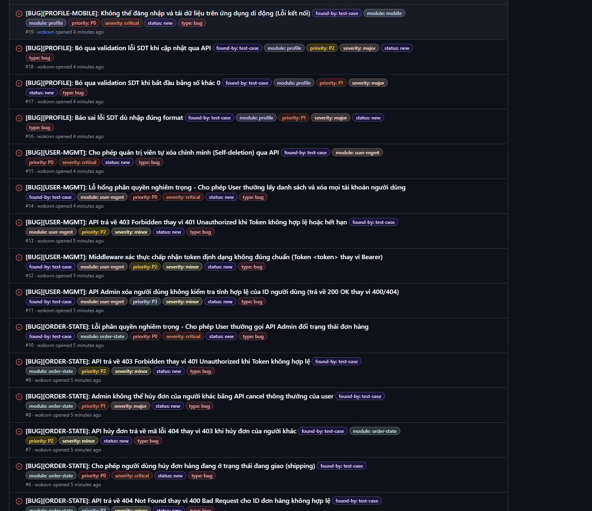

# BÁO CÁO BÀI TẬP VỀ NHÀ HW02: DOMAIN TESTING & BOUNDARY VALUE ANALYSIS

**Môn học:** Kiểm thử phần mềm  
**Hệ thống kiểm thử (SUT):** [EShop](https://github.com/ttbhanh/eshop-sut)  
**Nhóm:** 06  
**Họ và tên:** Nguyễn Anh Khoa  
**MSSV:** 23127391  

---

## TỔNG QUAN PHẠM VI KIỂM THỬ
Báo cáo này trình bày chi tiết việc áp dụng hai kỹ thuật thiết kế blackbox testing: **Phân hoạch tương đương (EP)** và **Phân tích giá trị biên (BVA)** để thiết kế kịch bản kiểm thử cho 4 phân hệ chức năng được giao bao gồm:
1. **FR-04: Quản lý hồ sơ cá nhân (Web/API)**
2. **FR-10: Trạng thái Đơn hàng (Order State Machine)**
3. **FR-19: Quản lý Người dùng (Admin User Management)**
4. **Mobile App: Quản lý hồ sơ cá nhân (FR-04 trên Mobile)**

---

## YÊU CẦU 1: DOMAIN TESTING

### 1.1 Khái quát Phương pháp & Quy trình áp dụng với AI
Kỹ thuật Phân hoạch tương đương (EP) được áp dụng nhằm chia miền giá trị đầu vào của các biến thành các phân hoạch tương đương. Các giá trị trong cùng một phân hoạch được giả định là có hành vi xử lý giống nhau bởi hệ thống. Do đó, ta chỉ cần chọn một giá trị đại diện từ mỗi phân hoạch để thiết kế ca kiểm thử, giúp tối ưu hóa số lượng test case mà vẫn đảm bảo độ bao phủ.
* **Quy trình thực hiện cùng AI:**
  1. AI hỗ trợ đọc tài liệu đặc tả yêu cầu (SRS) và đặc tả API để xác định danh sách các biến/tham số đầu vào.
  2. Xác định các phân hoạch hợp lệ (Valid Partitions) - nơi hệ thống xử lý thành công.
  3. Xác định các phân hoạch không hợp lệ (Invalid Partitions) - nơi hệ thống phát hiện lỗi và từ chối xử lý hoặc báo lỗi phù hợp.
  4. Lồng ghép các phân hoạch an toàn thông tin (chống leo thang quyền, chống tấn công XSS qua dữ liệu nhập).
  5. Xây dựng bảng miền trị (Domain Table) chi tiết cho từng biến.

---

### 1.2 Phân tích miền cho FR-04: Quản lý hồ sơ cá nhân (Web/API)
API cập nhật thông tin cá nhân được thực hiện qua phương thức `PUT /api/users/me` với payload chứa thông tin cập nhật.

#### Bảng miền trị (Domain Table) - FR-04 (Web/API)

| Tham số (Variable) | Phân hoạch (Partition) | Loại phân hoạch (Class Type) | Điều kiện / Giá trị đại diện | Ca kiểm thử tương ứng |
| :--- | :--- | :--- | :--- | :--- |
| **name** (Họ tên) | P1 — Độ dài hợp lệ | Valid | $1 \le \text{length} \le 255$ Ví dụ: `"Nguyễn Văn A"` | TC-PROFILE-001 |
| | P2 — Để rỗng | Invalid | $\text{length} = 0$ Ví dụ: `""` | TC-PROFILE-002 |
| | P3 — Không truyền trường | Invalid | Trường `name` không tồn tại trong JSON payload | TC-PROFILE-012 |
| | P4 — Độ dài quá giới hạn | Invalid | $\text{length} > 255$ Ví dụ: Chuỗi 256 ký tự | TC-PROFILE-004 |
| | P5 — Chứa mã độc XSS | Invalid | Chứa thẻ HTML/Script Ví dụ: `` | TC-PROFILE-005 |
| **phone** (Số điện thoại) | P1 — Độ dài 10 số, bắt đầu bằng 0 | Valid | $\text{length} = 10$, bắt đầu bằng `'0'`, chỉ chứa số Ví dụ: `"0912345678"` | TC-PROFILE-006 |
| | P2 — Độ dài 11 số, bắt đầu bằng 0 | Valid | $\text{length} = 11$, bắt đầu bằng `'0'`, chỉ chứa số Ví dụ: `"01234567890"` | TC-PROFILE-007 |
| | P3 — Độ dài quá ngắn | Invalid | $\text{length} < 10$, chỉ chứa số Ví dụ: `"091234567"` | TC-PROFILE-008 |
| | P4 — Độ dài quá dài | Invalid | $\text{length} > 11$, chỉ chứa số Ví dụ: `"091234567890"` | TC-PROFILE-009 |
| | P5 — Không bắt đầu bằng 0 | Invalid | Bắt đầu bằng số khác `'0'` Ví dụ: `"1912345678"` | TC-PROFILE-010 |
| | P6 — Chứa ký tự chữ/đặc biệt | Invalid | Chứa ký tự không phải số Ví dụ: `"0912a45678"` | TC-PROFILE-011 |
| | P7 — Để rỗng / Null | Invalid | $\text{length} = 0$ hoặc `null` | TC-PROFILE-012 |
| **shipping_address** (Địa chỉ) | P1 — Độ dài hợp lệ | Valid | $1 \le \text{length} \le 500$ Ví dụ: `"123 Nguyễn Huệ, Quận 1"` | TC-PROFILE-001 |
| | P2 — Để rỗng | Invalid | $\text{length} = 0$ Ví dụ: `""` | TC-PROFILE-013 |
| | P3 — Không truyền trường | Invalid | Trường `shipping_address` không có trong JSON payload | TC-PROFILE-012 |
| | P4 — Độ dài quá giới hạn | Invalid | $\text{length} > 500$ Ví dụ: Chuỗi 501 ký tự | TC-PROFILE-015 |
| | P5 — Chứa mã độc XSS | Invalid | Chứa thẻ HTML/Script Ví dụ: `` | TC-PROFILE-016 |
| **email** (Chặn sửa) | P1 — Không truyền / Giữ nguyên | Valid | Không truyền hoặc truyền giá trị khớp email hiện tại | TC-PROFILE-001 |
| | P2 — Thay đổi email | Invalid | Gửi email mới trong JSON payload Ví dụ: `"new_email@eshop.com"` | TC-PROFILE-017 |
| **role** (Chặn sửa) | P1 — Không truyền / Giữ nguyên | Valid | Không truyền hoặc truyền giá trị khớp role hiện tại | TC-PROFILE-001 |
| | P2 — Nâng quyền | Invalid | Gửi `"role": "admin"` từ tài khoản user thường | TC-PROFILE-018 |
| **Authorization** (Xác thực) | P1 — Token hợp lệ | Valid | JWT Token hợp lệ của user đang đăng nhập | TC-PROFILE-001 |
| | P2 — Thiếu Token | Invalid | Không gửi Header `Authorization` | TC-PROFILE-019 |
| | P3 — Token không hợp lệ | Invalid | Token sai chữ ký, hết hạn hoặc sai định dạng | TC-PROFILE-020 |

---

### 1.3 Phân tích miền cho FR-10: Trạng thái Đơn hàng (Order State Machine)
Tính năng này được kiểm thử qua API Admin `PUT /api/admin/orders/:id/status` (để cập nhật trạng thái đơn hàng bất kỳ) và API User `PUT /api/orders/:id/cancel` (để hủy đơn hàng chính chủ).

#### Bảng miền trị (Domain Table) - FR-10 (Order State)

| Biến / Trạng thái | Phân hoạch (Partition) | Loại phân hoạch (Class Type) | Điều kiện / Mô tả | Ca kiểm thử tương ứng |
| :--- | :--- | :--- | :--- | :--- |
| **id** (Mã đơn hàng) | P1 — ID hợp lệ | Valid | $1 \le \text{id} \le \text{MAX\_INT}$, tồn tại thực tế trong DB | TC-ORDERSTATE-001 |
| | P2 — ID không tồn tại | Invalid | $\text{id} \ge 1$ nhưng không có trong DB (ví dụ: `999999`) | TC-ORDERSTATE-003 |
| | P3 — ID bằng 0 | Invalid | $\text{id} = 0$ | TC-ORDERSTATE-004 |
| | P4 — ID số âm | Invalid | $\text{id} < 0$ (ví dụ: `-5`) | TC-ORDERSTATE-005 |
| | P5 — Sai kiểu dữ liệu | Invalid | Kiểu chuỗi, số thực, null (ví dụ: `"abc"`, `1.5`) | TC-ORDERSTATE-006 |
| **status** (Trạng thái mới gửi lên) | P1 — Giá trị Enum hợp lệ | Valid | $\text{status} \in \{\text{"pending"}, \text{"confirmed"}, \text{"shipping"}, \text{"delivered"}, \text{"canceled"}\}$ | TC-ORDERSTATE-001 |
| | P2 — Chuỗi không hợp lệ | Invalid | Trạng thái lạ không thuộc Enum (ví dụ: `"processing"`) | TC-ORDERSTATE-007 |
| | P3 — Để trống / Null | Invalid | $\text{status} = ""$ hoặc `null` hoặc không truyền | TC-ORDERSTATE-008 |
| **current_status** (Trạng thái hiện tại trong DB) | P1 — Trạng thái `pending` | Valid | Cho phép Admin xác nhận (`confirmed`) hoặc User/Admin hủy (`canceled`) | TC-ORDERSTATE-001, TC-ORDERSTATE-011 |
| | P2 — Trạng thái `confirmed` | Valid | Cho phép Admin giao hàng (`shipping`) hoặc User/Admin hủy (`canceled`) | TC-ORDERSTATE-002, TC-ORDERSTATE-013 |
| | P3 — Trạng thái `shipping` | Valid | Chỉ cho phép Admin hoàn tất (`delivered`). Không ai được phép hủy lúc này. | TC-ORDERSTATE-010, TC-ORDERSTATE-015 |
| | P4 — Trạng thái kết thúc `delivered` | Invalid | Đơn hàng đã giao thành công. Chặn mọi thay đổi trạng thái đi tiếp. | TC-ORDERSTATE-016 |
| | P5 — Trạng thái kết thúc `canceled` | Invalid | Đơn hàng đã hủy. Chặn mọi thay đổi trạng thái đi tiếp. | TC-ORDERSTATE-018 |
| **role** (Quyền hạn từ JWT Token) | P1 — Vai trò Admin | Valid | `role = "admin"` thực hiện API Admin cập nhật trạng thái | TC-ORDERSTATE-001 |
| | P2 — Vai trò User thường | Invalid / Valid | Từ chối ở API Admin (HTTP 403) nhưng cho phép gọi API hủy đơn chính chủ | TC-ORDERSTATE-023, TC-ORDERSTATE-025 |
| **order_ownership** (Quan hệ sở hữu) | P1 — Hủy đơn chính chủ | Valid | Tài khoản gửi request hủy đơn trùng với chủ đơn hàng trong DB | TC-ORDERSTATE-025 |
| | P2 — Hủy đơn người khác | Invalid | Tài khoản gửi request hủy đơn KHÁC chủ đơn hàng trong DB | TC-ORDERSTATE-026 |

---

### 1.4 Phân tích miền cho FR-19: Quản lý Người dùng (Admin)
Admin thực hiện xem danh sách người dùng (`GET /api/admin/users`) và xóa người dùng (`DELETE /api/admin/users/:id`).

#### Bảng miền trị (Domain Table) - FR-19 (User Management)

| Biến / Điều kiện | Phân hoạch (Partition) | Loại phân hoạch (Class Type) | Điều kiện / Mô tả | Ca kiểm thử tương ứng |
| :--- | :--- | :--- | :--- | :--- |
| **id** (Mã người dùng cần xóa) | P1 — ID hợp lệ | Valid | $1 \le \text{id} \le \text{MAX\_INT}$, tồn tại người dùng khác | TC-USERMGMT-001 |
| | P2 — ID không tồn tại | Invalid | $\text{id} \ge 1$ nhưng không có trong DB | TC-USERMGMT-005 |
| | P3 — ID bằng 0 | Invalid | $\text{id} = 0$ | TC-USERMGMT-006 |
| | P4 — ID số âm | Invalid | $\text{id} < 0$ | TC-USERMGMT-007 |
| | P5 — Sai kiểu dữ liệu | Invalid | Kiểu chuỗi, số thực, null | TC-USERMGMT-008 |
| **role** (Quyền Admin) | P1 — Vai trò Admin | Valid | `role = "admin"`. Cho phép thực thi API. | TC-USERMGMT-001 |
| | P2 — Vai trò User thường | Invalid | `role = "user"`. Từ chối truy cập (HTTP 403 Forbidden). | TC-USERMGMT-013 |
| **self_deletion** (Logic tự xóa) | P1 — Xóa người khác | Valid | $\text{token\_user\_id} \neq \text{target\_user\_id}$ | TC-USERMGMT-001 |
| | P2 — Tự xóa chính mình | Invalid | $\text{token\_user\_id} = \text{target\_user\_id}$ (từ chối xóa) | TC-USERMGMT-010 |
| **target_user_is_self** (Giao diện UI) | P1 — Đối tượng khác | Valid | Nút "Xóa" hiển thị bình thường có màu đỏ, bấm được | TC-USERMGMT-003 |
| | P2 — Chính Admin đang đăng nhập | Invalid | Nút "Xóa" bị ẩn hoặc vô hiệu hóa (disabled) | TC-USERMGMT-011 |

---

### 1.5 Phân tích miền cho Mobile App: Quản lý hồ sơ cá nhân
Phân tích các thuộc tính và hành vi đặc thù trên môi trường di động của FR-04.

#### Bảng miền trị (Domain Table) - Mobile Profile

| Biến / Tham số di động | Phân hoạch (Partition) | Loại phân hoạch (Class Type) | Điều kiện / Hành vi trên Mobile | Ca kiểm thử tương ứng |
| :--- | :--- | :--- | :--- | :--- |
| **phone_value_client** | P1 — Hợp lệ (10 chữ số) | Valid | Nhập đúng 10 chữ số bắt đầu bằng 0 | TC-PROFILE-MOBILE-001 |
| | P2 — Hợp lệ (11 chữ số) | Valid | Nhập đúng 11 chữ số bắt đầu bằng 0 | TC-PROFILE-MOBILE-002 |
| | P3 — Quá ngắn (9 chữ số) | Invalid | Nhập 9 chữ số | TC-PROFILE-MOBILE-003 |
| | P4 — Quá dài (12 chữ số) | Invalid | Cố gắng nhập hoặc dán 12 chữ số | TC-PROFILE-MOBILE-004 |
| | P5 — Không bắt đầu bằng 0 | Invalid | Số điện thoại bắt đầu bằng số khác 0 | TC-PROFILE-MOBILE-005 |
| | P6 — Chứa ký tự chữ cái | Invalid | Dán chuỗi chứa chữ cái từ clipboard | TC-PROFILE-MOBILE-006 |
| | P7 — Để trống | Invalid | Xóa trống trường Số điện thoại | TC-PROFILE-MOBILE-007 |
| **name_value_client** | P1 — Họ tên để trống | Invalid | Xóa trống trường Họ tên | TC-PROFILE-MOBILE-008 |
| | P2 — Hợp lệ tối đa (255 ký tự) | Valid | Nhập Họ tên dài đúng 255 ký tự | TC-PROFILE-MOBILE-009 |
| | P3 — Quá dài (256 ký tự) | Invalid | Nhập Họ tên dài 256 ký tự | TC-PROFILE-MOBILE-010 |
| | P4 — Chứa XSS script | Invalid | Nhập thẻ script để kiểm tra XSS | TC-PROFILE-MOBILE-011 |
| **address_value_client** | P1 — Địa chỉ để trống | Invalid | Xóa trống trường Địa chỉ | TC-PROFILE-MOBILE-012 |
| | P2 — Hợp lệ tối đa (500 ký tự) | Valid | Nhập Địa chỉ dài đúng 500 ký tự | TC-PROFILE-MOBILE-013 |
| | P3 — Quá dài (501 ký tự) | Invalid | Nhập Địa chỉ dài 501 ký tự | TC-PROFILE-MOBILE-014 |
| | P4 — Chứa XSS script | Invalid | Nhập thẻ script để kiểm tra XSS | TC-PROFILE-MOBILE-015 |

---

## YÊU CẦU 2: BOUNDARY VALUE ANALYSIS

### 2.1 Khái quát Phương pháp & Quy trình áp dụng với AI
Kỹ thuật Phân tích giá trị biên (BVA) tập trung vào kiểm thử các giá trị ở ranh giới của các phân hoạch tương đương, do đây là nơi lập trình viên dễ mắc lỗi nhất (lỗi "off-by-one", ví dụ dùng `<` thay vì `<=`).
Áp dụng kỹ thuật kiểm thử biên 2 điểm cho mỗi ranh giới:
*   **Giá trị On (On-point):** Nằm trực tiếp trên đường biên.
*   **Giá trị Off (Off-point):** Nằm sát đường biên nhưng ở phía đối diện của phân hoạch (phân hoạch không hợp lệ nếu On hợp lệ, và ngược lại).

---

### 2.2 Phân tích giá trị biên cho FR-04: Quản lý hồ sơ cá nhân (Web/API)

#### 1. Biên độ dài của trường Họ tên (`name`):
Ràng buộc: Bắt buộc, độ dài từ 1 đến 255 ký tự.
*   **Biên dưới (1 ký tự):**
    *   **On-point (1 ký tự):** `"A"` $\rightarrow$ Hợp lệ (thành công).
    *   **Off-point (0 ký tự/Rỗng):** `""` $\rightarrow$ Không hợp lệ (bị chặn/báo lỗi).
*   **Biên trên (255 ký tự):**
    *   **On-point (255 ký tự):** Chuỗi ký tự có độ dài đúng 255 $\rightarrow$ Hợp lệ (thành công).
    *   **Off-point (256 ký tự):** Chuỗi ký tự có độ dài đúng 256 $\rightarrow$ Không hợp lệ (bị chặn/báo lỗi).
*   *Ca kiểm thử tương ứng:* TC-PROFILE-002, TC-PROFILE-003, TC-PROFILE-004.

#### 2. Biên độ dài của trường Số điện thoại (`phone`):
Ràng buộc: Độ dài 10 đến 11 ký tự số.
*   **Biên dưới (10 ký tự):**
    *   **On-point (10 ký tự):** `"0912345678"` $\rightarrow$ Hợp lệ (thành công).
    *   **Off-point (9 ký tự):** `"091234567"` $\rightarrow$ Không hợp lệ (bị chặn/báo lỗi).
*   **Biên trên (11 ký tự):**
    *   **On-point (11 ký tự):** `"01234567890"` $\rightarrow$ Hợp lệ (thành công).
    *   **Off-point (12 ký tự):** `"012345678901"` $\rightarrow$ Không hợp lệ (bị chặn/báo lỗi).
*   *Ca kiểm thử tương ứng:* TC-PROFILE-006, TC-PROFILE-007, TC-PROFILE-008, TC-PROFILE-009.

#### 3. Biên độ dài của trường Địa chỉ giao hàng (`shipping_address`):
Ràng buộc: Bắt buộc, độ dài từ 1 đến 500 ký tự.
*   **Biên dưới (1 ký tự):**
    *   **On-point (1 ký tự):** `"B"` $\rightarrow$ Hợp lệ (thành công).
    *   **Off-point (0 ký tự/Rỗng):** `""` $\rightarrow$ Không hợp lệ (bị chặn/báo lỗi).
*   **Biên trên (500 ký tự):**
    *   **On-point (500 ký tự):** Chuỗi ký tự có độ dài đúng 500 $\rightarrow$ Hợp lệ (thành công).
    *   **Off-point (501 ký tự):** Chuỗi ký tự có độ dài đúng 501 $\rightarrow$ Không hợp lệ (bị chặn/báo lỗi).
*   *Ca kiểm thử tương ứng:* TC-PROFILE-013, TC-PROFILE-014, TC-PROFILE-015.

---

### 2.3 Phân tích giá trị biên cho FR-10: Trạng thái Đơn hàng (Order State Machine)

#### 1. Biên định danh đơn hàng (`id`):
*   **Biên dưới (ID = 1):**
    *   **On-point (id = 1):** Hợp lệ (đơn hàng đầu tiên).
    *   **Off-point (id = 0):** Không hợp lệ (báo lỗi HTTP 400).
*   *Ca kiểm thử tương ứng:* TC-ORDERSTATE-001, TC-ORDERSTATE-004.

#### 2. Biên logic chuyển đổi trạng thái đơn hàng (State Boundaries):
*   **Biên chặn hủy khi đang giao hàng (`shipping`):**
    *   **Tại trạng thái `confirmed`:** User và Admin có thể hủy đơn $\rightarrow$ Chuyển đổi trạng thái sang `canceled` thành công.
    *   **Tại trạng thái `shipping` (Biên chặn):** API cancel bị chặn hoàn toàn đối với User thường $\rightarrow$ Trả về lỗi phân quyền (HTTP 403/400).
*   **Biên đóng (Final States - `delivered` và `canceled`):**
    *   Một khi đã rơi vào `delivered` hoặc `canceled`, các trạng thái này đóng hoàn toàn. Mọi cố gắng gửi request thay đổi sang trạng thái mới (kể cả cập nhật trùng lặp hoặc quay ngược quy trình) đều bị từ chối $\rightarrow$ Trả về lỗi nghiệp vụ (HTTP 400).
*   *Ca kiểm thử tương ứng:* TC-ORDERSTATE-010, TC-ORDERSTATE-015, TC-ORDERSTATE-016, TC-ORDERSTATE-018.

---

### 2.4 Phân tích giá trị biên cho FR-19: Quản lý Người dùng (Admin)

#### 1. Biên định danh người dùng (`id`):
*   **Biên dưới (ID = 1):**
    *   **On-point (id = 1):** Hợp lệ (người dùng tồn tại thực tế).
    *   **Off-point (id = 0):** Không hợp lệ (báo lỗi HTTP 400).
*   *Ca kiểm thử tương ứng:* TC-USERMGMT-001, TC-USERMGMT-006.

#### 2. Biên logic tự xóa (`self_deletion`):
*   **Ranh giới đối chiếu ID:** Ngăn chặn Admin tự xóa chính tài khoản đang đăng nhập.
    *   **On-point (ID trùng - $\text{token\_user\_id} = \text{target\_user\_id}$):** Không hợp lệ $\rightarrow$ Server từ chối xử lý và trả về HTTP 400 Bad Request.
    *   **Off-point (ID khác - $\text{token\_user\_id} \ne \text{target\_user\_id}$):** Hợp lệ $\rightarrow$ Server thực hiện xóa thành công người dùng kia và trả về HTTP 200 OK.
*   *Ca kiểm thử tương ứng:* TC-USERMGMT-001, TC-USERMGMT-010.

---

### 2.5 Phân tích giá trị biên cho Mobile App: Quản lý hồ sơ cá nhân

#### 1. Biên chặn ký tự nhập tại Client (`phone_value_client`):
*   Thiết bị di động có thuộc tính `maxLength={11}` trên Input số điện thoại để giới hạn độ dài gõ trực tiếp của người dùng.
    *   **On-point (11 ký tự):** Gõ ký tự số thứ 11 thành công.
    *   **Off-point (Ký tự thứ 12):** TextInput chặn hoàn toàn, không cho gõ thêm hoặc hiển thị bất cứ ký tự số thứ 12 nào trên màn hình.
*   *Ca kiểm thử tương ứng:* TC-MOBILE-004.

#### 2. Biên thời gian phản hồi mạng (Timeout Boundary):
*   Ứng dụng di động cài đặt cấu hình timeout tối đa là **10.000 ms (10 giây)** để tránh trạng thái chờ vô hạn khi mạng chập chờn.
    *   **Phản hồi $\le$ 9.999 ms:** Đăng ký cập nhật thành công, loading đóng, hiển thị thông báo thành công.
    *   **Phản hồi $\ge$ 10.000 ms (On-point):** Hủy request kết nối, dừng loading indicator và hiển thị thông báo lỗi: *"Kết nối tới máy chủ thất bại (Request Timeout)"*.
*   *Ca kiểm thử tương ứng:* TC-MOBILE-018.

---

## YÊU CẦU 3: AI GAP ANALYSIS 

Dù đã các skill cho từng bước trong quá trình kiểm thử, AI vẫn mắc một số sai lầm như đặt tên file chưa phù hợp, tạo các test case dư thừa không thuộc domain testing như UI/UX và Security. 

---

## YÊU CẦU 4: BUG REPORTING 
Đối với các file markdown bug report, vui lòng kiểm tra ở thư mục tests/test-reports

# Traceability Matrix — HW02 Domain Testing

| Requirement | Test Case ID | Test Type | Technique | Result | Bug Issue | Status |
|------------|-------------|-----------|-----------|--------|-----------|--------|
| FR-04 (Profile Web) | TC-PROFILE-001 | Functional | EP | FAILED | [BUG-PROFILE-001](../test-reports/FR-4/BUG-PROFILE-001.md) | New |
| FR-04 (Profile Web) | TC-PROFILE-002 | Functional | BVA | PASSED |  |  |
| FR-04 (Profile Web) | TC-PROFILE-003 | Functional | BVA | BLOCKED | [BUG-PROFILE-001](../test-reports/FR-4/BUG-PROFILE-001.md) | New |
| FR-04 (Profile Web) | TC-PROFILE-004 | Functional | BVA | BLOCKED | [BUG-PROFILE-001](../test-reports/FR-4/BUG-PROFILE-001.md) | New |
| FR-04 (Profile Web) | TC-PROFILE-005 | Functional | EP | BLOCKED | [BUG-PROFILE-001](../test-reports/FR-4/BUG-PROFILE-001.md) | New |
| FR-04 (Profile Web) | TC-PROFILE-006 | Functional | BVA | FAILED | [BUG-PROFILE-001](../test-reports/FR-4/BUG-PROFILE-001.md) | New |
| FR-04 (Profile Web) | TC-PROFILE-007 | Functional | BVA | FAILED | [BUG-PROFILE-001](../test-reports/FR-4/BUG-PROFILE-001.md) | New |
| FR-04 (Profile Web) | TC-PROFILE-008 | Functional | BVA | PASSED |  |  |
| FR-04 (Profile Web) | TC-PROFILE-009 | Functional | BVA | PASSED |  |  |
| FR-04 (Profile Web) | TC-PROFILE-010 | Functional | EP | FAILED | [BUG-PROFILE-002](../test-reports/FR-4/BUG-PROFILE-002.md) | New |
| FR-04 (Profile Web) | TC-PROFILE-011 | Functional | EP | PASSED |  |  |
| FR-04 (Profile Web) | TC-PROFILE-012 | Functional | EP | PASSED |  |  |
| FR-04 (Profile Web) | TC-PROFILE-013 | Functional | BVA | BLOCKED | [BUG-PROFILE-001](../test-reports/FR-4/BUG-PROFILE-001.md) | New |
| FR-04 (Profile Web) | TC-PROFILE-014 | Functional | BVA | BLOCKED | [BUG-PROFILE-001](../test-reports/FR-4/BUG-PROFILE-001.md) | New |
| FR-04 (Profile Web) | TC-PROFILE-015 | Functional | BVA | BLOCKED | [BUG-PROFILE-001](../test-reports/FR-4/BUG-PROFILE-001.md) | New |
| FR-04 (Profile Web) | TC-PROFILE-016 | Functional | EP | BLOCKED | [BUG-PROFILE-001](../test-reports/FR-4/BUG-PROFILE-001.md) | New |
| FR-04 (Profile Web) | TC-PROFILE-017 | API Security | EP | PASSED | [BUG-PROFILE-001](../test-reports/FR-4/BUG-PROFILE-001.md) | New |
| FR-04 (Profile Web) | TC-PROFILE-018 | API Security | EP | PASSED | [BUG-PROFILE-001](../test-reports/FR-4/BUG-PROFILE-001.md) | New |
| FR-04 (Profile Web) | TC-PROFILE-019 | API Security | EP | PASSED |  |  |
| FR-04 (Profile Web) | TC-PROFILE-020 | API Security | EP | PASSED |  |  |
| FR-04 (Profile Web) | TC-PROFILE-021 | API Security | EP | FAILED | [BUG-PROFILE-003](../test-reports/FR-4/BUG-PROFILE-003.md) | New |
| FR-04 (Profile Mobile) | TC-PROFILE-MOBILE-001 | Functional | BVA | FAILED | [BUG-PROFILE-MOBILE-001](../test-reports/FR-4/BUG-PROFILE-MOBILE-001.md) | New |
| FR-04 (Profile Mobile) | TC-PROFILE-MOBILE-002 | Functional | BVA | FAILED | [BUG-PROFILE-MOBILE-001](../test-reports/FR-4/BUG-PROFILE-MOBILE-001.md) | New |
| FR-04 (Profile Mobile) | TC-PROFILE-MOBILE-003 | Functional | BVA | PASSED |  |  |
| FR-04 (Profile Mobile) | TC-PROFILE-MOBILE-004 | UI | BVA | PASSED |  |  |
| FR-04 (Profile Mobile) | TC-PROFILE-MOBILE-005 | Functional | EP | FAILED | [BUG-PROFILE-MOBILE-002](../test-reports/FR-4/BUG-PROFILE-MOBILE-002.md) | New |
| FR-04 (Profile Mobile) | TC-PROFILE-MOBILE-006 | Functional | EP | PASSED |  |  |
| FR-04 (Profile Mobile) | TC-PROFILE-MOBILE-007 | Functional | EP | PASSED |  |  |
| FR-04 (Profile Mobile) | TC-PROFILE-MOBILE-008 | Functional | BVA | BLOCKED | [BUG-PROFILE-MOBILE-001](../test-reports/FR-4/BUG-PROFILE-MOBILE-001.md) | New |
| FR-04 (Profile Mobile) | TC-PROFILE-MOBILE-009 | Functional | BVA | BLOCKED | [BUG-PROFILE-MOBILE-001](../test-reports/FR-4/BUG-PROFILE-MOBILE-001.md) | New |
| FR-04 (Profile Mobile) | TC-PROFILE-MOBILE-010 | Functional | BVA | BLOCKED | [BUG-PROFILE-MOBILE-001](../test-reports/FR-4/BUG-PROFILE-MOBILE-001.md) | New |
| FR-04 (Profile Mobile) | TC-PROFILE-MOBILE-011 | Functional | EP | BLOCKED | [BUG-PROFILE-MOBILE-001](../test-reports/FR-4/BUG-PROFILE-MOBILE-001.md) | New |
| FR-04 (Profile Mobile) | TC-PROFILE-MOBILE-012 | Functional | BVA | BLOCKED | [BUG-PROFILE-MOBILE-001](../test-reports/FR-4/BUG-PROFILE-MOBILE-001.md) | New |
| FR-04 (Profile Mobile) | TC-PROFILE-MOBILE-013 | Functional | BVA | BLOCKED | [BUG-PROFILE-MOBILE-001](../test-reports/FR-4/BUG-PROFILE-MOBILE-001.md) | New |
| FR-04 (Profile Mobile) | TC-PROFILE-MOBILE-014 | Functional | BVA | BLOCKED | [BUG-PROFILE-MOBILE-001](../test-reports/FR-4/BUG-PROFILE-MOBILE-001.md) | New |
| FR-04 (Profile Mobile) | TC-PROFILE-MOBILE-015 | Functional | EP | BLOCKED | [BUG-PROFILE-MOBILE-001](../test-reports/FR-4/BUG-PROFILE-MOBILE-001.md) | New |
| FR-10 (Order State) | TC-ORDERSTATE-001 | Functional | EP | PASSED |  |  |
| FR-10 (Order State) | TC-ORDERSTATE-002 | Functional | EP | PASSED |  |  |
| FR-10 (Order State) | TC-ORDERSTATE-003 | Functional | BVA | FAILED | [BUG-ORDERSTATE-001](../test-reports/FR-10/BUG-ORDERSTATE-001.md) | New |
| FR-10 (Order State) | TC-ORDERSTATE-004 | Functional | BVA | FAILED | [BUG-ORDERSTATE-001](../test-reports/FR-10/BUG-ORDERSTATE-001.md) | New |
| FR-10 (Order State) | TC-ORDERSTATE-005 | Functional | EP | FAILED | [BUG-ORDERSTATE-001](../test-reports/FR-10/BUG-ORDERSTATE-001.md) | New |
| FR-10 (Order State) | TC-ORDERSTATE-006 | Functional | EP | PASSED |  |  |
| FR-10 (Order State) | TC-ORDERSTATE-007 | Functional | BVA | PASSED |  |  |
| FR-10 (Order State) | TC-ORDERSTATE-008 | Functional | EP | PASSED |  |  |
| FR-10 (Order State) | TC-ORDERSTATE-009 | Functional | EP | PASSED |  |  |
| FR-10 (Order State) | TC-ORDERSTATE-010 | Functional | EP | PASSED |  |  |
| FR-10 (Order State) | TC-ORDERSTATE-011 | Functional | EP | PASSED |  |  |
| FR-10 (Order State) | TC-ORDERSTATE-012 | Functional | EP | PASSED |  |  |
| FR-10 (Order State) | TC-ORDERSTATE-013 | Functional | EP | PASSED |  |  |
| FR-10 (Order State) | TC-ORDERSTATE-014 | Functional | EP | PASSED |  |  |
| FR-10 (Order State) | TC-ORDERSTATE-015 | Functional | EP | PASSED |  |  |
| FR-10 (Order State) | TC-ORDERSTATE-016 | Functional | EP | PASSED |  |  |
| FR-10 (Order State) | TC-ORDERSTATE-017 | Functional | EP | PASSED |  |  |
| FR-10 (Order State) | TC-ORDERSTATE-018 | Functional | EP | PASSED |  |  |
| FR-10 (Order State) | TC-ORDERSTATE-019 | Functional | EP | PASSED |  |  |
| FR-10 (Order State) | TC-ORDERSTATE-020 | Functional | EP | PASSED |  |  |
| FR-10 (Order State) | TC-ORDERSTATE-021 | Functional | EP | PASSED |  |  |
| FR-10 (Order State) | TC-ORDERSTATE-022 | Functional | EP | PASSED |  |  |
| FR-10 (Order State) | TC-ORDERSTATE-023 | Functional | EP | FAILED | [BUG-ORDERSTATE-002](../test-reports/FR-10/BUG-ORDERSTATE-002.md) | New |
| FR-10 (Order State) | TC-ORDERSTATE-024 | Functional | EP | FAILED | [BUG-ORDERSTATE-003](../test-reports/FR-10/BUG-ORDERSTATE-003.md) | New |
| FR-10 (Order State) | TC-ORDERSTATE-025 | Functional | EP | FAILED | [BUG-ORDERSTATE-004](../test-reports/FR-10/BUG-ORDERSTATE-004.md) | New |
| FR-10 (Order State) | TC-ORDERSTATE-026 | Functional | EP | FAILED | [BUG-ORDERSTATE-004](../test-reports/FR-10/BUG-ORDERSTATE-004.md) | New |
| FR-10 (Order State) | TC-ORDERSTATE-027 | Functional | EP | FAILED | [BUG-ORDERSTATE-004](../test-reports/FR-10/BUG-ORDERSTATE-004.md) | New |
| FR-10 (Order State) | TC-ORDERSTATE-028 | Functional | EP | PASSED |  |  |
| FR-10 (Order State) | TC-ORDERSTATE-029 | Functional | EP | PASSED |  |  |
| FR-10 (Order State) | TC-ORDERSTATE-030 | Functional | EP | FAILED | [BUG-ORDERSTATE-005](../test-reports/FR-10/BUG-ORDERSTATE-005.md) | New |
| FR-10 (Order State) | TC-ORDERSTATE-031 | Functional | EP | FAILED | [BUG-ORDERSTATE-006](../test-reports/FR-10/BUG-ORDERSTATE-006.md) | New |
| FR-19 (User Mgmt) | TC-USERMGMT-001 | Functional | EP | PASSED |  |  |
| FR-19 (User Mgmt) | TC-USERMGMT-002 | Functional | EP | FAILED | [BUG-USERMGMT-001](../test-reports/FR-19/BUG-USERMGMT-001.md) | New |
| FR-19 (User Mgmt) | TC-USERMGMT-003 | Functional | BVA | FAILED | [BUG-USERMGMT-001](../test-reports/FR-19/BUG-USERMGMT-001.md) | New |
| FR-19 (User Mgmt) | TC-USERMGMT-004 | Functional | BVA | FAILED | [BUG-USERMGMT-001](../test-reports/FR-19/BUG-USERMGMT-001.md) | New |
| FR-19 (User Mgmt) | TC-USERMGMT-005 | Functional | EP | FAILED | [BUG-USERMGMT-001](../test-reports/FR-19/BUG-USERMGMT-001.md) | New |
| FR-19 (User Mgmt) | TC-USERMGMT-006 | Functional | EP | PASSED |  |  |
| FR-19 (User Mgmt) | TC-USERMGMT-007 | Functional | EP | FAILED | [BUG-USERMGMT-002](../test-reports/FR-19/BUG-USERMGMT-002.md) | New |
| FR-19 (User Mgmt) | TC-USERMGMT-008 | Functional | EP | FAILED | [BUG-USERMGMT-003](../test-reports/FR-19/BUG-USERMGMT-003.md) | New |
| FR-19 (User Mgmt) | TC-USERMGMT-009 | Functional | EP | FAILED | [BUG-USERMGMT-004](../test-reports/FR-19/BUG-USERMGMT-004.md) | New |
| FR-19 (User Mgmt) | TC-USERMGMT-010 | Functional | EP | FAILED | [BUG-USERMGMT-004](../test-reports/FR-19/BUG-USERMGMT-004.md) | New |
| FR-19 (User Mgmt) | TC-USERMGMT-011 | Functional | EP | FAILED | [BUG-USERMGMT-004](../test-reports/FR-19/BUG-USERMGMT-004.md) | New |
| FR-19 (User Mgmt) | TC-USERMGMT-012 | Functional | EP | PASSED |  |  |
| FR-19 (User Mgmt) | TC-USERMGMT-013 | Functional | EP | PASSED |  |  |
| FR-19 (User Mgmt) | TC-USERMGMT-014 | Functional | EP | FAILED | [BUG-USERMGMT-002](../test-reports/FR-19/BUG-USERMGMT-002.md) | New |
| FR-19 (User Mgmt) | TC-USERMGMT-015 | Functional | EP | FAILED | [BUG-USERMGMT-003](../test-reports/FR-19/BUG-USERMGMT-003.md) | New |
| FR-19 (User Mgmt) | TC-USERMGMT-016 | Functional | EP | FAILED | [BUG-USERMGMT-004](../test-reports/FR-19/BUG-USERMGMT-004.md) | New |
| FR-19 (User Mgmt) | TC-USERMGMT-017 | Functional | EP | FAILED | [BUG-USERMGMT-004](../test-reports/FR-19/BUG-USERMGMT-004.md) | New |
| FR-19 (User Mgmt) | TC-USERMGMT-018 | Functional | EP | FAILED | [BUG-USERMGMT-005](../test-reports/FR-19/BUG-USERMGMT-005.md) | New |

## Summary
| Metric | Count |
|--------|-------|
| Total Test Cases | 85 |
| Passed | 34 |
| Failed | 29 |
| Blocked | 22 |
| Not Run | 0 |
| Bugs Found | 15 |

# AI Critique

**Student:** 23127391 - Nguyễn Anh Khoa

---
Mặc dù AI được trang bị nhiều khả năng chuyên biệt nhằm hỗ trợ từng giai đoạn trong quy trình kiểm thử phần mềm, hiệu quả của nó vẫn có sự khác biệt đáng kể giữa các loại tác vụ. Đối với quá trình thiết kế kiểm thử, AI có thể tạo test case với tốc độ nhanh, giúp giảm đáng kể thời gian chuẩn bị. Tuy nhiên, kết quả tạo ra vẫn tồn tại nhiều hạn chế như đặt tên file chưa thống nhất, sinh ra các test case dư thừa hoặc không cần thiết, đồng thời một số test case chưa tuân thủ đầy đủ nguyên tắc của kỹ thuật Domain Testing. Vì vậy, các sản phẩm do AI tạo ra vẫn cần được kiểm tra và chỉnh sửa thủ công trước khi có thể sử dụng trong quá trình kiểm thử thực tế.

Ngược lại, AI thể hiện hiệu quả cao hơn trong các hoạt động liên quan đến kiểm thử API. Công cụ có thể nhanh chóng tạo các script kiểm thử, đồng thời phân tích request, response và các HTTP status code chính xác hơn so với việc thực hiện hoàn toàn bằng tay. Điều này giúp rút ngắn đáng kể thời gian xây dựng và thực thi các bài kiểm thử API, đặc biệt đối với những hệ thống có nhiều endpoint hoặc yêu cầu kiểm tra lặp đi lặp lại.

Tuy nhiên, đối với kiểm thử giao diện người dùng, hiệu quả của AI vẫn còn nhiều hạn chế. Mặc dù đã được hỗ trợ bởi các tính năng như web agent để tương tác với ứng dụng, tốc độ thực hiện vẫn chậm hơn đáng kể so với thao tác trực tiếp của con người. Bên cạnh đó, AI chủ yếu kiểm tra dựa trên cấu trúc và hành vi của giao diện nên khó có thể phát hiện các lỗi liên quan đến hiển thị, chẳng hạn như bố cục bị lệch, nội dung bị cắt, màu sắc hiển thị không phù hợp hoặc các vấn đề ảnh hưởng đến trải nghiệm người dùng. Do đó, kiểm thử giao diện vẫn cần sự tham gia của kiểm thử viên để đảm bảo chất lượng hiển thị và tính trực quan của hệ thống.

# AI Audit Report
**Student:** 23127391 - Nguyễn Anh Khoa
I use AI tools for the following tasks,
| # | Agent | Date & Time (UTC+7) | Assignment | Your Prompt | AI Output (summary) | Verdict | Student Fix |
|---|-------|---------------------|------------|-------------|---------------------|---------|-------------|
| 1 | Gemini 3.5 Flash | 2026-06-26 23:58 | HW02 - Domain Testing | Đọc đặc tả và api cho các chức năng này  để tạo DUY NHẤT test plan, không tạo các analysis hoặc test case\| FR-04 (Profile) \| FR-10 (Order State) \| FR-19… | Đã tạo kế hoạch kiểm thử chuẩn ISTQB (TP-EShop-v1.0.md) cho các tính năng FR-04, FR-10, FR-19 và Mobile Profile ứng dụng kỹ thuật Domain Testing. | INCOMPLETE | Tạo thừa phần Schedule & Milestones, đã xóa |
| 2 | Gemini 3.5 Flash | 2026-06-27 01:18 | HW02 - Domain Testing | Dựa vào test plan trong tests/test-plans và các api, readme trong docs, tạo test analysis cho tính năng FR4, theo đúng domain testing | Đã tạo tài liệu Phân tích miền (TA-EShop-Khoa-FR04-v1.0.md) phân tích chi tiết các lớp tương đương và giá trị biên cho Họ tên, SĐT, Địa chỉ, và các ràng buộc bảo mật của tính năng FR-04. | VALID | Sửa tên file để kèm theo tên module để tiện cho việc nhận biết |
| 3 | Gemini 3.5 Flash | 2026-06-27 01:24 | HW02 - Domain Testing | Dựa vào test plan trong tests/test-plans và các api, readme trong docs, tạo test analysis cho tính năng FR10, theo đúng domain testing | Đã tạo tài liệu Phân tích miền (TA-EShop-Khoa-FR10-ORDER-STATE-v1.0.md) phân tích chi tiết các lớp tương đương và giá trị biên cho id, status, current_status, Authorization, role, và order_ownership của tính năng FR-10. | VALID | |
| 4 | Gemini 3.5 Flash | 2026-06-27 01:39 | HW02 - Domain Testing | Dựa vào test plan trong tests/test-plans và các api, readme trong docs, tạo test analysis cho tính năng FR19, theo đúng domain testing | Đã tạo tài liệu Phân tích miền (TA-EShop-Khoa-FR19-USERMGMT-v1.0.md) phân tích chi tiết các lớp tương đương và giá trị biên cho id, Authorization, role, self_deletion, và target_user_is_self của tính năng FR-19. | VALID | |
| 5 | Gemini 3.5 Flash | 2026-06-27 01:44 | HW02 - Domain Testing | Dựa vào test plan trong tests/test-plans và các api, readme trong docs, tạo test analysis cho tính năng FR4 nhưng cho mobile, theo đúng domain testing | Đã tạo tài liệu Phân tích miền (TA-EShop-Khoa-FR04-MOBILE-v1.0.md) phân tích chi tiết các lớp tương đương và giá trị biên của số điện thoại, địa chỉ, IP LAN, trạng thái mạng, và layout bàn phím ảo cho FR-04 trên Mobile. | VALID | |
| 6 | Gemini 3.5 Flash | 2026-06-27 15:37 | HW02 - Domain Testing | đọc TA của tính năng FR4 và tạo test case chuẩn domain testing, số lượng | Đã tạo 29 test case chuẩn Domain Testing và file chỉ mục bằng tiếng Việt có dấu cho tính năng FR-04. | INCOMPLETE | Bị dư các TC cho mobile, đã loại bỏ 9 TC không phù hợp|
| 7 | Gemini 3.5 Flash | 2026-06-27 16:01 | HW02 - Domain Testing | đọc TA của tính năng FR10 và tạo test case chuẩn domain testing | Đã tạo 31 test case chuẩn Domain Testing và file chỉ mục bằng tiếng Việt có dấu cho tính năng FR-10. | VALID | |
| 8 | Gemini 3.5 Flash | 2026-06-27 16:11 | HW02 - Domain Testing | đọc TA của tính năng FR19 và tạo test case chuẩn domain testing | Đã tạo 22 test case chuẩn Domain Testing và file chỉ mục bằng tiếng Việt có dấu cho tính năng FR-19. | INCOMPLETE | Dư thừa các TC về UI/UX và Security, không thuộc Domain testing |
| 9 | Gemini 3.5 Flash (High) | 2026-06-27 16:40 | HW02 - Domain Testing | đọc TA của tính năng FR4 cho mobile và tạo test case chuẩn domain testing | Đã tạo 20 test case chuẩn Domain Testing và file chỉ mục bằng tiếng Việt có dấu cho tính năng FR-04 trên Mobile. | INCOMPLETE | Sửa lại tên để dễ phân biệt với TC của FR4 web, xóa các TC không thuộc Domain testing |
| 10 | Gemini 3.5 Flash (High) | 2026-06-28 18:04 | HW02 - Domain Testing | tạo file test run cho FR4 web | Đã tạo file test run cho các test case Web/API của tính năng FR-04. | VALID | |
| 11 | Gemini 3.5 Flash (High) | 2026-06-28 18:05 | HW02 - Domain Testing | tên Khoa và đây là lần đầu tiên | Đã tạo file test run cho các test case Web/API của tính năng FR-04 với Sprint 1 và Tester là Khoa. | VALID | |
| 12 | Gemini 3.5 Flash (High) | 2026-06-28 19:55 | HW02 - Domain Testing | Vì các TC cho FR10 chủ yếu là api nên hãy thực hiện curl và viết các document test run và điền kết quả vào các test case, có bug nào thì báo tôi | Đã chạy test tự động cho FR-10, cập nhật kết quả vào 31 test case, tạo 6 báo cáo lỗi và lập tài liệu test run TR-ORDERSTATE-Sprint-2.md. | VALID | |
| 13 | Gemini 3.5 Flash (High) | 2026-06-28 20:35 | HW02 - Domain Testing | tiếp tục thực hiện tương tự với FR-19 | Đã chạy test tự động cho FR-19, cập nhật kết quả vào 18 test case, lập 5 báo cáo lỗi và tài liệu test run TR-USERMGMT-Sprint-2.md. | VALID | |
| 14 | Gemini 3.5 Flash (High) | 2026-06-28 22:13 | HW02 - Domain Testing | đọc và tổng hợp các kết quả test vào trace matrix, xóa các folder không thuộc tính năng của tôi | Đã dọn dẹp các thư mục không liên quan và tổng hợp kết quả của 77 test case vào ma trận truy vết (traceability-matrix.md). | VALID | |
| 15 | Gemini 3.5 Flash (High) | 2026-06-28 22:25 | HW02 - Domain Testing | Đọc issue template và tạo issue cho github theo đúng template ở .github/ | Đã đọc mẫu báo cáo lỗi và tạo thành công 15 issue trên GitHub tương ứng với các bug tìm thấy trong các phân hệ kiểm thử. | VALID | |
| 16 | Gemini 3.5 Flash (High) | 2026-06-28 22:36 | HW02 - Domain Testing | Thực hiện yêu cầu 1 và yêu cầu 2 trong file Report.md mới và placeholder cho 3 và 4 | Đã tạo báo cáo kiểm thử miền và giá trị biên chi tiết (Report.md) cho 4 phân hệ được phân công cùng các tiêu đề placeholder cho Yêu cầu 3 và 4. | VALID | |

