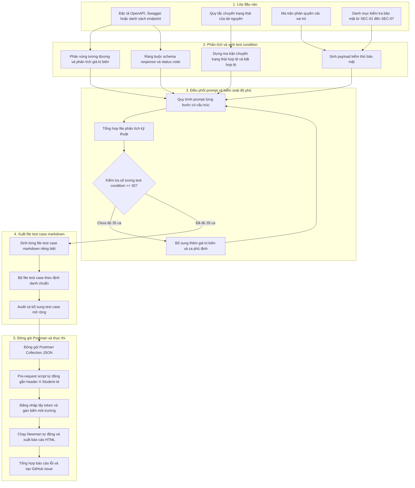

# Thiết Kế Hệ Thống Sinh Ca Kiểm Thử API Tự Động Bằng AI

## 1. Kiến Trúc Tổng Quan Hệ Thống

Hệ thống sinh ca kiểm thử API tự động bằng AI được thiết kế theo mô hình đường ống tuần tự nhiều giai đoạn, kết hợp giữa khả năng sinh nhanh của mô hình ngôn ngữ lớn và các chốt chặn kiểm soát chất lượng của kỹ sư kiểm thử:



---

## 2. Mã Giả Thuật Toán Thiết Kế

Mã giả mô tả chi tiết logic hoạt động của bộ sinh ca kiểm thử và đóng gói thực thi:

```python
class APITestGenerator:
    def __init__(self, api_spec, state_rules, rbac_matrix, security_rules, min_tc_threshold=35):
        self.api_spec = api_spec
        self.state_rules = state_rules
        self.rbac_matrix = rbac_matrix
        self.security_rules = security_rules
        self.min_tc_threshold = min_tc_threshold
        self.test_conditions = []
        self.generated_test_cases = []

    def run_pipeline(self):
        # Giai đoạn 1: Phân tích kỹ thuật và sinh các test condition
        dp_conditions = self.generate_domain_partitions()
        self.test_conditions.extend(dp_conditions)
        
        if self.state_rules.has_state_machine:
            st_conditions = self.generate_state_transition_matrix()
            self.test_conditions.extend(st_conditions)
            
        sec_conditions = self.generate_security_conditions()
        self.test_conditions.extend(sec_conditions)
        
        sch_conditions = self.generate_schema_validation_conditions()
        self.test_conditions.extend(sch_conditions)

        # Giai đoạn 2: Kiểm tra ngưỡng độ phủ tối thiểu
        while len(self.test_conditions) < self.min_tc_threshold:
            supplementary = self.deepen_boundary_and_negative_conditions()
            self.test_conditions.extend(supplementary)

        # Xuất file tổng hợp phân tích kỹ thuật
        analysis_doc = self.export_analysis_document(self.test_conditions)

        # Giai đoạn 3: Sinh từng file test case markdown chi tiết
        for idx, condition in enumerate(self.test_conditions, start=1):
            tc_file = self.build_markdown_test_case(condition, tc_index=idx)
            self.generated_test_cases.append(tc_file)

        return self.generated_test_cases

    def generate_domain_partitions(self):
        conditions = []
        for endpoint in self.api_spec.endpoints:
            for param in endpoint.parameters:
                # Phân vùng tương đương hợp lệ
                conditions.append({
                    "id": f"DP-{len(conditions)+1:03d}",
                    "group": "DP",
                    "endpoint": endpoint.path,
                    "param": param.name,
                    "type": "VALID",
                    "input": param.get_valid_sample(),
                    "expected_status": 200
                })
                # Phân vùng tương đương không hợp lệ: rỗng, khoảng trắng, thiếu field, sai kiểu dữ liệu
                for invalid_val in param.get_invalid_samples():
                    conditions.append({
                        "id": f"DP-{len(conditions)+1:03d}",
                        "group": "DP",
                        "endpoint": endpoint.path,
                        "param": param.name,
                        "type": "INVALID",
                        "input": invalid_val,
                        "expected_status": 400
                    })
                # Phân tích giá trị biên: min-1, min, max, max+1
                if param.has_boundaries:
                    for b_val, is_valid in param.get_boundary_samples():
                        conditions.append({
                            "id": f"DP-{len(conditions)+1:03d}",
                            "group": "DP",
                            "endpoint": endpoint.path,
                            "param": param.name,
                            "type": "BOUNDARY",
                            "input": b_val,
                            "expected_status": 200 if is_valid else 400
                        })
        return conditions

    def generate_state_transition_matrix(self):
        conditions = []
        states = self.state_rules.all_states
        events = self.state_rules.all_events

        for s_from in states:
            for event in events:
                is_valid, s_to, rule_desc = self.state_rules.evaluate_transition(s_from, event)
                conditions.append({
                    "id": f"ST-{len(conditions)+1:03d}",
                    "group": "ST",
                    "endpoint": event.target_endpoint,
                    "from_state": s_from,
                    "event": event.name,
                    "to_state": s_to if is_valid else s_from,
                    "is_valid_transition": is_valid,
                    "expected_status": 200 if is_valid else 400,
                    "rule": rule_desc
                })
        return conditions

    def generate_security_conditions(self):
        conditions = []
        sec_categories = [
            ("SEC-01", "SQL_INJECTION", ["' OR '1'='1", "'; DROP TABLE users; --", "' UNION SELECT..."]),
            ("SEC-02", "IDOR_ACCESS", ["tamper_id_with_other_user_id"]),
            ("SEC-03", "ROLE_ESCALATION", [{"role": "admin"}, {"isAdmin": True}]),
            ("SEC-04", "AUTH_BYPASS", ["missing_token", "invalid_jwt_signature", "expired_token"]),
            ("SEC-05", "STORED_XSS", ["<script>alert(1)</script>", ""]),
            ("SEC-06", "RATE_LIMIT_RACE", ["50_requests_per_sec", "concurrent_cancel"]),
            ("SEC-07", "DATA_EXPOSURE", ["check_response_for_password_and_token"])
        ]
        for sec_code, sec_name, payloads in sec_categories:
            for endpoint in self.api_spec.endpoints:
                for payload in payloads:
                    conditions.append({
                        "id": f"{sec_code}-{len(conditions)+1:03d}",
                        "group": "SEC",
                        "endpoint": endpoint.path,
                        "category": sec_name,
                        "payload": payload,
                        "expected_status": 400 if sec_code in ["SEC-01", "SEC-05"] else 401 if sec_code == "SEC-04" else 403
                    })
        return conditions

    def generate_schema_validation_conditions(self):
        conditions = []
        for endpoint in self.api_spec.endpoints:
            conditions.append({
                "id": f"SCH-{len(conditions)+1:03d}",
                "group": "SCH",
                "endpoint": endpoint.path,
                "status": 200,
                "schema_asserts": endpoint.response_schema_200
            })
            conditions.append({
                "id": f"SCH-{len(conditions)+1:03d}",
                "group": "SCH",
                "endpoint": endpoint.path,
                "status": 400,
                "schema_asserts": {"error": "string"}
            })
        return conditions

    def compile_postman_collection(self, test_cases, student_id="22127001"):
        # Giai đoạn 4: Đóng gói thành Postman Collection JSON
        collection = {
            "info": {
                "name": "EShop_API_Testing_Suite",
                "schema": "https://schema.getpostman.com/json/collection/v2.1.0/collection.json"
            },
            "event": [
                {
                    "listen": "prerequest",
                    "script": {
                        "exec": [
                            f"pm.request.headers.add({{ key: 'X-Student-Id', value: '{student_id}' }});"
                        ]
                    }
                }
            ],
            "item": []
        }

        collection["item"].append(self.create_auth_setup_folder())

        for tc in test_cases:
            folder = self.get_or_create_folder(collection, tc.feature_name, tc.group_name)
            postman_request = self.convert_tc_to_postman_item(tc)
            folder["item"].append(postman_request)

        return collection
```

---

## 3. Các Điểm Nổi Bật Trong Thiết Kế

1. **Phân tách trách nhiệm rõ ràng**:
   - AI thực hiện việc phân rã và sinh test case với tốc độ cao.
   - Bộ lọc điều kiện đảm bảo độ phủ đạt ít nhất 35 ca kiểm thử cho mỗi tính năng.
   - Kỹ sư kiểm thử thực hiện bước audit để loại bỏ ca sai và bổ sung các ca kiểm thử chuyên sâu về tương tranh hoặc bảo mật nâng cao.

2. **Cơ chế chuyển tiếp token tự động**:
   - Thư mục thiết lập xác thực thực hiện đăng nhập trước, tự động trích xuất chuỗi JWT token và lưu vào biến môi trường để toàn bộ các ca kiểm thử phía sau kế thừa tự động.

3. **Gắn header định danh tập trung**:
   - Header định danh sinh viên được xử lý tự động trong pre-request script ở cấp bộ sưu tập, không cần cấu hình lặp lại ở từng ca kiểm thử đơn lẻ.
