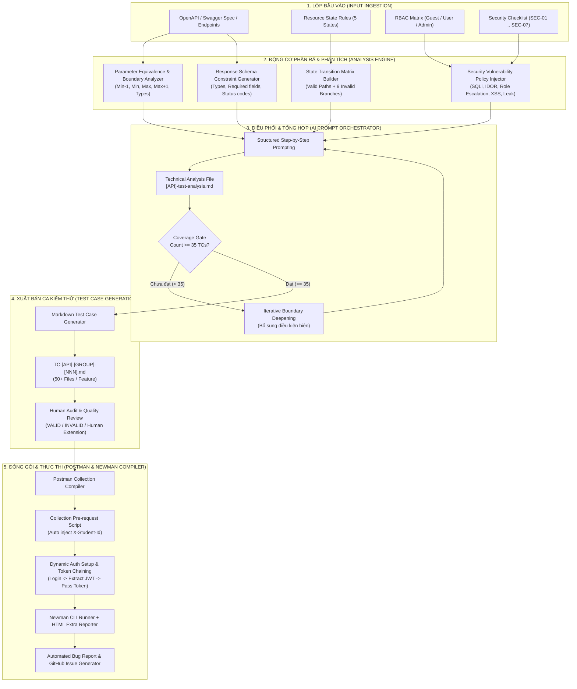

# Thiết Kế Hệ Thống AI-Driven API Test Generator (HW06 — Create Level G9.5)

**Sinh viên thực hiện:** 22127001  
**Môn học:** Kiểm thử Phần mềm (Software Testing)  
**Đề bài:** Thiết kế bộ sinh ca kiểm thử API tự động điều khiển bởi AI (AI-Driven API Test Generator) cho hệ thống EShop SUT. Đầu vào là đặc tả API (API Specification, State Transition Rules, Security Checklist), đầu ra là bộ ca kiểm thử tự động, Postman Collection và kịch bản thực thi.

---

## 1. Kiến Trúc Tổng Quan Hệ Thống (Architecture Overview)

Hệ thống **AI-Driven API Test Generator** được thiết kế theo kiến trúc đường ống nhiều giai đoạn (Multi-stage Pipeline Architecture) với cơ chế kiểm soát chất lượng nghiêm ngặt (Quality Gate) và sự tham gia của con người (Human-in-the-Loop):



---

## 2. Mã Giả Thuật Toán Thiết Kế (Design Pseudocode)

Dưới đây là mã giả chi tiết của toàn bộ thuật toán sinh ca kiểm thử và đóng gói thực thi tự động:

```python
"""
AI-Driven API Test Generator Algorithm
Author: Student 22127001
Target: EShop API SUT (FR-04, FR-10, FR-16)
"""

class APITestGenerator:
    def __init__(self, api_spec, state_rules, rbac_matrix, security_rules, min_tc_threshold=35):
        self.api_spec = api_spec
        self.state_rules = state_rules
        self.rbac_matrix = rbac_matrix
        self.security_rules = security_rules
        self.min_tc_threshold = min_tc_threshold
        self.test_conditions = []
        self.generated_test_cases = []

    def run_pipeline(self):
        # ==========================================
        # GIAI ĐOẠN 1: PHÂN RÃ & SINH TEST CONDITIONS
        # ==========================================
        
        # Bước 1: Domain Partitioning & Boundary Value Analysis (DP)
        dp_conditions = self.generate_domain_partitions()
        self.test_conditions.extend(dp_conditions)
        
        # Bước 2: State Transition Matrix (ST)
        if self.state_rules.has_state_machine:
            st_conditions = self.generate_state_transition_matrix()
            self.test_conditions.extend(st_conditions)
            
        # Bước 3: Security Testing (SEC-01 đến SEC-07)
        sec_conditions = self.generate_security_conditions()
        self.test_conditions.extend(sec_conditions)
        
        # Bước 4: Schema Validation (SCH)
        sch_conditions = self.generate_schema_validation_conditions()
        self.test_conditions.extend(sch_conditions)

        # ==========================================
        # GIAI ĐOẠN 2: KIỂM SOÁT ĐỘ PHỦ (QUALITY GATE)
        # ==========================================
        while len(self.test_conditions) < self.min_tc_threshold:
            print(f"[WARN] Coverage insufficient: {len(self.test_conditions)}/{self.min_tc_threshold}. Deepening boundary exploration...")
            supplementary = self.deepen_boundary_and_negative_conditions()
            self.test_conditions.extend(supplementary)

        # Xuất file tổng hợp phân tích kỹ thuật
        analysis_doc = self.export_analysis_document(self.test_conditions)

        # ==========================================
        # GIAI ĐOẠN 3: SINH TỪNG FILE TEST CASE MARKDOWN
        # ==========================================
        for idx, condition in enumerate(self.test_conditions, start=1):
            tc_file = self.build_markdown_test_case(condition, tc_index=idx)
            self.generated_test_cases.append(tc_file)

        return self.generated_test_cases

    def generate_domain_partitions(self):
        conditions = []
        for endpoint in self.api_spec.endpoints:
            for param in endpoint.parameters:
                # Phân vùng tương đương hợp lệ (Valid Partition)
                conditions.append({
                    "id": f"DP-{len(conditions)+1:03d}",
                    "group": "DP",
                    "endpoint": endpoint.path,
                    "param": param.name,
                    "type": "VALID_EQUIVALENCE",
                    "input": param.get_valid_sample(),
                    "expected_status": 200
                })
                # Phân vùng tương đương không hợp lệ (Invalid Partition: Empty, Whitespace, Missing, Null, Wrong Type)
                for invalid_val in param.get_invalid_samples():
                    conditions.append({
                        "id": f"DP-{len(conditions)+1:03d}",
                        "group": "DP",
                        "endpoint": endpoint.path,
                        "param": param.name,
                        "type": "INVALID_EQUIVALENCE",
                        "input": invalid_val,
                        "expected_status": 400
                    })
                # Phân tích giá trị biên (Boundary Value Analysis: min-1, min, max, max+1)
                if param.has_boundaries:
                    for b_val, is_valid in param.get_boundary_samples():
                        conditions.append({
                            "id": f"DP-{len(conditions)+1:03d}",
                            "group": "DP",
                            "endpoint": endpoint.path,
                            "param": param.name,
                            "type": "BOUNDARY",
                            "input": b_val,
                            "expected_status": 200 if is_valid else 400
                        })
        return conditions

    def generate_state_transition_matrix(self):
        conditions = []
        states = self.state_rules.all_states  # [pending, confirmed, shipping, delivered, canceled]
        events = self.state_rules.all_events  # [confirm, ship, deliver, cancel_user, cancel_admin]

        for s_from in states:
            for event in events:
                is_valid, s_to, rule_desc = self.state_rules.evaluate_transition(s_from, event)
                conditions.append({
                    "id": f"ST-{len(conditions)+1:03d}",
                    "group": "ST",
                    "endpoint": event.target_endpoint,
                    "from_state": s_from,
                    "event": event.name,
                    "to_state": s_to if is_valid else s_from,
                    "is_valid_transition": is_valid,
                    "expected_status": 200 if is_valid else 400,
                    "rule": rule_desc
                })
        return conditions

    def generate_security_conditions(self):
        conditions = []
        sec_categories = [
            ("SEC-01", "SQL_INJECTION", ["' OR '1'='1", "'; DROP TABLE users; --", "' UNION SELECT..."]),
            ("SEC-02", "IDOR_ACCESS", ["tamper_id_with_other_user_id"]),
            ("SEC-03", "ROLE_ESCALATION", [{"role": "admin"}, {"isAdmin": True}]),
            ("SEC-04", "AUTH_BYPASS", ["missing_token", "invalid_jwt_signature", "expired_token"]),
            ("SEC-05", "STORED_XSS", ["<script>alert(1)</script>", ""]),
            ("SEC-06", "RATE_LIMIT_RACE", ["50_requests_per_sec", "concurrent_cancel"]),
            ("SEC-07", "DATA_EXPOSURE", ["check_response_for_password_and_token"])
        ]
        for sec_code, sec_name, payloads in sec_categories:
            for endpoint in self.api_spec.endpoints:
                for payload in payloads:
                    conditions.append({
                        "id": f"{sec_code}-{len(conditions)+1:03d}",
                        "group": "SEC",
                        "endpoint": endpoint.path,
                        "category": sec_name,
                        "payload": payload,
                        "expected_status": 400 if sec_code in ["SEC-01", "SEC-05"] else 401 if sec_code == "SEC-04" else 403
                    })
        return conditions

    def generate_schema_validation_conditions(self):
        conditions = []
        for endpoint in self.api_spec.endpoints:
            # 200 Schema Check
            conditions.append({
                "id": f"SCH-{len(conditions)+1:03d}",
                "group": "SCH",
                "endpoint": endpoint.path,
                "status": 200,
                "schema_asserts": endpoint.response_schema_200
            })
            # 400 Error Schema Check
            conditions.append({
                "id": f"SCH-{len(conditions)+1:03d}",
                "group": "SCH",
                "endpoint": endpoint.path,
                "status": 400,
                "schema_asserts": {"error": "string"}
            })
        return conditions

    def compile_postman_collection(self, test_cases, student_id="22127001"):
        # ==========================================
        # GIAI ĐOẠN 4: ĐÓNG GÓI THỰC THI (POSTMAN)
        # ==========================================
        collection = {
            "info": {
                "name": "EShop_API_Testing_Suite",
                "schema": "https://schema.getpostman.com/json/collection/v2.1.0/collection.json"
            },
            "event": [
                {
                    "listen": "prerequest",
                    "script": {
                        "exec": [
                            f"// Global Student Header Injection",
                            f"pm.request.headers.add({{ key: 'X-Student-Id', value: '{student_id}' }});"
                        ]
                    }
                }
            ],
            "item": []
        }

        # Auth Setup Folder for Dynamic Chaining
        collection["item"].append(self.create_auth_setup_folder())

        # Compile test cases into folders by feature & group
        for tc in test_cases:
            folder = self.get_or_create_folder(collection, tc.feature_name, tc.group_name)
            postman_request = self.convert_tc_to_postman_item(tc)
            folder["item"].append(postman_request)

        return collection
```

---

## 3. Các Điểm Sáng Tạo & Nguyên Tắc Thiết Kế (Key Design Principles)

1. **Phân Tách Trách Nhiệm (Separation of Concerns)**:
   - AI chịu trách nhiệm sinh lập nhanh và rộng (High-speed generation).
   - Động cơ luật (Rule Engine) và Quality Gate đảm bảo đạt đủ ngưỡng tối thiểu $\ge 35$ TCs/tính năng.
   - Con người đóng vai trò Audit và mở rộng các ca kiểm thử phức tạp (Human Extensions `EXT-001` → `EXT-005`).

2. **Cơ Chế Dynamic Request Chaining**:
   - Thư mục `00. Auth Setup` tự động đăng nhập tài khoản User và Admin, trích xuất chuỗi JWT token lưu vào Environment variables để toàn bộ 155 test cases phía sau kế thừa tự động.

3. **Tự Động Inject Header Định Danh**:
   - Header `X-Student-Id: 22127001` được quản lý và inject tại tầng **Collection Pre-request Script**, tránh lặp lại mã nguồn ở từng request riêng lẻ.
