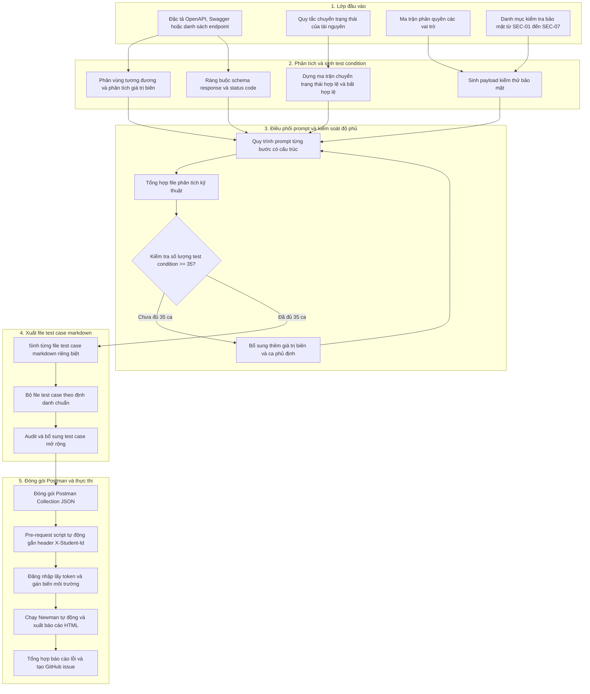

# Thiết Kế Hệ Thống Sinh Ca Kiểm Thử API Tự Động Bằng AI

## 1. Kiến Trúc Tổng Quan Hệ Thống

Hệ thống sinh ca kiểm thử API tự động bằng AI được thiết kế theo mô hình đường ống tuần tự nhiều giai đoạn, kết hợp giữa khả năng sinh nhanh của mô hình ngôn ngữ lớn và các chốt chặn kiểm soát chất lượng của kỹ sư kiểm thử:



---

## 2. Mã Giả Thuật Toán Thiết Kế

```text
THUẬT TOÁN: AITestGenerator(api_spec, state_rules, rbac_matrix, security_rules)
ĐẦU VÀO:
    api_spec: Danh sách endpoint, method, param, schema mong đợi
    state_rules: Tập trạng thái và ma trận chuyển đổi hợp lệ
    rbac_matrix: Quyền hạn các vai trò (guest, user, admin)
    security_rules: Danh mục checklist từ SEC-01 đến SEC-07
ĐẦU RA:
    test_suite: Tập hợp các file ca kiểm thử markdown và Postman Collection JSON

BƯỚC 1: Khởi tạo danh sách test_conditions = []

BƯỚC 2: Phân vùng tương đương và phân tích giá trị biên
    CHO MỖI endpoint TRONG api_spec:
        CHO MỖI param TRONG endpoint.parameters:
            test_conditions.THÊM(PhânVùngHợpLệ(param))
            test_conditions.THÊM(PhânVùngKhôngHợpLệ(param, [Rỗng, SaiKiểu, Null, Thiếu]))
            NẾU param có giới hạn biên:
                test_conditions.THÊM(GiáTrịBiên(param, [min-1, min, max, max+1]))

BƯỚC 3: Dựng ma trận chuyển trạng thái
    NẾU state_rules có định nghĩa vòng đời tài nguyên:
        CHO MỖI s_current TRONG state_rules.states:
            CHO MỖI event TRONG state_rules.events:
                transition = ĐánhGiáChuyểnTrạngThái(s_current, event)
                test_conditions.THÊM(transition)  // Bao gồm cả nhánh hợp lệ và bất hợp lệ

BƯỚC 4: Thiết kế kiểm thử an ninh (SEC-01 đến SEC-07)
    CHO MỖI sec_type TRONG [SQLi, IDOR, NângQuyền, VượtXácThực, StoredXSS, RateLimit, LộDữLiệu]:
        CHO MỖI endpoint TRONG api_spec:
            payloads = TạoPayloadBảoMật(sec_type, endpoint)
            test_conditions.THÊM(KiểmTraBảoMật(sec_type, endpoint, payloads))

BƯỚC 5: Thiết kế kiểm tra schema
    CHO MỖI endpoint TRONG api_spec:
        test_conditions.THÊM(RàngBuộcSchema(endpoint, MãTrạngThái=200, Schema=endpoint.schema_200))
        test_conditions.THÊM(RàngBuộcSchema(endpoint, MãTrạngThái=400, Schema=endpoint.schema_lỗi))

BƯỚC 6: Kiểm soát ngưỡng độ phủ tối thiểu (Quality Gate)
    TRONG KHI ĐỘ_DÀI(test_conditions) < 35:
        test_conditions.THÊM(ĐàoSâuGiáTrịBiênVàPhủĐịnh(api_spec))

BƯỚC 7: Xuất bản và đóng gói thực thi
    test_cases = XuấtFileMarkdown(test_conditions)
    audit_cases = KiểmDuyệtConNgười(test_cases)  // Audit VALID/INVALID và bổ sung ca mở rộng
    collection = ĐóngGóiPostmanCollection(audit_cases, TựĐộngGắnHeader="X-Student-Id")

TRẢ VỀ collection, test_cases
```

---

## 3. Các Điểm Nổi Bật Trong Thiết Kế

1. **Phân tách trách nhiệm rõ ràng**:
   - AI thực hiện việc phân rã và sinh test case với tốc độ cao.
   - Bộ lọc điều kiện đảm bảo độ phủ đạt ít nhất 35 ca kiểm thử cho mỗi tính năng.
   - Kỹ sư kiểm thử thực hiện bước audit để loại bỏ ca sai và bổ sung các ca kiểm thử chuyên sâu về tương tranh hoặc bảo mật nâng cao.

2. **Cơ chế chuyển tiếp token tự động**:
   - Thư mục thiết lập xác thực thực hiện đăng nhập trước, tự động trích xuất chuỗi JWT token và lưu vào biến môi trường để toàn bộ các ca kiểm thử phía sau kế thừa tự động.

3. **Gắn header định danh tập trung**:
   - Header định danh sinh viên được xử lý tự động trong pre-request script ở cấp bộ sưu tập, không cần cấu hình lặp lại ở từng ca kiểm thử đơn lẻ.
