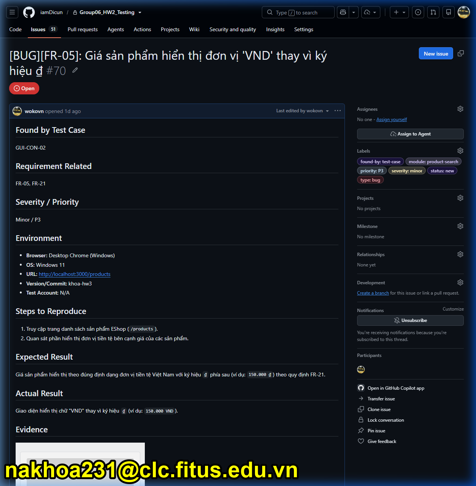
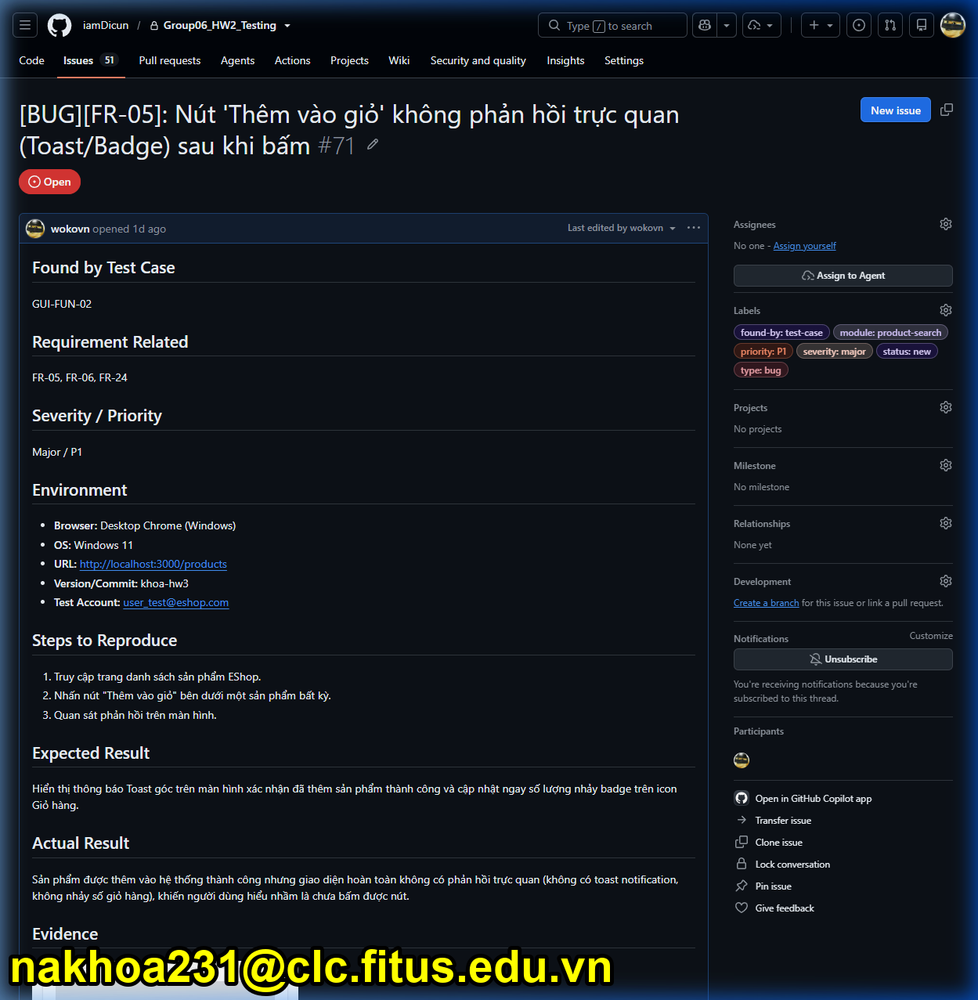
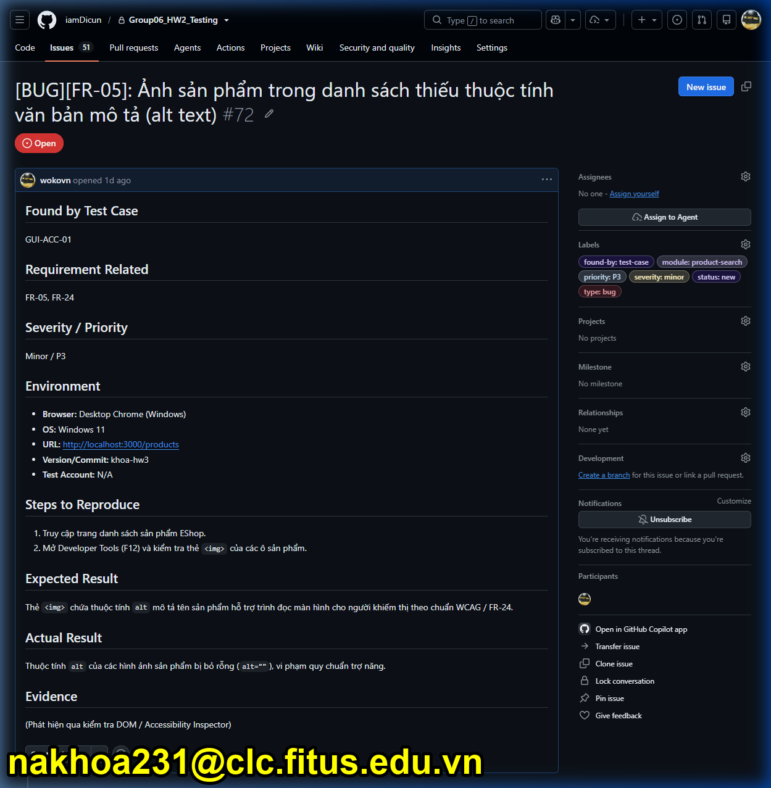
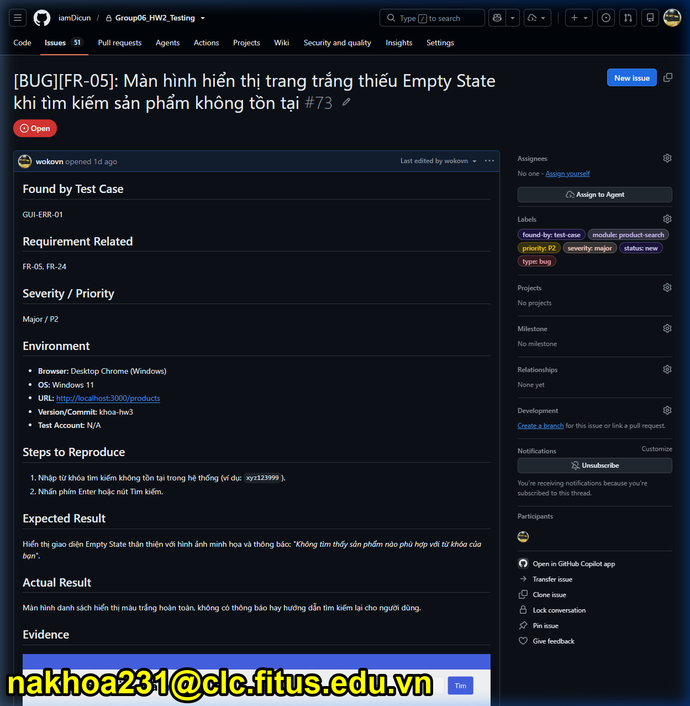
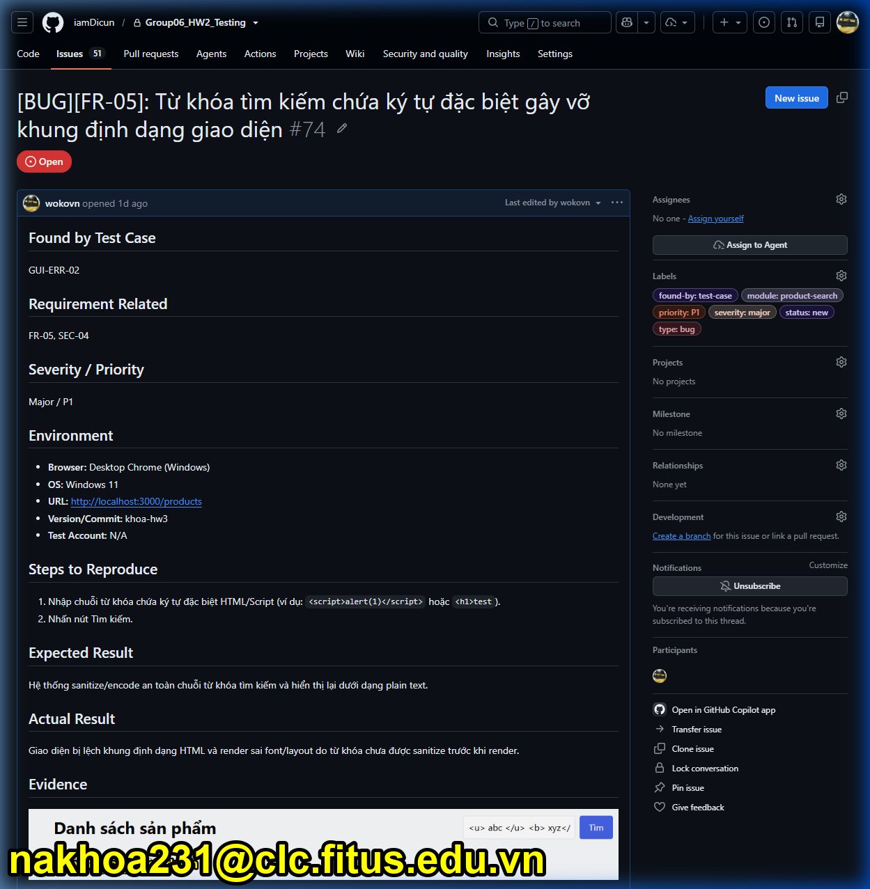
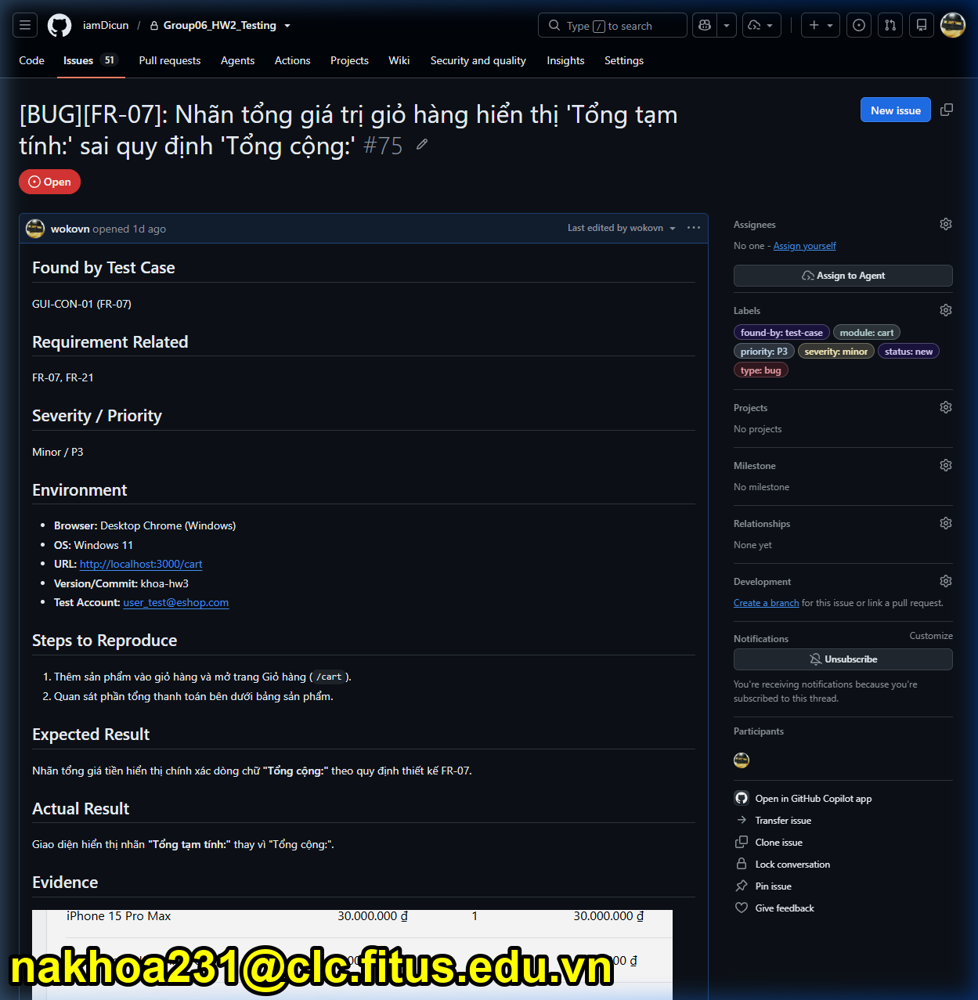
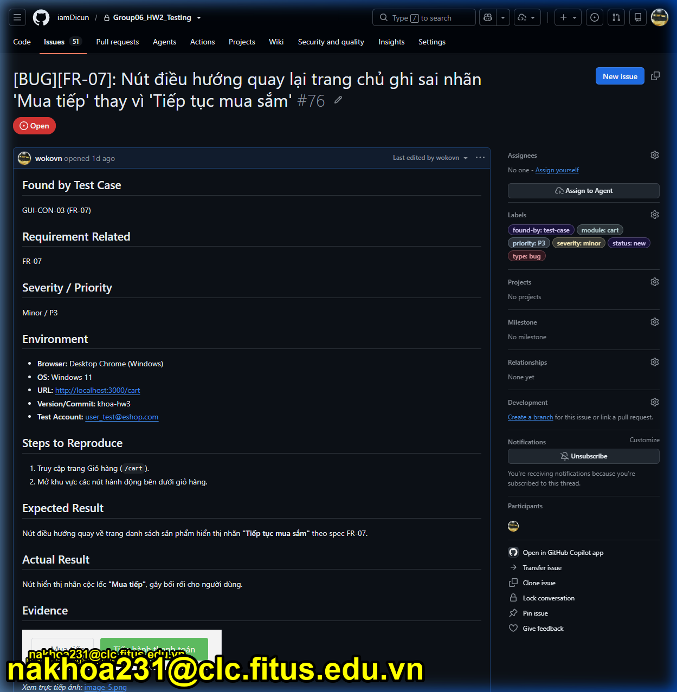
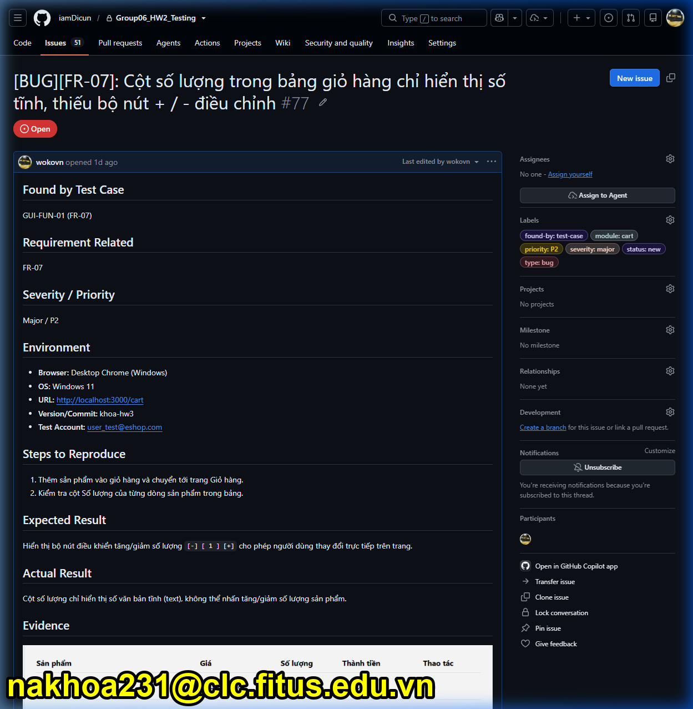
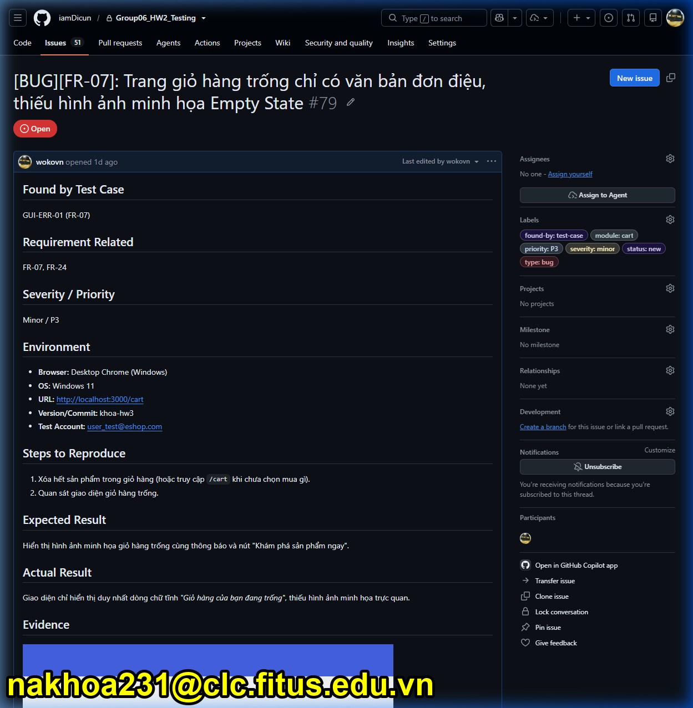
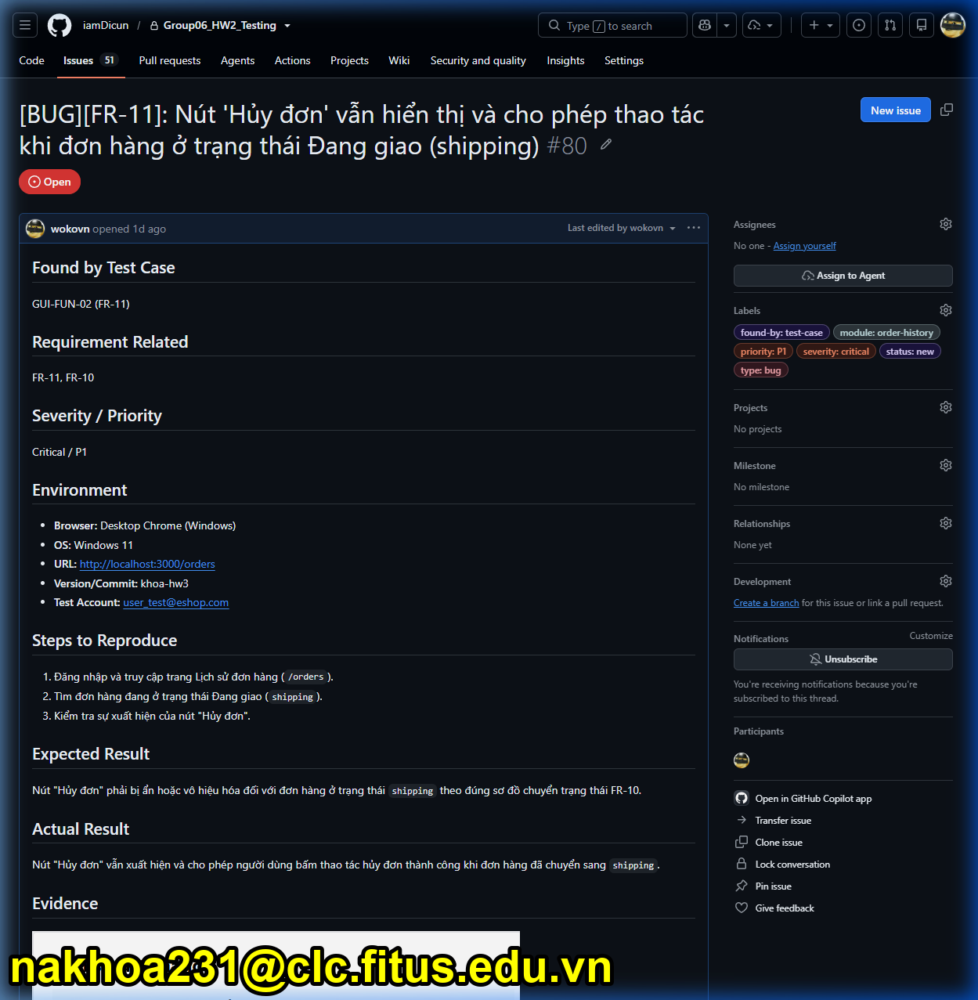

# Báo Cáo Chi Tiết Lỗi Giao Diện GitHub Issues (#70 - #80) — Bug Report

**Hệ thống kiểm thử (SUT):** EShop E-Commerce System  
**Repository:** `iamDicun/Group06_HW2_Testing`  
**Tổng số bug ghi nhận:** 11 Bug Issues (Từ Issue #70 đến Issue #80)  
**Tác giả:** wokovn  
**Ngày cập nhật:** 2026-08-02  

---

## 1. Tổng Quan Bảng Bug Issues GitHub (#70 - #80)

| Issue ID | Tiêu đề Bug Report | Module | Severity | Priority | Found-by | Screenshot GitHub Issue |
|---|---|---|---|---|---|---|
| [#70](https://github.com/iamDicun/Group06_HW2_Testing/issues/70) | [BUG][FR-05]: Giá sản phẩm hiển thị đơn vị 'VND' thay vì ký hiệu ₫ | product-search | Minor | P3 | GUI-CON-02 | [Xem Ảnh](#issue-70) |
| [#71](https://github.com/iamDicun/Group06_HW2_Testing/issues/71) | [BUG][FR-05]: Nút 'Thêm vào giỏ' không phản hồi trực quan (Toast/Badge) | product-search | Major | P1 | GUI-FUN-02 | [Xem Ảnh](#issue-71) |
| [#72](https://github.com/iamDicun/Group06_HW2_Testing/issues/72) | [BUG][FR-05]: Ảnh sản phẩm trong danh sách thiếu thuộc tính alt text | product-search | Minor | P3 | GUI-ACC-01 | [Xem Ảnh](#issue-72) |
| [#73](https://github.com/iamDicun/Group06_HW2_Testing/issues/73) | [BUG][FR-05]: Trang trắng thiếu Empty State khi tìm kiếm sản phẩm không tồn tại | product-search | Major | P2 | GUI-ERR-01 | [Xem Ảnh](#issue-73) |
| [#74](https://github.com/iamDicun/Group06_HW2_Testing/issues/74) | [BUG][FR-05]: Từ khóa chứa ký tự đặc biệt gây vỡ khung giao diện | product-search | Major | P1 | GUI-ERR-02 | [Xem Ảnh](#issue-74) |
| [#75](https://github.com/iamDicun/Group06_HW2_Testing/issues/75) | [BUG][FR-07]: Nhãn tổng giá trị hiển thị 'Tổng tạm tính:' sai quy định | cart | Minor | P3 | GUI-CON-01 | [Xem Ảnh](#issue-75) |
| [#76](https://github.com/iamDicun/Group06_HW2_Testing/issues/76) | [BUG][FR-07]: Nút điều hướng ghi sai nhãn 'Mua tiếp' thay vì 'Tiếp tục mua sắm' | cart | Minor | P3 | GUI-CON-03 | [Xem Ảnh](#issue-76) |
| [#77](https://github.com/iamDicun/Group06_HW2_Testing/issues/77) | [BUG][FR-07]: Cột số lượng giỏ hàng thiếu bộ nút + / - điều chỉnh | cart | Major | P2 | GUI-FUN-01 | [Xem Ảnh](#issue-77) |
| [#78](https://github.com/iamDicun/Group06_HW2_Testing/issues/78) | [BUG][FR-07]: Nút 'Xóa' thực hiện xóa ngay mà không hiển thị Dialog xác nhận | cart | Major | P2 | GUI-FUN-02 | [Xem Ảnh](#issue-78) |
| [#79](https://github.com/iamDicun/Group06_HW2_Testing/issues/79) | [BUG][FR-07]: Trang giỏ hàng trống đơn điệu, thiếu hình minh họa Empty State | cart | Minor | P3 | GUI-ERR-01 | [Xem Ảnh](#issue-79) |
| [#80](https://github.com/iamDicun/Group06_HW2_Testing/issues/80) | [BUG][FR-11]: Nút 'Hủy đơn' vẫn cho phép thao tác khi đơn hàng ở trạng thái Đang giao | order-history | Critical | P1 | GUI-FUN-02 | [Xem Ảnh](#issue-80) |

---

## 2. Chi Tiết Nội Dung Từng Bug Report & Ảnh GitHub Issue

### Issue #70: [BUG][FR-05]: Giá sản phẩm hiển thị đơn vị 'VND' thay vì ký hiệu ₫

- **Link GitHub Issue:** https://github.com/iamDicun/Group06_HW2_Testing/issues/70
- **Test Case:** `GUI-CON-02` | **Requirement:** `FR-05, FR-21`
- **Severity / Priority:** `Minor / P3` | **Module:** `product-search`

#### Environment
- **Browser:** Desktop Chrome (Windows)
- **OS:** Windows 11
- **URL:** http://localhost:3000/products
- **Version/Commit:** `khoa-hw3`
- **Test Account:** N/A

#### Steps to Reproduce
1. Truy cập trang danh sách sản phẩm EShop (`/products`).
2. Quan sát phần hiển thị đơn vị tiền tệ bên cạnh giá của các sản phẩm.

#### Expected Result
Giá sản phẩm hiển thị theo đúng định dạng đơn vị tiền tệ Việt Nam với ký hiệu `₫` phía sau (ví dụ: `150.000 ₫`) theo quy định FR-21.

#### Actual Result
Giao diện hiển thị chữ "VND" thay vì ký hiệu `₫` (ví dụ: `150.000 VND`).

#### GitHub Issue Screenshot

#### Minh chứng lỗi SUT (Evidence)

---

### Issue #71: [BUG][FR-05]: Nút 'Thêm vào giỏ' không phản hồi trực quan (Toast/Badge) sau khi bấm

- **Link GitHub Issue:** https://github.com/iamDicun/Group06_HW2_Testing/issues/71
- **Test Case:** `GUI-FUN-02` | **Requirement:** `FR-05, FR-06, FR-24`
- **Severity / Priority:** `Major / P1` | **Module:** `product-search`

#### Environment
- **Browser:** Desktop Chrome (Windows)
- **OS:** Windows 11
- **URL:** http://localhost:3000/products
- **Version/Commit:** `khoa-hw3`
- **Test Account:** user_test@eshop.com

#### Steps to Reproduce
1. Truy cập trang danh sách sản phẩm EShop.
2. Nhấn nút "Thêm vào giỏ" bên dưới một sản phẩm bất kỳ.
3. Quan sát phản hồi trên màn hình.

#### Expected Result
Hiển thị thông báo Toast góc trên màn hình xác nhận đã thêm sản phẩm thành công và cập nhật ngay số lượng nhảy badge trên icon Giỏ hàng.

#### Actual Result
Sản phẩm được thêm vào hệ thống thành công nhưng giao diện hoàn toàn không có phản hồi trực quan (không có toast notification, không nhảy số giỏ hàng), khiến người dùng hiểu nhầm là chưa bấm được nút.

#### GitHub Issue Screenshot

#### Minh chứng lỗi SUT (Evidence)

---

### Issue #72: [BUG][FR-05]: Ảnh sản phẩm trong danh sách thiếu thuộc tính văn bản mô tả (alt text)

- **Link GitHub Issue:** https://github.com/iamDicun/Group06_HW2_Testing/issues/72
- **Test Case:** `GUI-ACC-01` | **Requirement:** `FR-05, FR-24`
- **Severity / Priority:** `Minor / P3` | **Module:** `product-search`

#### Environment
- **Browser:** Desktop Chrome (Windows)
- **OS:** Windows 11
- **URL:** http://localhost:3000/products
- **Version/Commit:** `khoa-hw3`
- **Test Account:** N/A

#### Steps to Reproduce
1. Truy cập trang danh sách sản phẩm EShop.
2. Mở Developer Tools (F12) và kiểm tra thẻ `` của các ô sản phẩm.

#### Expected Result
Thẻ `` chứa thuộc tính `alt` mô tả tên sản phẩm hỗ trợ trình đọc màn hình cho người khiếm thị theo chuẩn WCAG / FR-24.

#### Actual Result
Thuộc tính `alt` của các hình ảnh sản phẩm bị bỏ rỗng (`alt=""`), vi phạm quy chuẩn trợ năng.

#### GitHub Issue Screenshot

#### Minh chứng lỗi SUT (Evidence)
*(Phát hiện qua kiểm tra DOM / Accessibility Inspector)*

---

### Issue #73: [BUG][FR-05]: Màn hình hiển thị trang trắng thiếu Empty State khi tìm kiếm sản phẩm không tồn tại

- **Link GitHub Issue:** https://github.com/iamDicun/Group06_HW2_Testing/issues/73
- **Test Case:** `GUI-ERR-01` | **Requirement:** `FR-05, FR-24`
- **Severity / Priority:** `Major / P2` | **Module:** `product-search`

#### Environment
- **Browser:** Desktop Chrome (Windows)
- **OS:** Windows 11
- **URL:** http://localhost:3000/products
- **Version/Commit:** `khoa-hw3`
- **Test Account:** N/A

#### Steps to Reproduce
1. Nhập từ khóa tìm kiếm không tồn tại trong hệ thống (ví dụ: `xyz123999`).
2. Nhấn phím Enter hoặc nút Tìm kiếm.

#### Expected Result
Hiển thị giao diện Empty State thân thiện với hình ảnh minh họa và thông báo: *"Không tìm thấy sản phẩm nào phù hợp với từ khóa của bạn"*.

#### Actual Result
Màn hình danh sách hiển thị màu trắng hoàn toàn, không có thông báo hay hướng dẫn tìm kiếm lại cho người dùng.

#### GitHub Issue Screenshot

#### Minh chứng lỗi SUT (Evidence)

---

### Issue #74: [BUG][FR-05]: Từ khóa tìm kiếm chứa ký tự đặc biệt gây vỡ khung định dạng giao diện

- **Link GitHub Issue:** https://github.com/iamDicun/Group06_HW2_Testing/issues/74
- **Test Case:** `GUI-ERR-02` | **Requirement:** `FR-05, SEC-04`
- **Severity / Priority:** `Major / P1` | **Module:** `product-search`

#### Environment
- **Browser:** Desktop Chrome (Windows)
- **OS:** Windows 11
- **URL:** http://localhost:3000/products
- **Version/Commit:** `khoa-hw3`
- **Test Account:** N/A

#### Steps to Reproduce
1. Nhập chuỗi từ khóa chứa ký tự đặc biệt HTML/Script (ví dụ: `` hoặc `<h1>test`).
2. Nhấn nút Tìm kiếm.

#### Expected Result
Hệ thống sanitize/encode an toàn chuỗi từ khóa tìm kiếm và hiển thị lại dưới dạng plain text.

#### Actual Result
Giao diện bị lệch khung định dạng HTML và render sai font/layout do từ khóa chưa được sanitize trước khi render.

#### GitHub Issue Screenshot

#### Minh chứng lỗi SUT (Evidence)

---

### Issue #75: [BUG][FR-07]: Nhãn tổng giá trị giỏ hàng hiển thị 'Tổng tạm tính:' sai quy định 'Tổng cộng:'

- **Link GitHub Issue:** https://github.com/iamDicun/Group06_HW2_Testing/issues/75
- **Test Case:** `GUI-CON-01 (FR-07)` | **Requirement:** `FR-07, FR-21`
- **Severity / Priority:** `Minor / P3` | **Module:** `cart`

#### Environment
- **Browser:** Desktop Chrome (Windows)
- **OS:** Windows 11
- **URL:** http://localhost:3000/cart
- **Version/Commit:** `khoa-hw3`
- **Test Account:** user_test@eshop.com

#### Steps to Reproduce
1. Thêm sản phẩm vào giỏ hàng và mở trang Giỏ hàng (`/cart`).
2. Quan sát phần tổng thanh toán bên dưới bảng sản phẩm.

#### Expected Result
Nhãn tổng giá tiền hiển thị chính xác dòng chữ **"Tổng cộng:"** theo quy định thiết kế FR-07.

#### Actual Result
Giao diện hiển thị nhãn **"Tổng tạm tính:"** thay vì "Tổng cộng:".

#### GitHub Issue Screenshot

#### Minh chứng lỗi SUT (Evidence)

---

### Issue #76: [BUG][FR-07]: Nút điều hướng quay lại trang chủ ghi sai nhãn 'Mua tiếp' thay vì 'Tiếp tục mua sắm'

- **Link GitHub Issue:** https://github.com/iamDicun/Group06_HW2_Testing/issues/76
- **Test Case:** `GUI-CON-03 (FR-07)` | **Requirement:** `FR-07`
- **Severity / Priority:** `Minor / P3` | **Module:** `cart`

#### Environment
- **Browser:** Desktop Chrome (Windows)
- **OS:** Windows 11
- **URL:** http://localhost:3000/cart
- **Version/Commit:** `khoa-hw3`
- **Test Account:** user_test@eshop.com

#### Steps to Reproduce
1. Truy cập trang Giỏ hàng (`/cart`).
2. Mở khu vực các nút hành động bên dưới giỏ hàng.

#### Expected Result
Nút điều hướng quay về trang danh sách sản phẩm hiển thị nhãn **"Tiếp tục mua sắm"** theo spec FR-07.

#### Actual Result
Nút hiển thị nhãn cộc lốc **"Mua tiếp"**, gây bối rối cho người dùng.

#### GitHub Issue Screenshot

#### Minh chứng lỗi SUT (Evidence)

---

### Issue #77: [BUG][FR-07]: Cột số lượng trong bảng giỏ hàng chỉ hiển thị số tĩnh, thiếu bộ nút + / - điều chỉnh

- **Link GitHub Issue:** https://github.com/iamDicun/Group06_HW2_Testing/issues/77
- **Test Case:** `GUI-FUN-01 (FR-07)` | **Requirement:** `FR-07`
- **Severity / Priority:** `Major / P2` | **Module:** `cart`

#### Environment
- **Browser:** Desktop Chrome (Windows)
- **OS:** Windows 11
- **URL:** http://localhost:3000/cart
- **Version/Commit:** `khoa-hw3`
- **Test Account:** user_test@eshop.com

#### Steps to Reproduce
1. Thêm sản phẩm vào giỏ hàng và chuyển tới trang Giỏ hàng.
2. Kiểm tra cột Số lượng của từng dòng sản phẩm trong bảng.

#### Expected Result
Hiển thị bộ nút điều khiển tăng/giảm số lượng `[-] [ 1 ] [+]` cho phép người dùng thay đổi trực tiếp trên trang.

#### Actual Result
Cột số lượng chỉ hiển thị số văn bản tĩnh (text), không thể nhấn tăng/giảm số lượng sản phẩm.

#### GitHub Issue Screenshot

#### Minh chứng lỗi SUT (Evidence)

---

### Issue #78: [BUG][FR-07]: Nút 'Xóa' sản phẩm khỏi giỏ hàng thực hiện xóa ngay mà không hiển thị Dialog xác nhận

- **Link GitHub Issue:** https://github.com/iamDicun/Group06_HW2_Testing/issues/78
- **Test Case:** `GUI-FUN-02 (FR-07)` | **Requirement:** `FR-07, FR-24`
- **Severity / Priority:** `Major / P2` | **Module:** `cart`

#### Environment
- **Browser:** Desktop Chrome (Windows)
- **OS:** Windows 11
- **URL:** http://localhost:3000/cart
- **Version/Commit:** `khoa-hw3`
- **Test Account:** user_test@eshop.com

#### Steps to Reproduce
1. Truy cập trang Giỏ hàng có chứa ít nhất 1 sản phẩm.
2. Nhấn nút "Xóa" màu đỏ tại một dòng sản phẩm.

#### Expected Result
Hiển thị hộp thoại xác nhận (Confirm Dialog): *"Bạn có chắc chắn muốn xóa sản phẩm này khỏi giỏ hàng?"* trước khi loại bỏ.

#### Actual Result
Sản phẩm bị xóa tức thì khỏi bảng giỏ hàng ngay sau khi bấm nút mà không hiển thị bất kỳ hộp thoại xác nhận nào.

#### GitHub Issue Screenshot

#### Minh chứng lỗi SUT (Evidence)

---

### Issue #79: [BUG][FR-07]: Trang giỏ hàng trống chỉ có văn bản đơn điệu, thiếu hình ảnh minh họa Empty State

- **Link GitHub Issue:** https://github.com/iamDicun/Group06_HW2_Testing/issues/79
- **Test Case:** `GUI-ERR-01 (FR-07)` | **Requirement:** `FR-07, FR-24`
- **Severity / Priority:** `Minor / P3` | **Module:** `cart`

#### Environment
- **Browser:** Desktop Chrome (Windows)
- **OS:** Windows 11
- **URL:** http://localhost:3000/cart
- **Version/Commit:** `khoa-hw3`
- **Test Account:** user_test@eshop.com

#### Steps to Reproduce
1. Xóa hết sản phẩm trong giỏ hàng (hoặc truy cập `/cart` khi chưa chọn mua gì).
2. Quan sát giao diện giỏ hàng trống.

#### Expected Result
Hiển thị hình ảnh minh họa giỏ hàng trống cùng thông báo và nút "Khám phá sản phẩm ngay".

#### Actual Result
Giao diện chỉ hiển thị duy nhất dòng chữ tĩnh *"Giỏ hàng của bạn đang trống"*, thiếu hình ảnh minh họa trực quan.

#### GitHub Issue Screenshot

#### Minh chứng lỗi SUT (Evidence)

---

### Issue #80: [BUG][FR-11]: Nút 'Hủy đơn' vẫn hiển thị và cho phép thao tác khi đơn hàng ở trạng thái Đang giao (shipping)

- **Link GitHub Issue:** https://github.com/iamDicun/Group06_HW2_Testing/issues/80
- **Test Case:** `GUI-FUN-02 (FR-11)` | **Requirement:** `FR-11, FR-10`
- **Severity / Priority:** `Critical / P1` | **Module:** `order-history`

#### Environment
- **Browser:** Desktop Chrome (Windows)
- **OS:** Windows 11
- **URL:** http://localhost:3000/orders
- **Version/Commit:** `khoa-hw3`
- **Test Account:** user_test@eshop.com

#### Steps to Reproduce
1. Đăng nhập và truy cập trang Lịch sử đơn hàng (`/orders`).
2. Tìm đơn hàng đang ở trạng thái Đang giao (`shipping`).
3. Kiểm tra sự xuất hiện của nút "Hủy đơn".

#### Expected Result
Nút "Hủy đơn" phải bị ẩn hoặc vô hiệu hóa đối với đơn hàng ở trạng thái `shipping` theo đúng sơ đồ chuyển trạng thái FR-10.

#### Actual Result
Nút "Hủy đơn" vẫn xuất hiện và cho phép người dùng bấm thao tác hủy đơn thành công khi đơn hàng đã chuyển sang `shipping`.

#### GitHub Issue Screenshot

#### Minh chứng lỗi SUT (Evidence)

---
