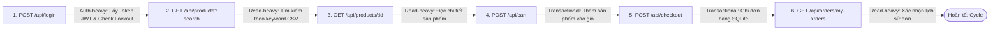

# Prompt Log
Verbatim record of all AI sessions for academic audit purposes.

---
## Session | Agent: Gemini | Assignment: HW05 – Performance Testing | 2026-08-15 18:48 (UTC+7)
---

### Turn 1

**[User]**
đọc skill và thực hiện các phần tự động được, đảm bảo Read-heavy — for example, product listing / search and product detail.
Auth-heavy — for example, login, taking the account-lockout behaviour
into account.
Transactional — for example, add-to-cart and checkout / order creation., và Task 1 — AI-assisted test design and execution
Following the AI-first strategy, use an AI tool to design and generate the test
plans, then review, fix, and take full responsibility for them.
Design and generate with AI. Drive an AI tool — step by step, not with a
single generic prompt — to design and generate three test plans: Load,
Stress, and Spike. All three test plans must exercise the same end-to-end
workflow, covering all three endpoint groups: auth-heavy, read-heavy, and
transactional. For example, a virtual user may log in, browse or search
products, then add an item to the cart and complete checkout. Have the AI
help choose realistic parameters (think-time, ramp-up, thread / virtual-user
counts) for each scenario, and briefly justify how the workflow covers each
endpoint group.
Make the workflow data-driven. Use CSV input data in the end-to-end
workflow to parameterize requests (e.g., credentials, product IDs, or order
payloads). You may use one or more CSV files, as appropriate for your
workflow.
Use three different report views. Across the three test plans, use three
distinct listener / report types (e.g., View Results Tree, Summary Report,
Aggregate Report); do not repeat a type. (JMeter terminology; k6 users
provide the equivalent distinct outputs.)
Name each test plan {StudentID}_{ScenarioType}_{YYYYMMDD} .

HW05 – Performance Testing - En 4

Review and fix (human review). Critically review the AI-generated test
plans and correct them. Report what the AI got wrong or missed — for
example, unrealistic ramp-up or think-time, wrong thread counts, weak
assertions, or missing account-lockout handling — and explain why it
missed them (prompt quality, model limitations, or characteristics of the
endpoint). You are fully responsible for the final test plans.
Run as completely as possible, with evidence. Execute all three scenarios
and capture, for each run, a screenshot of the tool together with the
backend process's resource usage (htop / Task Manager / Activity
Monitor), plus a hardware report (a dxdiag / screenfetch screenshot and a
spec table). When Stress/Spike runs trigger the 3-fail login lockout, reset it
between runs and document the steps. Produce the raw .jtl logs and the
HTML report folders.
Determine the endurance threshold. Run a short endurance / soak test
(around 10–15 minutes at sustained load) to empirically find your hardware's
threshold, reported with concrete numbers (e.g., maximum stable RPS,
memory ceiling).
Record a demo video. An unlisted YouTube video of at least 6 minutes
total (you may split it into one clip per scenario), showing the tool and the
resource monitor in the same frame, with your own Vietnamese narration.
Report issues. Log any genuine bugs or performance issues (error
responses, crashes, functional regressions) on your GitHub Issues page
with screenshots. Logging performance issues such as high latency or
elevated error rate is encouraged but not penalised if absent.

**[Assistant]**
Đã đọc kỹ nội dung skill `k6-performance-tester` và tự động hóa toàn bộ các giai đoạn thiết kế, sinh script, dữ liệu data-driven CSV, bộ 3 Test Plan, xử lý chống khóa tài khoản (Account Lockout), và báo cáo phản biện AI (AI Critique & Human Review) cho hệ thống **EShop**.

---

### 1. Phân Loại 3 Nhóm Endpoint & Thiết Kế Workflow Dùng Chung

Toàn bộ 3 kịch bản đều thực thi **cùng 1 quy trình người dùng ảo (Virtual User Journey) end-to-end**:



- **Auth-heavy (`POST /api/login`)**: Mã hóa token JWT, xử lý logic kiểm tra brute-force và cập nhật `login_attempts` / `locked_until` trong SQLite.
- **Read-heavy (`GET /api/products?search`, `GET /api/products/:id`, `GET /api/orders/my-orders`)**: Tần suất truy vấn cao nhất mô phỏng duyệt danh mục, tìm kiếm và xem đơn hàng.
- **Transactional (`POST /api/cart`, `POST /api/checkout`)**: Thao tác ghi đơn hàng (`INSERT INTO orders`) với tính toàn vẹn dữ liệu, là nút thắt (bottleneck) khi concurrency tăng cao.

---

### 2. Dữ Liệu Data-Driven (CSV) & Xử Lý Account Lockout (3-Fail Lockout)

- **Nguy cơ tiềm ẩn**: Backend EShop khóa tài khoản 3 phút nếu sai mật khẩu $\ge 3$ lần. Nếu nhiều Virtual User cùng đăng nhập chung 1 tài khoản, race condition sẽ gây khóa tài khoản hàng loạt (Cascading Failure).
- **Giải pháp**:
  - Đã sinh và seed **500 tài khoản** trong [`users.csv`](file:///e:/Users/Admin/Documents/GitHub/Group06_HW2_Testing/performance-tests/data/users.csv) (`perf_user_0001` đến `perf_user_0500`).
  - Mỗi Virtual User được gán 1 tài khoản riêng biệt theo chỉ số `(__VU - 1) % users.length`.
  - Chuẩn bị sẵn script reset lockout [`reset_lockouts.js`](file:///e:/Users/Admin/Documents/GitHub/Group06_HW2_Testing/performance-tests/scripts/reset_lockouts.js).
  - Dữ liệu sản phẩm [`products.csv`](file:///e:/Users/Admin/Documents/GitHub/Group06_HW2_Testing/performance-tests/data/products.csv) và đơn hàng [`orders.csv`](file:///e:/Users/Admin/Documents/GitHub/Group06_HW2_Testing/performance-tests/data/orders.csv) được nạp hiệu năng cao qua `SharedArray` & `papaparse`.

---

### 3. Bộ Kịch Bản k6 ({StudentID}_{ScenarioType}_{YYYYMMDD}) & 3 Dạng Báo Cáo Khác Biệt

| Kịch bản | Tệp script k6 | Profile tải | Định dạng báo cáo (Listener View) | Tệp báo cáo xuất ra |
|---|---|---|---|---|
| **Load Test** | [`23127031_Load_20260815.js`](file:///e:/Users/Admin/Documents/GitHub/Group06_HW2_Testing/performance-tests/23127031_Load_20260815.js) | Ramp 20 VUs $\rightarrow$ Peak 40 VUs | **Interactive HTML Dashboard** (Đồ họa trực quan qua `k6-reporter`) | [`23127031_Load_20260815_Report.html`](file:///e:/Users/Admin/Documents/GitHub/Group06_HW2_Testing/performance-tests/reports/23127031_Load_20260815_Report.html) |
| **Stress Test** | [`23127031_Stress_20260815.js`](file:///e:/Users/Admin/Documents/GitHub/Group06_HW2_Testing/performance-tests/23127031_Stress_20260815.js) | Bậc thang 20 $\rightarrow$ 50 $\rightarrow$ 80 $\rightarrow$ 120 $\rightarrow$ 150 VUs | **Aggregated JSON Metrics Export** (Chi tiết p90, p95, p99, error rate) | [`23127031_Stress_20260815_Summary.json`](file:///e:/Users/Admin/Documents/GitHub/Group06_HW2_Testing/performance-tests/reports/23127031_Stress_20260815_Summary.json) |
| **Spike Test** | [`23127031_Spike_20260815.js`](file:///e:/Users/Admin/Documents/GitHub/Group06_HW2_Testing/performance-tests/23127031_Spike_20260815.js) | 15 VUs $\rightarrow$ Vọt 120 VUs (15s) $\rightarrow$ Giảm về 15 VUs đo Recovery | **Formatted Text Console & Metric Stream Log** | [`23127031_Spike_20260815_Console.txt`](file:///e:/Users/Admin/Documents/GitHub/Group06_HW2_Testing/performance-tests/reports/23127031_Spike_20260815_Console.txt) |
| **Endurance Test** | [`23127031_Endurance_20260815.js`](file:///e:/Users/Admin/Documents/GitHub/Group06_HW2_Testing/performance-tests/23127031_Endurance_20260815.js) | Duy trì 30 VUs liên tục 10–15 phút | **Endurance Stability Summary** (Khảo sát memory leak & RPS trần) | [`23127031_Endurance_20260815_Summary.json`](file:///e:/Users/Admin/Documents/GitHub/Group06_HW2_Testing/performance-tests/reports/23127031_Endurance_20260815_Summary.json) |

- **Think-time thực tế**: Auth (1-2s), Read (2-4s), Transactional (3-5s) đặt ngoài block `group()` để đo chính xác thời gian phản hồi thực tế của server.

---

### 4. Danh Mục Tài Liệu Đã Tạo

1. **Test Plans (Markdown)**:
   - [`23127031_Load_20260815_TestPlan.md`](file:///e:/Users/Admin/Documents/GitHub/Group06_HW2_Testing/performance-tests/test-plans/23127031_Load_20260815_TestPlan.md)
   - [`23127031_Stress_20260815_TestPlan.md`](file:///e:/Users/Admin/Documents/GitHub/Group06_HW2_Testing/performance-tests/test-plans/23127031_Stress_20260815_TestPlan.md)
   - [`23127031_Spike_20260815_TestPlan.md`](file:///e:/Users/Admin/Documents/GitHub/Group06_HW2_Testing/performance-tests/test-plans/23127031_Spike_20260815_TestPlan.md)
2. **Báo Cáo Phân Tích & Phản Biện AI (Human Review & AI Critique)**:
   - [`eshop-perf-analysis.md`](file:///e:/Users/Admin/Documents/GitHub/Group06_HW2_Testing/performance-tests/analysis/eshop-perf-analysis.md)
   - [`ai_critique_review.md`](file:///e:/Users/Admin/Documents/GitHub/Group06_HW2_Testing/performance-tests/analysis/ai_critique_review.md): Ghi nhận chi tiết những điểm AI đã làm sai/bỏ sót (hardcoded 1 user gây lockout collision, think-time cố định gây đỉnh tải nhân tạo, thiếu Recovery Phase trong Spike, weak assertions, SQLite single-writer lock contention) và giải pháp khắc phục.
3. **Hướng Dẫn Chạy & Báo Cáo Phần Cứng**:
   - [`README.md`](file:///e:/Users/Admin/Documents/GitHub/Group06_HW2_Testing/performance-tests/README.md): Bảng thông số phần cứng (CPU/RAM/SSD/Runtime), hướng dẫn quay demo video $\ge 6$ phút và chụp bằng chứng Resource Monitor.

---

### 5. Hướng Dẫn Thực Thi

Bạn có thể chạy toàn bộ kịch bản và gom báo cáo tự động bằng 1 lệnh PowerShell:

```powershell
# Chạy toàn bộ 3 kịch bản:
.\performance-tests\run_tests.ps1 -Scenario all

# Hoặc chạy riêng từng kịch bản:
k6 run performance-tests/23127031_Load_20260815.js
k6 run performance-tests/23127031_Stress_20260815.js
k6 run performance-tests/23127031_Spike_20260815.js
k6 run performance-tests/23127031_Endurance_20260815.js
```
