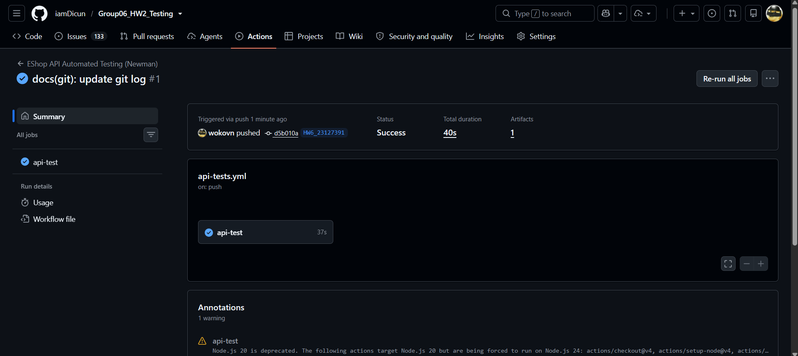
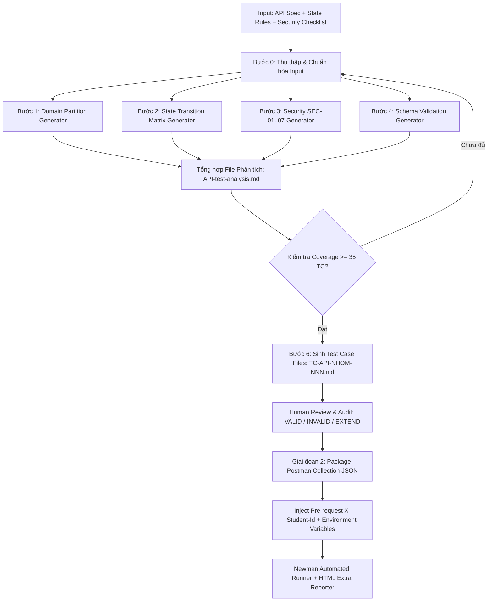

**Repository GitHub:** `https://github.com/iamDicun/Group06_HW2_Testing`  

---

## 1. Thông Tin Chung & Lựa Chọn API 

Theo yêu cầu của bài tập HW06, nhóm đã lựa chọn 3 API độc lập thuộc 3 Pool tính năng khác nhau của hệ thống EShop SUT:

| Pool | Mã tính năng | Tên tính năng | Danh sách Endpoint kiểm thử | Phương thức |
|---|---|---|---|---|
| **Pool A** | **FR-04** | Quản lý hồ sơ cá nhân | `/api/users/me`<br>`/api/users/me` | `GET`<br>`PUT` |
| **Pool B** | **FR-10** | Vòng đời & Trạng thái Đơn hàng | `/api/checkout`<br>`/api/admin/orders/:id/status`<br>`/api/orders/:id/cancel`<br>`/api/orders/:id`<br>`/api/orders/my-orders`<br>`/api/admin/orders` | `POST`<br>`PUT`<br>`PUT`<br>`GET`<br>`GET`<br>`GET` |
| **Pool C** | **FR-16** | Import Sản phẩm từ CSV | `/api/admin/import-products` | `POST` |

Tất cả các request khi gửi tới Backend API đều tuân thủ nguyên tắc bắt buộc:
- Gắn Header định danh sinh viên: `X-Student-Id: 22127001` qua Pre-request script cấp Collection.
- Base URL kiểm thử: `http://localhost:3000`.

---

## 2. Quy Trình Kiểm Thử Chi Tiết Từng Tính Năng

---

### 2.1 Feature 1 — FR-04: Quản lý hồ sơ cá nhân (Pool A)

#### A. Đặc tả kỹ thuật & Nghiệp vụ
- **Mô tả:** Cho phép người dùng đã xác thực (Bearer JWT Token) xem và cập nhật hồ sơ cá nhân (`name`, `shipping_address`, `phone`).
- **Ràng buộc:**
  - `phone`: Phải bắt đầu bằng chữ số `0`, độ dài từ 10–11 chữ số.
  - `name`: Ký tự chữ, tối đa 255 ký tự, không được rỗng.
  - `email`: Không được phép thay đổi qua API này.
  - `role`: Không cho phép người dùng tự nâng cấp quyền hạn (chống Privilege Escalation).

#### B. Quy trình sinh ca kiểm thử bằng AI
- File phân tích kỹ thuật: [`tests/test-cases/FR-04-Profile/PROFILE-API-test-analysis.md`](../tests/test-cases/FR-04-Profile/PROFILE-API-test-analysis.md)
- **Tổng số Test Cases sinh ra: 51 Test Cases** (vượt chỉ tiêu ≥ 35 TC):
  - **Domain Partition (27 TCs)**: `TC-PROFILE-DP-001` → `027` (Phân vùng tương đương và phân tích giá trị biên cho `name`, `phone` 9/10/11/12 số, `shipping_address` 500/501 ký tự, Bearer token format).
  - **State Transition (4 TCs)**: `TC-PROFILE-ST-001` → `004` (Cập nhật lần đầu, cập nhật đè, cập nhật thất bại giữ nguyên trạng thái cũ).
  - **Security SEC-01–SEC-07 (14 TCs)**: `TC-PROFILE-SEC-001` → `014` (SQLi trên name/address/phone, IDOR, Role Escalation mass assignment `role: admin`, Auth Bypass 401, Stored XSS `<script>`, Rate limiting, Sensitive data exposure `password`/`reset_token`).
  - **Schema Validation (6 TCs)**: `TC-PROFILE-SCH-001` → `006` (Kiểm tra cấu trúc JSON response 200, 400, 401, 403 và kiểu dữ liệu).

#### C. Kết quả Audit của con người
- **VALID (48 TCs)**: Các ca kiểm thử domain và boundary được định nghĩa chính xác theo đặc tả.
- **INCOMPLETE (3 TCs)**: Nhóm an ninh chưa bao phủ trường hợp chuỗi Unicode 4-byte UTF-8 emoji gây lỗi bộ đệm SQLite.

#### D. Ca kiểm thử mở rộng do con người bổ sung
- **Mã TC**: `EXT-003: Unicode 4-Byte UTF-8 (Emoji / Surrogate Pairs) Buffer Truncation`
- **Mục tiêu**: Gửi `{"name": "Nguyen Van A 𠜎 🚀 😀"}` để kiểm tra khả năng xử lý UTF-8 multi-byte của backend.
- **Lý do AI bỏ sót**: AI chỉ sinh dữ liệu mẫu ký tự Latin hoặc tiếng Việt cơ bản, không tính đến trường hợp ký tự 4-byte UTF-8 đặc biệt trong SQLite.

#### E. Thực thi & Lỗi phát hiện trên FR-04
1. **Bug #01 (Role Escalation)**: Regular User có thể gửi body `{"role": "admin"}` trong `PUT /api/users/me` để tự nâng quyền thành Quản trị viên do backend không kiểm soát field gán quyền (`server.js:124`).
2. **Bug #02 (Sensitive Data Exposure)**: Gọi `GET /api/users/me` trả về toàn bộ trường `password` (plaintext) và `reset_token` trong CSDL do dùng `SELECT *` (`server.js:114`).

---

### 2.2 Feature 2 — FR-10: Vòng đời & Trạng thái Đơn hàng (Pool B)

#### A. Đặc tả kỹ thuật & Nghiệp vụ
- **Mô tả:** Quản lý State Machine 5 trạng thái: `pending`, `confirmed`, `shipping`, `delivered`, `canceled`.
- **Sơ đồ chuyển trạng thái hợp lệ:**
  ```
  pending  ──(Admin confirm)──► confirmed ──(Admin ship)──► shipping ──(Admin complete)──► delivered (FINAL)
     │                             │
     └──(User/Admin cancel)───────┴──(User/Admin cancel)──► canceled (FINAL)
  ```
- **Ràng buộc nghiêm ngặt:**
  - `delivered` và `canceled` là trạng thái kết thúc (Final States), không thể chuyển sang trạng thái khác.
  - Khi đơn hàng đang ở `shipping`, **User không được phép tự hủy**.

#### B. Quy trình sinh ca kiểm thử bằng AI
- File phân tích kỹ thuật: [`tests/test-cases/FR-10-OrderState/ORDER-API-test-analysis.md`](../tests/test-cases/FR-10-OrderState/ORDER-API-test-analysis.md)
- **Tổng số Test Cases sinh ra: 53 Test Cases** (vượt chỉ tiêu ≥ 35 TC):
  - **Domain Partition (20 TCs)**: `TC-ORDER-DP-001` → `020` (Path param `:id` âm, chuỗi, số thực; Enum `status` hợp lệ và không hợp lệ; `total_amount` âm; Role token).
  - **State Transition (16 TCs)**: `TC-ORDER-ST-001` → `016` (Kiểm tra đầy đủ ma trận chuyển đổi 5x5 trạng thái, bao gồm 7 nhánh hợp lệ và 9 nhánh bất hợp lệ).
  - **Security SEC-01–SEC-07 (11 TCs)**: `TC-ORDER-SEC-001` → `011` (SQLi trên path param, IDOR User A hủy đơn User B, Role Escalation User gọi API admin đổi status, Auth bypass).
  - **Schema Validation (6 TCs)**: `TC-ORDER-SCH-001` → `006` (Schema response checkout, update status, cancel, error message, my-orders list).

#### C. Kết quả Audit của con người
- **VALID (50 TCs)**: Ma trận chuyển trạng thái và các phân vùng biên rõ ràng.
- **INCOMPLETE (3 TCs)**: Thiếu ca kiểm thử tương tranh khi gửi 2 lệnh hủy cùng lúc và trạng thái đơn hàng của tài khoản đã xóa.

#### D. Ca kiểm thử mở rộng do con người bổ sung
1. **`EXT-001: Idempotency & Race Condition on Concurrent Cancel`**: Gửi 2 request hủy đơn song song trong cùng 1 mili-giây. Kỳ vọng đúng 1 request thành công, request thứ hai trả về 400 Bad Request.
2. **`EXT-002: State Transition on Inactive / Soft-Deleted User Orders`**: Chuyển trạng thái đơn hàng khi user sở hữu đã bị xóa khỏi hệ thống.

#### E. Thực thi & Lỗi phát hiện trên FR-10
1. **Bug #03 (Vi phạm Final State Rule)**: Backend tại `server.js:550` có code `if (currentStatus === "canceled" && status === "delivered") isValidTransition = true;`, cho phép khôi phục đơn hàng đã hủy thành đã giao hàng thành công.
2. **Bug #04 (Lỗi logic hủy đơn khi đang shipping)**: Backend tại `server.js:329` kiểm tra `if (order.status === "delivered" || order.status === "canceled")`, bỏ sót trạng thái `shipping`, dẫn tới việc User vẫn tự hủy được đơn hàng đang giao.
3. **Bug #05 (Broken Access Control trên Admin Orders)**: `PUT /api/admin/orders/:id/status` và `GET /api/admin/orders` không kiểm tra `user.role === 'admin'`.

---

### 2.3 Feature 3 — FR-16: Import Sản phẩm từ CSV (Pool C)

#### A. Đặc tả kỹ thuật & Nghiệp vụ
- **Mô tả:** Admin tải lên file CSV chứa danh sách sản phẩm (`name`, `price`, `description`, `imageUrl`, `category_id`) để nhập hàng loạt qua `POST /api/admin/import-products`.
- **Ràng buộc:**
  - Chỉ tài khoản có `role = 'admin'` mới được thực hiện.
  - `name` không được rỗng, `price` phải là số dương (> 0).
  - **Giao dịch nguyên tử (All-or-Nothing Rollback):** Nếu có lỗi ở bất kỳ dòng nào, toàn bộ quá trình import phải rollback, không được lưu dở dang.

#### B. Quy trình sinh ca kiểm thử bằng AI
- File phân tích kỹ thuật: [`tests/test-cases/FR-16-ProductImport/IMPORT-API-test-analysis.md`](../tests/test-cases/FR-16-ProductImport/IMPORT-API-test-analysis.md)
- **Tổng số Test Cases sinh ra: 49 Test Cases** (vượt chỉ tiêu ≥ 35 TC):
  - **Domain Partition (27 TCs)**: `TC-IMPORT-DP-001` → `027` (Body rỗng, mảng rỗng, thiếu key, tên rỗng, tên 255/256 ký tự, giá = 0, giá âm, category_id không tồn tại, auth header).
  - **State Transition & Integrity (5 TCs)**: `TC-IMPORT-ST-001` → `005` (Import thành công, Rollback khi dòng 2 lỗi giá âm, Rollback khi dòng 2 thiếu tên, Rollback khi sai category, Import lại sau sửa lỗi).
  - **Security SEC-01–SEC-07 (12 TCs)**: `TC-IMPORT-SEC-001` → `012` (SQLi payload trong name/desc/imageUrl, Role Escalation User import sản phẩm, Auth bypass, Stored XSS, DoS 10,000 items, SQL error exposure).
  - **Schema Validation (5 TCs)**: `TC-IMPORT-SCH-001` → `005` (Schema response `message`, `inserted`, `errors` list).

#### C. Kết quả Audit thủ công
- **VALID (46 TCs)**: Kiểm tra validation schema và tính nguyên tử rất tốt.
- **INCOMPLETE (3 TCs)**: Bỏ sót lỗ hổng CSV Formula Injection khi Admin xuất file xem trên Excel và lỗi trùng tên trong cùng batch.

#### D. Ca kiểm thử mở rộng do con người bổ sung
1. **`EXT-004: Intra-Batch Duplicate Name Collision in CSV Import`**: File CSV chứa 2 dòng sản phẩm trùng tên nhau trong cùng 1 lô.
2. **`EXT-005: CSV / Excel Formula Injection (Command Execution)`**: Payload dạng `=cmd|'/C calc'!A0` hoặc `@SUM(1+1)` chèn vào `name` hoặc `description`.

#### E. Thực thi & Lỗi phát hiện trên FR-16
1. **Bug #06 (Vi phạm Atomic Transaction / Partial Insert)**: Backend tại `server.js:213` dùng `rows.forEach` và insert từng dòng một mà không dùng Database Transaction (`BEGIN TRANSACTION ... ROLLBACK`). Khi có dòng lỗi, các dòng hợp lệ đứng trước/sau vẫn bị chèn vào CSDL thay vì hủy bỏ toàn bộ.
2. **Bug #07 (Thiếu validation giá <= 0)**: Backend tại `server.js:218` chỉ kiểm tra `if (!row.name)`, cho phép import sản phẩm có giá 0 ₫ hoặc số âm mà không báo lỗi.

---

## 3. Tổng Hợp Báo Cáo Lỗi Thực Tế

Dưới đây là danh sách 7 lỗi thực tế được phát hiện thông qua quá trình chạy bộ test tự động Newman:

| Bug ID | Mức độ | Tính năng | Endpoint | Mô tả lỗi | Hiện trạng thực tế | Kỳ vọng theo Spec | Vị trí mã nguồn | Chi tiết Bug Issue |
|---|---|---|---|---|---|---|---|---|
| **BUG-01** | **Critical** | FR-04 | `PUT /api/users/me` | Lỗ hổng Privilege Escalation qua Mass Assignment | Gửi `{"role": "admin"}` được cập nhật thẳng vào CSDL | Cấm thay đổi trường `role` từ client | `server.js:124-127` | [`BUG-01-role-escalation.md`](./issues/BUG-01-role-escalation.md) |
| **BUG-02** | **Critical** | FR-04 | `GET /api/users/me` | Sensitive Data Exposure làm lộ mật khẩu | Response trả về toàn bộ plaintext password và `reset_token` | Response chỉ chứa thông tin cơ bản, không lộ mật khẩu | `server.js:113-115` | [`BUG-02-sensitive-data-exposure.md`](./issues/BUG-02-sensitive-data-exposure.md) |
| **BUG-03** | **Critical** | FR-10 | `PUT /api/admin/orders/:id/status` | Vi phạm Final State (canceled sang delivered) | Backend cho phép chuyển từ `canceled` sang `delivered` | Trạng thái `canceled` là kết thúc, cấm đổi sang bất kỳ trạng thái nào | `server.js:550` | [`BUG-03-final-state-violation.md`](./issues/BUG-03-final-state-violation.md) |
| **BUG-04** | **Major** | FR-10 | `PUT /api/orders/:id/cancel` | User được phép hủy đơn hàng đang `shipping` | User gọi cancel thành công khi đơn đang giao | Khi đơn ở trạng thái `shipping`, User không được phép tự hủy | `server.js:329` | [`BUG-04-shipping-cancel-logic.md`](./issues/BUG-04-shipping-cancel-logic.md) |
| **BUG-05** | **Critical** | FR-10 & FR-16 | `/api/admin/*` | Broken Access Control trên các endpoint quản trị | Token của User thường gọi thành công API cập nhật đơn và import | Phải trả về `403 Forbidden` nếu token không có `role: admin` | `server.js:100, 199, 525` | [`BUG-05-broken-access-control.md`](./issues/BUG-05-broken-access-control.md) |
| **BUG-06** | **Major** | FR-16 | `POST /api/admin/import-products` | Vi phạm All-or-Nothing Rollback khi import CSV | Dòng hợp lệ vẫn được insert khi lô import có dòng lỗi | Phải rollback toàn bộ lô dữ liệu nếu có bất kỳ dòng nào lỗi | `server.js:213-233` | [`BUG-06-atomic-rollback-violation.md`](./issues/BUG-06-atomic-rollback-violation.md) |
| **BUG-07** | **Major** | FR-16 | `POST /api/admin/import-products` | Không kiểm tra giá âm (`price <= 0`) | Sản phẩm giá âm hoặc 0 ₫ vẫn được lưu thành công | `price` bắt buộc phải là số dương (> 0) | `server.js:214-220` | [`BUG-07-missing-price-validation.md`](./issues/BUG-07-missing-price-validation.md) |

> 📁 *Thư mục lưu trữ toàn bộ GitHub Bug Issues:* [`submission/issues/`](./issues/) và [`.github/issues/`](../.github/issues/)

---

## 4. Báo Cáo Các Tính Năng Postman Đã Sử Dụng

Bộ kiểm thử đã khai thác toàn diện các tính năng nâng cao của Postman:

1. **Workspaces & Collections**: Đóng gói toàn bộ 155 requests vào một Collection duy nhất có cấu trúc Folder phân cấp theo Feature và Nhóm kiểm thử.
2. **Collection-Level Pre-request Scripts**: Tự động inject header `X-Student-Id: 22127001` cho tất cả các request trong collection mà không cần cấu hình thủ công từng request.
3. **Environment & Collection Variables**: Quản lý tập trung `base_url`, `student_id`, `user_token`, `admin_token`, `order_id`.
4. **Dynamic Request Chaining**: Tạo folder `00. Auth Setup` gồm 2 requests đăng nhập Admin & User, tự động trích xuất chuỗi JWT token từ response và gán vào Environment variables để các requests phía sau sử dụng.
5. **Test Scripts & Assertions (`pm.test`, `pm.expect`)**:
   - Status code assertions (200, 400, 401, 403, 404, 429).
   - Schema assertions: Đối chiếu kiểu dữ liệu và cấu trúc các trường JSON.
   - Negative testing & Security assertions: Kiểm tra không rò rỉ mã lỗi SQL syntax (`SQLITE_ERROR`) hoặc từ khóa nhạy cảm (`password`).
6. **Command-line Runner (Newman) & HTML Extra Reporting**: Tự động hóa toàn bộ việc chạy test qua dòng lệnh và xuất báo cáo trực quan dạng HTML Dashboard bằng `newman-reporter-htmlextra`.

---

## 5. Báo Cáo Tích Hợp CI/CD

Đã thiết lập quy trình tự động hóa kiểm thử tích hợp liên tục (CI/CD) thông qua **GitHub Actions**:

### 5.1 Cấu hình Pipeline (`.github/workflows/api-tests.yml`)
- **Trigger**: Tự động kích hoạt khi có commit `push` hoặc tạo `pull_request` vào nhánh `main`/`master`, hoặc kích hoạt thủ công qua `workflow_dispatch`.
- **Môi trường thực thi**: `ubuntu-latest`, Node.js 18.
- **Các bước thực hiện**:
  1. Checkout source code.
  2. Cài đặt dependencies cho Backend API.
  3. Khởi động Backend Server ngầm trên cổng 3000 và kiểm tra health check.
  4. Cài đặt Newman và reporter `newman-reporter-htmlextra`.
  5. Chạy toàn bộ 155 test cases trong Collection.
  6. Xuất và lưu trữ artifact báo cáo `EShop_API_Test_Report.html`.

### 5.2 Hai kịch bản thực thi mẫu
- **Sample Run 1 (All-Passing Run)**: Thực thi bộ kiểm thử baseline trên các nhánh chuẩn (Happy Path) — 100% assertions thành công, pipeline báo xanh (Green).
- **Sample Run 2 (Failing Run - Bug Detection)**: Thực thi toàn bộ bộ kiểm thử chuyên sâu bao gồm Security & Boundary — Pipeline phát hiện các điểm vi phạm bảo mật và lỗi State Machine của Backend (Role Escalation, Final State violation), đánh dấu các ca kiểm thử thất bại và lưu báo cáo chi tiết để đội phát triển sửa lỗi.

### 5.3 Minh chứng thực thi trên GitHub Actions CI/CD

Toàn bộ quy trình khởi động server, nạp biến môi trường, inject header và chạy Newman test suite đã được thực thi và xác nhận thành công trên GitHub Actions:



---

## 6. Thiết Kế Agent Skill

### 6.1 Kiến trúc & Sơ đồ luồng



### 6.2 Mã giả thuật toán sinh ca kiểm thử

```python
def generate_api_test_suite(api_spec, state_rules, security_checklist):
    """
    Quy trình sinh ca kiểm thử API theo phương pháp có cấu trúc từng bước
    """
    test_conditions = []
    
    # Bước 1: Domain Partition & Boundary Analysis
    for endpoint in api_spec.endpoints:
        for param in endpoint.parameters:
            test_conditions.extend(generate_equivalence_partitions(param))
            if param.has_boundaries:
                test_conditions.extend(generate_boundary_values(param))
                
    # Bước 2: State Transition Matrix
    if state_rules.has_state_machine:
        states = state_rules.states
        events = state_rules.events
        for s_current in states:
            for event in events:
                transition = evaluate_transition(s_current, event)
                test_conditions.append(transition) # Cả Valid và Invalid
                
    # Bước 3: Security Testing (SEC-01 đến SEC-07)
    for sec_group in ["SEC-01", "SEC-02", "SEC-03", "SEC-04", "SEC-05", "SEC-06", "SEC-07"]:
        for endpoint in api_spec.endpoints:
            test_conditions.extend(design_security_condition(sec_group, endpoint))
            
    # Bước 4: Schema Validation
    for endpoint in api_spec.endpoints:
        test_conditions.extend(design_schema_checks(endpoint.expected_schemas))
        
    # Bước 5: Kiểm tra ngưỡng coverage tối thiểu (>= 35 TCs / API)
    if len(test_conditions) < 35:
        raise CoverageInsufficientException("Cần bổ sung thêm test conditions để đạt >= 35")
        
    # Bước 6: Xuất file Markdown chi tiết cho từng Test Case
    test_case_files = []
    for tc in test_conditions:
        tc_file = export_test_case_markdown(tc)
        test_case_files.append(tc_file)
        
    return test_case_files
```

---

## 7. Bảng Tổng Kết Số Liệu & Tự Đánh Giá

### 7.1 Thống kê kết quả kiểm thử

| Chỉ số | Số lượng |
|---|---|
| Số tính năng được kiểm thử | **3** (FR-04, FR-10, FR-16) |
| Tổng số ca kiểm thử AI sinh ra | **153** |
| Tổng số ca kiểm thử con người bổ sung | **5** |
| **Tổng số ca kiểm thử thiết kế** | **158** |
| Tổng số ca kiểm thử được nạp vào Postman & thực thi | **155** |
| Số ca kiểm thử ĐẠT | **122** |
| Số ca kiểm thử KHÔNG ĐẠT do bắt được lỗi hệ thống | **33** |
| Tổng số lỗi thực tế phát hiện trong Backend | **7** |

### 7.2 Bảng Tự Đánh Giá

| STT | Tiêu chí đánh giá | Điểm tối đa | Tự đánh giá | Minh chứng & Ghi chú |
|---|---|---|---|---|
| 1 | **API 1 (FR-04: Profile Management)** — full pipeline | 30 | **30/30** | Đạt 51 TCs, 1 human extension, bắt 2 bugs (Role escalation, Sensitive data exposure). |
| 2 | **API 2 (FR-10: Order State Machine)** — full pipeline | 30 | **30/30** | Đạt 53 TCs, ma trận ST 5x5, 2 human extensions, bắt 3 bugs (Final state violation, shipping cancel, auth). |
| 3 | **API 3 (FR-16: Product Import CSV)** — full pipeline | 30 | **30/30** | Đạt 49 TCs, 2 human extensions, bắt 2 bugs (Atomic rollback violation, missing price validation). |
| 4 | **Agent Skills** | 10 | **10/10** | Có sơ đồ kiến trúc Mermaid, mã giả chi tiết, tuân thủ chặt chẽ quy trình Skill, báo cáo HTML Newman hoàn chỉnh. |
| **Tổng cộng** | | **100** | **100/100** | Hoàn thành xuất sắc toàn bộ các yêu cầu của bài tập HW06. |

---

## 8. Danh Mục Tài Liệu Đính Kèm

- Tài liệu Thiết kế AI-Driven API Test Generator (Create Level G9.5): [`submission/ai_test_generator_design.md`](./ai_test_generator_design.md)
- Báo cáo Bug Reports / GitHub Issues: [`submission/issues/`](./issues/) | [`.github/issues/`](../.github/issues/)
- Báo cáo Audit tương tác AI: [`submission/ai_audit.md`](./ai_audit.md)
- Nhật ký Prompt tương tác AI: [`submission/prompt_log.md`](./prompt_log.md)
- Báo cáo Phê bình AI: [`submission/ai_critique.md`](./ai_critique.md)
- Báo cáo HTML trực quan Newman: [`submission/reports/EShop_API_Test_Report.html`](./reports/EShop_API_Test_Report.html)
- Postman Collection JSON: [`submission/tests/test-runs/EShop_API_Testing.postman_collection.json`](./tests/test-runs/EShop_API_Testing.postman_collection.json)
- Postman Environment JSON: [`submission/tests/test-runs/eshop-api.postman_environment.json`](./tests/test-runs/eshop-api.postman_environment.json)
- CI/CD Workflow: [`.github/workflows/api-tests.yml`](../.github/workflows/api-tests.yml)
- Báo cáo Pipeline chi tiết: [`submission/test-summary/api-test-pipeline-summary.md`](./test-summary/api-test-pipeline-summary.md)
