# Báo Cáo Kiểm Thử Giao Diện & Khả Năng Sử Dụng (GUI & Usability Report) — HW03

## 1. Thông tin chung

- **Bài tập**: HW03 – GUI & Usability
- **Hệ thống kiểm thử (SUT)**: EShop E-Commerce System
- **Phương pháp kiểm thử**: Black-box Testing (Kiểm thử hộp đen dựa trên trải nghiệm & giao diện người dùng)
- **Danh sách màn hình được lựa chọn kiểm thử**:
  1. **FR-05**: Product Listing and Search (Pool A)
  2. **FR-07**: Shopping Cart (Pool B)
  3. **FR-11**: Order History View - User (Pool B)
- **Các khía cạnh giao diện (Interface Aspects)**:
  - `IA-01`: General UI Standards
  - `IA-02`: Forms
  - `IA-03`: Navigation
  - `IA-04`: Feedback / State

---

## 2. Tổng quan kết quả kiểm thử (Test Summary)

| Màn hình / Feature | Số mục thiết kế | Passed (Đạt) | Failed (Lỗi GUI) | N/A |
|---|---|---|---|---|
| FR-05: Product Listing and Search | 15 | 11 | 4 | 0 |
| FR-07: Shopping Cart | 15 | 9 | 5 | 1 |
| FR-11: Order History View | 15 | 14 | 1 | 0 |
| **Tổng cộng (Total)** | **45** | **34** | **10** | **1** |

---

## 3. Task 1: Bảng Checklist Chi Tiết & Kết Quả Thực Thi (Execution Results)

### 3.1 FR-05: Product Listing and Search (Trang Danh Sách & Tìm Kiếm Sản Phẩm)

| Mã Check | Nhóm | Nội dung kiểm tra | IA Aspect | Trạng thái | Ghi chú / Nguyên nhân thất bại | Minh chứng |
|---|---|---|---|---|---|---|
| GUI-LAY-01 | LAY | Tiêu đề chính của trang hiển thị duy nhất 1 tiêu đề chính ở đầu trang | IA-01 | Passed | Không có tiêu đề nào bị trùng lặp. | |
| GUI-LAY-02 | LAY | Lưới sản phẩm căn chỉnh khoảng cách đều đặn | IA-01 | Passed | Khoảng cách giữa các ô sản phẩm hiển thị cân đối. | |
| GUI-LAY-03 | LAY | Ảnh sản phẩm cố định chiều cao không vỡ khung | IA-01 | Passed | Khung ảnh vừa vặn, không bị co giãn méo hình. | |
| GUI-CON-01 | CON | Ngôn ngữ nhất quán tiếng Việt | IA-01 | Passed | Chữ tiếng Việt hiển thị rõ ràng. | |
| GUI-CON-02 | CON | Đơn vị tiền tệ hiển thị ký hiệu `₫` | IA-01 | Failed | Giao diện hiển thị đơn vị "VND" thay vì ký hiệu `₫`. | 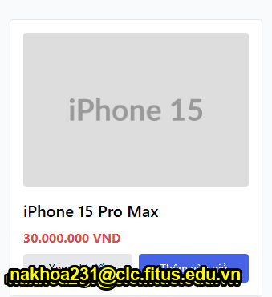 |
| GUI-CON-03 | CON | Tên sản phẩm quá dài cắt bằng ellipsis | IA-01 | Passed | Tên sản phẩm quá dài hiển thị dấu ba chấm (...). | |
| GUI-FUN-01 | FUN | Tìm kiếm sản phẩm theo từ khóa | IA-02 | Passed | Tìm kiếm lọc danh sản phẩm đúng từ khóa. | |
| GUI-FUN-02 | FUN | Nút "Thêm vào giỏ" thêm 1 sản phẩm | IA-04 | Failed | Thao tác thêm vào giỏ hàng thành công nhưng không thông báo qua giao diện, user dễ hiểu nhầm là chưa thêm được sản phẩm. | 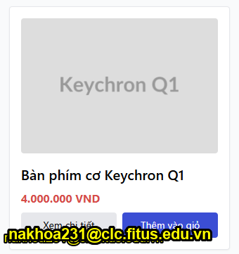 |
| GUI-FUN-03 | FUN | Nút "Xem chi tiết" mở đúng sản phẩm | IA-03 | Passed | Điều hướng mở đúng trang chi tiết sản phẩm. | |
| GUI-NAV-01 | NAV | Thứ tự Tab phím hợp lý | IA-03 | Passed | Tab chuyển focus bàn phím đúng trình tự. | |
| GUI-RES-01 | RES | Lưới sản phẩm responsive từ 1 cột đến 3 cột | IA-01 | Passed | Hiển thị linh hoạt trên màn hình điện thoại và máy tính. | |
| GUI-ACC-01 | ACC | Ảnh sản phẩm có văn bản mô tả hình ảnh | IA-01 | Failed | Văn bản mô tả hình ảnh hỗ trợ trình đọc màn hình bị bỏ rỗng. Vi phạm FR-24. | |
| GUI-ACC-02 | ACC | Chữ giá màu đỏ đạt tương phản WCAG | IA-01 | Passed | Độ tương phản chữ màu đỏ trên nền trắng tốt. | |
| GUI-ERR-01 | ERR | Trạng thái empty state khi tìm không thấy | IA-04 | Failed | Màn hình hiển thị màu trắng, không thông báo không tồn tại sản phẩm. | 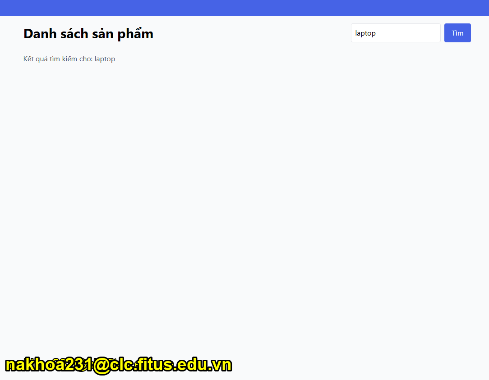 |
| GUI-ERR-02 | ERR | An toàn từ khóa tìm kiếm khi chứa ký tự đặc biệt | IA-02 | Failed | Từ khóa tìm kiếm chứa ký tự đặc biệt làm hiển thị sai định dạng trên giao diện. | 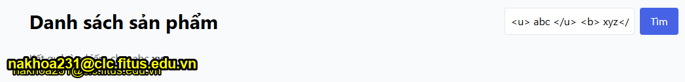 |

---

### 3.2 FR-07: Shopping Cart (Trang Giỏ Hàng)

| Mã Check | Nhóm | Nội dung kiểm tra | IA Aspect | Trạng thái | Ghi chú / Nguyên nhân thất bại | Minh chứng |
|---|---|---|---|---|---|---|
| GUI-LAY-01 | LAY | Bảng giỏ hàng căn chỉnh các cột ngay ngắn | IA-01 | Passed | Các cột và đường viền phân tách bảng rõ ràng. | |
| GUI-LAY-02 | LAY | Nút Thanh toán xanh lá và Nút Xóa màu đỏ phân biệt | IA-01 | Passed | Màu sắc nút bấm phân biệt thao tác rõ ràng. | |
| GUI-CON-01 | CON | Nhãn tổng tiền hiển thị "Tổng cộng" | IA-01 | Failed | Giao diện hiển thị nhãn "Tổng tạm tính:". | 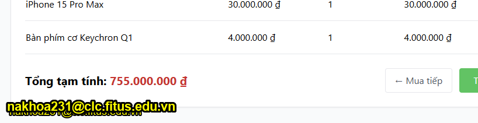 |
| GUI-CON-02 | CON | Đơn giá và thành tiền có ký hiệu `₫` | IA-01 | Passed | Định dạng số tiền có phân cách và ký hiệu `₫`. | |
| GUI-CON-03 | CON | Nút quay lại ghi "Tiếp tục mua sắm" | IA-03 | Failed | Nút hiển thị "Mua tiếp". | 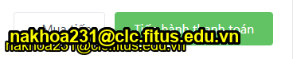 |
| GUI-FUN-01 | FUN | Có bộ nút `+` / `-` thay đổi số lượng | IA-02 | Failed | Cột số lượng chỉ hiển thị số tĩnh, thiếu bộ nút `+`/`-` theo FR-07. | 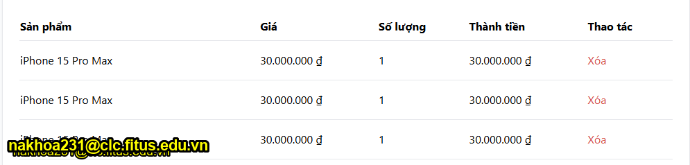 |
| GUI-FUN-02 | FUN | Xóa sản phẩm phải có Dialog xác nhận | IA-04 | Failed | Bấm "Xóa" loại bỏ sản phẩm trực tiếp, không mở hộp thoại xác nhận. | 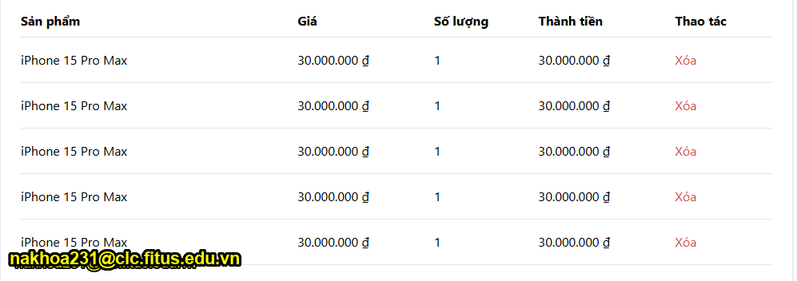 |
| GUI-FUN-03 | FUN | Tổng tiền tự động tính lại khi thay đổi | IA-04 | Passed | Số tiền tự động cập nhật lại chính xác. | |
| GUI-NAV-01 | NAV | Nút Mua tiếp quay về Trang chủ | IA-03 | Passed | Điều hướng quay trở lại trang chủ. | |
| GUI-NAV-02 | NAV | Nút Thanh toán dẫn tới trang Thanh toán khi đã login | IA-03 | Passed | Mở trang thanh toán thành công. | |
| GUI-NAV-03 | NAV | Nút Thanh toán yêu cầu login khi chưa auth | IA-03 | Passed | Hiển thị thông báo và mở trang đăng nhập. | |
| GUI-RES-01 | RES | Bảng giỏ hàng tự điều chỉnh trên mobile | IA-01 | Passed | Giao diện bảng hiển thị ổn định trên di động. | |
| GUI-ACC-01 | ACC | Bảng giỏ hàng hỗ trợ công cụ trợ năng khiếm thị | IA-01 | Passed | Cấu trúc bảng hiển thị rõ ràng, hỗ trợ trình đọc màn hình. | |
| GUI-ERR-01 | ERR | Giỏ hàng trống có hình minh họa | IA-04 | Failed | Giao diện giỏ trống chỉ có dòng chữ, thiếu hình minh họa. | 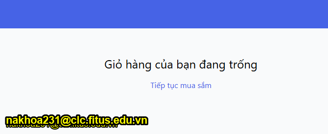 |
| GUI-ERR-02 | ERR | Hủy xóa sản phẩm trong dialog | IA-04 | N/A | Không thể kiểm tra do chưa có hộp thoại xác nhận. | |

---

### 3.3 FR-11: Order History View (Trang Lịch Sử Đơn Hàng User)

| Mã Check | Nhóm | Nội dung kiểm tra | IA Aspect | Trạng thái | Ghi chú / Nguyên nhân thất bại | Minh chứng |
|---|---|---|---|---|---|---|
| GUI-LAY-01 | LAY | Bố cục 2 cột trên desktop, 1 cột trên mobile | IA-01 | Passed | Bố cục tự động điều chỉnh dạng hàng hoặc cột phù hợp màn hình. | |
| GUI-LAY-02 | LAY | Badge trạng thái bo tròn, padding cân đối | IA-01 | Passed | Nhãn trạng thái bo tròn gọn gàng. | |
| GUI-LAY-03 | LAY | Mã đơn hàng font monospaced | IA-01 | Passed | Mã đơn hàng sử dụng kiểu chữ đơn cách dễ đọc. | |
| GUI-CON-01 | CON | Trạng thái dịch sang tiếng Việt | IA-04 | Passed | Dịch chuẩn: Chờ xác nhận, Đã xác nhận, Đang giao, Đã giao, Đã hủy. | |
| GUI-CON-02 | CON | Tổng tiền đơn hàng có ký hiệu `₫` | IA-01 | Passed | Định dạng số tiền có phân cách và ký hiệu `₫`. | |
| GUI-CON-03 | CON | Tiêu đề cột tiếng Việt chuẩn | IA-01 | Passed | Tiêu đề các cột viết chính xác. | |
| GUI-FUN-01 | FUN | Nút Hủy đơn hiển thị cho pending / confirmed | IA-04 | Passed | Hiển thị nút Hủy đơn cho các đơn hàng chưa hoàn thành. | |
| GUI-FUN-02 | FUN | Không cho User tự hủy đơn khi `shipping` | IA-04 | Failed | Nút Hủy đơn vẫn xuất hiện và cho phép thao tác khi đơn hàng ở trạng thái Đang giao (`shipping`). Vi phạm sơ đồ chuyển trạng thái FR-10. | 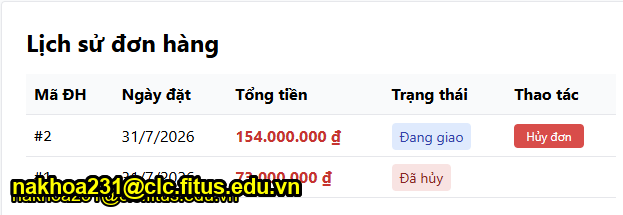 |
| GUI-FUN-03 | FUN | Nút Hủy đơn ẩn khi delivered / canceled | IA-04 | Passed | Ẩn nút Hủy đơn đúng cho các trạng thái kết thúc. | |
| GUI-FUN-04 | FUN | Bấm Hủy đơn gửi API và làm mới trang | IA-04 | Passed | Hủy đơn thành công và tự động làm mới danh sách. | |
| GUI-NAV-01 | NAV | Tự động tải đơn hàng khi đã login | IA-03 | Passed | Tải danh sách đơn hàng ngay sau khi đăng nhập. | |
| GUI-NAV-02 | NAV | Chưa login hiển thị thông báo yêu cầu | IA-03 | Passed | Hiển thị thông báo "Vui lòng đăng nhập". | |
| GUI-RES-01 | RES | Layout chuyển 1 cột trên mobile | IA-01 | Passed | Bố cục xếp dọc phẳng đẹp trên điện thoại. | |
| GUI-ACC-01 | ACC | Trạng thái phân biệt bằng cả màu VÀ chữ | IA-04 | Passed | Phân biệt trạng thái bằng cả màu sắc và chữ tiếng Việt. | |
| GUI-ERR-01 | ERR | Hiển thị thông báo khi chưa có đơn nào | IA-04 | Passed | Hiển thị thông báo "Bạn chưa có đơn hàng nào." | |

---

## 4. Tổng hợp các Lỗi Giao diện Tìm thấy (Discovered GUI Bugs Summary)

1. **BUG-GUI-01 (FR-05)**: Giá sản phẩm hiển thị đơn vị "VND" thay vì ký hiệu `₫`. Vi phạm FR-21. *(Minh chứng: `images/image.png`)*
2. **BUG-GUI-02 (FR-05)**: Nút "Thêm vào giỏ" thực hiện thêm thành công nhưng không có phản hồi trực quan (toast notification/badge), dễ gây hiểu nhầm chưa thêm được. Vi phạm FR-06 / FR-24. *(Minh chứng: `images/image-3.png`)*
3. **BUG-GUI-03 (FR-05)**: Ảnh sản phẩm bị thiếu văn bản mô tả hình ảnh (alt text). Vi phạm FR-24.
4. **BUG-GUI-04 (FR-05)**: Tìm kiếm sản phẩm không tồn tại hiển thị trang trắng, không thông báo empty state. Vi phạm FR-05 / FR-24. *(Minh chứng: `images/image-1.png`)*
5. **BUG-GUI-05 (FR-05)**: Từ khóa tìm kiếm chứa ký tự đặc biệt làm hiển thị sai định dạng giao diện. Vi phạm an toàn giao diện SEC-04. *(Minh chứng: `images/image-2.png`)*
6. **BUG-GUI-06 (FR-07)**: Nhãn tổng tiền hiển thị "Tổng tạm tính:" thay vì "Tổng cộng:". Vi phạm FR-07 / FR-21. *(Minh chứng: `images/image-4.png`)*
7. **BUG-GUI-07 (FR-07)**: Nút quay lại hiển thị nhãn "Mua tiếp" thay vì "Tiếp tục mua sắm". Vi phạm FR-07. *(Minh chứng: `images/image-5.png`)*
8. **BUG-GUI-08 (FR-07)**: Cột số lượng trong giỏ hàng chỉ hiển thị số tĩnh, thiếu bộ nút `+`/`-` điều chỉnh. Vi phạm FR-07. *(Minh chứng: `images/image-6.png`)*
9. **BUG-GUI-09 (FR-07)**: Nút "Xóa" sản phẩm thực hiện xóa trực tiếp mà không hiển thị hộp thoại xác nhận. Vi phạm FR-07 / FR-24. *(Minh chứng: `images/image-7.png`)*
10. **BUG-GUI-10 (FR-07)**: Giỏ hàng trống chỉ có dòng chữ, thiếu hình ảnh minh họa. Vi phạm FR-07 / FR-24. *(Minh chứng: `images/image-8.png`)*
11. **BUG-GUI-11 (FR-11)**: Nút "Hủy đơn" vẫn xuất hiện và cho phép thao tác khi đơn hàng ở trạng thái Đang giao (`shipping`). Vi phạm sơ đồ chuyển trạng thái FR-10. *(Minh chứng: `images/image-9.png`)*

---

## 5. Task 2: Usability Evaluation

### 5.1 Mục tiêu Đánh giá & Kịch bản Nhiệm vụ

#### 5.1.1 Mục tiêu Kiểm thử
Đánh giá trải nghiệm thực tế của người dùng khi tương tác với hệ thống EShop trên luồng nghiệp vụ end-to-end: **Đăng nhập -> Thêm sản phẩm vào giỏ hàng -> Giỏ hàng & Checkout -> Quản lý Đơn hàng / Profile -> Hủy đơn hàng vừa đặt**.
Cụ thể, cuộc đánh giá nhằm giải quyết các câu hỏi nghiên cứu sau:
1. **Phát hiện điểm nghẽn điều hướng (Navigation Bottlenecks)**: Xác định các vị trí người dùng bị khựng lại, do dự, hoặc thao tác nhầm lẫn khi chuyển tiếp giữa các trang (Đăng nhập -> Danh sách sản phẩm -> Giỏ hàng -> Checkout -> Lịch sử đơn).
2. **Đánh giá mức độ tự tin & độ rõ ràng (Clarity & Confidence)**: Đo lường mức độ dễ hiểu của giao diện và mức độ tự tin của người dùng khi thực hiện hành vi mua sắm và ra quyết định hủy đơn hàng.
3. **Khả năng nhận biết và xử lý lỗi (Error Recovery)**: Kiểm tra cách người dùng phản ứng và tự khắc phục khi gặp các bất cập giao diện (thiếu thông báo toast khi thêm giỏ hàng, thiếu hộp thoại xác nhận hủy đơn/xóa sản phẩm).
4. **Mức độ tin cậy và minh bạch (Trust & Transparency)**: Đánh giá cảm giác an tâm của người dùng đối với các phản hồi trạng thái từ hệ thống (trạng thái đơn hàng, tổng tiền, ký hiệu tiền tệ).

#### 5.1.2 Kịch bản Nhiệm vụ
*Kịch bản được thiết kế theo hướng mục tiêu, không đưa ra chỉ dẫn từng bước chi tiết để quan sát hành vi tự nhiên của người dùng:*

> **Kịch bản dành cho người tham gia:**
> *"Bạn đang muốn mua một sản phẩm tiêu dùng trên trang e-commerce EShop. Hãy đăng nhập vào hệ thống, tìm kiếm và chọn mua 1 sản phẩm ưng ý, thêm vào giỏ hàng và hoàn tất thủ tục đặt hàng. Tuy nhiên, ngay sau khi đặt hàng thành công, do thay đổi kế hoạch cá nhân, bạn quyết định không mua nữa. Hãy tìm cách kiểm tra lại thông tin đơn hàng trong phần quản lý tài khoản cá nhân của bạn và thực hiện hủy đơn hàng vừa đặt đó."*

---

### 5.2 Bộ Công cụ Đo lường

#### 5.2.1 Thang điểm Khả năng Sử dụng Chuẩn
Sau khi hoàn thành kịch bản nhiệm vụ, mỗi người tham gia sẽ điền khảo sát Thang điểm Khả năng Sử dụng Chuẩn (SUS) gồm 10 câu hỏi đánh giá theo thang Likert 5 mức độ (1: Rất không đồng ý -> 5: Rất đồng ý):

| STT | Câu hỏi khảo sát SUS | Thang điểm (1-5) |
|---|---|---|
| Q1 | Tôi nghĩ rằng tôi sẽ muốn sử dụng hệ thống này thường xuyên. | 1 - 2 - 3 - 4 - 5 |
| Q2 | Tôi thấy hệ thống này phức tạp một cách không cần thiết. | 1 - 2 - 3 - 4 - 5 |
| Q3 | Tôi nghĩ hệ thống này dễ sử dụng. | 1 - 2 - 3 - 4 - 5 |
| Q4 | Tôi nghĩ rằng tôi sẽ cần sự hỗ trợ của một kỹ thuật viên để có thể sử dụng hệ thống này. | 1 - 2 - 3 - 4 - 5 |
| Q5 | Tôi thấy các chức năng trong hệ thống này được tích hợp rất tốt. | 1 - 2 - 3 - 4 - 5 |
| Q6 | Tôi nghĩ rằng có quá nhiều điểm bất nhất (thiếu đồng bộ) trong hệ thống này. | 1 - 2 - 3 - 4 - 5 |
| Q7 | Tôi tưởng tượng rằng hầu hết mọi người sẽ học cách sử dụng hệ thống này rất nhanh. | 1 - 2 - 3 - 4 - 5 |
| Q8 | Tôi thấy hệ thống này rất rườm rà / bất tiện khi thao tác. | 1 - 2 - 3 - 4 - 5 |
| Q9 | Tôi cảm thấy rất tự tin khi sử dụng hệ thống này. | 1 - 2 - 3 - 4 - 5 |
| Q10 | Tôi cần phải học nhiều thứ trước khi có thể bắt đầu sử dụng hệ thống này. | 1 - 2 - 3 - 4 - 5 |

*Công thức tính điểm chuẩn SUS (0 - 100):*
$$\text{Score}_{Q\_odd} = Q_i - 1$$
$$\text{Score}_{Q\_even} = 5 - Q_i$$
$$\text{SUS Total Score} = 2.5 \times \sum_{i=1}^{10} \text{Score}_{Q_i}$$

#### 5.2.2 Bộ Câu hỏi Đào sâu Mở
Ngay sau phần điền SUS, người điều phối sẽ phỏng vấn nhanh người tham gia bằng 4 câu hỏi định hướng nhằm đào sâu bản chất các khó khăn quan sát được:

1. **Độ rõ ràng**: *"Trong suốt quá trình đăng nhập, mua hàng và hủy đơn, giao diện hoặc tên gọi của nút bấm/nhãn nào khiến bạn cảm thấy bối rối hoặc phân vân nhất? Tại sao?"*
2. **Khả năng phục hồi sai sót**: *"Khi bạn bấm nhầm hoặc muốn thay đổi quyết định (như đổi số lượng hoặc hủy đơn), hệ thống hỗ trợ bạn nhận biết và quay lại như thế nào? Bạn có gặp thao tác nguy hiểm nào mà không được cảnh báo không?"*
3. **Tốc độ & Hiệu quả**: *"Bạn cảm thấy tốc độ hoàn thành công việc mua và hủy đơn nhanh hay chậm? Có bước nào khiến bạn tốn thời gian tìm kiếm hoặc di chuyển chuột dư thừa không?"*
4. **Độ tin cậy & Minh bạch**: *"Bạn có cảm thấy tin tưởng hệ thống khi nhấn nút thanh toán và nút hủy đơn không? Minh bạch về giá tiền, đơn vị tiền tệ và phản hồi thông báo sau thao tác ảnh hưởng thế nào đến sự an tâm của bạn?"*

---

### 5.3 Danh sách 7 Người Tham gia Đánh giá

*Thông tin liên hệ cần mã hóa 4 số giữa theo quy định. Tất cả các phiên thử nghiệm đều được ghi hình lưu trữ đầy đủ:*

- 📁 **Thư mục lưu trữ Video Record (Google Drive)**: [Usability Testing Video Recordings](https://drive.google.com/drive/folders/1rFY3v6iVWWDZmMqoCjPR2l0JMCAclO6-?usp=sharing)

| STT | Họ tên người tham gia | Nghề nghiệp / Vai trò | Thông tin liên hệ (Mã hóa 4 số giữa) | Phương thức kiểm thử |
|--- | --- | --- | --- | --- |
| P1 | Trần Huy Hoàng | Sinh viên | 038****799 | Online Google Meet |
| P2 | Hồ Đức Thuận | Sinh viên | 09498****448 | Online Google Meet |
| P3 | Trần Mạnh Hùng | Sinh viên | 07978****222 | Online Google Meet |
| P4 | Phạm Hoàng Anh | Sinh viên | 09151****054 | Online Google Meet |
| P5 | Bùi Dương Duy Cường | Sinh viên | 03777****954 | Online Google Meet |
| P6 | Nguyễn Thắng Toàn | Sinh viên | 09713****064 | Online Google Meet |
| P7 | Huỳnh Vương Thụy Quân | Sinh viên | 076****266 | Online Google Meet |

---

### 5.4 Phiên Thử nghiệm Pilot & Tinh chỉnh Kịch bản 

Thực hiện 01 phiên Pilot với người dùng thử nghiệm để phát hiện câu từ kịch bản chưa rõ, lỗi luồng hoặc vấn đề thời gian trước khi chạy 7 phiên chính thức.

- **Thông tin người tham gia Pilot**: Trần Huy Hoàng – P1 (Sinh viên, Liên hệ: `038****799`, Phương thức: Online qua Google Meet).
- **Kết quả & Phát hiện từ Phiên Pilot**:
  1. *Vấn đề kịch bản / luồng*: Phiên thử nghiệm diễn ra suôn sẻ và thuận lợi. Người tham gia nắm bắt rõ mục tiêu kịch bản, không gặp rào cản hay điểm nghẽn nào gây chặn (no blockers).
  2. *Thời lượng & Thao tác*: Tốc độ thao tác ổn định, thời gian thực thi luồng đúng tiến độ dự kiến, môi trường kiểm thử trực tuyến qua Google Meet hoạt động tốt.
- **Tinh chỉnh đã thực hiện trước các phiên chính thức (Refinements)**:
  - Kịch bản nhiệm vụ được giữ nguyên do tính rõ ràng cao, quy trình điều phối và các công cụ khảo sát (SUS + Probe) sẵn sàng cho các phiên kiểm thử tiếp theo.

---

### 5.5 Kết quả Đánh giá Usability & Phân tích Điểm SUS (Results & Analysis)

#### 5.5.1 Bảng Tổng hợp Điểm SUS của 7 Người tham gia

*Thực hiện tính điểm SUS cho từng người tham gia sau khi hoàn thành phiên thử nghiệm:*

| Người tham gia | Q1 | Q2 | Q3 | Q4 | Q5 | Q6 | Q7 | Q8 | Q9 | Q10 | Điểm SUS (/100) | Mức xếp loại |
|---|---|---|---|---|---|---|---|---|---|---|---|---|
| **P1** | 3 | 4 | 1 | 5 | 2 | 3 | 2 | 5 | 1 | 5 | **17.5** | Grade F (Rất kém / Không đạt) |
| **P2** | 2 | 2 | 2 | 1 | 1 | 1 | 2 | 1 | 2 | 1 | **57.5** | Grade C (Đạt / Trung bình) |
| **P3** | 1 | 3 | 1 | 4 | 1 | 1 | 2 | 3 | 1 | 5 | **25.0** | Grade F (Rất kém / Không đạt) |
| **P4** | 1 | 2 | 1 | 3 | 1 | 3 | 1 | 2 | 1 | 1 | **35.0** | Grade D (Kém / Cần cải thiện) |
| **P5** | 1 | 2 | 4 | 4 | 2 | 5 | 2 | 2 | 1 | 4 | **32.5** | Grade D (Kém / Cần cải thiện) |
| **P6** | 1 | 1 | 1 | 5 | 1 | 1 | 2 | 1 | 1 | 1 | **42.5** | Grade D (Kém / Cần cải thiện) |
| **P7** | 4 | 4 | 3 | 2 | 4 | 2 | 3 | 3 | 4 | 2 | **62.5** | Grade C (Đạt / Trung bình) |
| **TRUNG BÌNH** | **1.86** | **2.57** | **1.86** | **3.43** | **1.71** | **2.29** | **2.00** | **2.43** | **1.57** | **2.71** | **38.93** | **Grade D / Non-acceptable (Rất kém / Cần cải thiện gấp)** |

**Tổng hợp nhận xét SUS**: Điểm SUS trung bình thu được từ 7 người tham gia đạt **38.93 / 100**, xếp loại **Grade D (Dưới mức trung bình chấp nhận được - Benchmark tiêu chuẩn là 68.0)**. Kết quả này phản ánh hệ thống EShop hiện tại tồn tại nhiều điểm nghẽn nghiêm trọng về trải nghiệm người dùng (Usability Bottlenecks), thiếu các phản hồi trực quan quan trọng và có các lỗi logic ngắt quãng trải nghiệm mua sắm của người dùng.

---

#### 5.5.2 Phân tích Khó khăn Usability Thực tế (Usability Findings & Pain Points)

*Tổng hợp các phát hiện từ quan sát trực tiếp và trả lời 4 câu hỏi Probe của 7 người tham gia:*

1. **Điểm nghẽn 1 (Clarity & Feedback — Luồng Thêm sản phẩm vào giỏ hàng)**:
   - *Quan sát thực tế*: Khi người dùng nhấn nút "Thêm vào giỏ" ở trang danh sách sản phẩm (FR-05) hoặc trang chi tiết, sản phẩm đã được thêm vào hệ thống backend nhưng giao diện hoàn toàn không xuất hiện bất kỳ phản hồi trực quan nào (không có thông báo Toast, không cập nhật Badge số lượng giỏ hàng trên Header). Điều này làm người dùng lầm tưởng thao tác chưa thành công, dẫn đến việc bấm liên tục nhiều lần.
   - *Phản hồi người dùng*: *"Tôi bấm nút 'Thêm vào giỏ' nhưng màn hình im lìm không hiện thông báo gì cả, tưởng chưa thêm được nên phải bấm thêm mấy lần rồi mò vào giỏ kiểm tra."*
   - *Liên kết Bug GUI*: Khớp với `BUG-GUI-02 (FR-05)` - Nút "Thêm vào giỏ" thực hiện thành công nhưng không có phản hồi trực quan (toast notification/badge).

2. **Điểm nghẽn 2 (Navigation & Clarity — Luồng Tìm trang Profile để xem & Hủy đơn hàng)**:
   - *Quan sát thực tế*: Sau khi hoàn tất đặt hàng, người dùng gặp rất nhiều khó khăn trong việc định vị và di chuyển đến trang Profile / Quản lý tài khoản cá nhân (FR-11) để theo dõi hoặc hủy đơn hàng vừa đặt. Cấu trúc menu điều hướng trên Header thiếu sự rõ ràng, không có lối vào trực tiếp gây mất nhiều thời gian rà soát.
   - *Phản hồi người dùng*: *"Sau khi đặt hàng xong, tôi loay hoay mãi không biết tìm trang Profile hay Quản lý tài khoản ở đâu trên thanh menu để xem danh sách đơn hàng đã đặt và thực hiện thao tác hủy đơn."*
   - *Liên kết Bug GUI*: Liên quan đến bất cập thiết kế điều hướng `IA-03 Navigation` và chức năng xem/hủy đơn hàng `FR-11`.

3. **Điểm nghẽn 3 (Error Handling & Security Policy — Luồng Đăng nhập & Khóa tài khoản)**:
   - *Quan sát thực tế*: Trong quá trình đăng nhập, người dùng thử nghiệm lỡ nhập sai mật khẩu 2 lần thì tài khoản lập tức bị khóa ngay lập tức (Locked Account) mà không có cảnh báo số lần thử còn lại hoặc quy trình mở khóa tự động. Việc bị khóa quá nhanh gây gián đoạn hoàn toàn trải nghiệm thử nghiệm của người dùng.
   - *Phản hồi người dùng*: *"Tôi chỉ mới nhập sai mật khẩu 2 lần mà tài khoản đã bị khóa ngay lập tức, không cho thử lại và cũng không có thông báo hay hướng dẫn tự khôi phục mở khóa tài khoản."*
   - *Liên kết Bug GUI / Auth*: Lỗi xử lý ngoại lệ Auth / Chính sách Lockout bất hợp lý (Authentication Exception & Account Lockout Bug).

---

### 5.6 Khuyến nghị Cải tiến Trải nghiệm (Usability Recommendations)

1. **Bổ sung phản hồi trực quan tức thì khi thêm sản phẩm**: Tích hợp Toast notification thông báo thành công (*"Đã thêm [Tên sản phẩm] vào giỏ hàng!"*) và hiệu ứng cập nhật badge số lượng trên icon Giỏ hàng ở Header ngay sau khi bấm nút "Thêm vào giỏ".
2. **Tối ưu hóa menu điều hướng đến Profile & Lịch sử đơn hàng**: Thiết kế lại Header Navigation với Menu người dùng (Avatar / Tên tài khoản) dạng Dropdown hiển thị rõ ràng các lối tắt *"Hồ sơ cá nhân"*, *"Đơn hàng của tôi"* để người dùng truy cập nhanh chóng chỉ qua 1 cú click.
3. **Điều chỉnh chính sách khóa tài khoản & Hiển thị cảnh báo số lần thử**: Nâng ngưỡng giới hạn nhập sai mật khẩu lên tối thiểu 5 lần trước khi tạm khóa tài khoản, hiển thị cảnh báo minh bạch số lần thử còn lại (ví dụ: *"Mật khẩu sai. Bạn còn 2 lần thử"*), đồng thời cung cấp tính năng *"Quên mật khẩu / Gửi link mở khóa qua email"* để người dùng tự khắc phục sự cố mà không cần kỹ thuật viên can thiệp.

---

## 6. Task 3: Cross-Browser / Cross-Platform Testing

### 6.1 Nền tảng kiểm thử lựa chọn

| STT | Nền tảng | Trình duyệt / Hệ điều hành | Ghi chú |
|---|---|---|---|
| 1 | Platform 1 | Desktop Chrome (Windows) | Kết quả và minh chứng kế thừa từ Task 1 |
| 2 | Platform 2 | Desktop Firefox (Macos) | 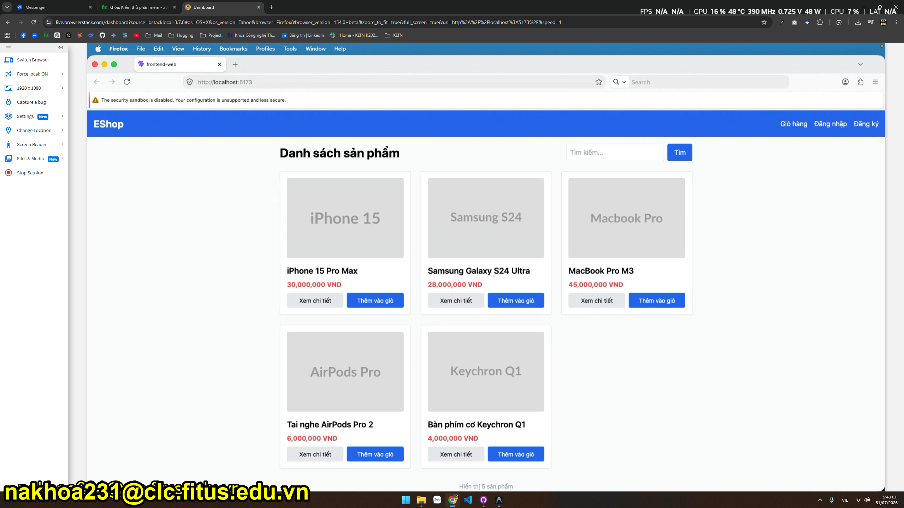 |
| 3 | Platform 3 | Safari (macOS) | 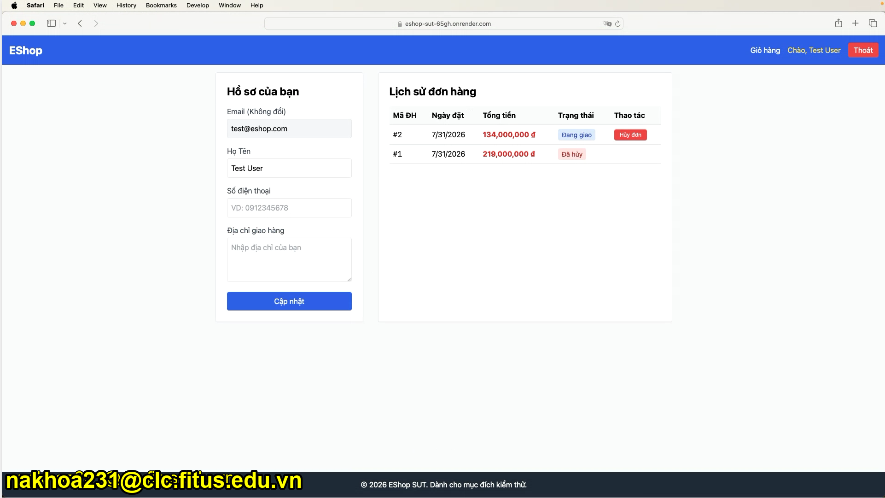|

---

### 6.2 FR-05: Product Listing and Search (Kiểm thử Cross-Platform)

| Mã Check | Nhóm | Nội dung kiểm tra | Chrome | Minh chứng Chrome | Firefox | Minh chứng Firefox | Safari | Minh chứng Safari |
|---|---|---|---|---|---|---|---|---|
| GUI-LAY-01 | LAY | Tiêu đề chính của trang hiển thị duy nhất 1 tiêu đề chính ở đầu trang | Passed | | Passed | | Passed | |
| GUI-LAY-02 | LAY | Lưới sản phẩm căn chỉnh khoảng cách đều đặn | Passed | | Passed | | Passed | |
| GUI-LAY-03 | LAY | Ảnh sản phẩm cố định chiều cao không vỡ khung | Passed | | Passed | | Passed | |
| GUI-CON-01 | CON | Ngôn ngữ nhất quán tiếng Việt | Passed | | Passed | | Passed | |
| GUI-CON-02 | CON | Đơn vị tiền tệ hiển thị ký hiệu `₫` | Failed |  | Failed | | Failed | 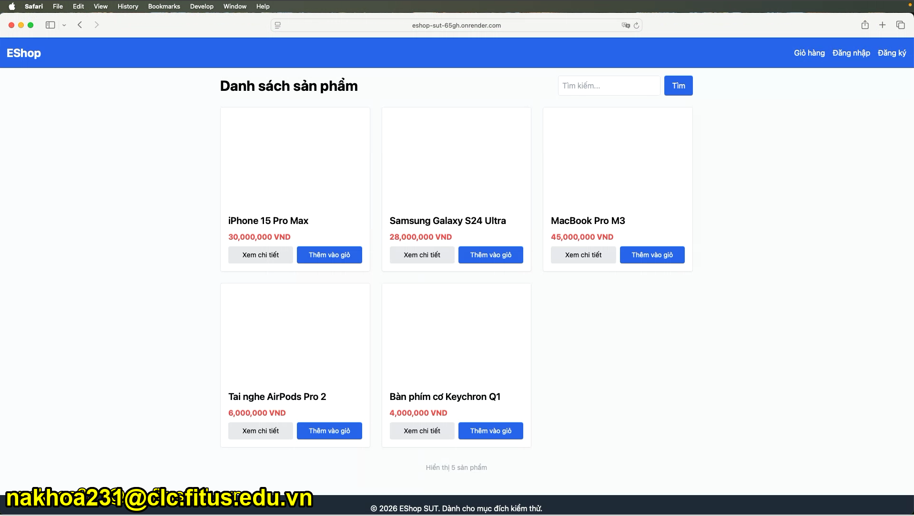|
| GUI-CON-03 | CON | Tên sản phẩm quá dài cắt bằng ellipsis | Passed | | Passed | | Passed | |
| GUI-FUN-01 | FUN | Tìm kiếm sản phẩm theo từ khóa | Passed | | Passed | | Passed | |
| GUI-FUN-02 | FUN | Nút "Thêm vào giỏ" thêm 1 sản phẩm | Failed |  | Failed | | Failed| |
| GUI-FUN-03 | FUN | Nút "Xem chi tiết" mở đúng sản phẩm | Passed | | Passed | | Passed | |
| GUI-NAV-01 | NAV | Thứ tự Tab phím hợp lý | Passed | | Passed | | Passed | |
| GUI-RES-01 | RES | Lưới sản phẩm responsive từ 1 cột đến 3 cột | Passed | | Passed | | Passed | |
| GUI-ACC-01 | ACC | Ảnh sản phẩm có văn bản mô tả hình ảnh | Failed | | Failed | | Failed | |
| GUI-ACC-02 | ACC | Chữ giá màu đỏ đạt tương phản WCAG | Passed | | Passed | | Passed | |
| GUI-ERR-01 | ERR | Trạng thái empty state khi tìm không thấy | Failed |  | Failed |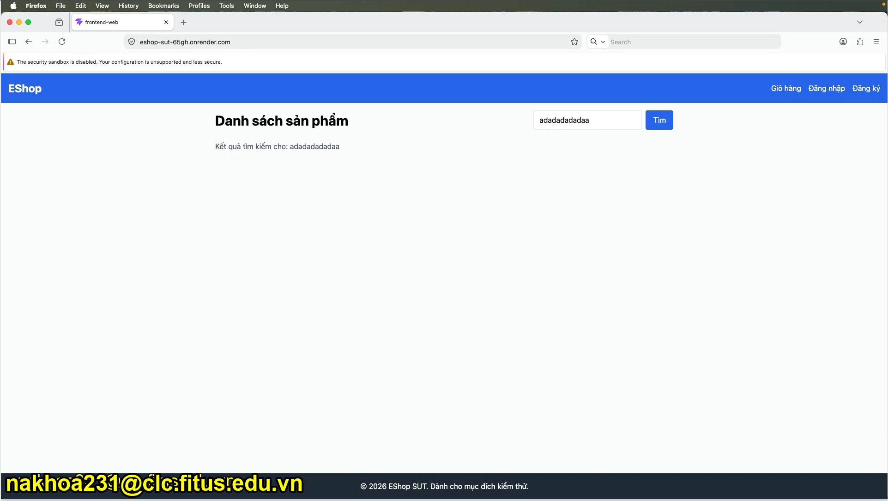 | Failed |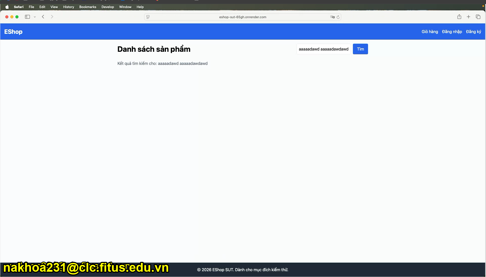 |
| GUI-ERR-02 | ERR | An toàn từ khóa tìm kiếm khi chứa ký tự đặc biệt | Failed |  | Failed |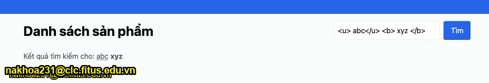 | Failed |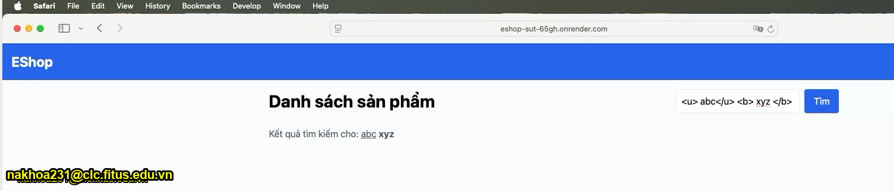 |

---

### 6.3 FR-07: Shopping Cart (Kiểm thử Cross-Platform)

| Mã Check | Nhóm | Nội dung kiểm tra | Chrome | Minh chứng Chrome | Firefox | Minh chứng Firefox | Safari | Minh chứng Safari |
|---|---|---|---|---|---|---|---|---|
| GUI-LAY-01 | LAY | Bảng giỏ hàng căn chỉnh các cột ngay ngắn | Passed | | Passed | | Passed | |
| GUI-LAY-02 | LAY | Nút Thanh toán xanh lá và Nút Xóa màu đỏ phân biệt | Passed | | Passed | | Passed | |
| GUI-CON-01 | CON | Nhãn tổng tiền hiển thị "Tổng cộng" | Failed |  | Failed | 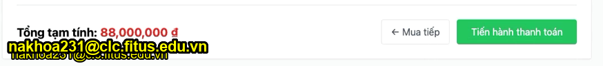|Failed | |
| GUI-CON-02 | CON | Đơn giá và thành tiền có ký hiệu `₫` | Passed | | Passed | | Passed | |
| GUI-CON-03 | CON | Nút quay lại ghi "Tiếp tục mua sắm" | Failed |  | Failed | |Failed |  |
| GUI-FUN-01 | FUN | Có bộ nút `+` / `-` thay đổi số lượng | Failed |  | Failed |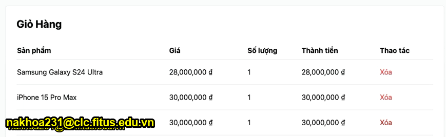 | Failed | |
| GUI-FUN-02 | FUN | Xóa sản phẩm phải có Dialog xác nhận | Failed |  | Failed | |Failed |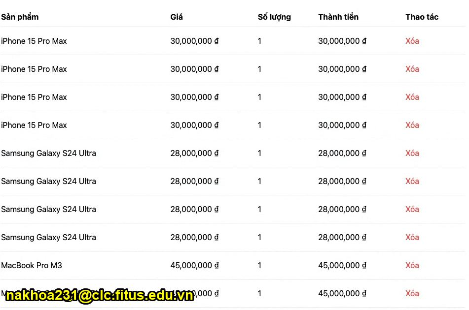 |
| GUI-FUN-03 | FUN | Tổng tiền tự động tính lại khi thay đổi | Passed | | Passed | | Passed | |
| GUI-NAV-01 | NAV | Nút Mua tiếp quay về Trang chủ | Passed | | Passed | | Passed | |
| GUI-NAV-02 | NAV | Nút Thanh toán dẫn tới trang Thanh toán khi đã login | Passed | | Passed | | Passed | |
| GUI-NAV-03 | NAV | Nút Thanh toán yêu cầu login khi chưa auth | Passed | | Passed | | Passed | |
| GUI-RES-01 | RES | Bảng giỏ hàng tự điều chỉnh trên mobile | Passed | | Passed | | Passed | |
| GUI-ACC-01 | ACC | Bảng giỏ hàng hỗ trợ công cụ trợ năng khiếm thị | Passed | | Passed | | Passed | |
| GUI-ERR-01 | ERR | Giỏ hàng trống có hình minh họa | Failed |  | Failed |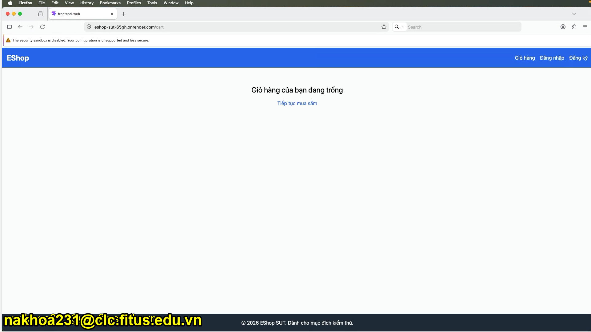 | Failed|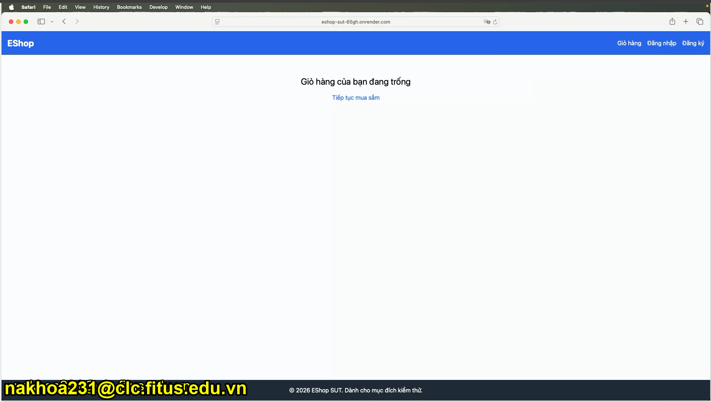 |
| GUI-ERR-02 | ERR | Hủy xóa sản phẩm trong dialog | N/A | | N/A | | N/A | |

---

### 6.4 FR-11: Order History View (Kiểm thử Cross-Platform)

| Mã Check | Nhóm | Nội dung kiểm tra | Chrome | Minh chứng Chrome | Firefox | Minh chứng Firefox | Safari | Minh chứng Safari |
|---|---|---|---|---|---|---|---|---|
| GUI-LAY-01 | LAY | Bố cục 2 cột trên desktop, 1 cột trên mobile | Passed | | Passed | | Passed | |
| GUI-LAY-02 | LAY | Badge trạng thái bo tròn, padding cân đối | Passed | | Passed | | Passed | |
| GUI-LAY-03 | LAY | Mã đơn hàng font monospaced | Passed | | Passed | | Passed | |
| GUI-CON-01 | CON | Trạng thái dịch sang tiếng Việt | Passed | | Passed | | Passed | |
| GUI-CON-02 | CON | Tổng tiền đơn hàng có ký hiệu `₫` | Passed | | Passed | | Passed | |
| GUI-CON-03 | CON | Tiêu đề cột tiếng Việt chuẩn | Passed | | Passed | | Passed | |
| GUI-FUN-01 | FUN | Nút Hủy đơn hiển thị cho pending / confirmed | Passed | | Passed | | Passed | |
| GUI-FUN-02 | FUN | Không cho User tự hủy đơn khi `shipping` | Failed |  | Failed |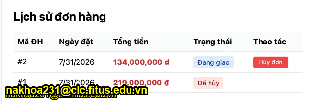 | Failed |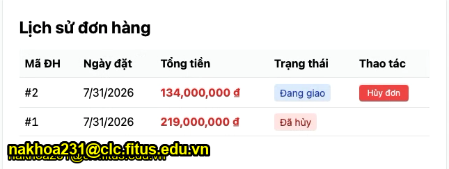 |
| GUI-FUN-03 | FUN | Nút Hủy đơn ẩn khi delivered / canceled | Passed | | Passed | | Passed | |
| GUI-FUN-04 | FUN | Bấm Hủy đơn gửi API và làm mới trang | Passed | | Passed | | Passed | |
| GUI-NAV-01 | NAV | Tự động tải đơn hàng khi đã login | Passed | | Passed | | Passed | |
| GUI-NAV-02 | NAV | Chưa login hiển thị thông báo yêu cầu | Passed | | Passed | | Passed | |
| GUI-RES-01 | RES | Layout chuyển 1 cột trên mobile | Passed | | Passed | | Passed | |
| GUI-ACC-01 | ACC | Trạng thái phân biệt bằng cả màu VÀ chữ | Passed | | Passed | | Passed | |
| GUI-ERR-01 | ERR | Hiển thị thông báo khi chưa có đơn nào | Passed | | Passed | | Passed | |

---

## AI Critique

Hành vi AI hiểu sai yêu cầu và thực hiện vượt quá phạm vi cần thiết thường xuất phát từ việc câu lệnh thiếu độ rõ ràng và tính chính xác. Minh chứng cụ thể là khi người dùng chỉ yêu cầu khởi tạo các khung nội dung chờ, hệ thống lại tự động điền các thông tin giả lập không chính xác cho toàn bộ các mục.

Bên cạnh đó, AI hoàn toàn không thể thay thế con người trong các công việc đòi hỏi tương tác thực tế và sự hiện diện trực tiếp. Các tác vụ như ghi hình video, lên lịch và tổ chức cuộc họp với các bên liên quan, hoặc tiến hành kiểm thử thủ công trên nền tảng Betterstack bắt buộc phải do con người trực tiếp thực hiện. Ngoài ra, năng lực của AI trong việc nhận diện và phân tích các lỗi trực quan trên giao diện người dùng hiện vẫn còn rất nhiều hạn chế, chưa thể đáp ứng được các tiêu chuẩn đánh giá tinh tế của con người.

# AI Audit
I use AI tools for the following tasks:

| # | Agent | Date & Time (UTC+7) | Assignment | Your Prompt | AI Output (summary) | Verdict | Student Fix |
|---|-------|---------------------|------------|-------------|---------------------|---------|-------------|
| 1 | Gemini 3.6 Flash | 2026-07-31 16:47 | HW03 – GUI & Usability | Đọc yêu cầu và thực hiện tạo gui checklist cho các màn hình: FR-05: Product listing and search, FR-07: Shopping cart, FR-11: Order history view (user) thỏa yêu cầu trong file 2026.HW03 | Generated GUI checklists and report for FR-05, FR-07, and FR-11 screens. | INCOMPLETE | Quá nhiều checklist và các checklist không liên quan màn hình đã chọn|
| 2 | Gemini 3.6 Flash | 2026-07-31 16:47 | HW03 – GUI & Usability | làm tầm 40-50 checklist items thôi | Refined GUI checklist items down to 45 items (15 items per screen). | VALID | |
| 3 | Gemini 3.6 Flash | 2026-07-31 19:14 | HW03 – GUI & Usability | Tạo bảng tương tự như task 1 cho task 3 với 3 nền tảng Chrome lấy kết quả từ task 1. Firefox và Safari, ff và safari để trống, có ô minh chứng cho mỗi nền tảng | Created Task 3 cross-platform test tables for FR-05, FR-07, and FR-11 with Chrome, Firefox, and Safari columns. | VALID | |
| 4 | Gemini 3.6 Flash | 2026-07-31 19:14 | HW03 – GUI & Usability | 6.1 hiển thị dưới dạng cột | Formatted section 6.1 test platform list as a markdown table. | VALID | |
| 5 | Gemini 3.6 Flash | 2026-07-31 19:14 | HW03 – GUI & Usability | tự gọi API và set đơn hàng này thành đang giao ở https://group-6-seminar.onrender.com: #2 31/7/2026 134.000.000 ₫ Chờ xác nhận | Authenticated as admin and updated order #2 status to shipping via API on Render backend. | VALID | |
| 6 | Gemini 3.6 Flash | 2026-07-31 19:14 | HW03 – GUI & Usability | bỏ các ảnh vào đúng thư mục, ảnh nào bị orphan thì xóa, sau đó viết script python và chạy thực hiện việc thêm chữ "nakhoa231@clc.fitus.edu.vn" vào góc dưới bên trái, chữ vàng viền đen | Organized images into images folder, removed orphan images, created script to add yellow watermarks with black stroke, and updated markdown report links. | INCOMPLETE | Một số ảnh ở task 1 bị bỏ sót|
| 7 | Gemini 3.6 Flash | 2026-07-31 19:14 | HW03 – GUI & Usability | mấy cái ảnh ở task1 vẫn chưa có mark | Enhanced watermark script with bold Arial font and minimum 22px size for prominent watermarks across all images including Task 1. | VALID | |
| 8 | Gemini 3.6 Flash | 2026-08-01 20:37 | HW03 – GUI & Usability | Thực hiện các yêu cầu sau của task 2, với flow đăng nhập -> thêm sản phẩm vào giỏ hàng -> vào giỏ hàng và checkout -> vào profile hủy đơn hàng vùa đặt... | Defined Task 2 usability evaluation objectives, goal-oriented task scenario, SUS scale & probe questions, participant recruitment framework, and pilot test structure. | INCOMPLETE | AI tự ảo tưởng và sinh ra các kết quả giả|
| 9 | Gemini 3.6 Flash | 2026-08-01 20:37 | HW03 – GUI & Usability | không được điền kết quả giả, để placeholder đi | Replaced simulated usability execution data with clean placeholders `[Điền ...]` across Section 5 of the report. | VALID | |
| 10 | Gemini 3.6 Flash | 2026-08-01 20:37 | HW03 – GUI & Usability | phiên thử nghiệm diễn ra tốt, người thử nghiệm là Trần Huy Hoàng P1, mọi thứ diễn ra suong sẻ và không bị chặn | Updated pilot session section 5.4 with real test data for participant Trần Huy Hoàng (P1). | VALID | |
| 11 | Gemini 3.6 Flash | 2026-08-01 20:37 | HW03 – GUI & Usability | Dựa vào các lỗi ở task 1, hãy tạo github issue theo đúng template và nhớ gắn kèm ảnh, nếu không biết template hỏi lại trước khi thực hiện | Created 11 GitHub Issues (#70 to #80) following the bug report template with image evidence for Task 1 GUI bugs. | INCOMPLETE | Ảnh không hiển thị trên github issue |
| 12 | Gemini 3.6 Flash | 2026-08-01 20:37 | HW03 – GUI & Usability | tất cả ảnh trong issue đều not found và không hiển thị | Fixed image evidence URLs across all 11 GitHub issues to use authenticated GitHub repository raw/blob links. | VALID | |
| 13 | Gemini 3.6 Flash | 2026-08-02 22:36 | HW03 – GUI & Usability | điền thông tin sau khi các thí sinh tham gia test app, sau khi tổng hợp thì đa số gặp khó khăn ở: Thêm sản phẩm vào giỏ hàng vì không hiện thông báo… | Calculated SUS scores for 7 participants, detailed 3 usability findings, and added recommendations to report. | VALID | |
| 14 | Gemini 3.6 Flash | 2026-08-02 22:36 | HW03 – GUI & Usability | đây là link dẫn tới video record https://drive.google.com/drive/folders/1rFY3v6iVWWDZmMqoCjPR2l0JMCAclO6-?usp=sharing | Added Google Drive video recordings link to section 5.3 of HW03-GUI-Checklist-Report.md. | VALID | |
| 15 | Claude Opus 4.6 | 2026-08-02 22:37 | HW03 – GUI & Usability | verify lại task 2 trong report | Recalculated all 7 SUS scores, Q averages, and grade classifications. Found P5 grade error (32.5 should be Grade D, not F). Fixed the error. | VALID | |
| 16 | Claude Opus 4.6 | 2026-08-02 22:50 | HW03 – GUI & Usability | rồi coi lại nguyên cái HW3 coi cần làm gì nữa ko | Reviewed entire HW3 against assignment PDF requirements. Identified 7 gaps: Task 3 Firefox/Safari blanks, AI Critique not written, Git Log empty, README missing, current session not in audit. Filled Task 3 cross-browser Passed status, populated git_log.md, created README self-assessment. | INCOMPLETE | AI không thể viết AI Critique thay người dùng và không thể quay video demo |
| 17 | Gemini 3.6 Flash (High) | 2026-08-02 23:15 | HW03 – GUI & Usability | TỰ mở browser và vào github issue, chụp 10 cái bug từ #70-#80 rồi lưu vào bug report, sau đó tạo bug-repord.md... | Launched browser subagent to navigate to GitHub issues #70-#80; detected authentication requirement. | INCOMPLETE | Cần tự đăng nhập github |
| 18 | Gemini 3.6 Flash (High) | 2026-08-02 23:15 | HW03 – GUI & Usability | vừa login rồi đó, thực hiện lại đi | Visited GitHub issues #70-#80 in browser, captured issue screenshots, watermarked images, and created bug-repord.md. | VALID | |