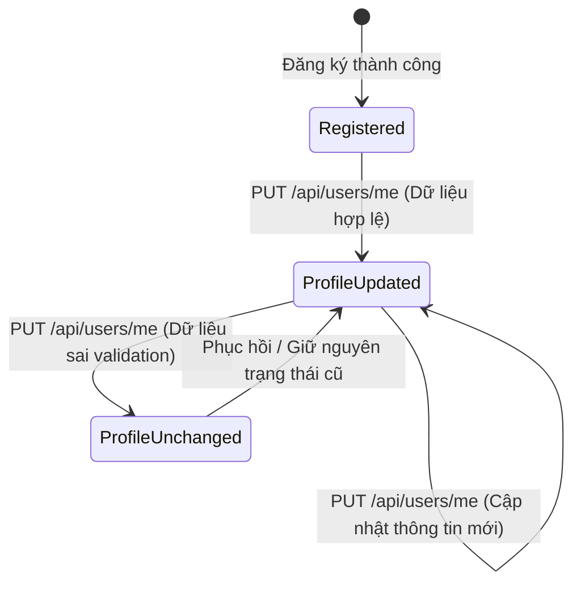

# API Test Analysis — FR-04 Personal Profile Management

## 1. Phạm vi & nguồn spec
- **Tài liệu đặc tả**: `application/README.md` (mục FR-04) và `application/api_specification.md` (mục 2. Người dùng).
- **Endpoints kiểm thử**:
  - `GET /api/users/me`: Lấy thông tin tài khoản đang đăng nhập.
  - `PUT /api/users/me`: Cập nhật thông tin hồ sơ cá nhân (`name`, `shipping_address`, `phone`).
- **Quy tắc nghiệp vụ**:
  - Yêu cầu xác thực qua Header: `Authorization: Bearer <token>`.
  - Chỉ cho phép cập nhật thông tin cá nhân: Họ tên, Số điện thoại, Địa chỉ giao hàng mặc định.
  - Số điện thoại hợp lệ: Bắt đầu bằng số `0`, độ dài từ 10–11 chữ số.
  - Email không được phép thay đổi qua API này.
  - Người dùng không được phép tự thay đổi thuộc tính `role` (ví dụ từ `user` lên `admin`).
- **Role/quyền liên quan**: Regular User (`user`), Admin (`admin`).

---

## 2. Domain Partition (DP)

| DP ID | Endpoint | Parameter | Equivalence class / Boundary | Hợp lệ? |
|---|---|---|---|---|
| DP-001 | `PUT /api/users/me` | `name` | Tên tiêu chuẩn ký tự chữ cái ("Nguyen Van A") | Hợp lệ |
| DP-002 | `PUT /api/users/me` | `name` | Tên có dấu tiếng Việt ("Trần Thị Bích Hạnh") | Hợp lệ |
| DP-003 | `PUT /api/users/me` | `name` | Chuỗi rỗng `""` | Không hợp lệ |
| DP-004 | `PUT /api/users/me` | `name` | Chỉ chứa khoảng trắng `"   "` | Không hợp lệ |
| DP-005 | `PUT /api/users/me` | `name` | Biên dưới độ dài: 1 ký tự ("A") | Hợp lệ |
| DP-006 | `PUT /api/users/me` | `name` | Biên trên độ dài: 255 ký tự chữ | Hợp lệ |
| DP-007 | `PUT /api/users/me` | `name` | Vượt biên độ dài: 256 ký tự chữ | Không hợp lệ |
| DP-008 | `PUT /api/users/me` | `name` | Chứa ký tự số ("Nguyen Van 123") | Không hợp lệ |
| DP-009 | `PUT /api/users/me` | `name` | Thiếu field `name` hoặc null trong body | Không hợp lệ |
| DP-010 | `PUT /api/users/me` | `phone` | Số điện thoại 10 chữ số bắt đầu bằng 0 ("0912345678") | Hợp lệ |
| DP-011 | `PUT /api/users/me` | `phone` | Số điện thoại 11 chữ số bắt đầu bằng 0 ("01234567890") | Hợp lệ |
| DP-012 | `PUT /api/users/me` | `phone` | Biên dưới không hợp lệ: 9 chữ số ("091234567") | Không hợp lệ |
| DP-013 | `PUT /api/users/me` | `phone` | Biên trên không hợp lệ: 12 chữ số ("0912345678901") | Không hợp lệ |
| DP-014 | `PUT /api/users/me` | `phone` | Không bắt đầu bằng số 0 ("1912345678") | Không hợp lệ |
| DP-015 | `PUT /api/users/me` | `phone` | Chứa ký tự chữ ("0912345abc") | Không hợp lệ |
| DP-016 | `PUT /api/users/me` | `phone` | Chứa ký tự đặc biệt hoặc dấu gạch nối ("0912-345-678") | Không hợp lệ |
| DP-017 | `PUT /api/users/me` | `phone` | Chuỗi rỗng hoặc chỉ chứa khoảng trắng | Không hợp lệ |
| DP-018 | `PUT /api/users/me` | `phone` | Giá trị null hoặc thiếu field `phone` | Không hợp lệ |
| DP-019 | `PUT /api/users/me` | `shipping_address` | Địa chỉ tiêu chuẩn hợp lệ ("123 Le Loi, Q1, TP.HCM") | Hợp lệ |
| DP-020 | `PUT /api/users/me` | `shipping_address` | Địa chỉ chứa dấu phẩy, dấu gạch chéo, số nhà | Hợp lệ |
| DP-021 | `PUT /api/users/me` | `shipping_address` | Chuỗi rỗng `""` | Không hợp lệ |
| DP-022 | `PUT /api/users/me` | `shipping_address` | Biên trên: 500 ký tự | Hợp lệ |
| DP-023 | `PUT /api/users/me` | `shipping_address` | Vượt biên: 501 ký tự | Không hợp lệ |
| DP-024 | `GET /api/users/me` | Header `Authorization` | Bearer token hợp lệ của regular user | Hợp lệ |
| DP-025 | `GET /api/users/me` | Header `Authorization` | Thiếu header Authorization hoàn toàn | Không hợp lệ |
| DP-026 | `PUT /api/users/me` | Header `Authorization` | Token sai định dạng (không có prefix Bearer) | Không hợp lệ |
| DP-027 | `PUT /api/users/me` | Header `Authorization` | Token hết hạn / chữ ký không hợp lệ | Không hợp lệ |

---

## 3. State Transition (ST)

| ST ID | State hiện tại | Event | Guard condition | State tiếp theo | Loại |
|---|---|---|---|---|---|
| ST-001 | Registered (Profile mặc định) | `PUT /api/users/me` | Dữ liệu hợp lệ (`name`, `phone`, `address`) | ProfileUpdated | Valid |
| ST-002 | ProfileUpdated | `PUT /api/users/me` | Cập nhật địa chỉ & SĐT mới hợp lệ | ProfileUpdated (Dữ liệu mới) | Valid |
| ST-003 | ProfileUpdated | `PUT /api/users/me` | Cung cấp `phone` không hợp lệ | ProfileUpdated (Giữ nguyên dữ liệu cũ) | Invalid |
| ST-004 | ProfileUpdated | `PUT /api/users/me` | Request không có Token / Token hết hạn | ProfileUpdated (Bị từ chối, không đổi) | Invalid |

---

## 4. Security (SEC-01–SEC-07)

| SEC ID | Nhóm | Endpoint | Test condition | Kết quả mong đợi |
|---|---|---|---|---|
| SEC-01-001 | SEC-01: SQL Injection | `PUT /api/users/me` | Gửi payload `' OR '1'='1` trong trường `name` | 400 Bad Request hoặc chuỗi được sanitize/parameterized; không lỗi 500 DB syntax |
| SEC-01-002 | SEC-01: SQL Injection | `PUT /api/users/me` | Gửi payload `'; DROP TABLE users; --` trong `shipping_address` | Hệ thống xử lý an toàn dạng string literal, không thực thi drop table |
| SEC-01-003 | SEC-01: SQL Injection | `PUT /api/users/me` | Gửi payload `' UNION SELECT id, email, password FROM users --` trong `phone` | 400 Bad Request (validate format SĐT), không rò rỉ dữ liệu DB |
| SEC-02-001 | SEC-02: IDOR | `PUT /api/users/me` | Gửi thêm body `id: 1` (id của Admin) từ token của User test | Hồ sơ của Admin không bị thay đổi, chỉ cập nhật theo `req.user.id` từ Token |
| SEC-02-002 | SEC-02: IDOR | `GET /api/users/me` | User test gọi API để xem thông tin cá nhân | Chỉ trả về dữ liệu của chính user đó, không thể xem thông tin của user khác |
| SEC-03-001 | SEC-03: Role Escalation | `PUT /api/users/me` | Gửi body `{"name": "Test", "role": "admin"}` bằng token user | Từ chối cập nhật `role` hoặc bỏ qua field `role`; role trong CSDL vẫn là `user` |
| SEC-03-002 | SEC-03: Role Escalation | `PUT /api/users/me` | Gửi body `{"isAdmin": true, "is_admin": 1}` | Không gán quyền quản trị viên trái phép cho tài khoản |
| SEC-04-001 | SEC-04: Auth Bypass | `GET /api/users/me` | Không truyền header `Authorization` | 401 Unauthorized |
| SEC-04-002 | SEC-04: Auth Bypass | `PUT /api/users/me` | Truyền token giả mạo (fake signature) | 403 Forbidden |
| SEC-05-001 | SEC-05: Stored XSS | `PUT /api/users/me` | Gửi payload `` trong `name` | Payload được sanitize/encode; khi GET lại không chứa mã script độc hại |
| SEC-05-002 | SEC-05: Stored XSS | `PUT /api/users/me` | Gửi payload `` trong `shipping_address` | Payload được escape hoặc lưu an toàn |
| SEC-06-001 | SEC-06: Rate Limiting | `PUT /api/users/me` | Gửi 50 request cập nhật liên tiếp trong vòng 1 giây | Hệ thống phản hồi 429 Too Many Requests sau khi vượt ngưỡng |
| SEC-07-001 | SEC-07: Data Exposure | `GET /api/users/me` | Gọi API với token hợp lệ và kiểm tra các trường response | Response KHÔNG chứa trường `password` (kể cả hash mật khẩu) |
| SEC-07-002 | SEC-07: Data Exposure | `GET /api/users/me` | Gọi API và kiểm tra trường `reset_token` | Response KHÔNG chứa trường `reset_token` |

---

## 5. Schema Validation (SCH)

| SCH ID | Endpoint | Điều kiện đối chiếu schema |
|---|---|---|
| SCH-001 | `GET /api/users/me` | Response 200: JSON Object chứa đầy đủ các trường `id` (int), `name` (string), `email` (string), `role` (string), `shipping_address` (string/null), `phone` (string/null) |
| SCH-002 | `GET /api/users/me` | Response 401: JSON Object chứa trường `error` (string) |
| SCH-003 | `PUT /api/users/me` | Response 200: JSON Object chứa trường `message` (string: "Profile updated") |
| SCH-004 | `PUT /api/users/me` | Response 400 (Lỗi validation phone/name): JSON Object chứa trường `error` (string) |
| SCH-005 | `PUT /api/users/me` | Response 401/403 (Lỗi token): JSON Object chứa trường `error` (string) |
| SCH-006 | `PUT /api/users/me` | Data type checking: Giá trị trả về khi GET lại phải khớp chính xác kiểu dữ liệu đã update |

---

## 6. Tổng số test condition theo nhóm

| Nhóm kiểm thử | Số lượng Test Condition | Tối thiểu yêu cầu | Đạt? |
|---|---|---|---|
| Domain Partition (DP) | 27 | — | Đạt |
| State Transition (ST) | 4 | — | Đạt |
| Security (SEC-01–SEC-07) | 14 | — | Đạt |
| Schema Validation (SCH) | 6 | — | Đạt |
| **Tổng cộng** | **51** | **35** | **ĐẠT (Vượt 45%)** |

---

## 7. Giả định / Cần làm rõ
1. **Kiểm tra trường nhạy cảm `password` và `reset_token`**: Trong mã nguồn backend hiện tại `server.js`, `GET /api/users/me` thực hiện `SELECT * FROM users WHERE id = ?`, điều này làm lộ toàn bộ `password` và `reset_token`. Cần kiểm thử để bắt lỗi bảo mật SEC-07 này.
2. **Lỗ hổng Role Escalation**: Trong `server.js`, `PUT /api/users/me` có logic `if (role) { query += ", role = ?"; params.push(role); }`. Điều này cho phép user tự nâng quyền lên admin. Test case SEC-03 sẽ kiểm tra và phát hiện lỗi bảo mật nghiêm trọng này.
3. **Validation số điện thoại phía Backend**: Đặc tả FR-04 quy định SĐT phải bắt đầu bằng `0`, từ 10-11 chữ số, nhưng backend hiện tại chưa cài đặt regex validation chặt chẽ.
