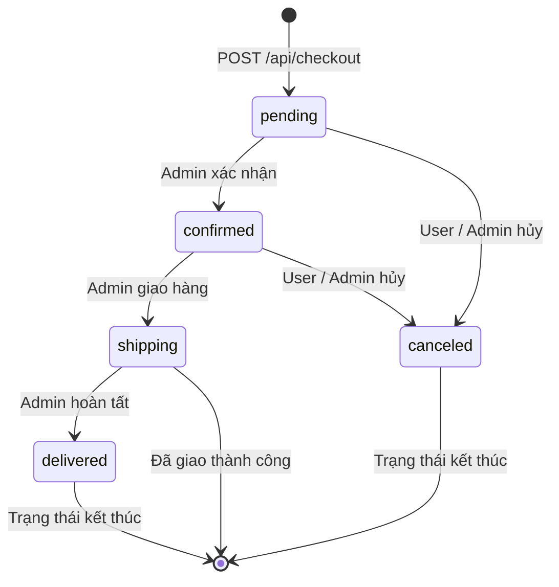

# API Test Analysis — FR-10 Order State Machine

## 1. Phạm vi & nguồn spec
- **Tài liệu đặc tả**: `application/README.md` (mục FR-10, FR-18) và `application/api_specification.md` (mục 4 & 6.2).
- **Endpoints kiểm thử**:
  - `POST /api/checkout`: Tạo đơn hàng mới ở trạng thái `pending`.
  - `PUT /api/admin/orders/:id/status`: Admin cập nhật trạng thái đơn hàng.
  - `PUT /api/orders/:id/cancel`: User hủy đơn hàng cá nhân.
  - `GET /api/orders/:id`: Lấy chi tiết đơn hàng.
  - `GET /api/orders/my-orders`: Lấy lịch sử đơn hàng của User.
  - `GET /api/admin/orders`: Admin xem toàn bộ danh sách đơn hàng.
- **Quy tắc nghiệp vụ**:
  - 5 trạng thái: `pending`, `confirmed`, `shipping`, `delivered`, `canceled`.
  - Final States: `delivered` và `canceled` là trạng thái kết thúc, tuyệt đối không được chuyển sang trạng thái khác.
  - Khi đơn hàng ở trạng thái `shipping`, User không được phép tự hủy.
  - User chỉ được hủy đơn khi đang ở trạng thái `pending` hoặc `confirmed`.
  - Các API Admin yêu cầu xác thực JWT và `role = 'admin'`.

---

## 2. Domain Partition (DP)

| DP ID | Endpoint | Parameter | Equivalence class / Boundary | Hợp lệ? |
|---|---|---|---|---|
| DP-001 | `PUT /api/admin/orders/:id/status` | `:id` (Path param) | ID đơn hàng hợp lệ đang tồn tại (ví dụ: 1) | Hợp lệ |
| DP-002 | `PUT /api/admin/orders/:id/status` | `:id` (Path param) | ID không tồn tại trong CSDL (999999) | Không hợp lệ |
| DP-003 | `PUT /api/admin/orders/:id/status` | `:id` (Path param) | ID là số âm (-1) | Không hợp lệ |
| DP-004 | `PUT /api/admin/orders/:id/status` | `:id` (Path param) | ID là chuỗi không phải số ("abc") | Không hợp lệ |
| DP-005 | `PUT /api/admin/orders/:id/status` | `:id` (Path param) | ID là số thực thập phân (1.5) | Không hợp lệ |
| DP-006 | `PUT /api/admin/orders/:id/status` | `status` (Body) | Giá trị enum hợp lệ: `"confirmed"` | Hợp lệ |
| DP-007 | `PUT /api/admin/orders/:id/status` | `status` (Body) | Giá trị enum hợp lệ: `"shipping"` | Hợp lệ |
| DP-008 | `PUT /api/admin/orders/:id/status` | `status` (Body) | Giá trị enum hợp lệ: `"delivered"` | Hợp lệ |
| DP-009 | `PUT /api/admin/orders/:id/status` | `status` (Body) | Giá trị enum hợp lệ: `"canceled"` | Hợp lệ |
| DP-010 | `PUT /api/admin/orders/:id/status` | `status` (Body) | Giá trị enum không xác định: `"completed"` | Không hợp lệ |
| DP-011 | `PUT /api/admin/orders/:id/status` | `status` (Body) | Giá trị rỗng `""` hoặc chỉ có khoảng trắng | Không hợp lệ |
| DP-012 | `PUT /api/admin/orders/:id/status` | `status` (Body) | Kiểu dữ liệu không phải chuỗi (số nguyên 123) | Không hợp lệ |
| DP-013 | `PUT /api/orders/:id/cancel` | `:id` (Path param) | ID đơn hàng hợp lệ thuộc về User hiện tại | Hợp lệ |
| DP-014 | `PUT /api/orders/:id/cancel` | `:id` (Path param) | ID không tồn tại hoặc ID thuộc user khác | Không hợp lệ |
| DP-015 | `POST /api/checkout` | `total_amount` | Giá trị số nguyên dương hợp lệ (> 0) | Hợp lệ |
| DP-016 | `POST /api/checkout` | `total_amount` | Giá trị 0 hoặc số âm (< 0) | Không hợp lệ |
| DP-017 | `POST /api/checkout` | `shipping_address` | Chuỗi địa chỉ hợp lệ | Hợp lệ |
| DP-018 | `POST /api/checkout` | `shipping_address` | Chuỗi rỗng `""` hoặc thiếu trường | Không hợp lệ |
| DP-019 | `PUT /api/admin/orders/:id/status` | Header `Authorization` | Token hợp lệ của tài khoản Admin | Hợp lệ |
| DP-020 | `PUT /api/admin/orders/:id/status` | Header `Authorization` | Token của User thường (không có role admin) | Không hợp lệ |

---

## 3. State Transition (ST)

| ST ID | State hiện tại | Event | Guard condition | State tiếp theo | Loại |
|---|---|---|---|---|---|
| ST-001 | `pending` | Admin cập nhật `confirmed` | Role Admin, ID hợp lệ | `confirmed` | Valid |
| ST-002 | `pending` | User gọi `/cancel` | Owner của đơn hàng | `canceled` | Valid |
| ST-003 | `pending` | Admin cập nhật `canceled` | Role Admin | `canceled` | Valid |
| ST-004 | `confirmed` | Admin cập nhật `shipping` | Role Admin | `shipping` | Valid |
| ST-005 | `confirmed` | User gọi `/cancel` | Owner của đơn hàng | `canceled` | Valid |
| ST-006 | `confirmed` | Admin cập nhật `canceled` | Role Admin | `canceled` | Valid |
| ST-007 | `shipping` | Admin cập nhật `delivered` | Role Admin | `delivered` | Valid |
| ST-008 | `shipping` | User gọi `/cancel` | Owner của đơn hàng | Bị từ chối (400) / Giữ nguyên `shipping` | Invalid |
| ST-009 | `shipping` | Admin cập nhật `pending` | Role Admin (Đi lùi trạng thái) | Bị từ chối (400) / Giữ nguyên `shipping` | Invalid |
| ST-010 | `shipping` | Admin cập nhật `confirmed` | Role Admin (Đi lùi trạng thái) | Bị từ chối (400) / Giữ nguyên `shipping` | Invalid |
| ST-011 | `delivered` | Admin cập nhật `pending` | Role Admin (Chuyển từ final state) | Bị từ chối (400) / Giữ nguyên `delivered` | Invalid |
| ST-012 | `delivered` | Admin cập nhật `shipping` | Role Admin (Chuyển từ final state) | Bị từ chối (400) / Giữ nguyên `delivered` | Invalid |
| ST-013 | `delivered` | Admin/User gọi `/cancel` | Chuyển từ final state | Bị từ chối (400) / Giữ nguyên `delivered` | Invalid |
| ST-014 | `canceled` | Admin cập nhật `delivered` | Chuyển từ final state (Bug server.js) | Bị từ chối (400) / Giữ nguyên `canceled` | Invalid |
| ST-015 | `canceled` | Admin cập nhật `pending` | Chuyển từ final state | Bị từ chối (400) / Giữ nguyên `canceled` | Invalid |
| ST-016 | `canceled` | Admin cập nhật `confirmed` | Chuyển từ final state | Bị từ chối (400) / Giữ nguyên `canceled` | Invalid |

---

## 4. Security (SEC-01–SEC-07)

| SEC ID | Nhóm | Endpoint | Test condition | Kết quả mong đợi |
|---|---|---|---|---|
| SEC-01-001 | SEC-01: SQL Injection | `PUT /api/orders/:id/cancel` | Gửi `:id = 1 OR 1=1` | 400 Bad Request hoặc 404, không lỗi SQL syntax |
| SEC-01-002 | SEC-01: SQL Injection | `PUT /api/admin/orders/:id/status` | Gửi payload injection trong trường `status` (`"confirmed'; DROP TABLE orders; --"`) | Không thực thi câu lệnh drop table, trả về lỗi invalid state |
| SEC-02-001 | SEC-02: IDOR | `PUT /api/orders/:id/cancel` | User A gọi cancel đơn hàng của User B (`id = 2`) | 404 Not Found hoặc 403 Forbidden, không cho phép hủy đơn của người khác |
| SEC-02-002 | SEC-02: IDOR | `GET /api/orders/:id` | User A xem chi tiết đơn hàng của User B | 403 Forbidden hoặc 404, không hiển thị dữ liệu đơn hàng người khác |
| SEC-03-001 | SEC-03: Role Escalation | `PUT /api/admin/orders/:id/status` | User thường gửi token gọi API cập nhật trạng thái đơn của Admin | 403 Forbidden (kiểm tra quyền `role = 'admin'`) |
| SEC-03-002 | SEC-03: Role Escalation | `GET /api/admin/orders` | User thường gửi token gọi API xem tất cả đơn hàng hệ thống | 403 Forbidden |
| SEC-04-001 | SEC-04: Auth Bypass | `PUT /api/orders/:id/cancel` | Gọi API không kèm Authorization Header | 401 Unauthorized |
| SEC-04-002 | SEC-04: Auth Bypass | `PUT /api/admin/orders/:id/status` | Gọi API không kèm Authorization Header | 401 Unauthorized |
| SEC-05-001 | SEC-05: Stored XSS | `POST /api/checkout` | Gửi payload `` trong `shipping_address` | Địa chỉ được escape/sanitize khi xem lại |
| SEC-06-001 | SEC-06: Concurrency / Race | `PUT /api/orders/:id/cancel` | Gửi 2 request hủy đơn cùng 1 tích tắc | Chỉ 1 request thành công, request thứ hai trả 400 (đã bị hủy) |
| SEC-07-001 | SEC-07: Sensitive Exposure | `GET /api/admin/orders` | Kiểm tra dữ liệu trả về của đơn hàng | Không lộ thông tin nhạy cảm của khách hàng ngoài họ tên/địa chỉ |

---

## 5. Schema Validation (SCH)

| SCH ID | Endpoint | Điều kiện đối chiếu schema |
|---|---|---|
| SCH-001 | `POST /api/checkout` | Response 200: `{ "message": "Checkout successful", "orderId": number }` |
| SCH-002 | `PUT /api/admin/orders/:id/status` | Response 200: `{ "message": "Order status updated" }` |
| SCH-003 | `PUT /api/orders/:id/cancel` | Response 200: `{ "message": "Order canceled successfully" }` |
| SCH-004 | `PUT /api/admin/orders/:id/status` | Response 400 (Invalid transition): `{ "error": string }` |
| SCH-005 | `PUT /api/orders/:id/cancel` | Response 404 (Not found): `{ "error": string }` |
| SCH-006 | `GET /api/orders/my-orders` | Response 200: Array of Objects, mỗi item chứa `id`, `user_id`, `total_amount`, `status`, `shipping_address`, `created_at` |

---

## 6. Tổng số test condition theo nhóm

| Nhóm kiểm thử | Số lượng Test Condition | Tối thiểu yêu cầu | Đạt? |
|---|---|---|---|
| Domain Partition (DP) | 20 | — | Đạt |
| State Transition (ST) | 16 | — | Đạt |
| Security (SEC-01–SEC-07) | 11 | — | Đạt |
| Schema Validation (SCH) | 6 | — | Đạt |
| **Tổng cộng** | **53** | **35** | **ĐẠT (Vượt 51%)** |

---

## 7. Giả định / Cần làm rõ
1. **Lỗi nghiêm trọng trong State Transition tại `server.js` dòng 550**: Backend có đoạn code `if (currentStatus === "canceled" && status === "delivered") isValidTransition = true;`. Đây là bug vi phạm nghiêm trọng Final State Rule của FR-10. Bộ test case ST-014 sẽ bắt lỗi này.
2. **Lỗi kiểm tra quyền hủy đơn hàng `shipping` tại `server.js` dòng 329**: Code hiện tại `if (order.status === "delivered" || order.status === "canceled")` bỏ sót việc chặn hủy khi đơn hàng đang ở trạng thái `shipping`. ST-008 sẽ bắt lỗi này.
3. **Lỗi Access Control Admin tại `PUT /api/admin/orders/:id/status`**: Middleware `authenticateToken` chỉ kiểm tra token hợp lệ mà không kiểm tra `req.user.role === 'admin'`. SEC-03-001 sẽ bắt lỗi bảo mật này.
