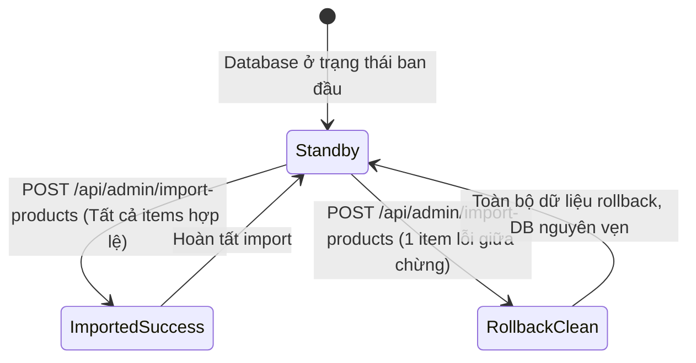

# API Test Analysis — FR-16 Product Import from CSV

## 1. Phạm vi & nguồn spec
- **Tài liệu đặc tả**: `application/README.md` (mục FR-16) và `application/api_specification.md` (mục 6.3).
- **Endpoints kiểm thử**:
  - `POST /api/admin/import-products`: Import danh sách sản phẩm từ file CSV (được parse thành JSON array gồm các objects).
- **Quy tắc nghiệp vụ**:
  - Yêu cầu xác thực Admin qua Header: `Authorization: Bearer <admin_token>`.
  - Body JSON: `{ "products": [ { "name", "price", "description", "imageUrl", "category_id" } ] }`.
  - Validation: `name` không được rỗng, `price` phải là số dương (> 0).
  - Giao dịch nguyên tử (All-or-nothing rollback): Nếu có lỗi ở bất kỳ dòng nào, toàn bộ quá trình import phải rollback, không lưu dở dang.
  - Phản hồi báo cáo: Bao nhiêu dòng thành công, bao nhiêu dòng lỗi và nguyên nhân chi tiết.

---

## 2. Domain Partition (DP)

| DP ID | Endpoint | Parameter / Field | Equivalence class / Boundary | Hợp lệ? |
|---|---|---|---|---|
| DP-001 | `POST /api/admin/import-products` | Body `products` | Mảng chứa 1 sản phẩm hợp lệ | Hợp lệ |
| DP-002 | `POST /api/admin/import-products` | Body `products` | Mảng chứa nhiều sản phẩm hợp lệ (ví dụ: 5 sản phẩm) | Hợp lệ |
| DP-003 | `POST /api/admin/import-products` | Body `products` | Mảng rỗng `[]` | Không hợp lệ |
| DP-004 | `POST /api/admin/import-products` | Body `products` | Thiếu key `products` hoặc body rỗng `{}` | Không hợp lệ |
| DP-005 | `POST /api/admin/import-products` | Body `products` | Kiểu dữ liệu không phải mảng (chuỗi hoặc object) | Không hợp lệ |
| DP-006 | `POST /api/admin/import-products` | Body `products` | Giá trị null | Không hợp lệ |
| DP-007 | `POST /api/admin/import-products` | Item `name` | Tên hợp lệ ký tự chữ ("iPhone 16 Pro Max") | Hợp lệ |
| DP-008 | `POST /api/admin/import-products` | Item `name` | Tên có dấu tiếng Việt ("Ốp lưng da chống sốc") | Hợp lệ |
| DP-009 | `POST /api/admin/import-products` | Item `name` | Chuỗi rỗng `""` | Không hợp lệ |
| DP-010 | `POST /api/admin/import-products` | Item `name` | Chỉ chứa khoảng trắng `"   "` | Không hợp lệ |
| DP-011 | `POST /api/admin/import-products` | Item `name` | Thiếu field `name` hoặc null | Không hợp lệ |
| DP-012 | `POST /api/admin/import-products` | Item `name` | Biên trên độ dài: 255 ký tự | Hợp lệ |
| DP-013 | `POST /api/admin/import-products` | Item `name` | Vượt biên độ dài: 256 ký tự | Không hợp lệ |
| DP-014 | `POST /api/admin/import-products` | Item `price` | Số nguyên dương hợp lệ (100000) | Hợp lệ |
| DP-015 | `POST /api/admin/import-products` | Item `price` | Biên dưới số dương: 1 (1 ₫) | Hợp lệ |
| DP-016 | `POST /api/admin/import-products` | Item `price` | Giá trị bằng 0 (0 ₫) | Không hợp lệ |
| DP-017 | `POST /api/admin/import-products` | Item `price` | Số âm (-50000) | Không hợp lệ |
| DP-018 | `POST /api/admin/import-products` | Item `price` | Chuỗi không phải số ("100k", "free") | Không hợp lệ |
| DP-019 | `POST /api/admin/import-products` | Item `price` | Thiếu field `price` hoặc null | Không hợp lệ |
| DP-020 | `POST /api/admin/import-products` | Item `category_id` | ID danh mục hợp lệ tồn tại trong CSDL (1, 2, 3) | Hợp lệ |
| DP-021 | `POST /api/admin/import-products` | Item `category_id` | ID danh mục không tồn tại trong CSDL (9999) | Không hợp lệ |
| DP-022 | `POST /api/admin/import-products` | Item `category_id` | ID là số âm (-1) | Không hợp lệ |
| DP-023 | `POST /api/admin/import-products` | Item `imageUrl` | URL ảnh hợp lệ ("https://example.com/img.png") | Hợp lệ |
| DP-024 | `POST /api/admin/import-products` | Item `description` | Mô tả hợp lệ có dấu và xuống dòng | Hợp lệ |
| DP-025 | `POST /api/admin/import-products` | Header `Authorization` | Bearer Token hợp lệ của Admin | Hợp lệ |
| DP-026 | `POST /api/admin/import-products` | Header `Authorization` | Bearer Token của User thường | Không hợp lệ |
| DP-027 | `POST /api/admin/import-products` | Header `Authorization` | Không truyền token hoặc token rỗng | Không hợp lệ |

---

## 3. State Transition & Transactional Integrity (ST)

| ST ID | State hiện tại | Event | Guard condition | State tiếp theo | Loại |
|---|---|---|---|---|---|
| ST-001 | Standby | Import 3 sản phẩm hợp lệ | Role Admin, tất cả fields valid | ImportedSuccess (DB có thêm 3 sản phẩm) | Valid |
| ST-002 | Standby | Import 3 sản phẩm: SP 1 valid, SP 2 price=-1000, SP 3 valid | Có 1 item vi phạm nghiệp vụ | RollbackClean (DB không tăng sản phẩm nào) | Invalid |
| ST-003 | Standby | Import 3 sản phẩm: SP 1 valid, SP 2 name="", SP 3 valid | Có 1 item thiếu name | RollbackClean (DB không tăng sản phẩm nào) | Invalid |
| ST-004 | Standby | Import 2 sản phẩm có category_id không tồn tại (9999) | Vi phạm foreign key | RollbackClean (DB không tăng sản phẩm nào) | Invalid |
| ST-005 | RollbackClean | Gửi lại danh sách đã sửa lỗi hợp lệ | Tất cả fields valid | ImportedSuccess (Import thành công trọn vẹn) | Valid |

---

## 4. Security (SEC-01–SEC-07)

| SEC ID | Nhóm | Endpoint | Test condition | Kết quả mong đợi |
|---|---|---|---|---|
| SEC-01-001 | SEC-01: SQL Injection | `POST /api/admin/import-products` | Gửi payload SQL Injection trong `name`: `"iPhone', 100, '', '', 1); DROP TABLE products; --"` | Câu lệnh được parameterized, không drop table, không lỗi DB syntax |
| SEC-01-002 | SEC-01: SQL Injection | `POST /api/admin/import-products` | Gửi payload SQLi trong `description`: `"Mô tả' OR '1'='1"` | Lưu an toàn dạng text, không làm sai lệch truy vấn CSDL |
| SEC-01-003 | SEC-01: SQL Injection | `POST /api/admin/import-products` | Gửi payload SQLi trong `imageUrl`: `"http://img.com' UNION SELECT 1,2,3--"` | Xử lý an toàn hoặc báo lỗi URL |
| SEC-02-001 | SEC-02: IDOR | `POST /api/admin/import-products` | Thử gán quyền sở hữu hoặc ghi đè sản phẩm người dùng khác | Chỉ thực hiện insert theo đúng quyền admin |
| SEC-03-001 | SEC-03: Role Escalation | `POST /api/admin/import-products` | User thường (`role = 'user'`) gọi API Import sản phẩm | 403 Forbidden (Bắt buộc kiểm tra role Admin) |
| SEC-03-002 | SEC-03: Role Escalation | `POST /api/admin/import-products` | Gửi header giả danh admin nhưng token của user thường | 403 Forbidden |
| SEC-04-001 | SEC-04: Auth Bypass | `POST /api/admin/import-products` | Gọi API không truyền Authorization Header | 401 Unauthorized |
| SEC-04-002 | SEC-04: Auth Bypass | `POST /api/admin/import-products` | Gọi API với Token hết hạn hoặc chữ ký bị giả mạo | 403 Forbidden |
| SEC-05-001 | SEC-05: Stored XSS | `POST /api/admin/import-products` | Gửi payload `` trong trường `name` | Payload được sanitize/escape khi render hoặc lưu trữ |
| SEC-05-002 | SEC-05: Stored XSS | `POST /api/admin/import-products` | Gửi payload `<svg onload=alert(1)>` trong trường `description` | Payload được sanitize an toàn |
| SEC-06-001 | SEC-06: DoS / Bulk Resource | `POST /api/admin/import-products` | Gửi mảng chứa 10,000 items để kiểm tra giới hạn payload | Hệ thống từ chối (413 Payload Too Large) hoặc xử lý giới hạn, không crash server |
| SEC-07-001 | SEC-07: Sensitive Exposure | `POST /api/admin/import-products` | Gửi dữ liệu lỗi và kiểm tra mảng `errors` trong response | Response trả về thông báo lỗi thân thiện, không lộ stack trace hay cấu trúc database SQL |

---

## 5. Schema Validation (SCH)

| SCH ID | Endpoint | Điều kiện đối chiếu schema |
|---|---|---|
| SCH-001 | `POST /api/admin/import-products` | Response 200 (Success): `{ "message": string, "inserted": number, "errors": array }` |
| SCH-002 | `POST /api/admin/import-products` | Response 400 (Body rỗng): `{ "error": string }` |
| SCH-003 | `POST /api/admin/import-products` | Response 401 (Chưa đăng nhập): `{ "error": string }` |
| SCH-004 | `POST /api/admin/import-products` | Response 403 (Không có quyền admin): `{ "error": string }` |
| SCH-005 | `POST /api/admin/import-products` | Mảng `errors` (khi có lỗi từng dòng): Mảng chứa các chuỗi string mô tả chi tiết vị trí hàng và lý do lỗi |

---

## 6. Tổng số test condition theo nhóm

| Nhóm kiểm thử | Số lượng Test Condition | Tối thiểu yêu cầu | Đạt? |
|---|---|---|---|
| Domain Partition (DP) | 27 | — | Đạt |
| State Transition (ST) | 5 | — | Đạt |
| Security (SEC-01–SEC-07) | 12 | — | Đạt |
| Schema Validation (SCH) | 5 | — | Đạt |
| **Tổng cộng** | **49** | **35** | **ĐẠT (Vượt 40%)** |

---

## 7. Giả định / Cần làm rõ
1. **Lỗi vi phạm Atomic Transaction (All-or-Nothing Rollback) tại `server.js` dòng 213**:
   - Backend hiện tại dùng `rows.forEach` và insert từng dòng một mà **không dùng database transaction (`BEGIN TRANSACTION ... COMMIT/ROLLBACK`)**.
   - Khi có dòng hợp lệ và dòng lỗi cùng lúc, backend vẫn chèn các dòng hợp lệ vào CSDL (`inserted > 0`). Điều này vi phạm nghiêm trọng yêu cầu FR-16: *"Nếu có lỗi ở bất kỳ dòng nào, toàn bộ import phải được rollback (giao dịch nguyên tử — all-or-nothing)"*.
   - Test case ST-002, ST-003 sẽ bắt lỗi này.
2. **Lỗi thiếu validation giá âm tại `server.js` dòng 218**:
   - Backend chỉ kiểm tra `if (!row.name)`, hoàn toàn bỏ qua kiểm tra `row.price <= 0`.
   - Test case DP-016, DP-017 sẽ bắt lỗi này.
3. **Lỗi Access Control Admin tại `server.js` dòng 199**:
   - Middleware `authenticateToken` không kiểm tra `req.user.role === 'admin'`. User thường vẫn có thể gọi endpoint này. Test case SEC-03-001 sẽ bắt lỗi.
