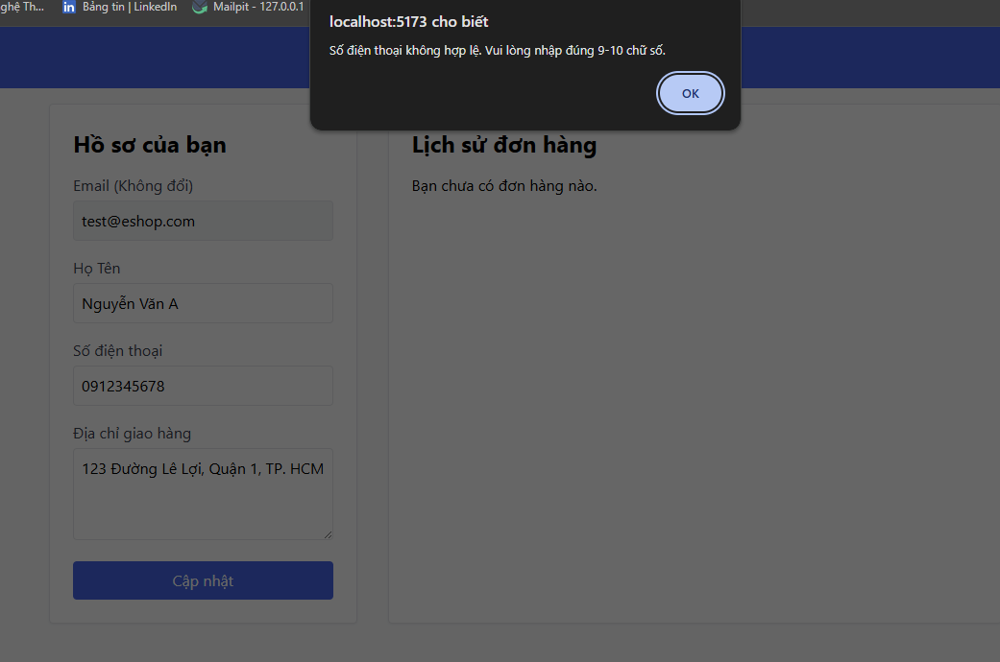

# [BUG][PROFILE] Báo sai lỗi SDT dù nhập đúng format

## Found by Test Case
TC-PROFILE-001

## Requirement Related
FR-04

## Severity / Priority
Major / P1

## Environment
- **Browser:** Chrome
- **OS:** Windows 11
- **URL:** http://localhost:5173/profile
- **Version/Commit:** 85af3ba875c88283615e22cb108f13e2fccaf0e9
- **Test Account:** test@eshop.com/Test1234!

## Steps to Reproduce
1. Nhập Họ Tên: "Nguyễn Văn A"
2. Nhập Số điện thoại: "0912345678"
3. Nhập Địa chỉ giao hàng: "123 Đường Lê Lợi, Quận 1, TP. HCM"
4. Nhấn nút "Lưu" hoặc "Cập nhật"

## Expected Result
Thông tin cập nhật thành công

## Actual Result
Không cho cập nhật và báo "Số điện thoại không hợp lệ. Vui lòng nhập đúng 9-10 chữ số."

## Evidence

## Labels
- `type: bug`
- `module: PROFILE`
- `severity: Major`
- `priority: P1`
- `status: new`
- `found-by: test-case TC-PROFILE-001`
