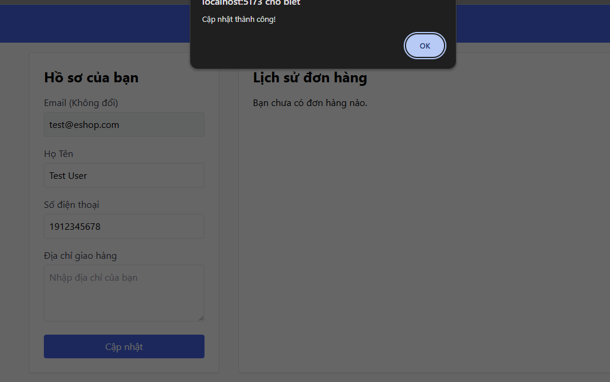

# [BUG][PROFILE] Bỏ qua validation SDT khi bắt đầu bằng số khác 0

## Found by Test Case
TC-PROFILE-010

## Requirement Related
FR-04

## Severity / Priority
Major / P1

## Environment
- **Browser:** Chrome
- **OS:** Windows 11
- **URL:** http://localhost:5173/profile
- **Version/Commit:** 85af3ba875c88283615e22cb108f13e2fccaf0e9
- **Test Account:** test@eshop.com/Test1234!

## Steps to Reproduce
1. Nhập Số điện thoại: "1912345678" (bắt đầu bằng 1)
2. Nhấn nút "Lưu" hoặc "Cập nhật"

## Expected Result
- Hệ thống chặn không cho lưu.
- Hiển thị thông báo lỗi yêu cầu số điện thoại phải bắt đầu bằng số 0.

## Actual Result
- Hệ thống cho phép lưu số điện thoại: 1912345678 và báo "Cập nhật thành công"

## Evidence

## Labels
- `type: bug`
- `module: PROFILE`
- `severity: Major`
- `priority: P1`
- `status: new`
- `found-by: test-case TC-PROFILE-010`
