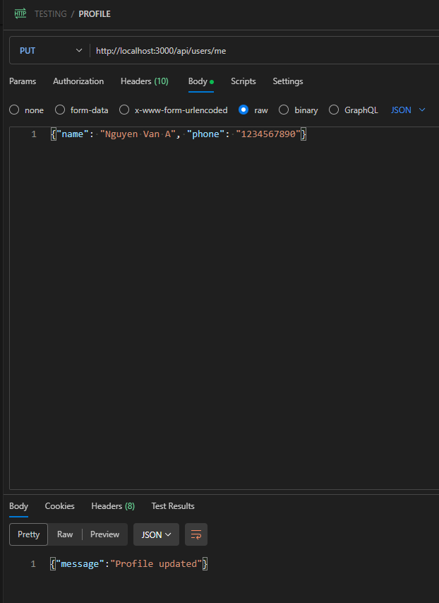
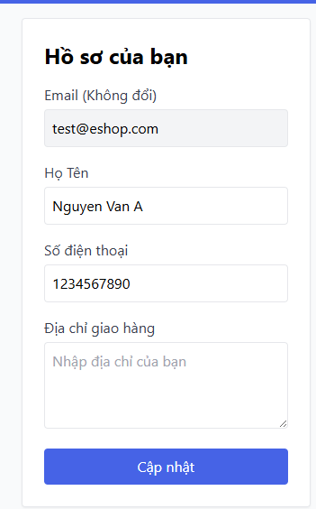

# [BUG][PROFILE] Bỏ qua validation lỗi SDT khi cập nhật qua API

## Found by Test Case
TC-PROFILE-021

## Requirement Related
FR-04

## Severity / Priority
Major / P2

## Environment
- **Browser:** Chrome
- **OS:** Windows 11
- **URL:** http://localhost:5173/profile
- **Version/Commit:** 85af3ba875c88283615e22cb108f13e2fccaf0e9
- **Test Account:** test@eshop.com/Test1234!

## Steps to Reproduce
1. Sử dụng công cụ kiểm thử API (Postman/cURL) để gửi request PUT /api/users/me với JWT token hợp lệ.
2. Đưa trường "phone": "1234567890" vào payload .
3. Gửi request.

## Expected Result
- API từ chối cập nhật số điện thoại.
- API trả về mã lỗi HTTP 400 Bad Request

## Actual Result
Thông tin cập nhật thành công

## Evidence

## Labels
- `type: bug`
- `module: PROFILE`
- `severity: `
- `priority: P2`
- `status: new`
- `found-by: test-case TC-PROFILE-021`
