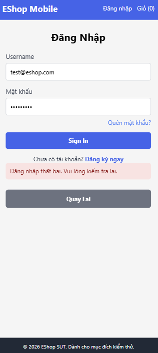

# [BUG][PROFILE-MOBILE] Không thể đăng nhập và tải dữ liệu trên ứng dụng di động (Lỗi kết nối)

## Found by Test Case
TC-PROFILE-MOBILE-001, TC-PROFILE-MOBILE-002, TC-PROFILE-MOBILE-003, TC-PROFILE-MOBILE-004, TC-PROFILE-MOBILE-005, TC-PROFILE-MOBILE-006, TC-PROFILE-MOBILE-007

## Requirement Related
FR-04

## Severity / Priority
Critical / P0 (Blocker)

## Environment
- **Device:** Điện thoại di động (thật) / Trình giả lập di động (Expo Go)
- **OS:** iOS

## Steps to Reproduce
1. Khởi chạy ứng dụng EShop trên thiết bị di động / trình giả lập qua Expo.
2. Truy cập màn hình Đăng nhập.
3. Nhập tài khoản và mật khẩu hợp lệ, sau đó nhấn nút đăng nhập.
4. Hoặc truy cập màn hình trang chủ để tải danh sách sản phẩm.

## Expected Result
- Ứng dụng đăng nhập thành công và chuyển hướng đến trang chủ/hồ sơ cá nhân.
- Danh sách sản phẩm hiển thị đầy đủ thông tin.

## Actual Result
- Ứng dụng báo lỗi đăng nhập thất bại, vui lòng thử lại.
- Không thể đăng nhập vào tài khoản, dẫn đến không thể truy cập màn hình Hồ sơ cá nhân để thực hiện các bước kiểm thử tiếp theo.

## Labels
- `type: bug`
- `module: PROFILE-MOBILE`
- `severity: Critical`
- `priority: P0`
- `status: new`
- `found-by: mobile-test-cases`
