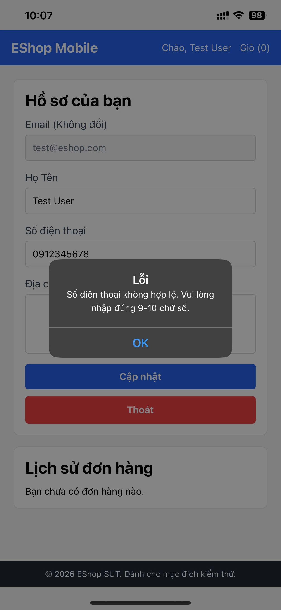

# [BUG][PROFILE-MOBILE] Số điện thoại bị chặn đăng nhập dù format đúng trên mobile

## Found by Test Case
TC-PROFILE-MOBILE-001

## Requirement Related
FR-04

## Severity / Priority
Critical / P0 (Blocker)

## Environment
- **Device:** Điện thoại di động (thật)
- **OS:** iOS

## Steps to Reproduce
1. Khởi chạy ứng dụng EShop trên thiết bị di động / trình giả lập qua Expo.
2. Truy cập màn hình Đăng nhập.
3. Nhập Số điện thoại hợp lệ (ví dụ: "0912345678" hoặc "09123456789").
4. Nhập mật khẩu hợp lệ và nhấn nút "Đăng nhập".

## Expected Result
- Đăng nhập thành công và chuyển hướng đến trang chủ/hồ sơ cá nhân.

## Actual Result
- Ứng dụng báo lỗi "Số điện thoại không hợp lệ. Vui lòng nhập đúng 9-10 chữ số." và chặn không cho đăng nhập, dẫn đến không thể truy cập màn hình Hồ sơ cá nhân để thực hiện các bước kiểm thử tiếp theo.

## Labels
- `type: bug`
- `module: PROFILE-MOBILE`
- `severity: Critical`
- `priority: P0`
- `status: new`
- `found-by: mobile-test-cases`
