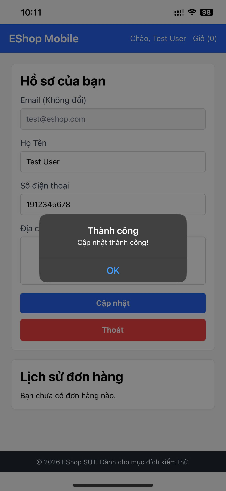

# [BUG][PROFILE-MOBILE] Bỏ qua validation SDT khi bắt đầu bằng số khác 0

## Found by Test Case
TC-PROFILE-MOBILE-005

## Requirement Related
FR-04

## Severity / Priority
Major / P1

## Environment
- **Device:** Điện thoại di động (thật)
- **OS:** iOS

## Steps to Reproduce
1. Nhập Số điện thoại "1912345678" vào ô nhập Số điện thoại.
2. Nhấn nút "Lưu thay đổi".
3. Quan sát thông báo lỗi.

## Expected Result
- Hệ thống chặn không cho lưu.
- Hiển thị thông báo lỗi yêu cầu số điện thoại phải bắt đầu bằng số 0.

## Actual Result
- Hệ thống cho phép lưu số điện thoại: 1912345678 và báo "Cập nhật thành công"

## Evidence

## Labels
- `type: bug`
- `module: PROFILE-MOBILE`
- `severity: Major`
- `priority: P1`
- `status: new`
- `found-by: test-case TC-PROFILE-MOBILE-005`
